# Create Shared Lists of Values

## Introduction

In Oracle APEX, a list of values (LOV) supplies values to LOV-based page items and report columns. Named LOVs in Shared Components are reusable throughout an application. Create TAP LOVs for recruitment forms, then create ESS LOVs for leave and onboarding tasks.

Estimated Time: 5 minutes

### Objectives

- Create TAP interviewer, interview-stage, and offer-status LOVs.
- Create ESS leave-type, onboarding-task status, and task-category LOVs.
- Verify that each LOV is available when you configure page items.

## Task 1: Create the TAP LOVs

1. In TAP, open **Shared Components**, select **Lists of Values**, and select **Create**.

    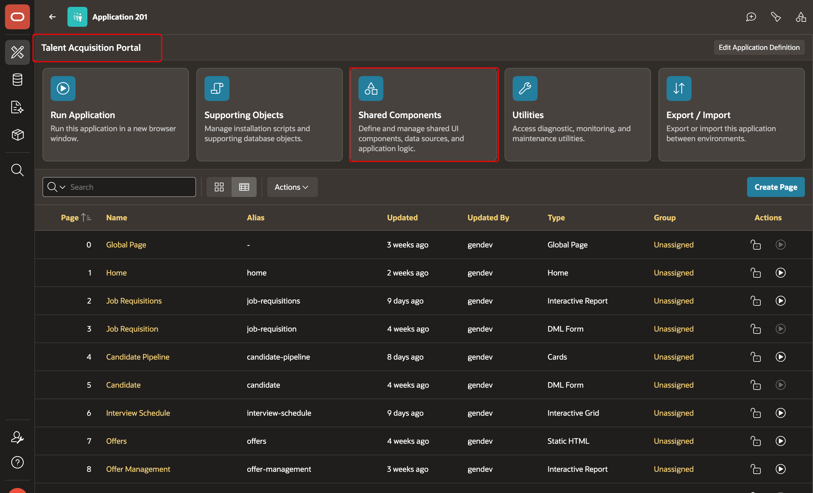
    
    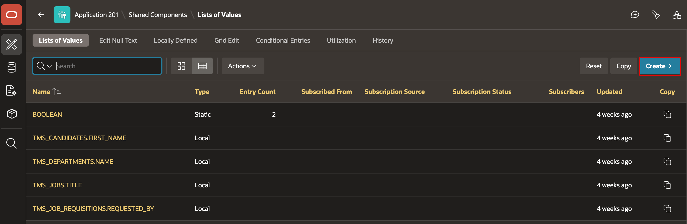

2. Create a dynamic LOV named `TMS_INTERVIEWERS.NAME`. Choose **SQL Query** as the source type. The query returns a display value (`d`) and a return value (`r`):
    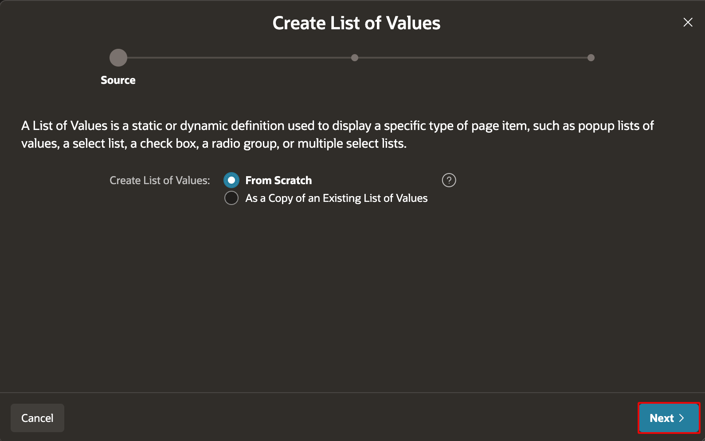
    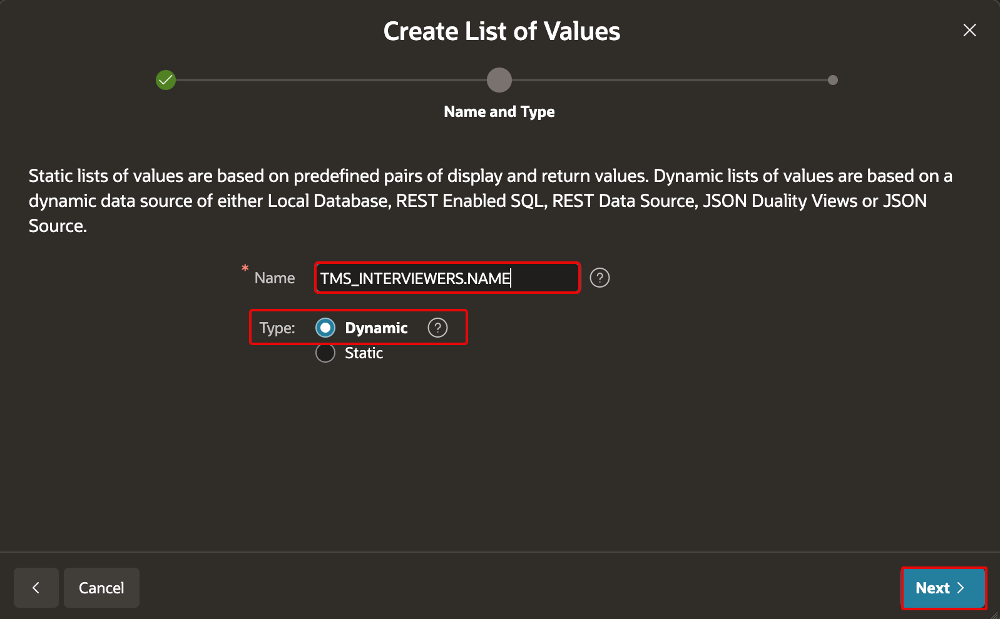
    
    ```sql
    <copy>SELECT first_name || ' ' || last_name d,
           employee_id r
      FROM tms_employees
     WHERE status = 'Active'</copy>
    ```
    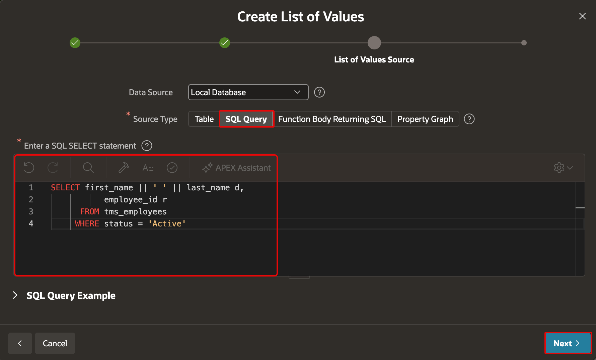
    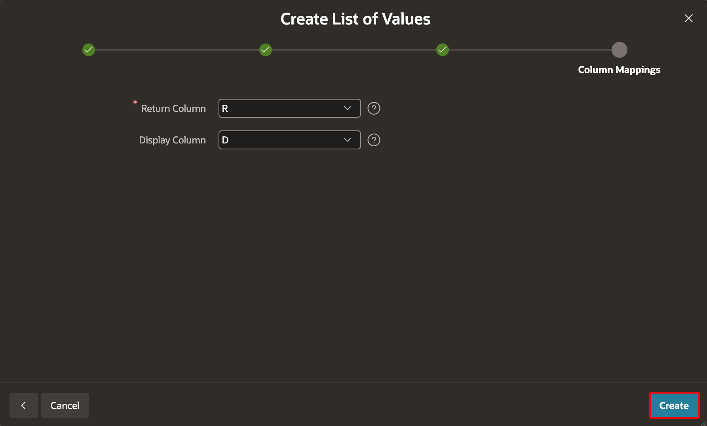

3. Create a static LOV named `TMS_INTERVIEW.STAGES`. For each entry, set the same display and return value: `Applied`, `Screening`, `Interview`, `Offer`, `Hired`, and `Rejected`.
    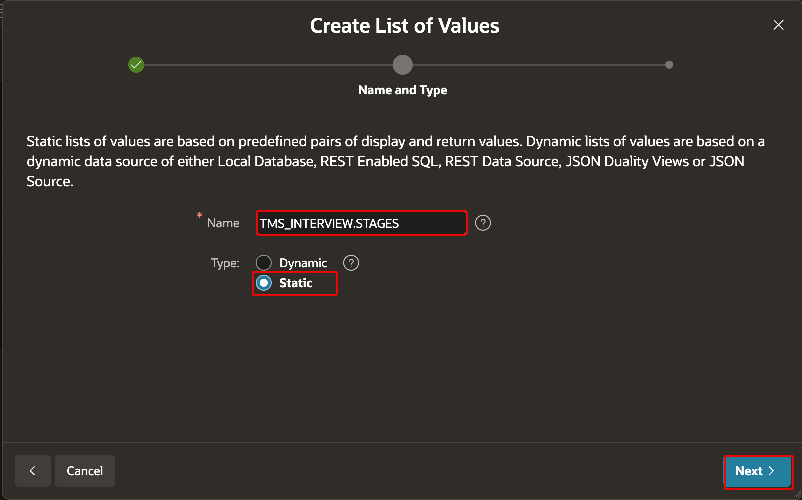
    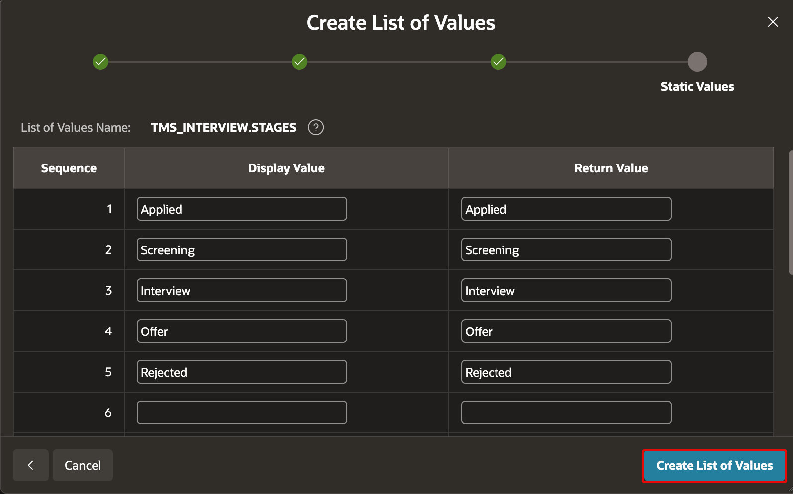

4. Create a static LOV named `TMS_OFFER.STATUS`. Add `Draft`, `Pending Approval`, `Sent`, `Accepted`, `Rejected`, and `Withdrawn` as both the display and return values.

5. Save each LOV and confirm that it appears in the application’s **Lists of Values** page.
    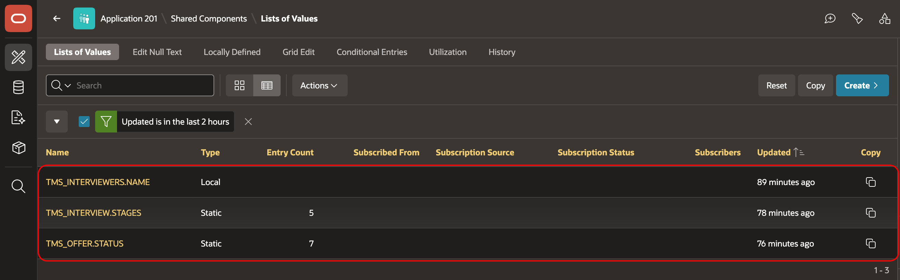


## Task 2: Create the ESS LOVs

1. In ESS, open **Shared Components**, select **Lists of Values**, and select **Create**.
    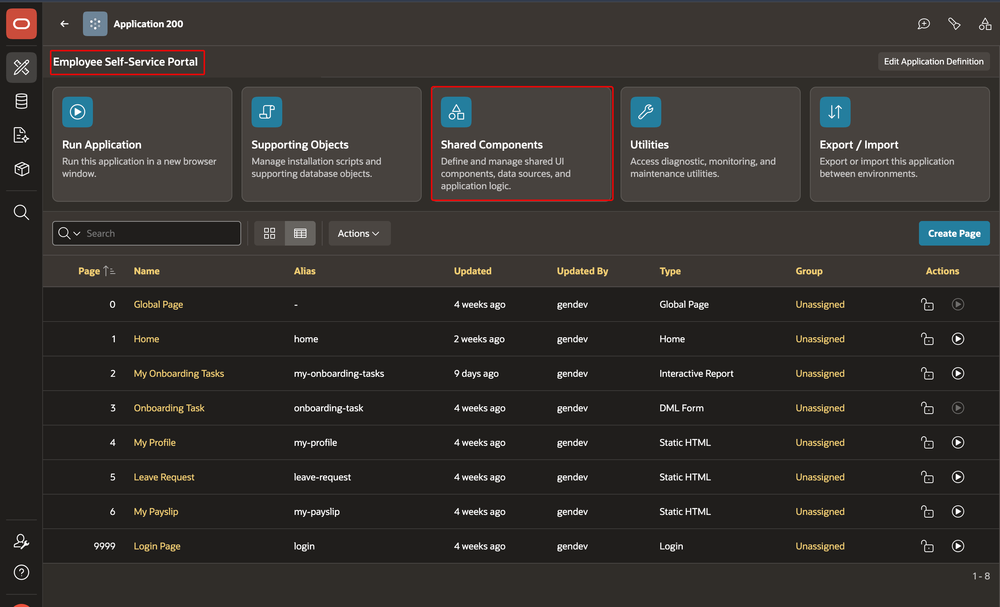
    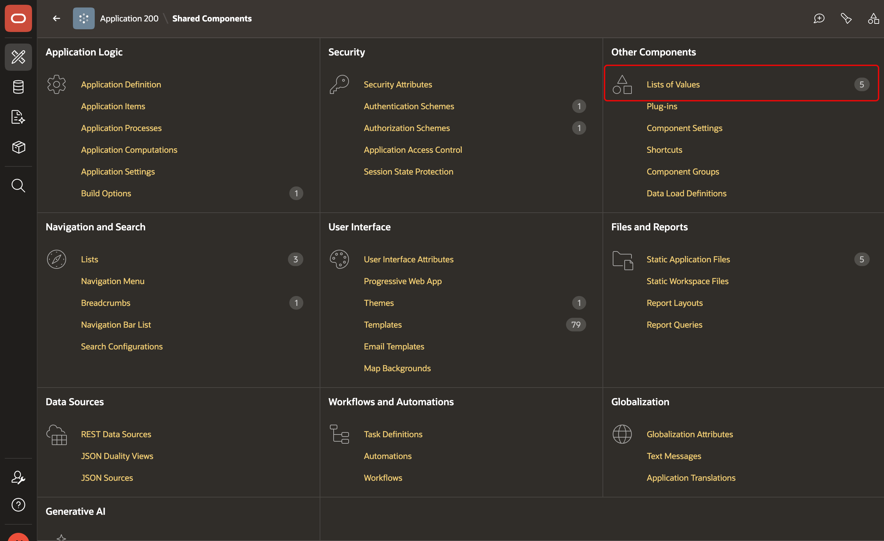
    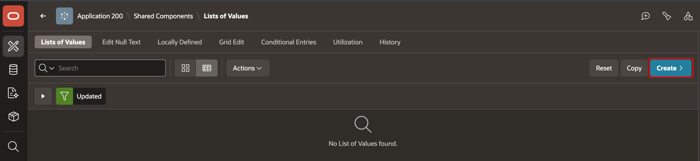

2. Create a dynamic LOV named `TMS_LEAVE.TYPES`. Choose **Local Data**, select **Table**, and then select `TMS_LEAVE_TYPES` as the source table.
    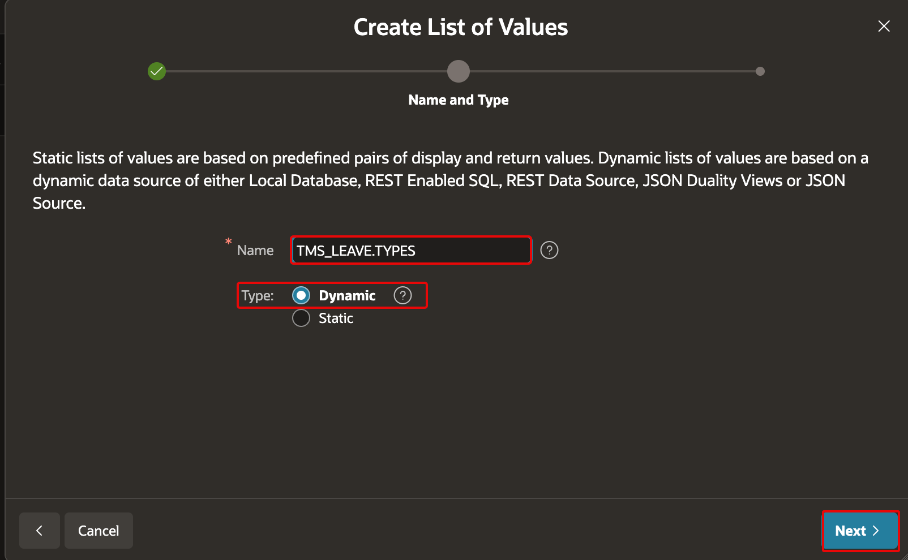
    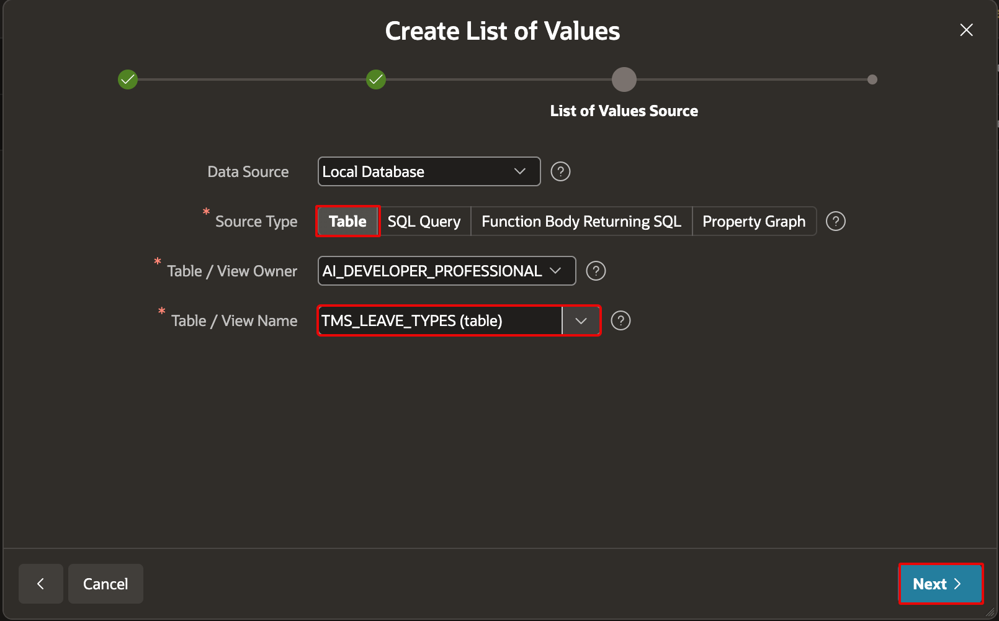
    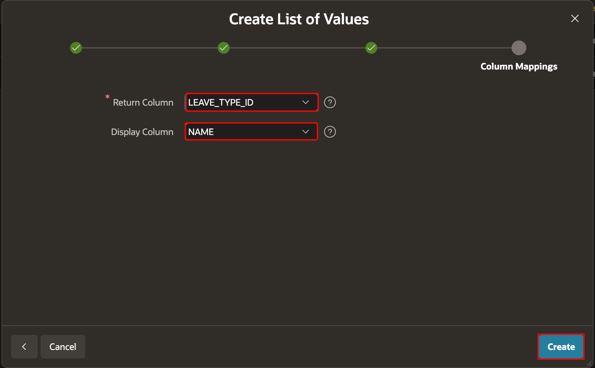


3. Create a static LOV named `TMS_TASK.STATUS` with these display and return values: `Pending`, `In Progress`, `Done`, and `Blocked`.
    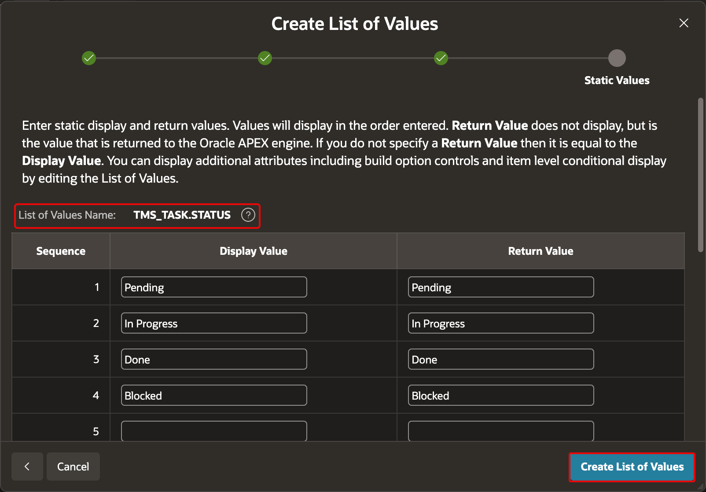

4. Create a static LOV named `TMS_TASK.CATEGORY` with these display and return values: `IT Setup`, `HR Documents`, `Training`, `Benefits`, and `Facilities`.
    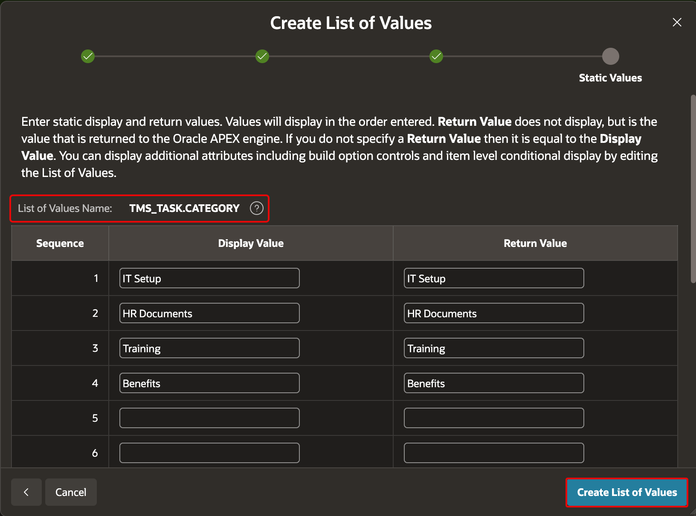

5. Save each LOV and confirm that it appears in the application’s **Lists of Values** page.
    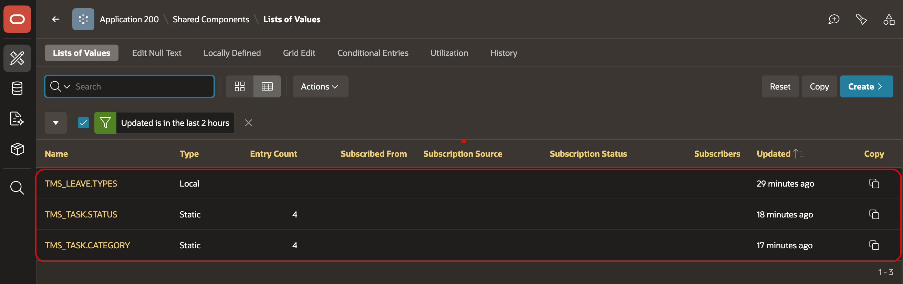


## Acknowledgements

 - **Author -** Aravind Madhavan, Senior Product Manager.
 - **Last Updated By/Date** - Aravind Madhavan, Senior Product Manager, July 2026
