# Lab 1: Create Shared Lists of Values

## Introduction

In Oracle APEX, a list of values (LOV) supplies values to LOV-based page items and report columns. Named LOVs in Shared Components are reusable throughout an application. Create TAP LOVs for recruitment forms, then create ESS LOVs for leave and onboarding tasks.

Estimated Workshop Time: 5 minutes

### Objectives

- Create TAP interviewer, interview-stage, and offer-status LOVs.
- Create ESS leave-type, onboarding-task status, and task-category LOVs.
- Verify that each LOV is available when you configure page items.

## Task 1: Create the TAP LOVs

1. In TAP:

    a) Navigate to **Shared Components**.
        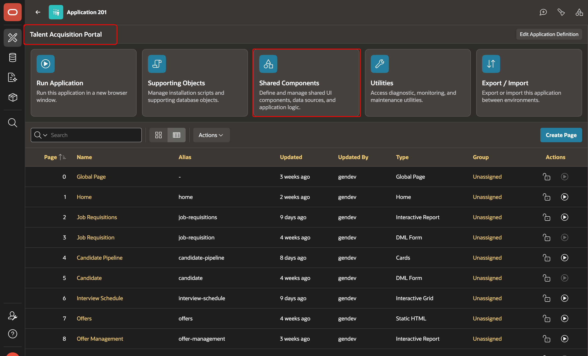

    b) Under Other Components, select **List of Values**.
        

    c) Select **Create**.
        

2. Create a dynamic LOV named `TMS_INTERVIEWERS.NAME`:

    a) In the **Create List of Values** wizard, select **From Scratch** and click **Next**.
        

    b) For **Name**, enter `TMS_INTERVIEWERS.NAME`. Select **Dynamic** as the **Type**, then click **Next**.
        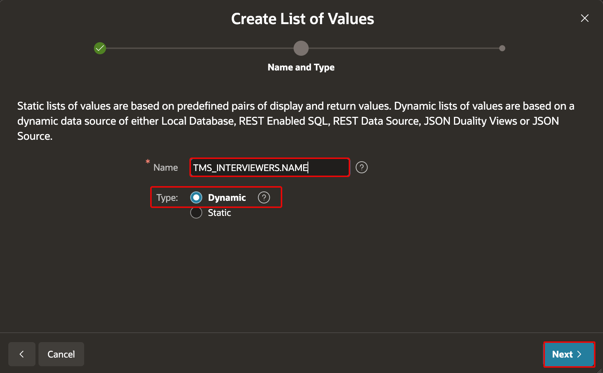

    c) Choose **SQL Query** as the source type, then for **Enter a SQL SELECT statement**, copy and paste the SQL query below, which returns a display value (`d`) and a return value (`r`), and click **Next**:
        ```
        <copy>
        SELECT first_name || ' ' || last_name d,
               employee_id r
          FROM tms_employees
         WHERE status = 'Active'
         </copy>
        ```
    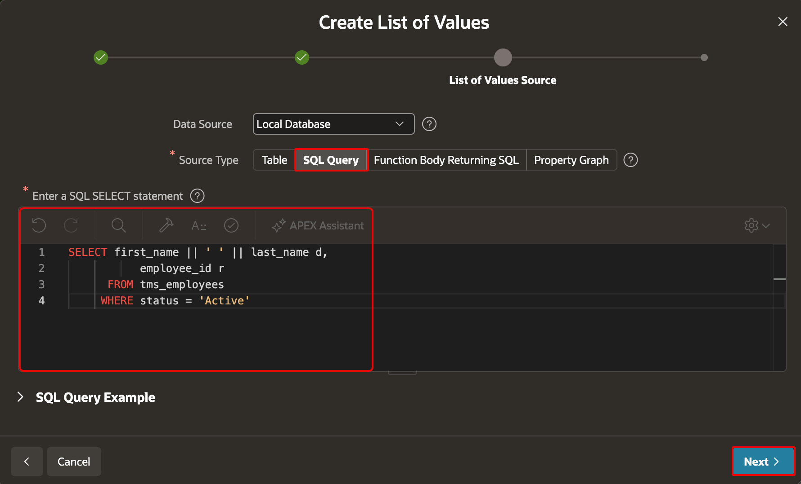

    e) Leave **Column Mappings** as the default and click **Create**.
        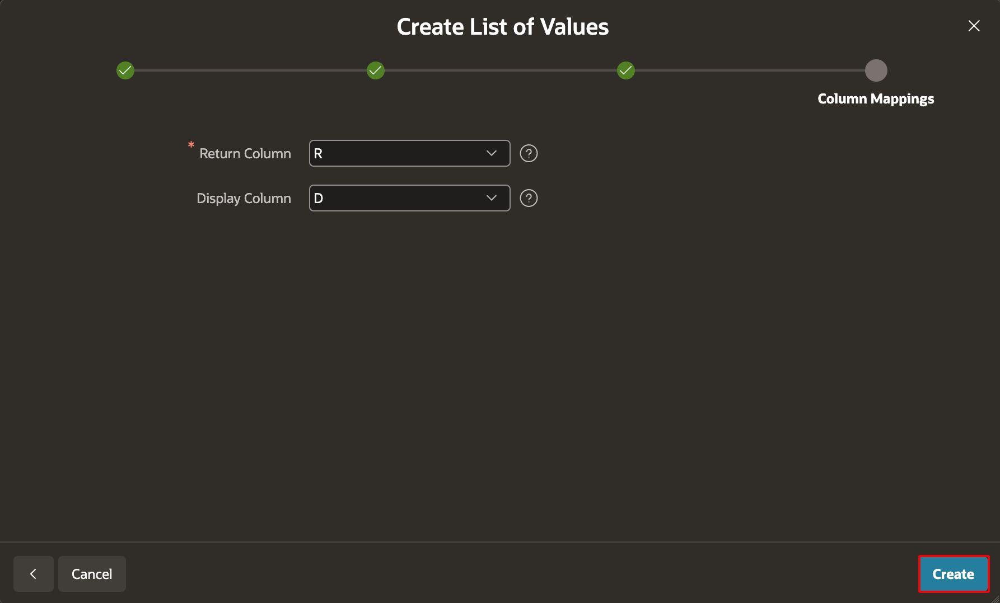

3. Create the static LOV named `TMS_INTERVIEW.STAGES`:

    a) Click **Create** to start creating a static LOV.

    b) In the **Create List of Values** wizard, select **From Scratch** and click **Next**.
        

    c) For **Name**, enter `TMS_INTERVIEW.STAGES`. Select **Static** as the **Type**, then click **Next**.
        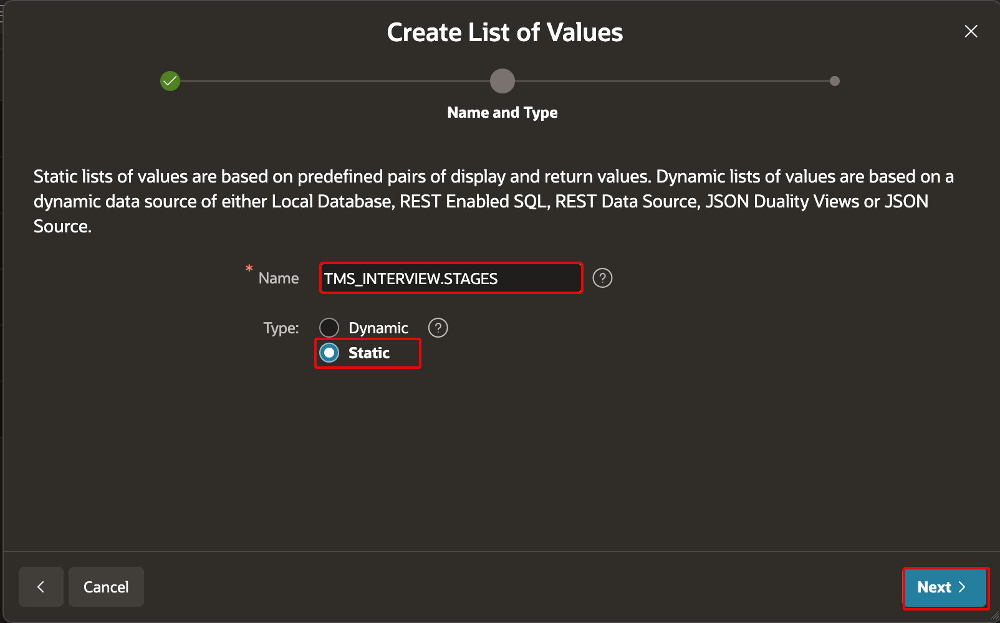

    d) Enter the following values, using each stage as both the **Display Value** and **Return Value**, then click **Create List of Values**:

    | Display Value | Return Value |
    | ------------- | ------------ |
    | Applied       | Applied      |
    | Screening     | Screening    |
    | Interview     | Interview    |
    | Offer         | Offer        |
    | Hired         | Hired        |
    | Rejected      | Rejected     |

    

4. Create the static LOV named `TMS_OFFER.STATUS`:

    a) Click **Create** to start creating a static LOV.

    b) In the **Create List of Values** wizard, select **From Scratch** and click **Next**.
        

    c) For **Name**, enter `TMS_OFFER.STATUS`. Select **Static** as the **Type**, then click **Next**.
        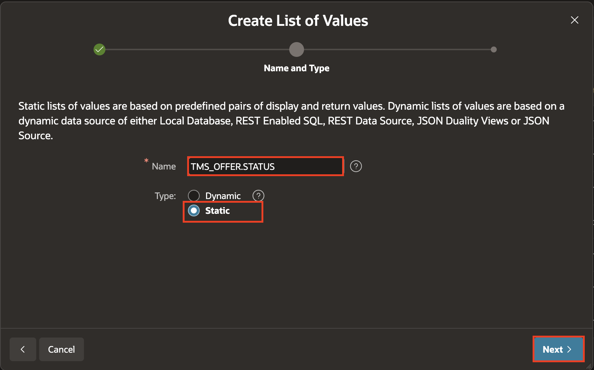

    d) Enter the following values, using each status as both the **Display Value** and **Return Value**, then click **Create List of Values**:

    | Display Value    | Return Value     |
    | ---------------- | ---------------- |
    | Draft            | Draft            |
    | Pending Approval | Pending Approval |
    | Sent             | Sent             |
    | Accepted         | Accepted         |
    | Rejected         | Rejected         |
    | Withdrawn        | Withdrawn        |

    

5. Confirm if all the LOV's created appears in the application’s **Lists of Values** page.
    


## Task 2: Create the ESS LOVs

1. Return to App Builder and select the **Employee Self Service Portal (ESS)** application:

    a) Navigate to **Shared Components**.
        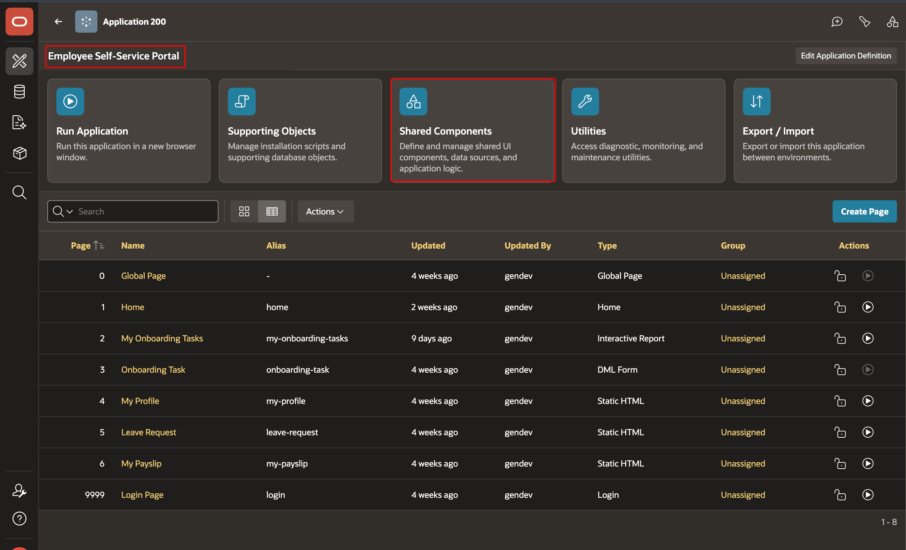

    b) Under Other Components, select **List of Values**.
        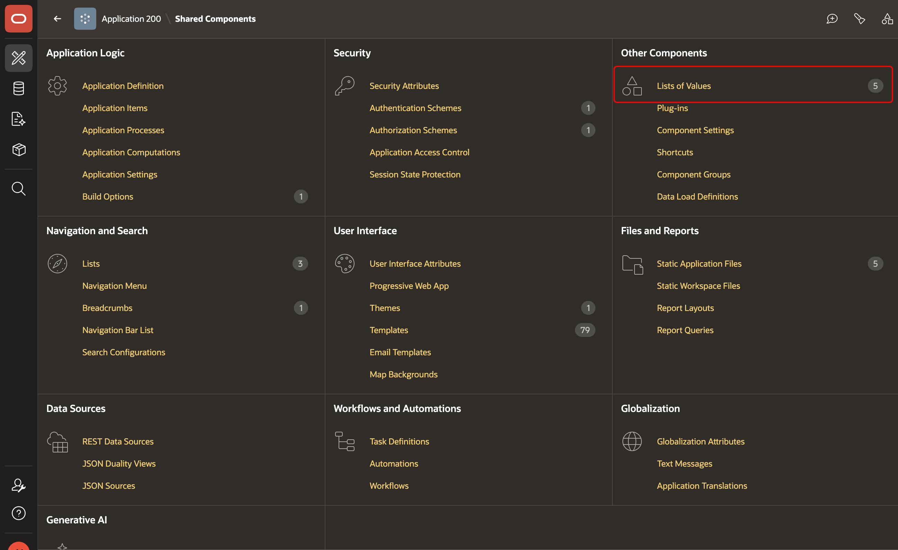

    c) Select **Create**.
        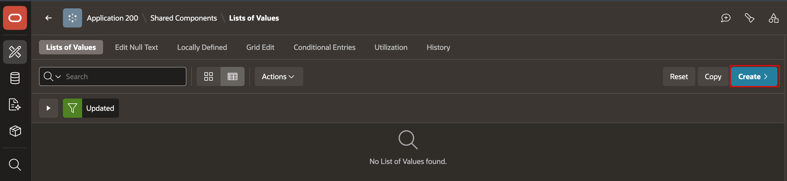

2. Create the dynamic LOV named `TMS_LEAVE.TYPES`:

    a) In the **Create List of Values** wizard, select **From Scratch** and click **Next**.
        

    b) For **Name**, enter `TMS_LEAVE.TYPES`. Select **Dynamic** as the **Type**, then click **Next**.
        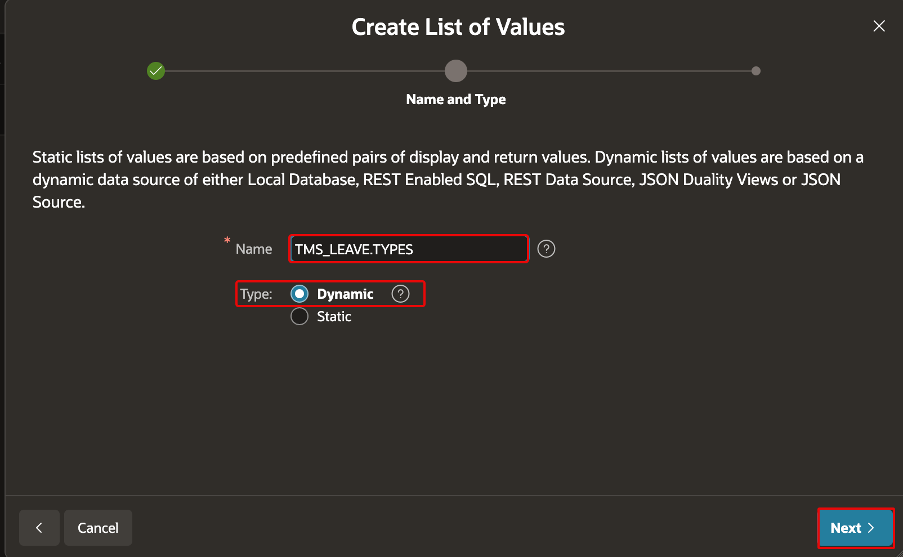

    c) Keep **Data Source** set to **Local Database**. Under **Source Type**, select **Table**. For **Table / View Name**, select `TMS_LEAVE_TYPES`, then click **Next**.
        

    d) Leave the **Return Column** and **Display Column** mappings as shown, then click **Create**.
        

3. Create the static LOV named `TMS_TASK.STATUS`:

    a) Click **Create** to start creating a static LOV.

    b) In the **Create List of Values** wizard, select **From Scratch** and click **Next**.
        

    c) For **Name**, enter `TMS_TASK.STATUS`. Select **Static** as the **Type**, then click **Next**.
    

    d) Enter the following values, using each status as both the **Display Value** and **Return Value**, then click **Create List of Values**:

    | Display Value | Return Value |
    | ------------- | ------------ |
    | Pending       | Pending      |
    | In Progress   | In Progress  |
    | Done          | Done         |
    | Blocked       | Blocked      |

    

4. Create the static LOV named `TMS_TASK.CATEGORY`:

    a) Click **Create** to start creating a static LOV.

    b) In the **Create List of Values** wizard, select **From Scratch** and click **Next**.
        

    c) For **Name**, enter `TMS_TASK.CATEGORY`. Select **Static** as the **Type**, then click **Next**.
    


    d) Enter the following values, using each category as both the **Display Value** and **Return Value**, then click **Create List of Values**:

    | Display Value | Return Value |
    | ------------- | ------------ |
    | IT Setup      | IT Setup     |
    | HR Documents  | HR Documents |
    | Training      | Training     |
    | Benefits      | Benefits     |
    | Facilities    | Facilities   |

    

5. Confirm that all the LOVs appear in the application’s **Lists of Values** page.
    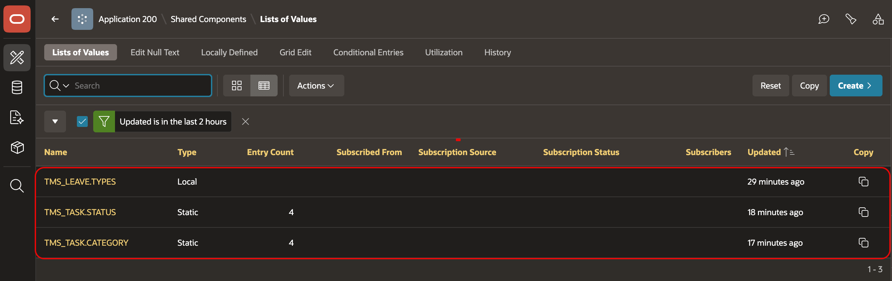


## Acknowledgements

 - **Author -** Aravind Madhavan, Senior Product Manager.
 - **Last Updated By/Date** - Aravind Madhavan, Senior Product Manager, July 2026
