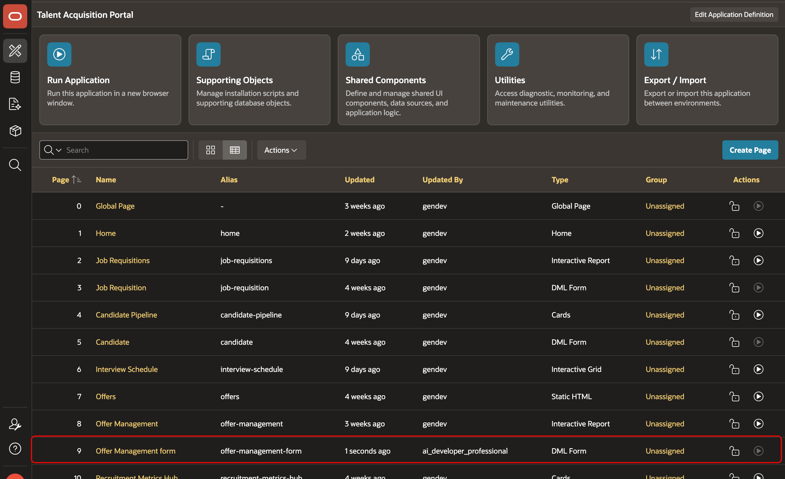
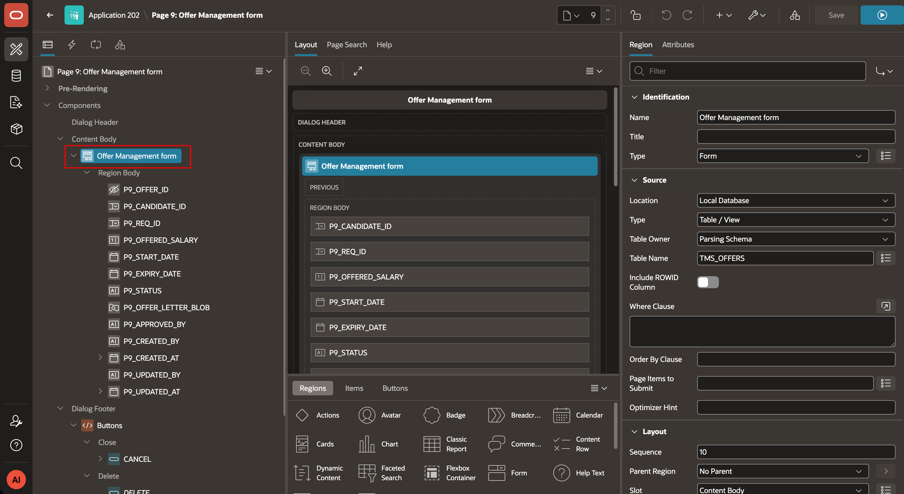
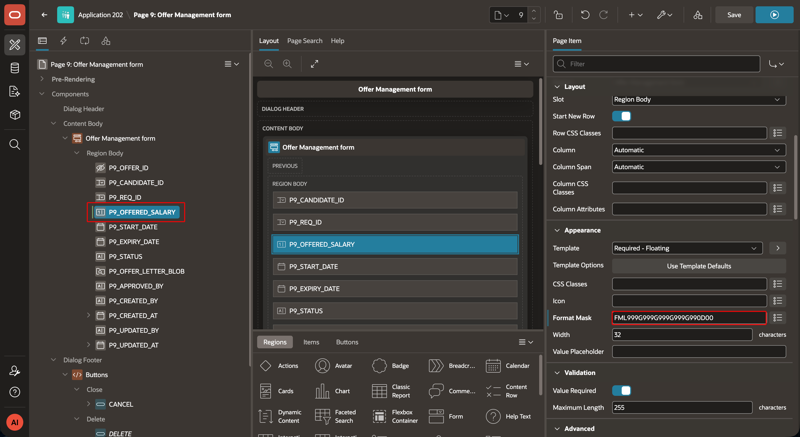
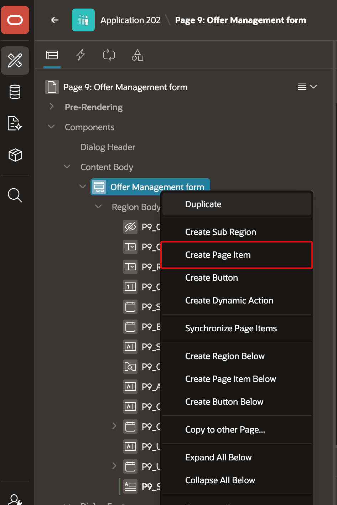
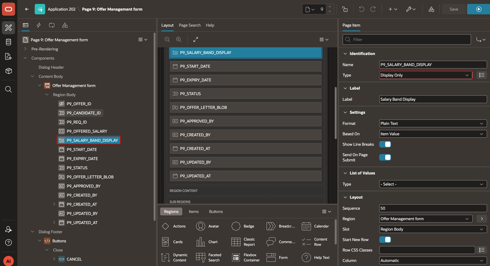
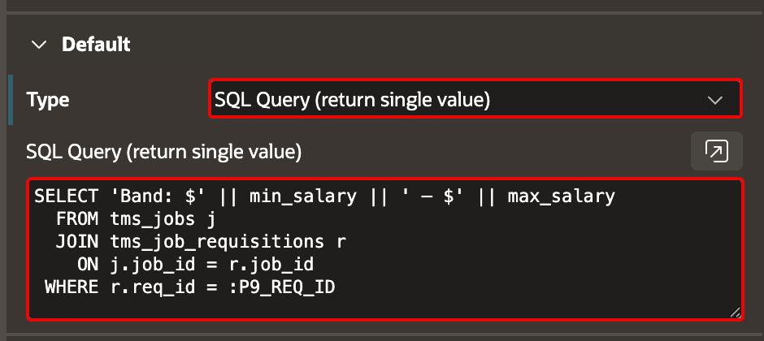
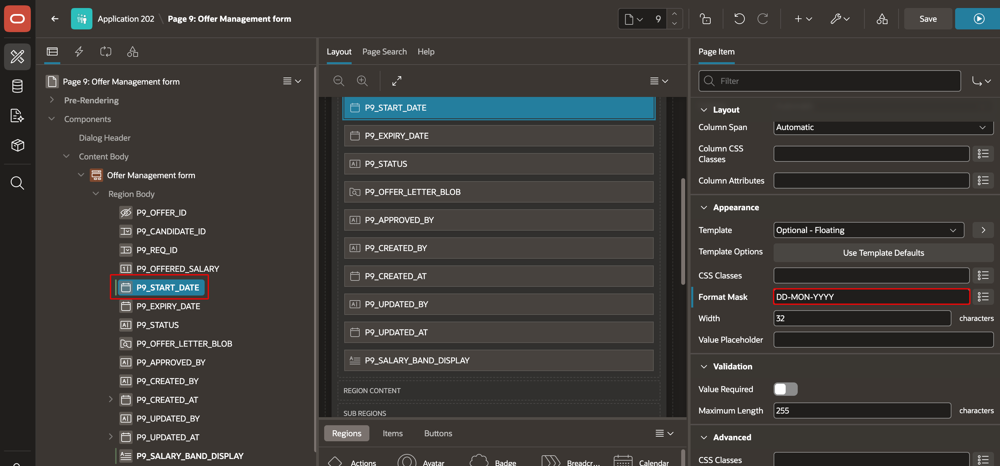
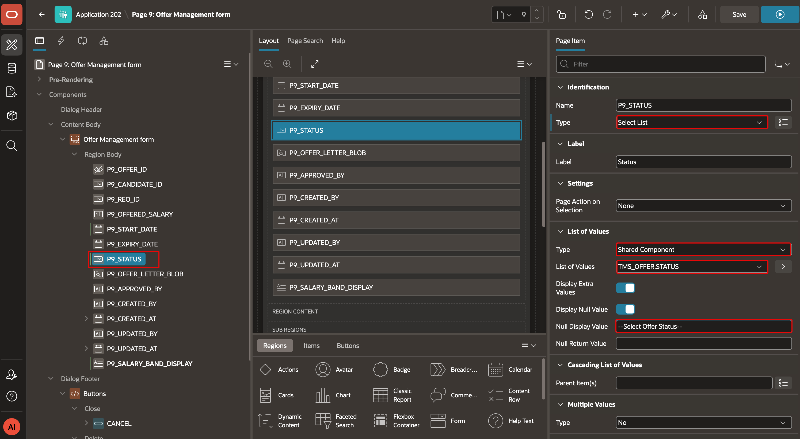
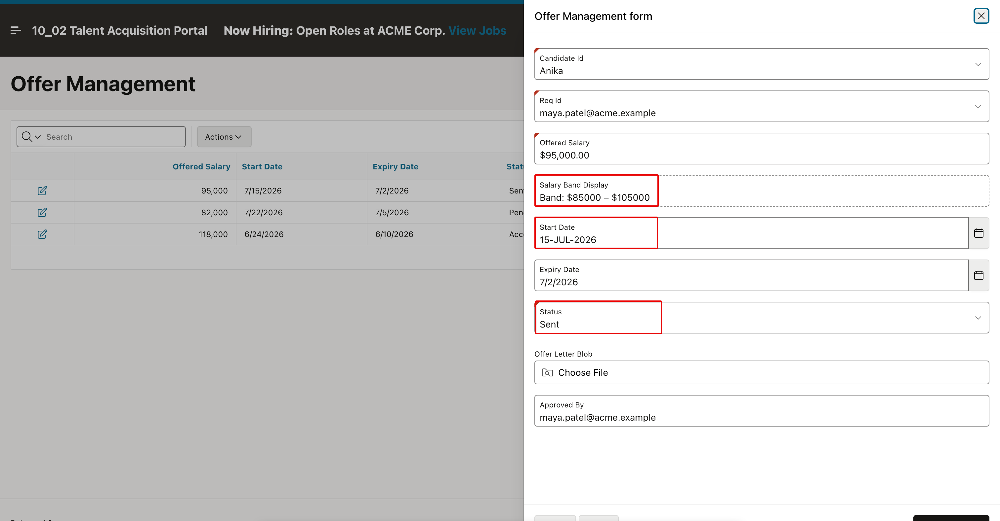

# Build the Offer Management Form

## Introduction

The Offers page from Module 5 needs consistent dates, values, and offer statuses. Configure the form and add a Display Only salary-band item. In Oracle APEX, a Display Only item displays non-enterable text.

Estimated Time: 5 minutes

### Objectives

- Set the offered-salary number format.
- Display the selected requisition’s salary band.
- Configure date and status page items.

## Task 1: Open the Offer Management form

1. In TAP App Builder, open the **Offers** page created from the `TMS_OFFERS` table in Module 5.
    

2. In Page Designer, select the Offer Management form region.
    

## Task 2: Configure the offer fields

1. Select the `OFFERED_SALARY` item. Set its type to **Number Field**, which supports automatic formatting. Set **Format Mask** to the following value:
    ```
    <copy>FML999G999G999G999G990D00</copy>
    ```
    

2. Create a new item named `PXX_SALARY_BAND_DISPLAY` in the Offer Management form. Set **Type** to **Display Only**.
    
    
3. Set the default type to **SQL Query**. Use the following query. If needed, replace `:PXX_REQ_ID` with the requisition item name on your page:

    ```sql
    <copy>SELECT 'Band: $' || min_salary || ' – $' || max_salary
      FROM tms_jobs j
      JOIN tms_job_requisitions r
        ON j.job_id = r.job_id
     WHERE r.req_id = :PXX_REQ_ID</copy>
    ```
    

4. Select `START_DATE`. Set its type to **Date Picker** and set **Format Mask** to `DD-MON-YYYY`. A Date Picker displays a text field with a calendar icon. Users can enter a date or select one from the calendar.
    

5. Select `STATUS`. Set its type to **Select List**. For **List of Values**, choose **Shared Component** and select `TMS_OFFER.STATUS`. Set **Null Display Value** to `--Select Offer Status--`. A Select List displays LOV choices inline. Use it for a small, discrete list such as offer status.
    

6. Save the page and run it. Select an offer record to confirm that the salary band, date picker, and status list display correctly.
    


## Acknowledgements

 - **Author -** Aravind Madhavan, Senior Product Manager.
 - **Last Updated By/Date** - Aravind Madhavan, Senior Product Manager, July 2026
