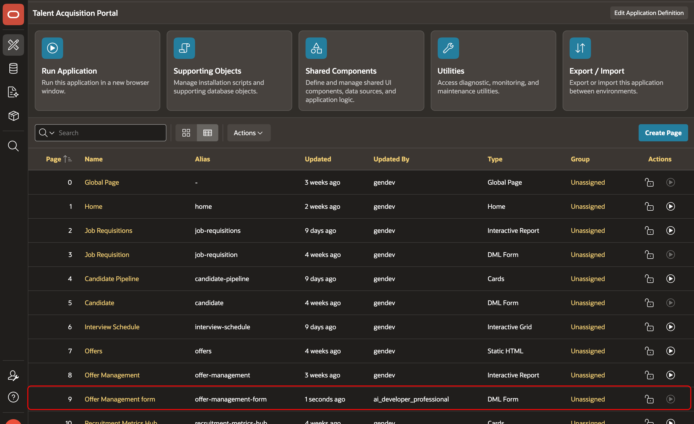
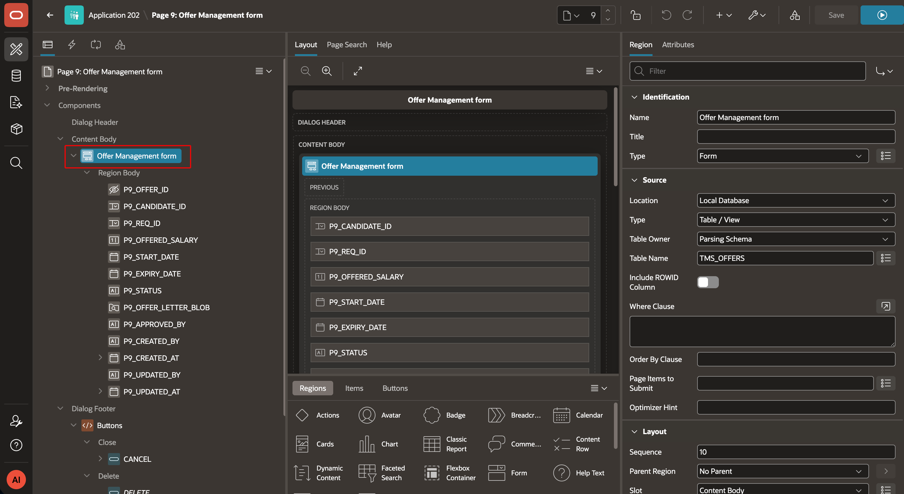
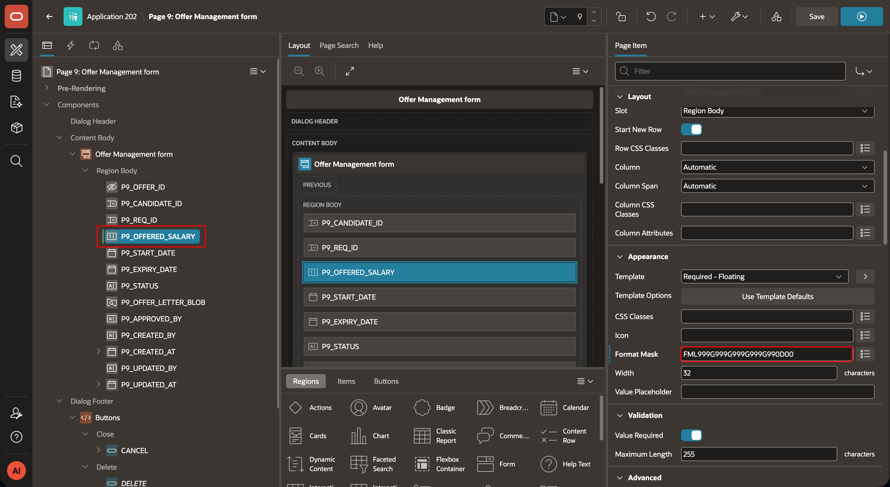
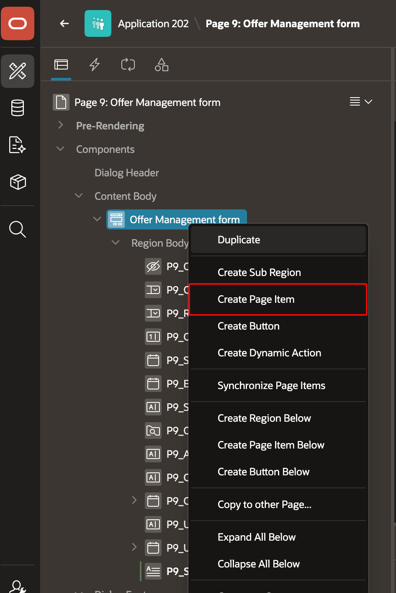
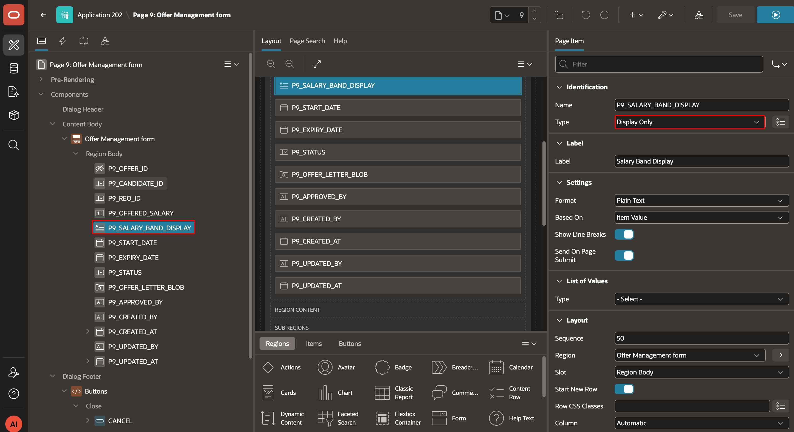
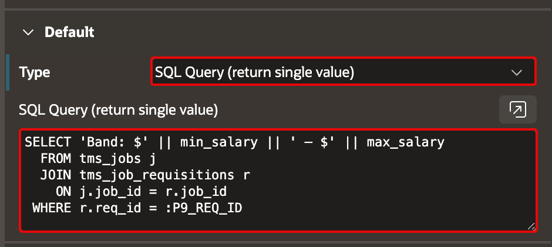
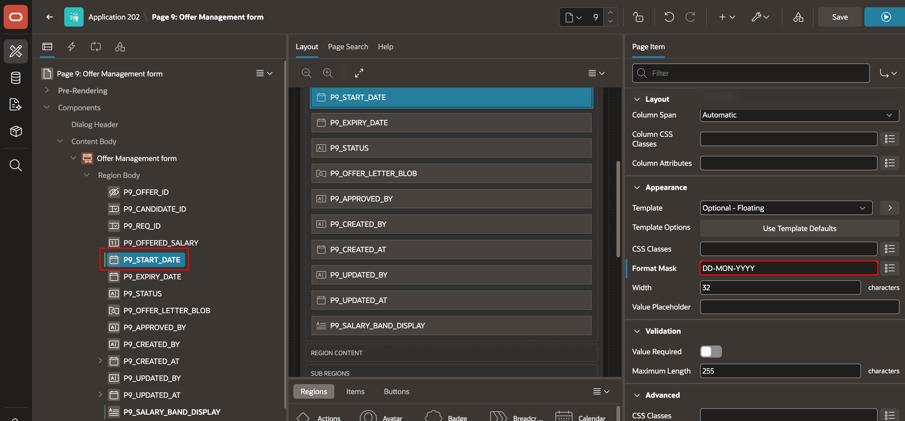
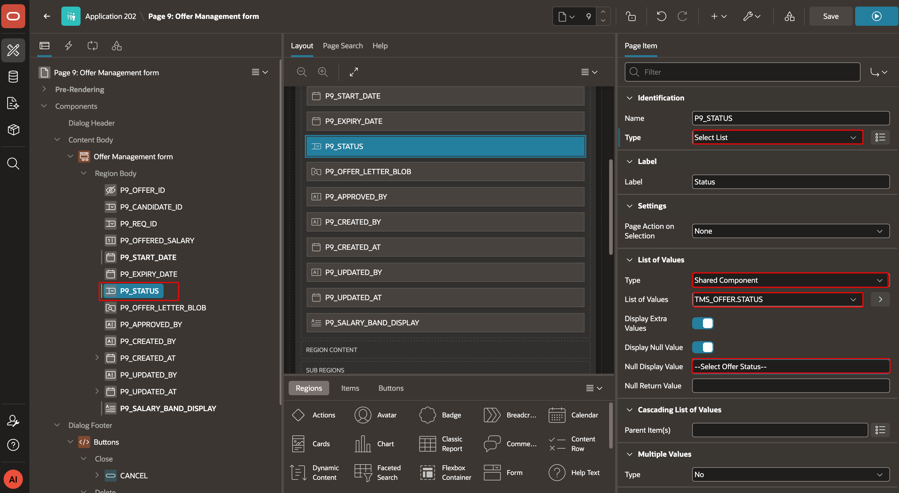
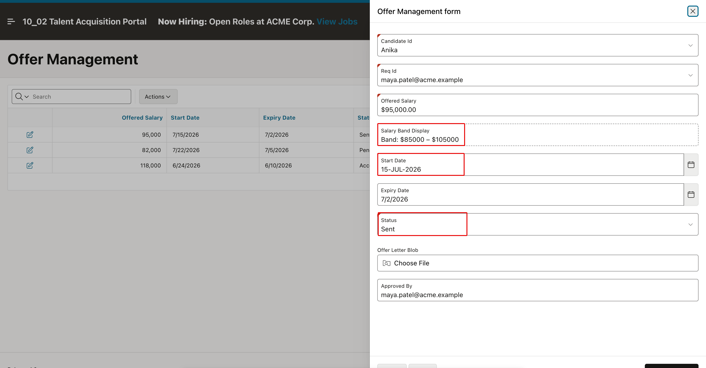

# Lab 2: Build the Offer Management Form

## Introduction

The Offers page from Module 5 needs consistent dates, values, and offer statuses. Configure the form and add a Display Only salary-band item. In Oracle APEX, a Display Only item displays non-enterable text.

Estimated Workshop Time: 5 minutes

### Objectives

In this lab, you will learn how to:

- Set the offered-salary number format.
- Display the selected requisition’s salary band.
- Configure date and status page items.

## Task 1: Open the Offer Management form

1. In TAP **App Builder**, open the **Offer Management form** page created from the `TMS_OFFERS` table in Module 5.

    

2. In the left pane, select the **Offer Management form** region.

    

## Task 2: Configure the offer fields

> **Page numbers:** The examples use form page `9` and item names beginning with `P9_`. If your form has a different page number, use its item names throughout this task.

1. Select the `P9_OFFERED_SALARY` item.

    - In the **Property Editor**, under **Appearance**, set **Format Mask** to the following value:
        ```
        <copy>FML999G999G999G999G990D00</copy>
        ```

    

2. Right-click **Offer Management form** and select **Create Page Item**.

    

    - In the **Property Editor**, enter or select the following:
        - **Name:** `P9_SALARY_BAND_DISPLAY`.
        - **Identification** > **Type:** **Display Only**.
        - Under **Default**:
            - **Type:** **SQL Query**.
            - **SQL Query:** Copy and paste the following query:

                ```sql
                <copy>SELECT 'Band: $' || min_salary || ' – $' || max_salary
                  FROM tms_jobs j
                  JOIN tms_job_requisitions r
                    ON j.job_id = r.job_id
                 WHERE r.req_id = :P9_REQ_ID</copy>
                ```

            - If your requisition item has a different name, replace `:P9_REQ_ID` with that item name.

    

    

3. Select `P9_START_DATE`.

    - In the **Property Editor**, under **Appearance**, set **Format Mask** to `DD-MON-YYYY`.

    

4. Select `P9_STATUS`.

    - Under **Identification**, set **Type** to **Select List**.

    - Under **List of Values**, set **Type** to **Shared Component** and select `TMS_OFFER.STATUS`.

    - Set **Null Display Value** to `--Select Offer Status--`.

    

5. Save the page and run it.

    - Select an offer record to confirm that the salary band, date picker, and status list display correctly.

    

## Acknowledgements

 - **Author -** Aravind Madhavan, Senior Product Manager.
 - **Last Updated By/Date** - Aravind Madhavan, Senior Product Manager, July 2026
