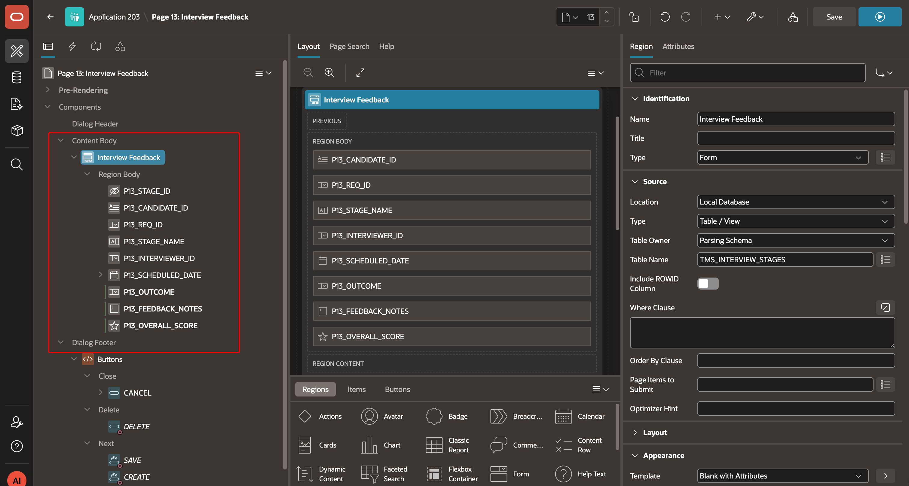

# Lab 3: Build the Interview Feedback Form

## Introduction

Recruiters and hiring managers need a focused form to capture interview feedback. Create a modal Interview Feedback page, configure its page items, and link it from the Interview Schedule interactive grid. A modal dialog displays above the calling page; when it closes, the calling page becomes active again.

Estimated Workshop Time: 5 minutes

### Objectives

In this lab, you will learn how to:

- Create an Interview Feedback form on `TMS_INTERVIEW_STAGES`.
- Configure candidate, interviewer, rating, and outcome items.
- Open the form from the Interview Schedule interactive grid and refresh the grid after close.

## Task 1: Create the Interview Feedback page

1. In TAP **App Builder**, select **Create Page**.

    

2. Select **Form** as the page type and click **Next**.

    

3. Name the page **Interview Feedback**.

    - Set **Page Mode** to **Modal Dialog**.

    - Use page number `13` if it is available.
    - Set **Table / View Name** to `TMS_INTERVIEW_STAGES`.
    - Click **Next**.

    

4. For **Primary Key Column 1**, select `STAGE_ID`, then click **Create Page**.

    

5. Open the new page in **Page Designer**.

    

## Task 2: Configure the form items

> **Page numbers:** These examples use the `P13_` item prefix. If you created another page number, substitute that page’s item prefix throughout this lab.

1. Select `P13_CANDIDATE_ID`.

    - Set its type to **Display Only**.

    - This non-enterable item displays the value that the **Interview Schedule** page passes in session state.

    

2. Select `P13_INTERVIEWER_ID`.

    - Under **Identification**, set **Type** to **Select List**.
    - Under **List of Values**, set **Type** to **Shared Component** and select `TMS_INTERVIEWERS.NAME`.

    

3. Select the rating item mapped to the `SCORE` database column.

    - The wizard-generated item is `P13_SCORE`. The example screenshot uses the renamed item `P13_OVERALL_SCORE`; use the item mapped to `SCORE` in your form.
    - Under **Identification**, set **Type** to **Star Rating**.
    - Under **Settings**, set **Number of Stars** to `5`.

    

4. Select `P13_OUTCOME`.

    - Under **Identification**, set **Type** to **Select List**.
    - Under **List of Values**, select **Static Values** and enter the following display and return values:

        | Display  | Return  |
        | -------- | ------- |
        | Proceed  | Proceed |
        | Hold     | Hold    |
        | Reject   | Rejected |

    

5. In the left pane, select the page items for `CREATED_BY`, `CREATED_AT`, `UPDATED_BY`, and `UPDATED_AT`.

    - Hold **Ctrl** on Windows or **Command** on macOS to select multiple items.
    - Right-click the selected items and choose **Delete**. Confirm deletion if prompted.

    

## Task 3: Link the form from Interview Schedule

1. In **Page Designer**, use **Page Browse** to open **Interview Schedule**.

    - This is page `6` in the course application. If it was resequenced, select the page by name.

    

2. Select the **Interview Schedule** interactive grid region.

    - On the **Attributes** tab, clear **Add Row**.

    

3. Right-click the **Breadcrumb** region and select **Create Button**.

    

4. Configure the new button:

    - **Button Name:** `ADD_FEEDBACK`.
    - **Slot:** Next.
    - **Hot:** On.

    

5. Set the button **Action** to **Redirect to a Page in this Application**.

    

6. Configure the target as page `13`, **Interview Feedback**.

    - If you used another page number, select that page instead.

    

7. Create a dynamic action for the **Add Feedback** button.

    - Set **Event** to **Dialog Closed** and **Selection Type** to **Button**.

    - This event occurs on the calling page after the modal dialog closes.

    

8. Add a true action of **Refresh**.

    - Set **Selection Type** to **Region** and select the Interview Schedule interactive grid region. The example screenshot names it **Interview Stages**.

    

9. Save and run the **Interview Schedule** page.

    - Select **Add Feedback**, close the dialog, and confirm that the Interview Schedule interactive grid refreshes.

    

## Acknowledgements

 - **Author -** Aravind Madhavan, Senior Product Manager.
 - **Last Updated By/Date** - Aravind Madhavan, Senior Product Manager, July 2026
