# Build the ESS Leave Request Form

## Introduction

Employees need a clear form to request leave and review prior requests. Build the ESS Leave Request form and add a leave-history report.

Estimated Time: 5 minutes.

### Objectives

- Build the Leave Request form on `TMS_LEAVE_REQUESTS`.
- Configure leave-type, date, number, text, and hidden page items.
- Add the My Leave History interactive report.

## Task 1: Create the Leave Request form

1. In ESS App Builder, open the **Leave Request** page in Page Designer.
    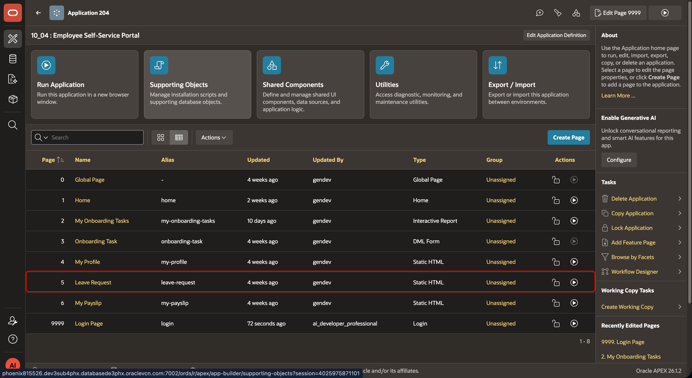

2. Add a **Form** region named **Leave Request Form**. Set the source table to `TMS_LEAVE_REQUESTS`.
    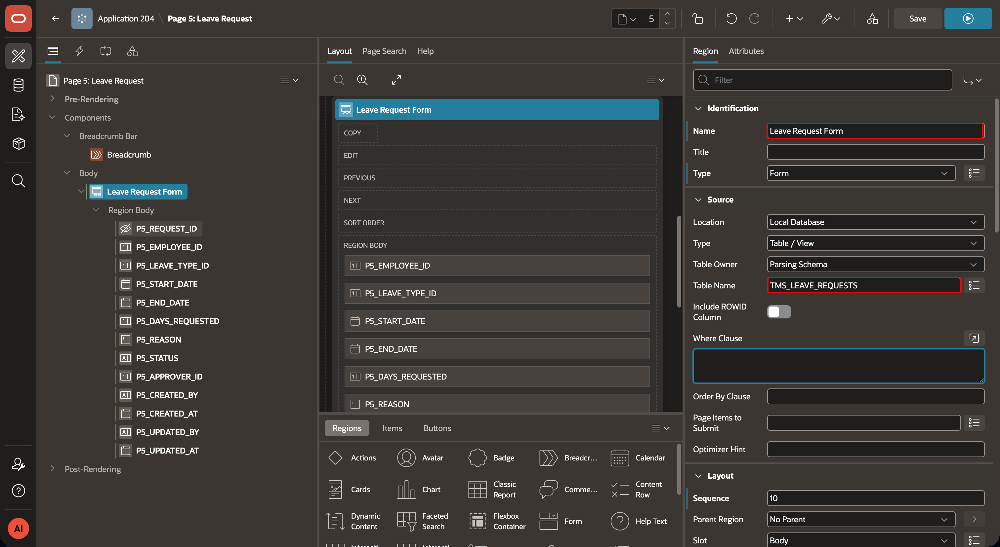

3. Add a **SUBMIT_LEAVE** button. Set **Slot** to **Create**, enable **Hot**, and set the action to **Submit Page**.
    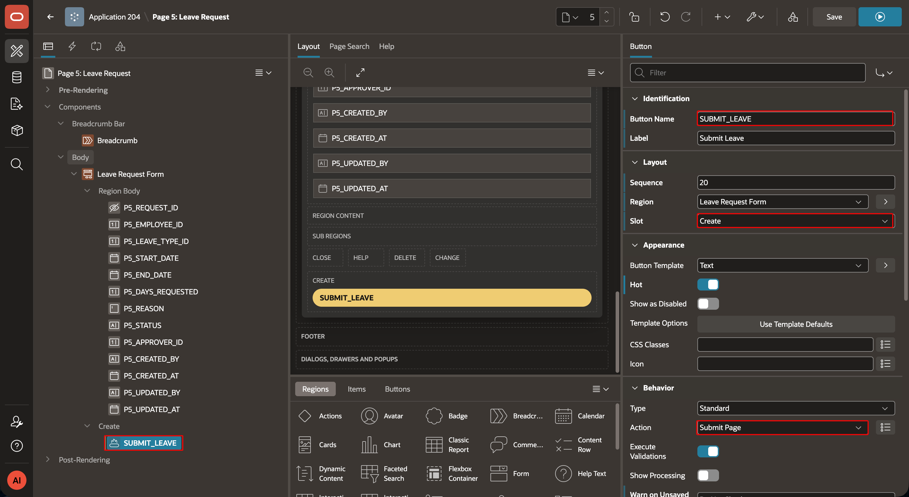

4. Add a **CANCEL** button. Set **Slot** to **Close** and set the action to navigate to the application home page.
    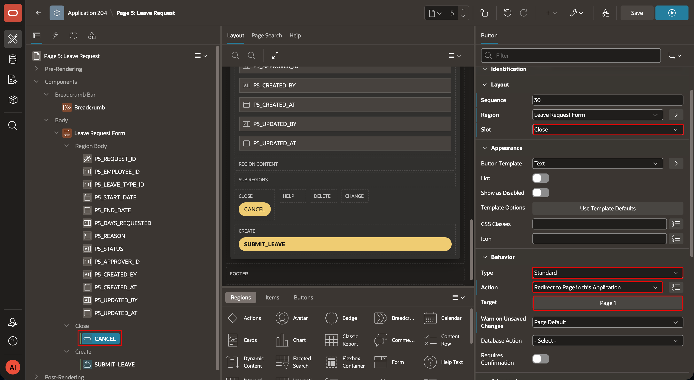

## Task 2: Configure the form items

1. Select `P5_EMPLOYEE_ID`. Set its type to **Display Only**. This non-enterable item displays the value from the logged-in employee session state.
    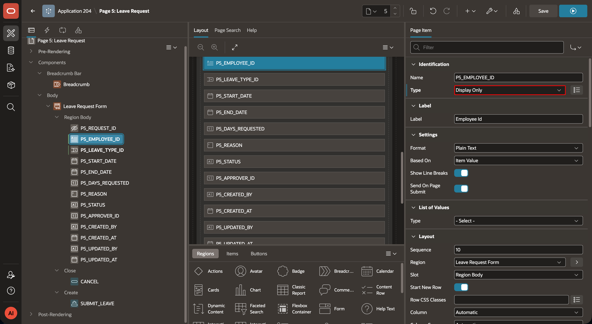

2. Select `P5_LEAVE_TYPE_ID`. Set its type to **Select List** and choose `TMS_LEAVE.TYPES` as the LOV. Set **Null Display Value** to `---Select Leave Type---`.
    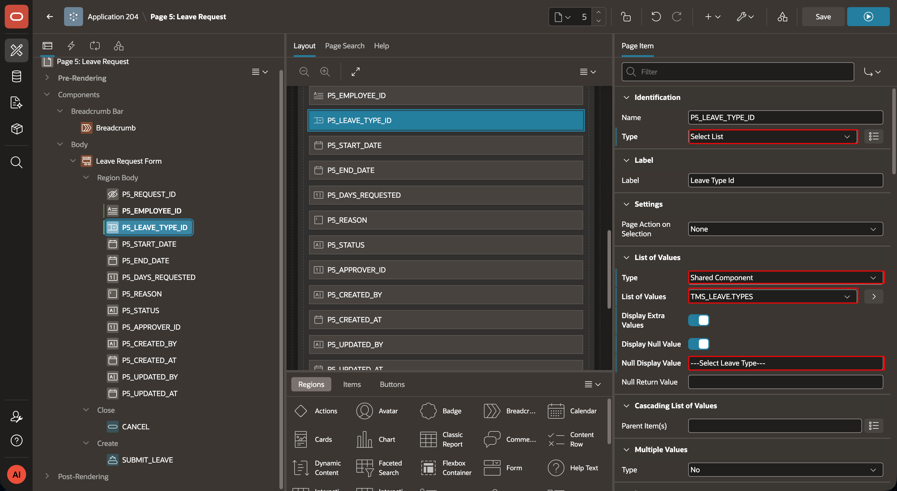

3. Set `P5_START_DATE` and `P5_END_DATE` to **Date Picker** items. A Date Picker displays a text field with a calendar icon. Users can enter or select a date.
    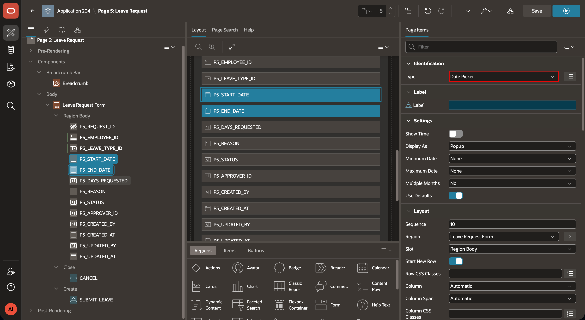

4. Set `P5_DAYS_REQUESTED` to a **Number Field**, which supports automatic formatting.
    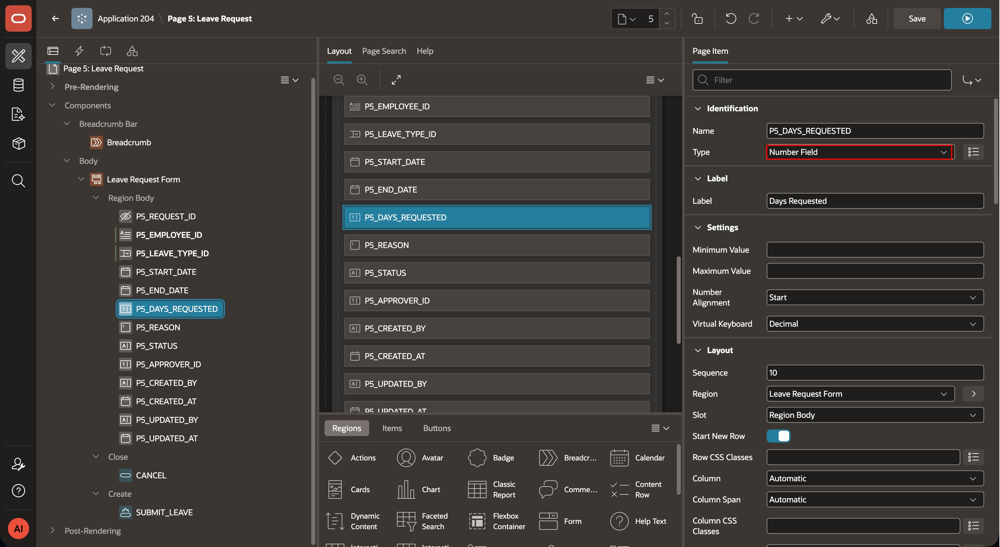

5. Set `P5_REASON` to a **Textarea** and set **Height** to `3` lines. A Textarea provides a multiple-row text area.
    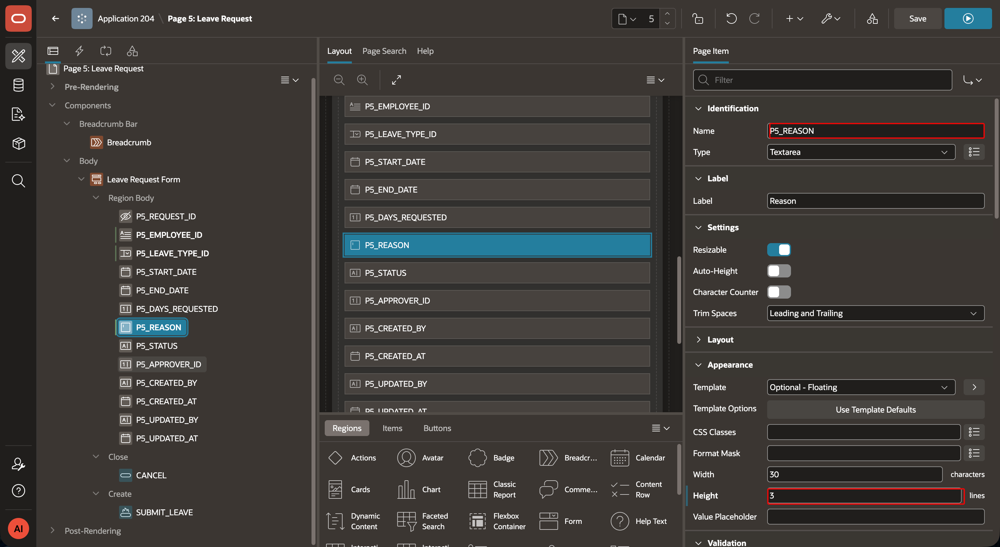

6. Set `P5_STATUS` to **Hidden** with a default value of `Submitted`. Set `P5_APPROVER_ID` to **Hidden**. Hidden items remain in the page source but do not render.
    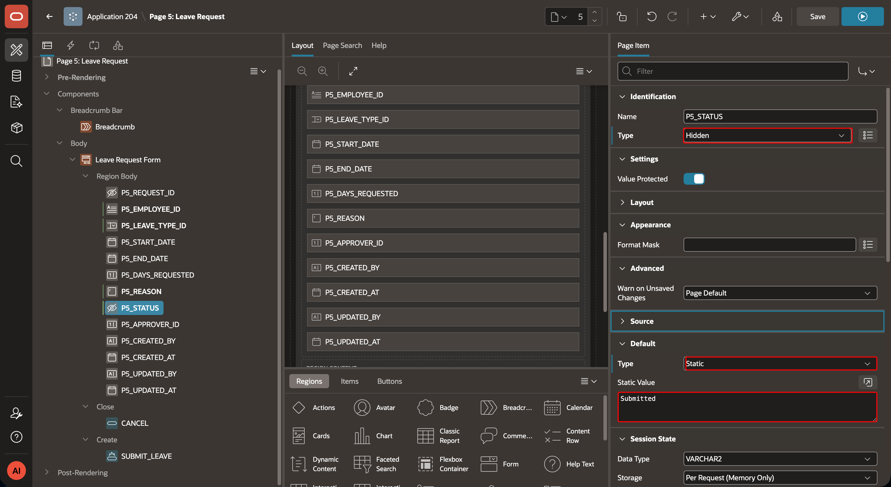
    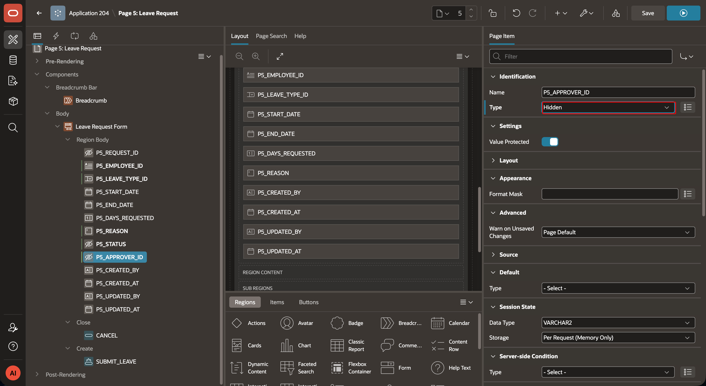

7. Delete the audit items: `P5_CREATED_BY`, `P5_CREATED_AT`, `P5_UPDATED_BY`, and `P5_UPDATED_AT`.
    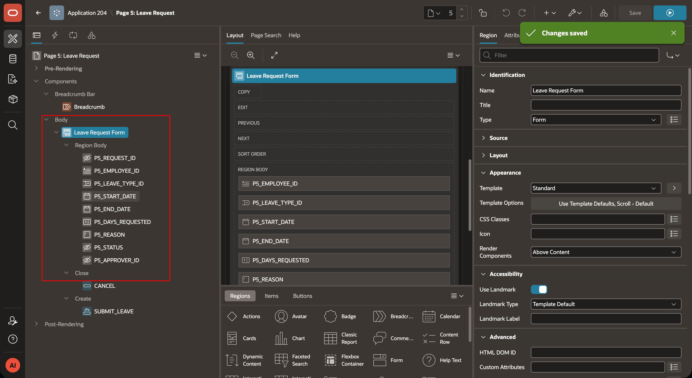

## Task 3: Add the My Leave History report

1. Add an **Interactive Report** below the Leave Request Form. Name it **My Leave History**.

2. Set the region source to this SQL query. Replace `:P5_EMPLOYEE_ID` if your page uses a different employee item name.

    ```sql
    <copy>SELECT leave_type_id,
           start_date,
           end_date,
           days_requested,
           status
      FROM tms_leave_requests
     WHERE employee_id = :P5_EMPLOYEE_ID
     ORDER BY start_date DESC</copy>
    ```
    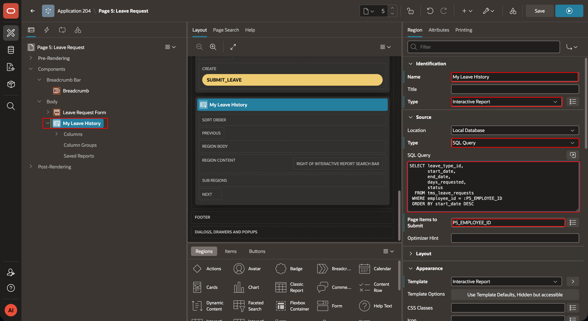

3. Save and run the page. Confirm that the form displays the configured page items and the report displays leave requests for the current employee.
    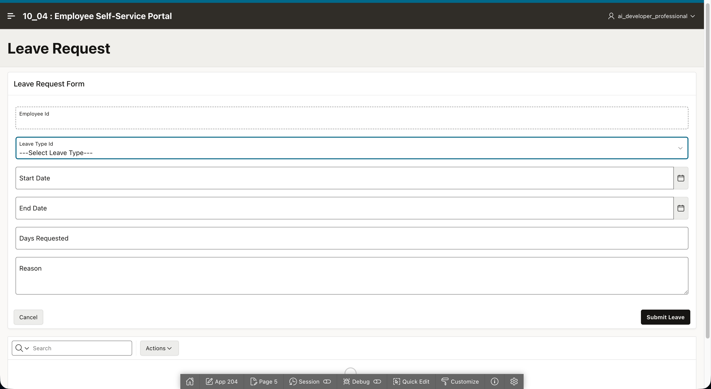

## Acknowledgements

 - **Author -** Aravind Madhavan, Senior Product Manager.
 - **Last Updated By/Date** - Aravind Madhavan, Senior Product Manager, July 2026
