# Lab 4: Build the ESS Leave Request Form

## Introduction

Employees need a clear form to request leave and review prior requests. Build the ESS Leave Request form and add a leave-history report.

Estimated Workshop Time: 5 minutes

### Objectives

In this lab, you will learn how to:

- Build the Leave Request form on `TMS_LEAVE_REQUESTS`.
- Configure employee, leave-type, status, and approver page items.
- Add the My Leave History interactive report.

## Task 1: Create the Leave Request form

1. In ESS **App Builder**, open the **Leave Request** page in **Page Designer**.

    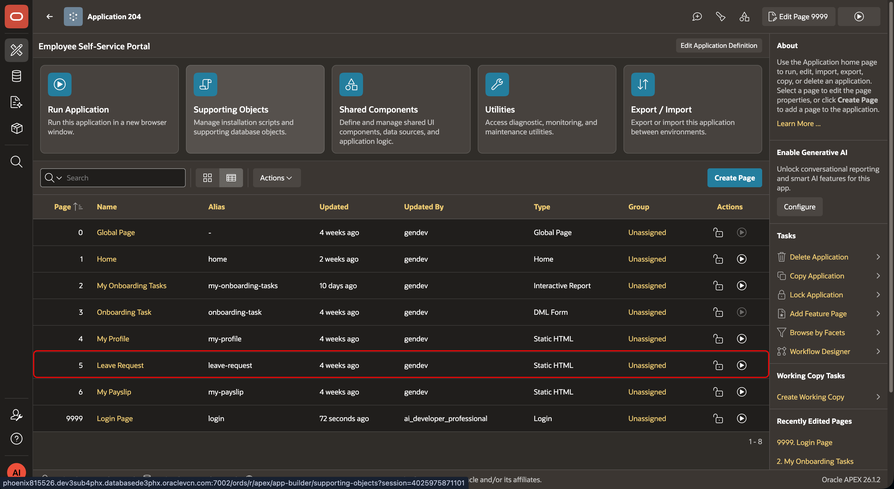

2. In the left pane, right-click **Body** and select **Create Region**.

    

3. In the **Property Editor** on the right, configure the region:

    - Under **Identification**, set **Type** to **Form** and **Name** to **Leave Request Form**.
    - Under **Source**, set the source table to `TMS_LEAVE_REQUESTS`.

    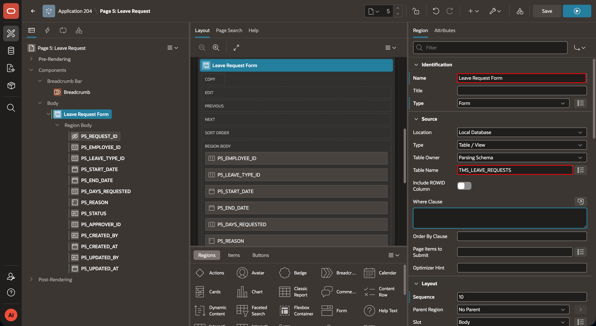

4. Add a **SUBMIT_LEAVE** button.

    - Set **Slot** to **Create**, enable **Hot**, and set the action to **Submit Page**.

    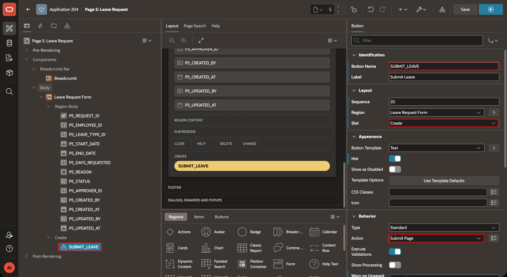

5. Add a **CANCEL** button and set **Slot** to **Close**.

    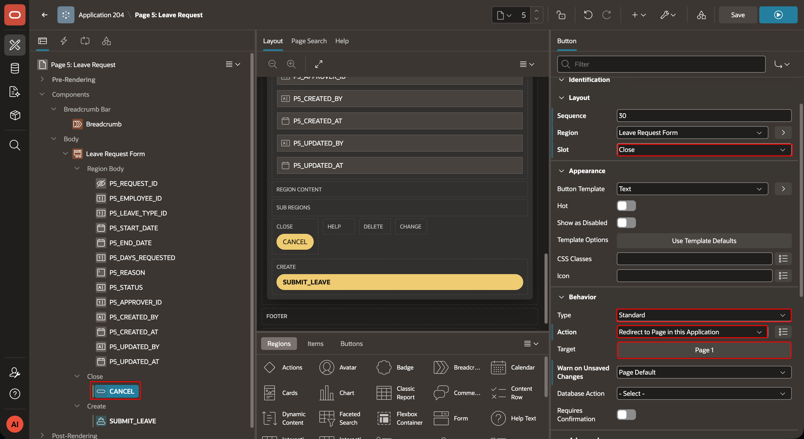

6. Set the button **Action** to **Redirect to a Page in this Application**.

    - Configure the target as the application home page.

    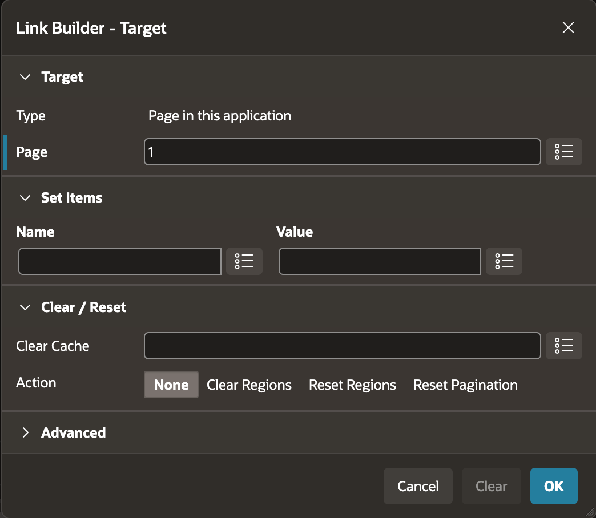

## Task 2: Configure the form items

> **Page numbers:** The examples use page `5` and the `P5_` item prefix. If your Leave Request page has a different number, use its item names and update the report query accordingly.

1. Select `P5_EMPLOYEE_ID`.

    - Set its type to **Display Only**.

    - This non-enterable item displays the value from the logged-in employee session state.

    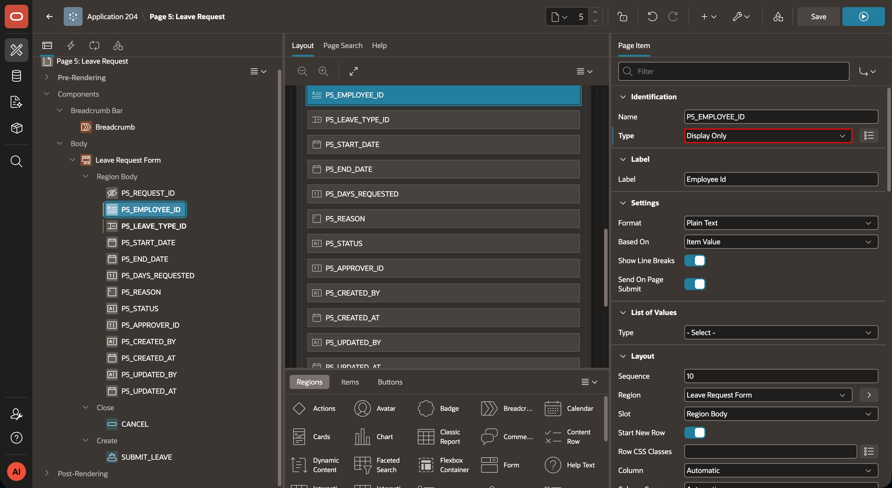

2. Select `P5_LEAVE_TYPE_ID`.

    - Under **Identification**, set **Type** to **Select List**.
    - Under **List of Values**, set **Type** to **Shared Component** and select `TMS_LEAVE.TYPES`.

    - Set **Null Display Value** to `---Select Leave Type---`.

    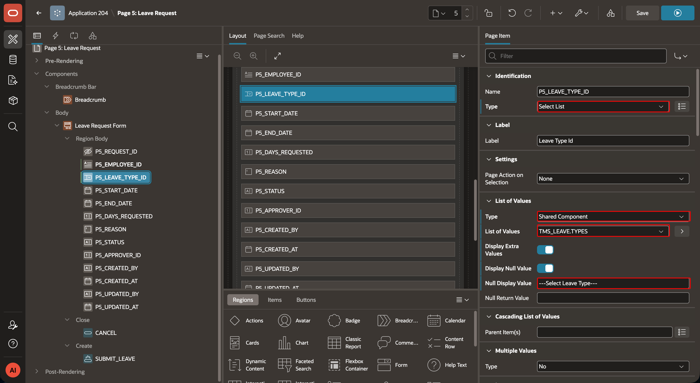

3. Set `P5_STATUS` to **Hidden** with a default value of `Submitted`.

    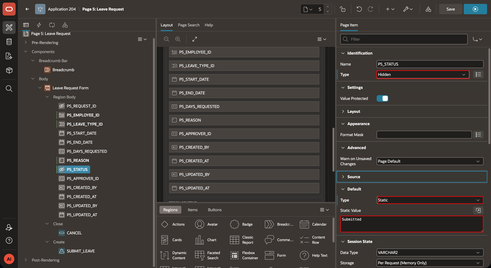

4. Set `P5_APPROVER_ID` to **Hidden**.

    - **Hidden** items remain in the page source but do not render.

    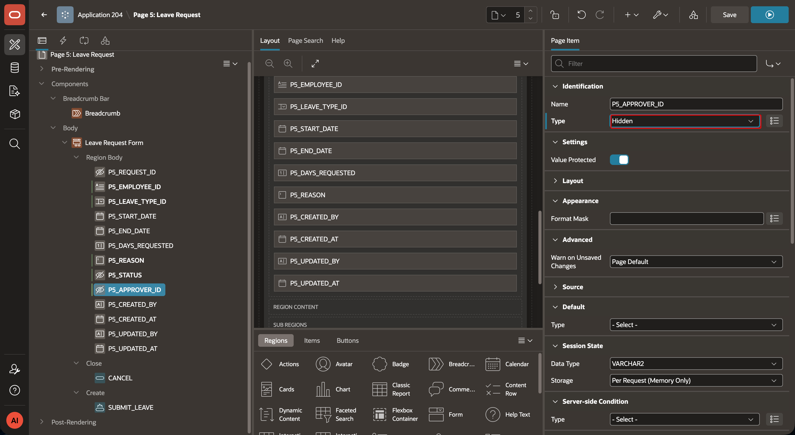

5. In the left pane, select `P5_CREATED_BY`, `P5_CREATED_AT`, `P5_UPDATED_BY`, and `P5_UPDATED_AT`.

    - Hold **Ctrl** on Windows or **Command** on macOS to select multiple items.
    - Right-click the selected items and choose **Delete**. Confirm deletion if prompted.

    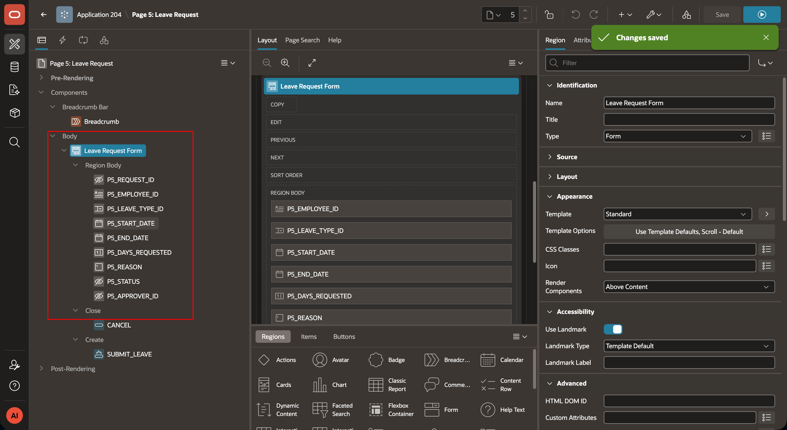

## Task 3: Add the My Leave History report

1. In the left pane, right-click **Body** and select **Create Region**.

    - In the **Property Editor**, set **Type** to **Interactive Report** and **Name** to **My Leave History**.
    - Set the region **Sequence** after the **Leave Request Form** so that the report appears below the form.

    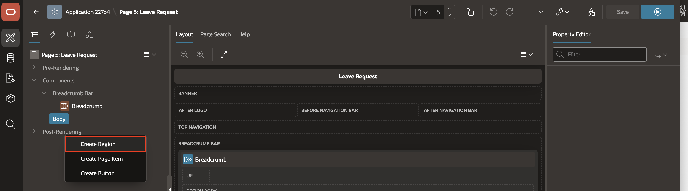

2. Set the region source to this SQL query. Replace `:P5_EMPLOYEE_ID` if your page uses a different employee item name.

    ```sql
    <copy>SELECT leave_type_id,
           start_date,
           end_date,
           days_requested,
           status
      FROM tms_leave_requests
     WHERE employee_id = :P5_EMPLOYEE_ID
     ORDER BY start_date DESC</copy>
    ```

    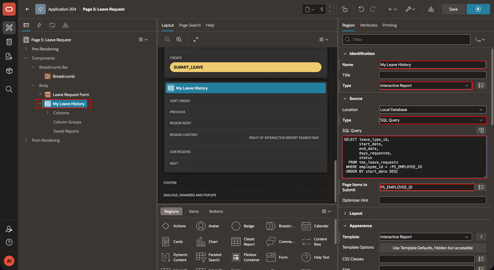

3. Save and run the page.

    - Confirm that the form displays the configured page items and the report displays leave requests for the current employee.

    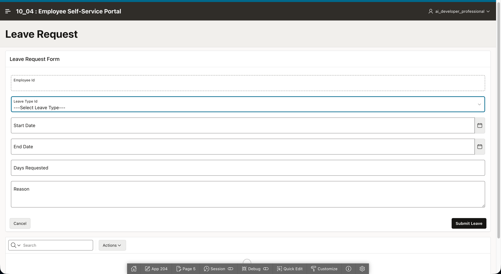

## Acknowledgements

 - **Author -** Aravind Madhavan, Senior Product Manager.
 - **Last Updated By/Date** - Aravind Madhavan, Senior Product Manager, July 2026
