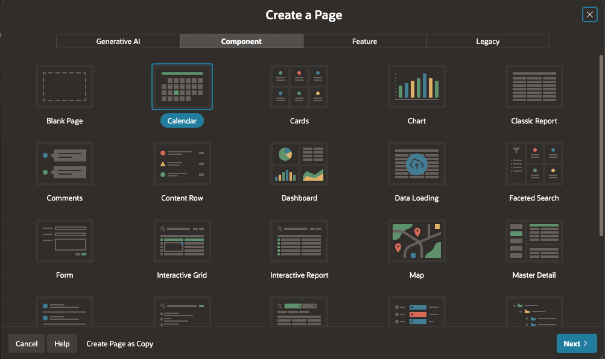
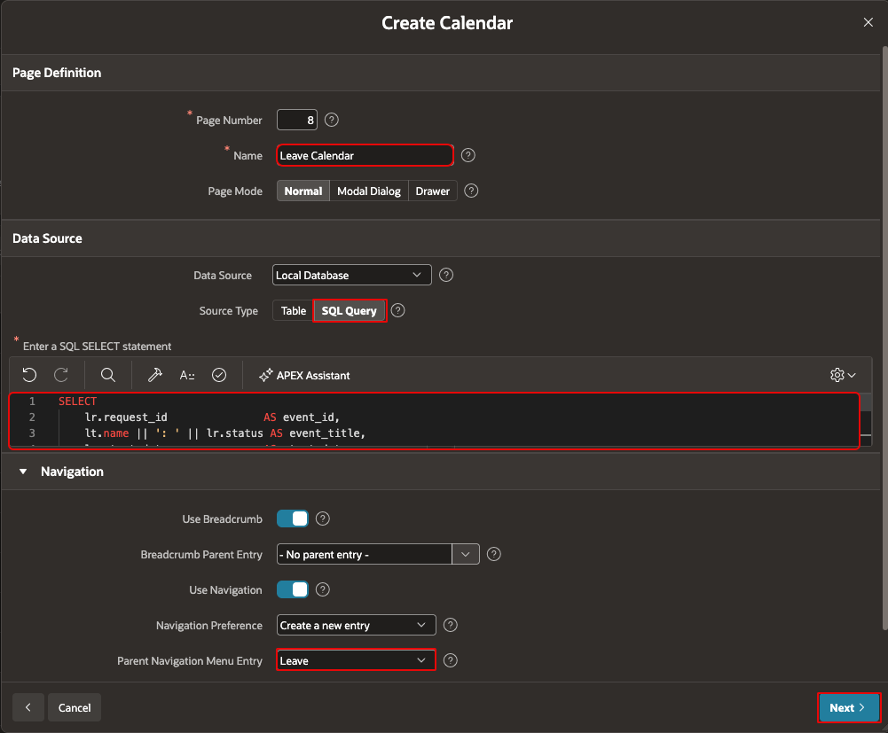
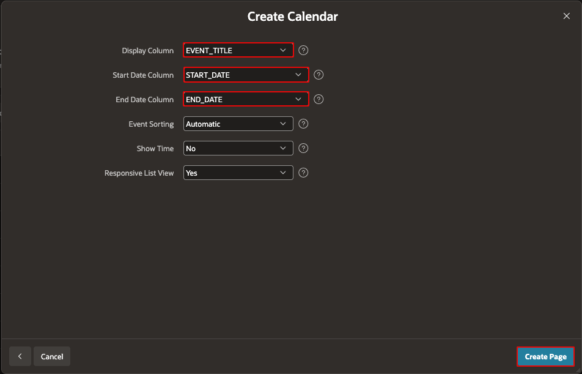
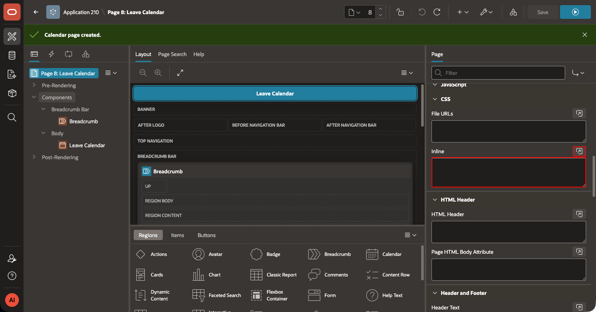
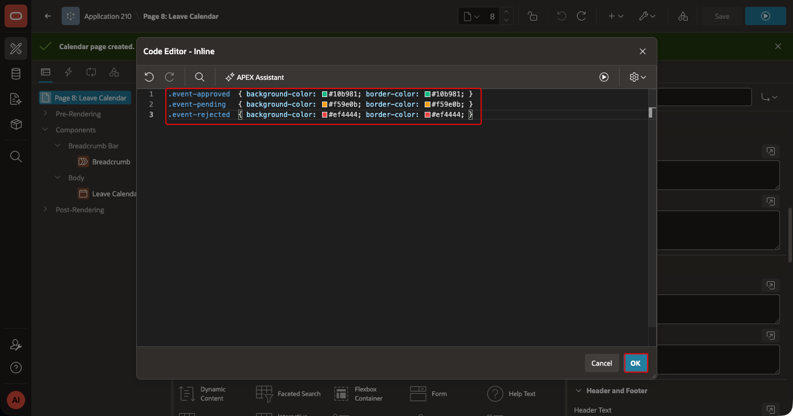
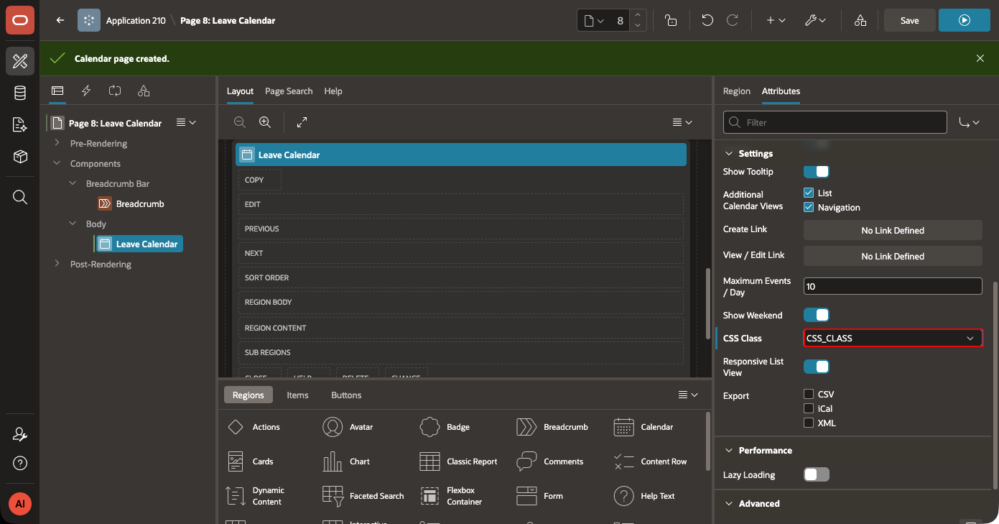
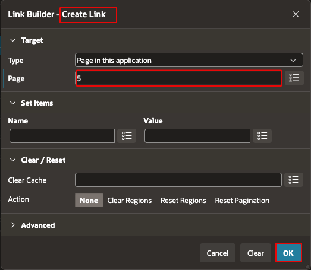
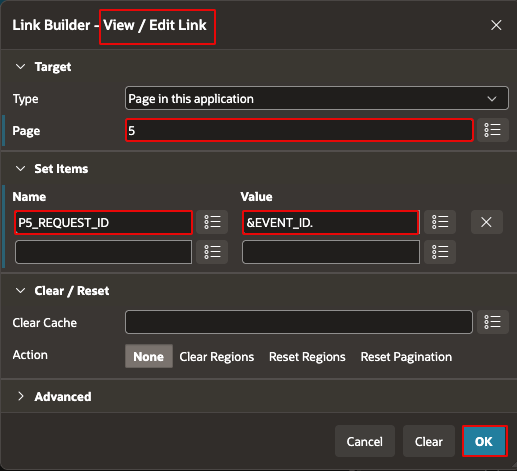

# Create the ESS Leave Calendar

## Introduction

Create a Calendar page in ESS. A Calendar region displays leave requests for the signed-in employee. The CSS Class column applies a different style to each request status.

### Objectives

- Create a Calendar page from a SQL query.
- Map event columns and apply leave-status styles.
- Link each event to the existing Leave Request page.

Estimated Time: 10 minutes

## Task 1: Create the Calendar page

1. In ESS App Builder, select **Create Page**. Select **Component**, then select **Calendar**.
    

2. Enter **Leave Calendar** as the page name. Enable navigation and select **Leave** as the navigation parent. For **Data Source**, select **Local Database** and **SQL Query**. Enter the following query:

    ```sql
    <copy>SELECT lr.request_id AS event_id,
           lt.name || ': ' || lr.status AS event_title,
           lr.start_date AS start_date,
           lr.end_date + 1 AS end_date,
           CASE lr.status
             WHEN 'Approved' THEN 'event-approved'
             WHEN 'Pending'  THEN 'event-pending'
             WHEN 'Rejected' THEN 'event-rejected'
           END AS css_class
      FROM tms_leave_requests lr
      JOIN tms_leave_types lt ON lt.leave_type_id = lr.leave_type_id
      JOIN tms_employees e ON e.employee_id = lr.employee_id
     WHERE UPPER(e.email) = UPPER(:APP_USER)</copy>
    ```
    

3. Map **EVENT_TITLE** to **Display Column**. Map **START_DATE** and **END_DATE** to the date columns. Select **No** for **Show Time**.
    

## Task 2: Style and link calendar events

1. In Page Designer, select the **Leave Calendar** page. In the page **CSS** property, add this inline CSS:

    ```css
    <copy>
    .event-approved { background-color: #10b981; border-color: #10b981; }
    .event-pending  { background-color: #f59e0b; border-color: #f59e0b; }
    .event-rejected { background-color: #ef4444; border-color: #ef4444; }
    </copy>
    ```
    
    

2. Select the Calendar region. In its attributes, set **CSS Class Column** to **CSS_CLASS**.
    

3. Create an **Event Click** link in the Calendar region attributes. Target the existing **Leave Request** page. Pass `EVENT_ID` to its leave-request item.
    
    

4. Save and run the page. Confirm that only the signed-in employee leave requests appear.

## Acknowledgements

- **Author -** Aravind Madhavan, Senior Product Manager.
- **Last Updated By/Date** - Aravind Madhavan, Senior Product Manager, July 2026
