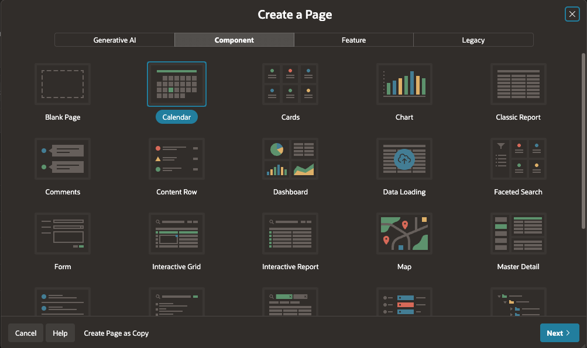
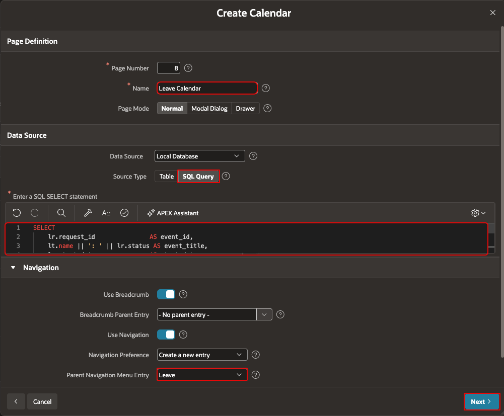
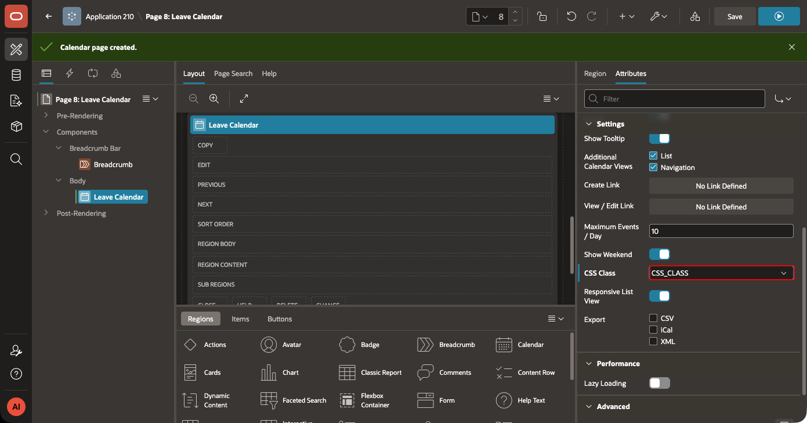
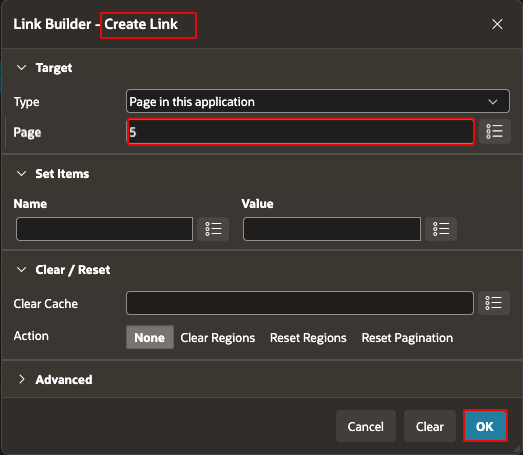
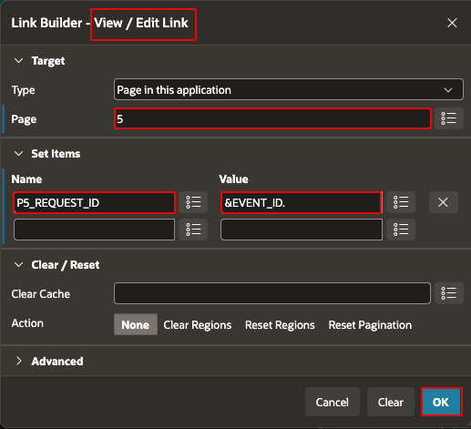

# Lab 1: Create the ESS Leave Calendar

## Introduction

Create a Calendar page in ESS. A Calendar region displays leave requests for the signed-in employee. The **CSS Class** setting applies a different style to each request status.

Estimated Workshop Time: 10 minutes

### Objectives

In this lab, you will learn how to:

- Create a Calendar page from a SQL query.
- Map event columns and apply leave-status styles.
- Link each event to the existing Leave Request page.

## Task 1: Create the Calendar page

1. In ESS **App Builder**, select **Create Page**.

    - Select **Component**, then select **Calendar**.
    

2. Enter **Leave Calendar** as the page name.

    - Enable navigation and select **Leave** as the navigation parent.

    - For **Data Source**, select **Local Database** and **SQL Query**.

    - Enter the following query:

        ```sql
        <copy>SELECT lr.request_id AS event_id,
               lt.name || ': ' || lr.status AS event_title,
               lr.start_date AS start_date,
               lr.end_date + 1 AS end_date,
               CASE lr.status
                 WHEN 'Approved' THEN 'event-approved'
                 WHEN 'Pending'  THEN 'event-pending'
                 WHEN 'Rejected' THEN 'event-rejected'
               END AS css_class
          FROM tms_leave_requests lr
          JOIN tms_leave_types lt ON lt.leave_type_id = lr.leave_type_id
          JOIN tms_employees e ON e.employee_id = lr.employee_id
         WHERE UPPER(e.email) = UPPER(:APP_USER)</copy>
        ```
    

3. Map **EVENT_TITLE** to **Display Column**.

    - Map **START_DATE** and **END_DATE** to the date columns.

    - Select **No** for **Show Time**.
    

## Task 2: Style and link calendar events

1. In **Page Designer**, select the **Leave Calendar** page. Expand **CSS** and open the code editor for **Inline**.

    

2. Enter the following inline CSS, then click **OK**:

    ```css
    <copy>
    .event-approved { background-color: #10b981; border-color: #10b981; }
    .event-pending  { background-color: #f59e0b; border-color: #f59e0b; }
    .event-rejected { background-color: #ef4444; border-color: #ef4444; }
    </copy>
    ```

    

3. Select the Calendar region. On the **Attributes** tab, set **CSS Class** to `CSS_CLASS`.
    

4. In the Calendar region **Attributes**, open **View / Edit Link**.

    

5. Target page `5`, **Leave Request**, and set `P5_REQUEST_ID` to `&EVENT_ID.`.

    

6. Save and run the page.

    - Confirm that only the signed-in employee leave requests appear.

## Acknowledgements

- **Author -** Aravind Madhavan, Senior Product Manager.
- **Last Updated By/Date** - Aravind Madhavan, Senior Product Manager, July 2026
