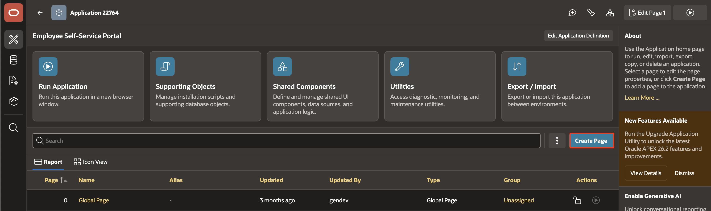
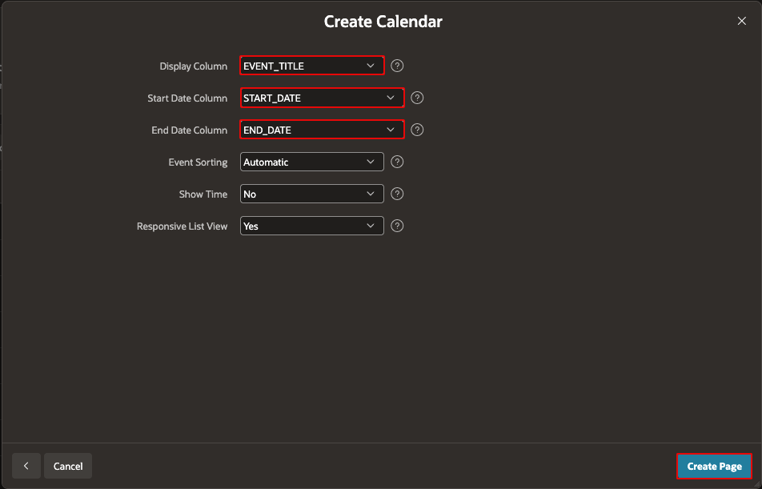
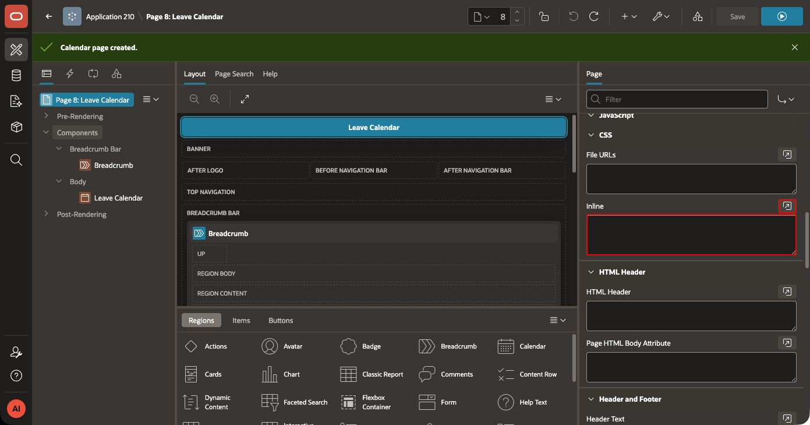
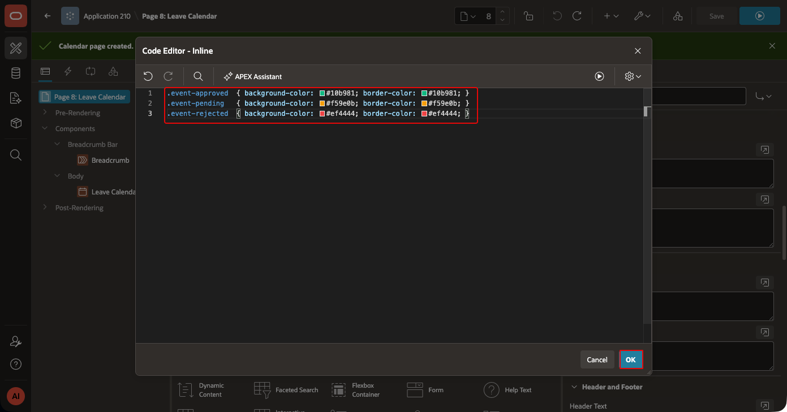

# Lab 1: Create the ESS Leave Calendar

## Introduction

Create a Calendar page in ESS. A Calendar region displays leave requests for the signed-in employee. The **CSS Class** setting applies a different style to each request status.

Estimated Workshop Time: 10 minutes

### Objectives

In this lab, you will learn how to:

- Create a Calendar page from a SQL query.
- Map event columns and apply leave-status styles.
- Link each event to the existing Leave Request page.

## Task 1: Create the Calendar page

1. Open **Employee Self-Service Portal (ESS)** in **App Builder**.

2. On the application home page, click **Create Page**.

    

3. Under **Component**, select **Calendar**.

    

4. Enter **Leave Calendar** as the page name.

    - Enable navigation and select **Leave** as the navigation parent.

    - For **Data Source**, select **Local Database** and **SQL Query**.

    - Enter the following query:

        ```sql
        <copy>SELECT lr.request_id AS event_id,
               lt.name || ': ' || lr.status AS event_title,
               lr.start_date AS start_date,
               lr.end_date + 1 AS end_date,
               CASE lr.status
                 WHEN 'Approved' THEN 'event-approved'
                 WHEN 'Pending'  THEN 'event-pending'
                 WHEN 'Rejected' THEN 'event-rejected'
               END AS css_class
          FROM tms_leave_requests lr
          JOIN tms_leave_types lt ON lt.leave_type_id = lr.leave_type_id
          JOIN tms_employees e ON e.employee_id = lr.employee_id
         WHERE UPPER(e.email) = UPPER(:APP_USER)</copy>
        ```
    

5. Map the following columns:

    - **Display Column:** `EVENT_TITLE`.
    - **Start Date Column:** `START_DATE`.
    - **End Date Column:** `END_DATE`.
    - Click **Create Page**.

    

## Task 2: Style and link calendar events

1. In the left pane, Click on the Page Name and in the **Property Editor**, scroll down to **CSS** and update the following:

    

    - **Inline:** Copy and paste the following CSS:

        ```css
        <copy>
        .event-approved { background-color: #10b981; border-color: #10b981; }
        .event-pending  { background-color: #f59e0b; border-color: #f59e0b; }
        .event-rejected { background-color: #ef4444; border-color: #ef4444; }
        </copy>
        ```

    - If you opened the code editor, click **OK** to close it.

    

2. In the left pane, select the **Leave Calendar** region.

    - In the right pane, open the **Attributes** tab.
    - Under **Settings**, enter or select the following:
        - **View / Edit Link:** Click **No Link Defined** to open the link target dialog.
            - **Target** > **Page:** `5`, **Leave Request**.
            - Set `P5_REQUEST_ID` to `&EVENT_ID.`.
            - Click **OK**.
                

        - **CSS Classes:** `CSS_CLASS`.
        

3. Save and run the page.

    - Confirm that only the signed-in employee leave requests appear.

## Acknowledgements

- **Author -** Aravind Madhavan, Senior Product Manager.
- **Last Updated By/Date** - Aravind Madhavan, Senior Product Manager, July 2026
