# Create the ESS 30-Day Check-In Survey

## Introduction

Build a check-in survey for employees who have completed their first 30 days. The form stores each employee rating and comment. Native Star Rating items collect three required scores from one through five.

### Objectives

- Create the `TMS_EMPLOYEE_CHECKINS` table.
- Create an Interactive Report and form for check-in records.
- Populate the employee ID from the signed-in user.
- Configure three native Star Rating items.

Estimated Time: 10 minutes

## Task 1: Create the check-in table

1. In SQL Workshop, select **SQL Commands**. Run the following statement:

    ```sql
    <copy>
    CREATE TABLE tms_employee_checkins (
    checkin_id NUMBER GENERATED BY DEFAULT AS IDENTITY PRIMARY KEY,
    employee_id NUMBER NOT NULL,
    overall_rating NUMBER,
    manager_support_rating NUMBER,
    onboarding_rating NUMBER,
    comments VARCHAR2(2000),
    created_at TIMESTAMP DEFAULT SYSTIMESTAMP);
    </copy>
    ```
    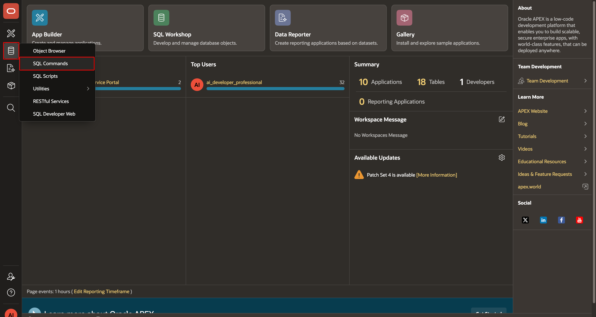
    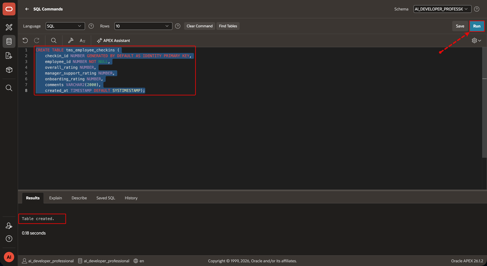

2. Confirm that `TMS_EMPLOYEE_CHECKINS` appears in Object Browser.
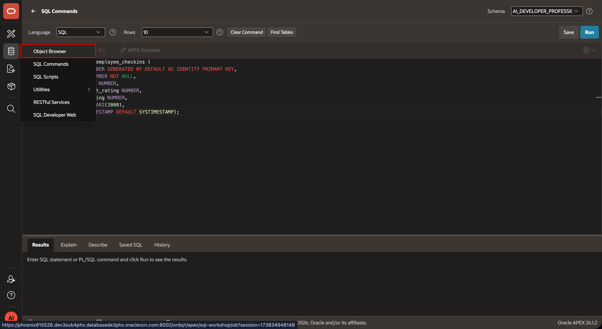
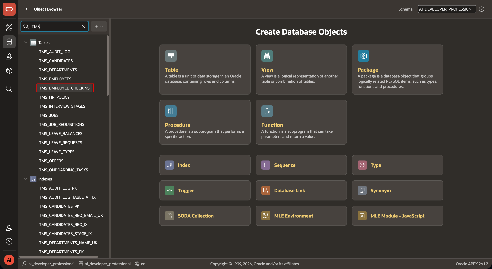

## Task 2: Create the report and form

1. In ESS App Builder, select **Create Page**, then select **Interactive Report with Form**.
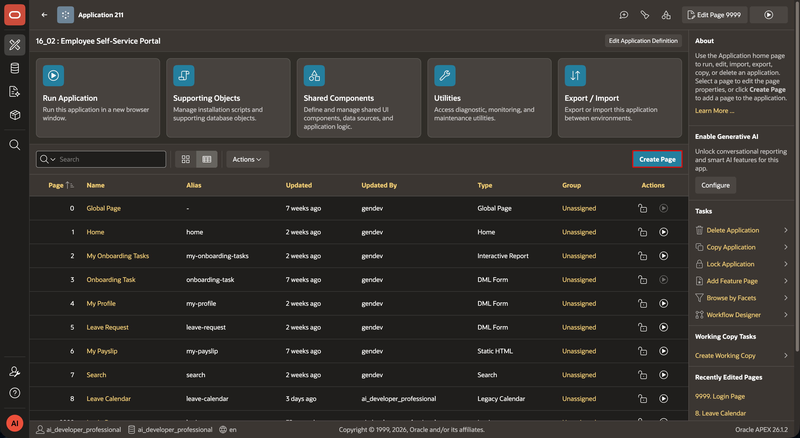
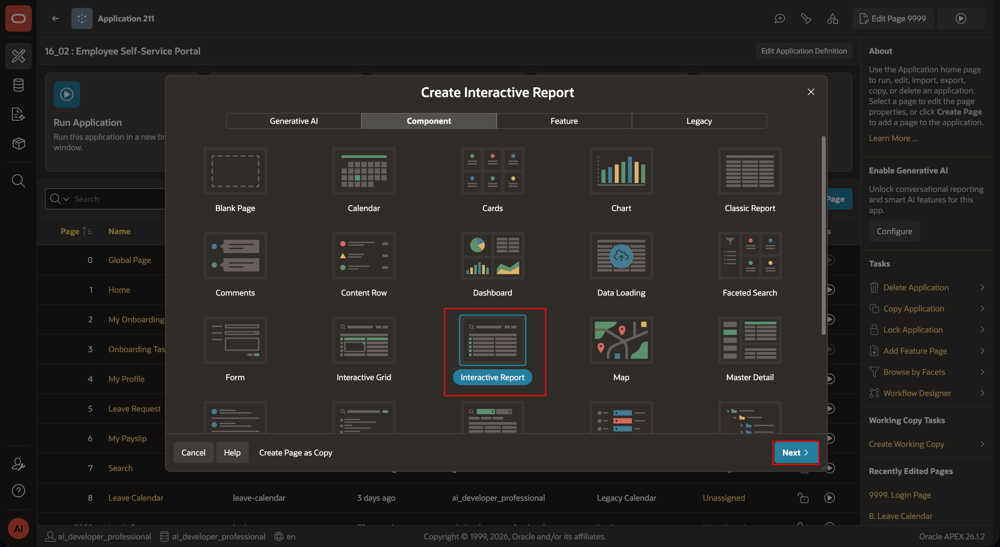

2. Name the report page **My Check-In History** and the form page as **Employee Check-In**. Select `TMS_EMPLOYEE_CHECKINS` as the table.
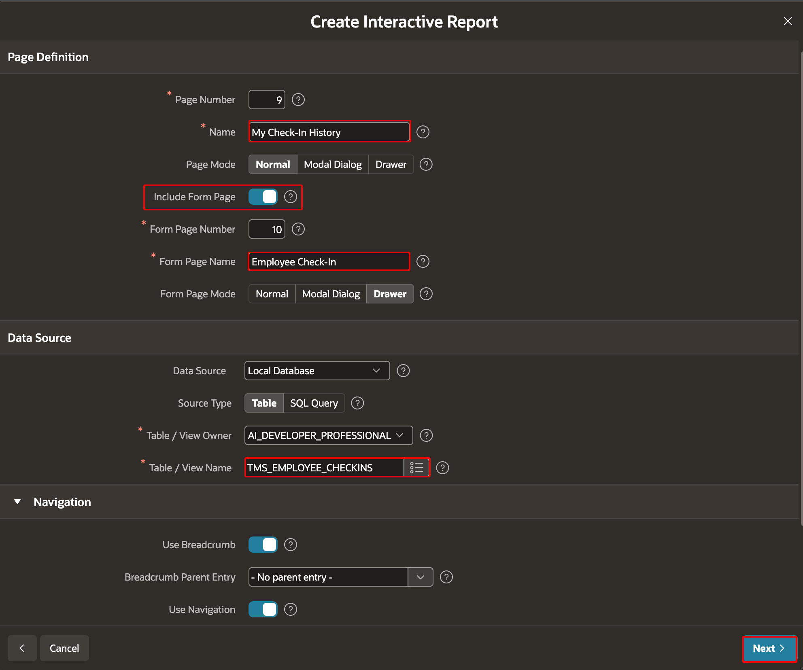

3. Run the **My Check-In History** page and click on `Create` button on the right of the Interactive Report to open **Employee Check-In** form.
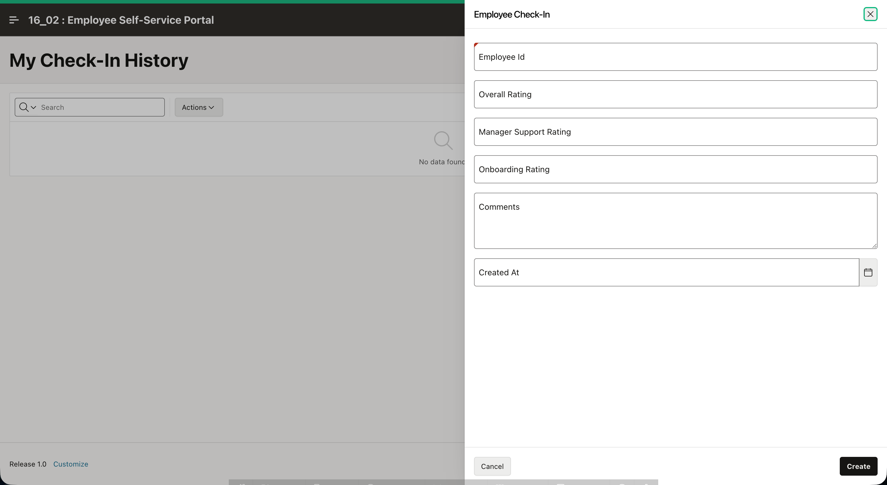

## Task 3: Populate the employee ID and configure ratings in Employee Check-In form

1. Select the `EMPLOYEE_ID` item. Set **Type** to **Hidden**. Under **Source**, clear any **Static Value**.
    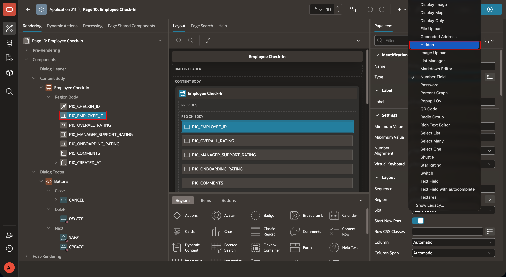


2. Under **Default**, select **SQL Query (returning single value)** and enter:

    ```sql
    <copy>SELECT employee_id
      FROM tms_employees
     WHERE UPPER(email) = UPPER(:APP_USER)</copy>
    ```
    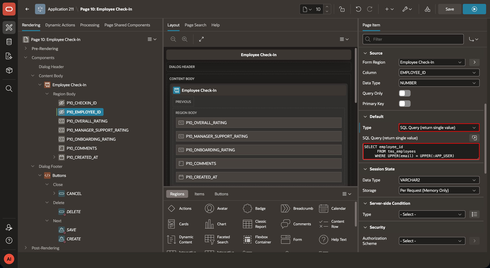


3. For each item in the table, select **Star Rating** from the **Type** list.

    | Item | Label |
    | --- | --- |
    | `PXX_OVERALL_RATING` | Overall Onboarding Experience |
    | `PXX_MANAGER_SUPPORT_RATING` | Manager Support |
    | `PXX_ONBOARDING_RATING` | Onboarding Process |

    For each Star Rating item, configure the below settings:

    - Set **Number of Stars** to `5`.
    - Toggle off `Use Defauts`.
    - Set **Show Value** to **Yes**. APEX displays the selected value, such as `3 / 5`.
    - Set **Show Clear Button** to **No**. This setting is optional.
    - Set **Value Required** to **Yes**.

    APEX renders the Star Rating item as SVG stars and submits a numeric value from `1` through `5`.
    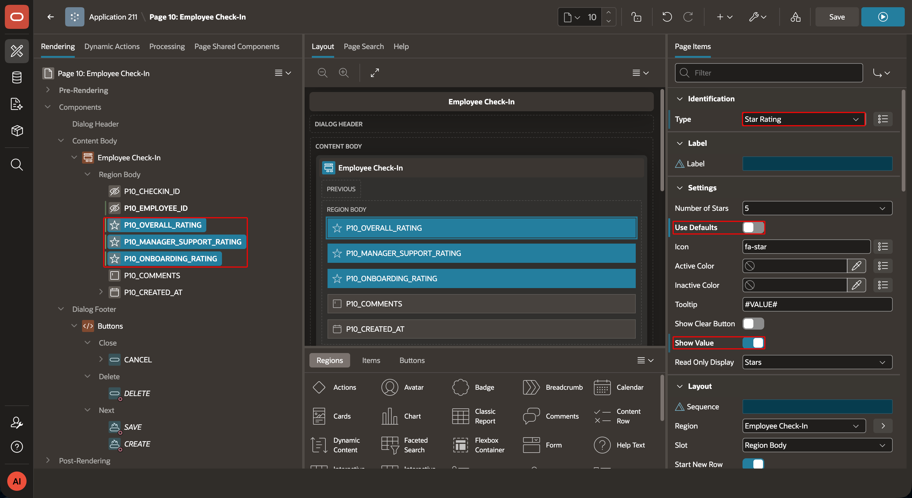

4. Keep `COMMENTS` as a Textarea and set its maximum length to `2000`.
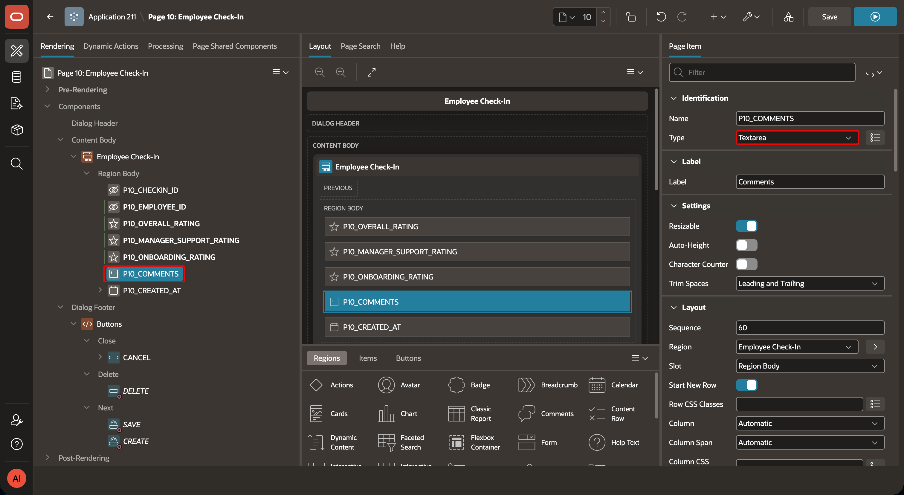

5. Change `PX_CREATED_AT` to Hidden, as it will be automatically populated with the default timestamp when a row is inserted.
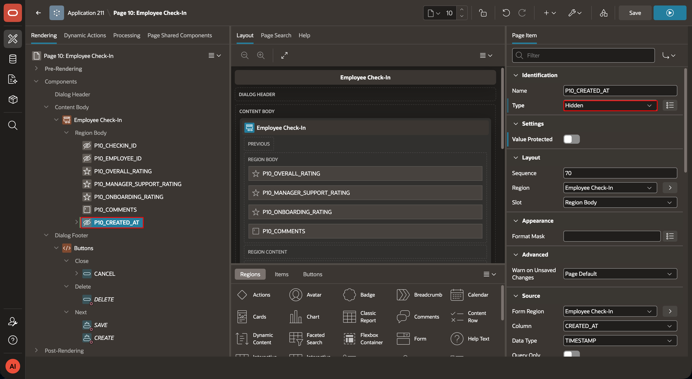
6. Save and run the form. Submit one check-in as the signed-in employee. Confirm that it appears in **My Check-In History**.
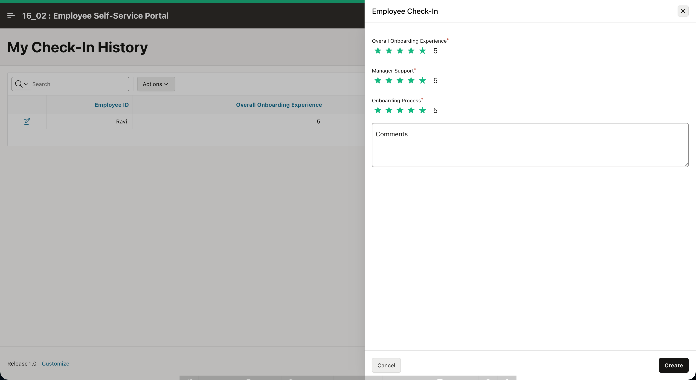
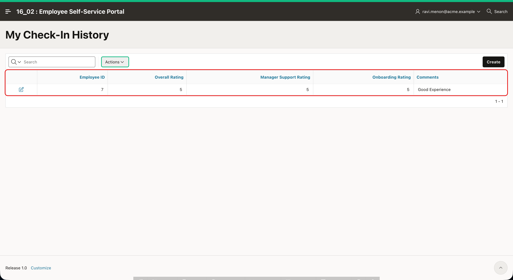

## Acknowledgements

- **Author -** Aravind Madhavan, Senior Product Manager.
- **Last Updated By/Date** - Aravind Madhavan, Senior Product Manager, July 2026
