# Lab 2: Create the ESS 30-Day Check-In Survey

## Introduction

Build a check-in survey for employees who have completed their first 30 days. The form stores each employee rating and comment. Star Rating items display five stars that users can click to set a numeric value.

Estimated Workshop Time: 10 minutes

### Objectives

In this lab, you will learn how to:

- Create the `TMS_EMPLOYEE_CHECKINS` table.
- Create an Interactive Report and form for check-in records.
- Populate the employee ID from the signed-in user.
- Configure three native Star Rating items.

## Task 1: Create the check-in table

1. From the left navigation menu, open **SQL Workshop** and select **SQL Commands**.

    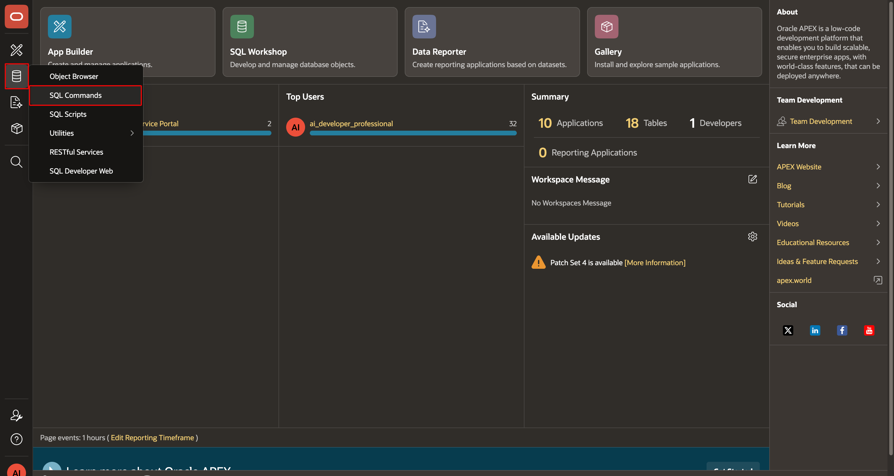

2. Copy and paste the following SQL statement, then click **Run**:

    ```sql
    <copy>
    CREATE TABLE tms_employee_checkins (
    checkin_id NUMBER GENERATED BY DEFAULT AS IDENTITY PRIMARY KEY,
    employee_id NUMBER NOT NULL,
    overall_rating NUMBER,
    manager_support_rating NUMBER,
    onboarding_rating NUMBER,
    comments VARCHAR2(2000),
    created_at TIMESTAMP DEFAULT SYSTIMESTAMP);
    </copy>
    ```

    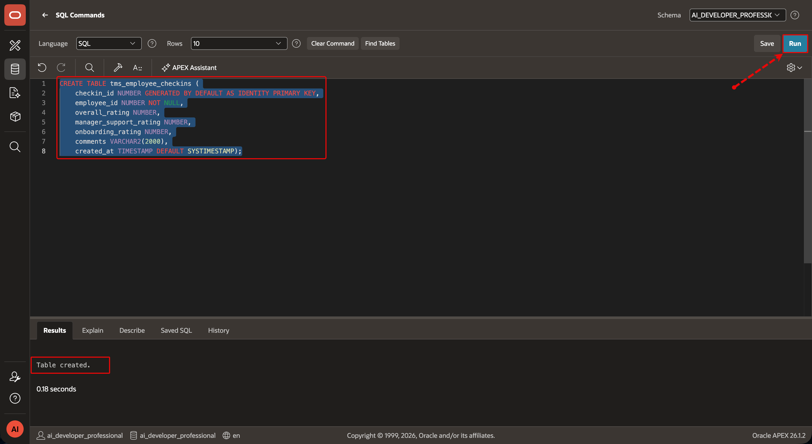

3. From the left navigation menu, open **SQL Workshop** and select **Object Browser**.

    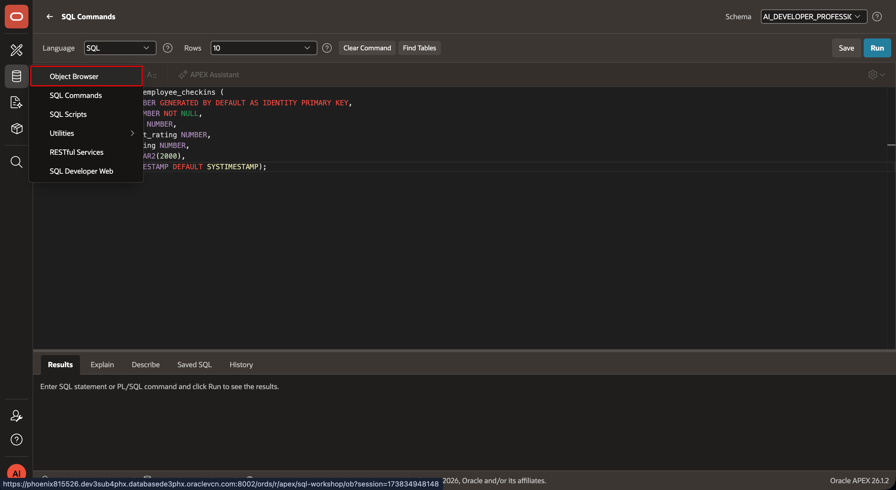

4. Expand **Tables** and search for `TMS_EMPLOYEE_CHECKINS`.

    - Select the table to confirm that it exists and displays the expected columns.

    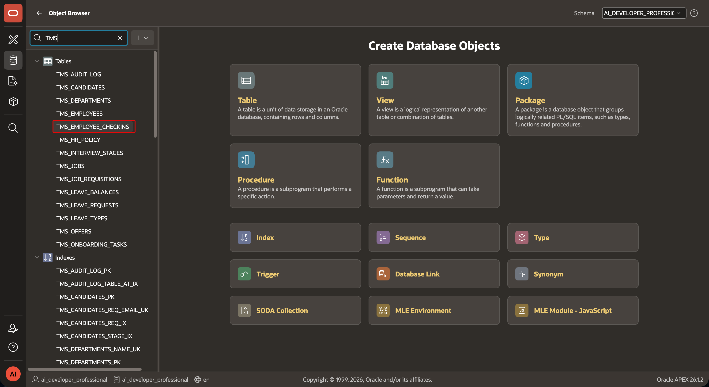

## Task 2: Create the report and form

1. From the left navigation menu, click the **App Builder** icon.

2. Select the **Employee Self-Service Portal (ESS)** application.

3. On the application home page, click **Create Page**.

    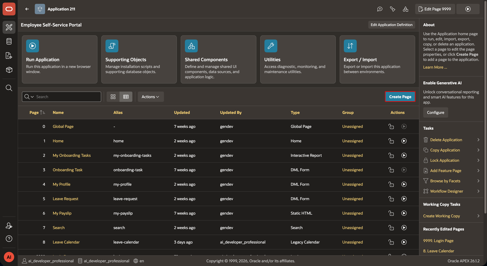

4. Under **Component**, select **Interactive Report**.

    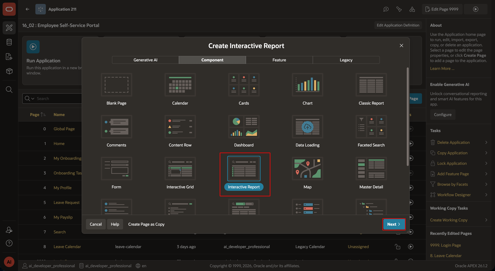

5. Enter or select the following attributes:

    - **Name:** My Check-In History.
    - **Include Form Page:** On.
    - **Form Page Name:** Employee Check-In.
    - **Table / View Name:** `TMS_EMPLOYEE_CHECKINS`.
    - Click **Next**.

    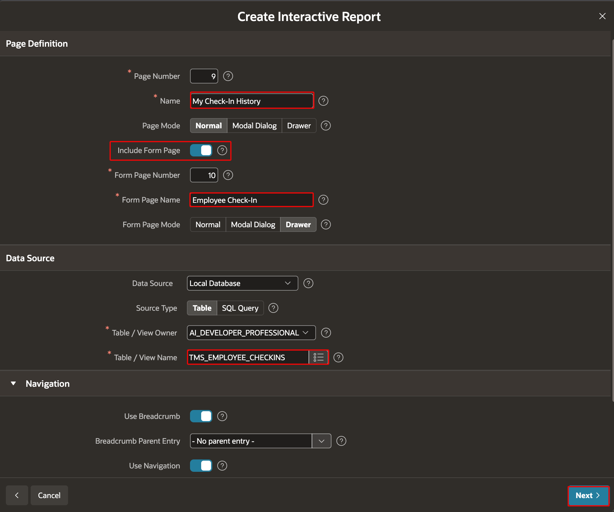

6. Confirm that **Primary Key Column 1** is `CHECKIN_ID`, then click **Create Page**.

    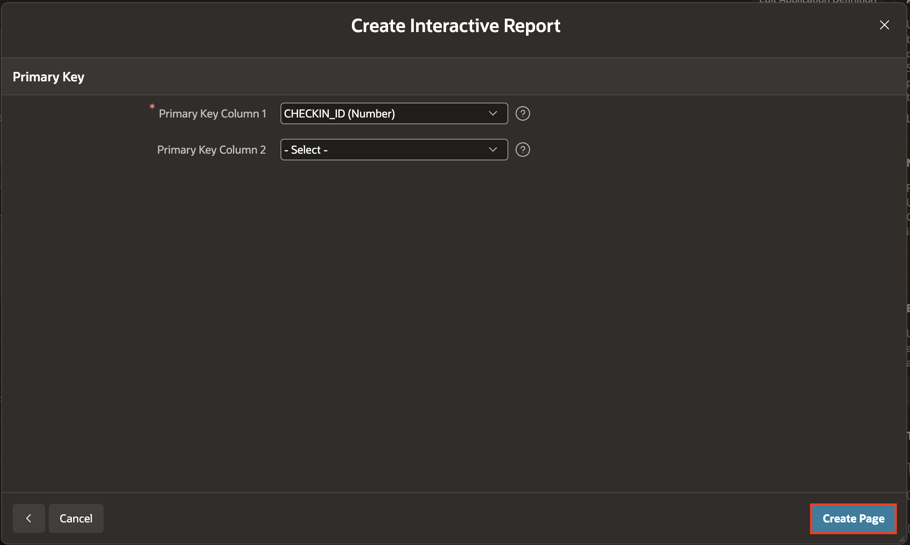

7. Click **Save and Run** for the **My Check-In History** page.

    - Click **Create** to open the **Employee Check-In** form.
    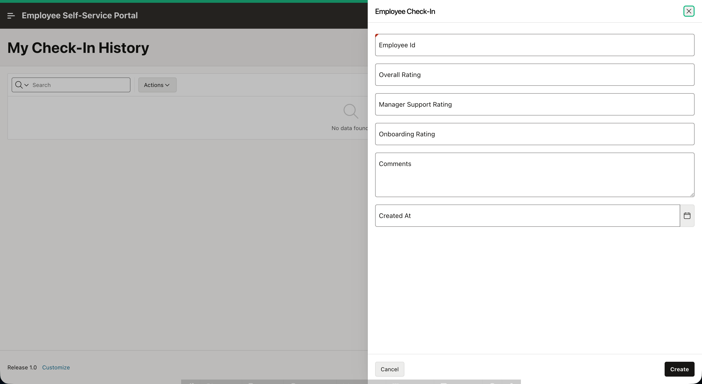

## Task 3: Populate the employee ID and configure ratings in Employee Check-In form

1. Select the `PXX_EMPLOYEE_ID` page item for the `EMPLOYEE_ID` form column.

    - Set **Type** to **Hidden**.

    - Under **Source**, clear any **Static Value**.
    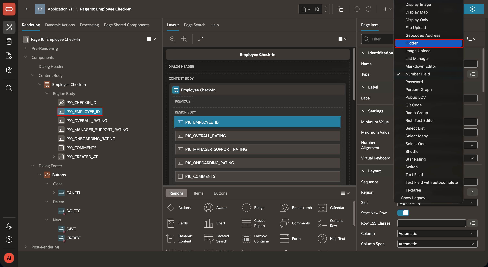

2. Under **Default**, select **SQL Query (returning single value)**.

    - Enter:

        ```sql
        <copy>SELECT employee_id
          FROM tms_employees
         WHERE UPPER(email) = UPPER(:APP_USER)</copy>
        ```
    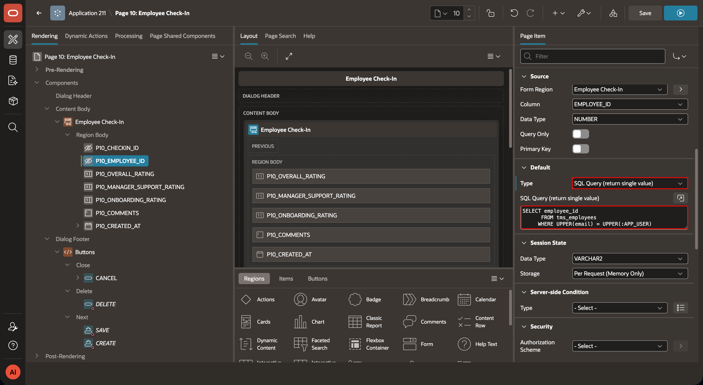

3. For each item in the table, select **Star Rating** from the **Type** list.

    | Item | Label |
    | --- | --- |
    | `PXX_OVERALL_RATING` | Overall Onboarding Experience |
    | `PXX_MANAGER_SUPPORT_RATING` | Manager Support |
    | `PXX_ONBOARDING_RATING` | Onboarding Process |

    For each **Star Rating** item, configure these settings:

    - Set **Number of Stars** to `5`.
    - Turn off **Use Defaults**.
    - Set **Show Value** to **Yes**. APEX displays the selected value, such as `3 / 5`.
    - Set **Show Clear Button** to **No**. This setting is optional.
    - Set **Value Required** to **Yes**.

    A **Star Rating** item displays stars that users can click to set a numeric value from `1` through `5`.
    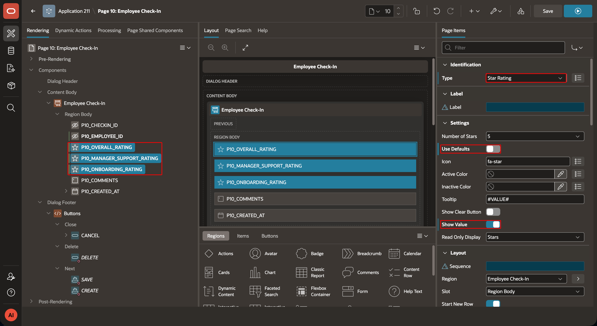

4. Keep `PXX_COMMENTS` as a **Textarea** and set its maximum length to `2000`.
    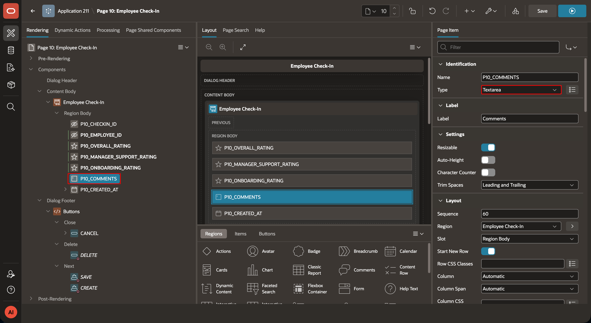

5. Change `PXX_CREATED_AT` to **Hidden**. APEX assigns the default timestamp when a user inserts a row.
    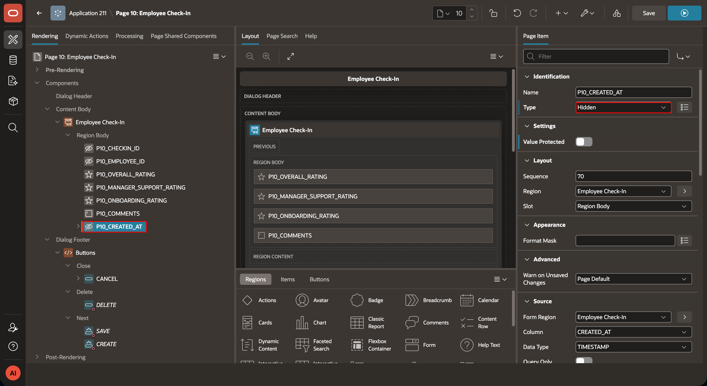

6. Save and run the **Employee Check-In** form. Submit one check-in as the signed-in employee.

    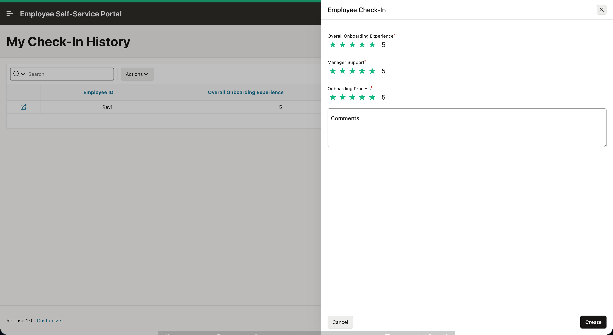

7. Confirm that the submitted check-in appears in **My Check-In History**.

    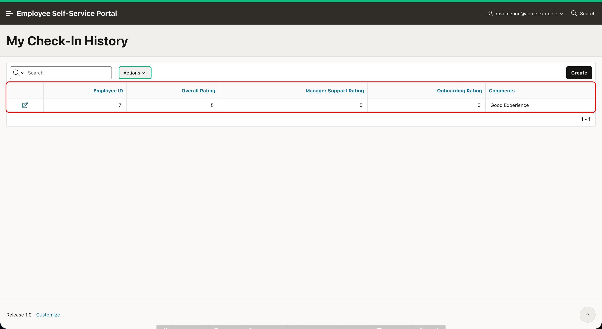

## Acknowledgements

- **Author -** Aravind Madhavan, Senior Product Manager.
- **Last Updated By/Date** - Aravind Madhavan, Senior Product Manager, July 2026
