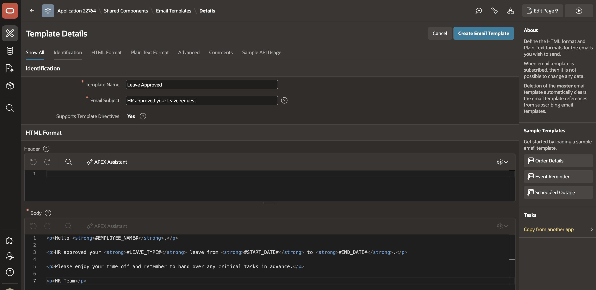
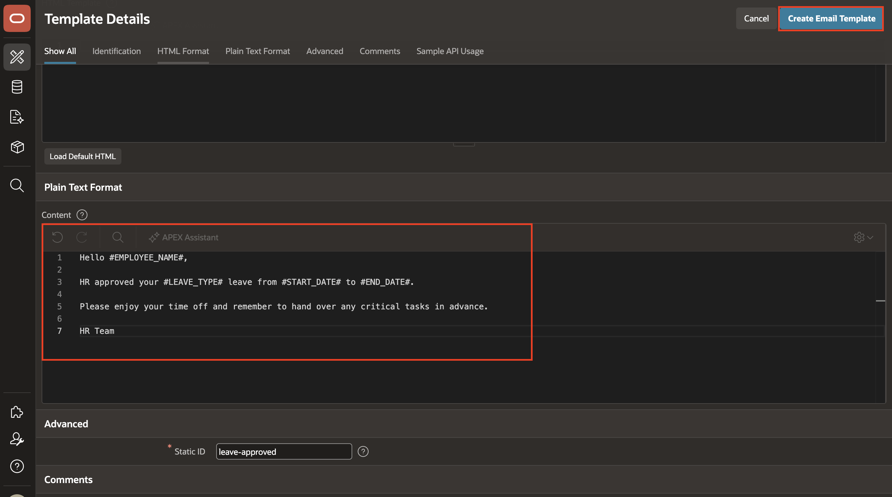

# Lab 3: Create ESS Email Templates

## Introduction

Create email templates for leave, onboarding, and probation events. Each template has a static identifier. Automations populate its placeholders from a query row.

Estimated Workshop Time: 10 minutes

### Objectives

In this lab, you will learn how to:

- Verify instance email prerequisites.
- Create five ESS email templates.
- Use stable static identifiers and placeholders.

## Task 1: Set up instance email

1. Ask your instance administrator to configure the SMTP host and port in **Administration Services**. Ask them to set a default From address, such as `noreply@acmecorp.com`.

2. Follow the [Oracle email setup guidance](https://docs.oracle.com/en/database/oracle/apex/26.1/aeadm/configuring-email.html) for your instance.

3. If you use Oracle APEX Service (`https://www.oracleapex.com`), ignore this task. The service manages instance email.

4. Confirm that the application can send a test email before you continue.

## Task 2: Create the ESS templates

> **Screenshot guidance:** The screenshots show **Leave Approved**. Follow the same field layout for each subsequent template, using the values and content provided in its numbered step.

1. In **Employee Self-Service Portal (ESS)**, navigate to **Shared Components**.

    

2. Under **User Interface**, select **Email Templates**.

    

3. Click **Create Email Template**.

    

4. Configure the following attributes:

    - Under **Identification**:
        - **Template Name:** Leave Approved
        - **Email Subject:** HR approved your leave request

    - **HTML Format** > **Body**: Copy and paste the following HTML code:

        ```html
        <copy><p>Hello <strong>#EMPLOYEE_NAME#</strong>,</p>

        <p>HR approved your <strong>#LEAVE_TYPE#</strong> leave from <strong>#START_DATE#</strong> to <strong>#END_DATE#</strong>.</p>

        <p>Please enjoy your time off and remember to hand over any critical tasks in advance.</p>

        <p>HR Team</p></copy>
        ```

    

    - **Plain Text Format** > **Content**: Copy and paste the following text:

        ```text
        <copy>Hello #EMPLOYEE_NAME#,

        HR approved your #LEAVE_TYPE# leave from #START_DATE# to #END_DATE#.

        Please enjoy your time off and remember to hand over any critical tasks in advance.

        HR Team</copy>
        ```

    

    - Under **Advanced**, confirm that **Static ID** is `leave-approved`.
    - Click **Create Email Template** to save the template.
    - Return to **Email Templates** and click **Create Email Template** to begin the next template.

5. Configure the following attributes:

    - Under **Identification**:
        - **Template Name:** Leave Rejected
        - **Email Subject:** HR could not approve your leave request

    - **HTML Format** > **Body**: Copy and paste the following HTML code:

        ```html
        <copy><p>Hello <strong>#EMPLOYEE_NAME#</strong>,</p>

        <p>HR could not approve your recent leave request.</p>

        <p><em>Reason:</em> #REJECTION_REASON#</p>

        <p>If you believe this is an error or have questions, please contact HR.</p></copy>
        ```

    - **Plain Text Format** > **Content**: Copy and paste the following text:

        ```text
        <copy>Hello #EMPLOYEE_NAME#,

        HR could not approve your recent leave request.

        Reason: #REJECTION_REASON#

        If you have questions, please contact HR.</copy>
        ```

    - Under **Advanced**, confirm that **Static ID** is `leave-rejected`.
    - Click **Create Email Template** to save the template.
    - Return to **Email Templates** and click **Create Email Template** to begin the next template.

6. Configure the following attributes:

    - Under **Identification**:
        - **Template Name:** Task Overdue Notification
        - **Email Subject:** Action needed: Overdue onboarding task

    - **HTML Format** > **Body**: Copy and paste the following HTML code:

        ```html
        <copy><p>Hello <strong>#EMPLOYEE_NAME#</strong>,</p>

        <p>Your onboarding task <strong>"#TASK_NAME#"</strong> was due on <strong>#DUE_DATE#</strong> and is now <span style="color:#ef4444;">overdue</span>.</p>

        <p>Please complete it as soon as possible or reach out to your manager if you need help.</p></copy>
        ```

    - **Plain Text Format** > **Content**: Copy and paste the following text:

        ```text
        <copy>Hello #EMPLOYEE_NAME#,

        Your onboarding task "#TASK_NAME#" was due on #DUE_DATE# and is now OVERDUE.

        Please complete it as soon as possible or reach out to your manager if you need help.</copy>
        ```

    - Under **Advanced**, confirm that **Static ID** is `task-overdue-notification`.
    - Click **Create Email Template** to save the template.
    - Return to **Email Templates** and click **Create Email Template** to begin the next template.

7. Configure the following attributes:

    - Under **Identification**:
        - **Template Name:** Welcome to Acme Corp
        - **Email Subject:** Welcome to Acme Corp, #EMPLOYEE_NAME#!

    - **HTML Format** > **Body**: Copy and paste the following HTML code:

        ```html
        <copy><h2 style="margin-bottom:0">Welcome to Acme Corp, #EMPLOYEE_NAME#!</h2>

        <p>We look forward to your first day on <strong>#START_DATE#</strong>.</p>

        <ul>
                <li><strong>Department:</strong> #DEPT_NAME#</li>
                <li><strong>Manager:</strong> #MANAGER_NAME#</li>
        </ul>

        <p>Please sign in to the Employee Self-Service portal to view your onboarding tasks and upload any required documents.</p>

        <p>If you have questions before you start, just reply to this email.</p>

        <p>HR Team</p></copy>
        ```

    - **Plain Text Format** > **Content**: Copy and paste the following text:

        ```text
        <copy>WELCOME TO ACME CORP, #EMPLOYEE_NAME#!

        We look forward to your first day on #START_DATE#.

        Department: #DEPT_NAME#
        Manager: #MANAGER_NAME#

        Sign in to the ESS portal to view your onboarding tasks and upload documents.

        If you have questions before you start, just reply to this email.

        HR Team</copy>
        ```

    - Under **Advanced**, confirm that **Static ID** is `welcome-to-acme-corp`.
    - Click **Create Email Template** to save the template.
    - Return to **Email Templates** and click **Create Email Template** to begin the next template.

8. Configure the following attributes:

    - Under **Identification**:
        - **Template Name:** Probation Alert
        - **Email Subject:** Probation ends soon for #EMPLOYEE_NAME#

    - **HTML Format** > **Body**: Copy and paste the following HTML code:

        ```html
        <copy><p><strong>Probation Review Reminder</strong></p>

        <p>Employee: <strong>#EMPLOYEE_NAME#</strong><br>
        Hire Date: <strong>#HIRE_DATE#</strong><br>
        Probation End Date: <strong>#PROBATION_END#</strong></p>

        <p>The probation period ends in <strong>7 days</strong>. Schedule the confirmation meeting and update the system with the outcome.</p>

        <p>HR Team</p></copy>
        ```

    - **Plain Text Format** > **Content**: Copy and paste the following text:

        ```text
        <copy>PROBATION REVIEW REMINDER

        Employee: #EMPLOYEE_NAME#
        Hire Date: #HIRE_DATE#
        Probation End Date: #PROBATION_END#

        The probation period ends in 7 days.
        Please schedule the confirmation meeting and update the system.

        HR Team</copy>
        ```

    - Under **Advanced**, confirm that **Static ID** is `probation-alert`.
    - Click **Create Email Template** to save the template.

9. Return to **Email Templates** and confirm that all five static identifiers appear.
    

10. The static identifier is what you reference with `p_template_static_id` in `APEX_MAIL.SEND` or select in a native **Send E-Mail** action.
    

## Acknowledgements

- **Author -** Aravind Madhavan, Senior Product Manager.
- **Last Updated By/Date** - Aravind Madhavan, Senior Product Manager, July 2026
