# Create ESS Scheduled Automations

## Introduction

Create three scheduled automations in ESS. Each automation runs actions in the background. When a query returns rows, actions can use the current-row columns.

### Objectives

- Create the Task Overdue automation.
- Create the Monthly Leave Accrual automation.
- Create the Probation End Alert automation.

Estimated Time: 10 minutes

## Task 1: Create the Task Overdue automation

1. In ESS, select **Shared Components**, then select **Automations** and **Create**. Select **Scheduled**.
    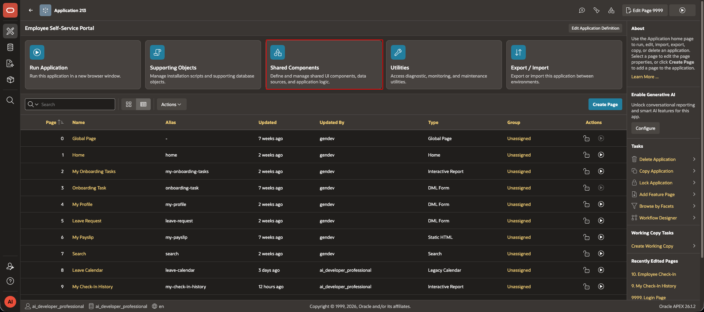
    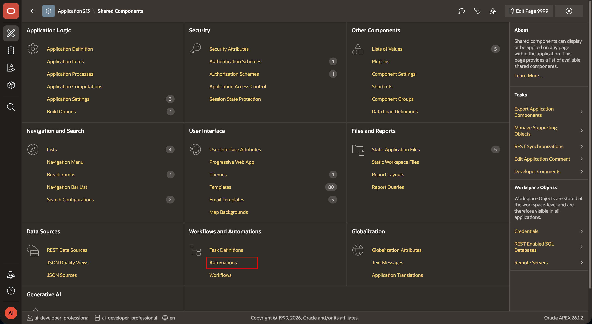
    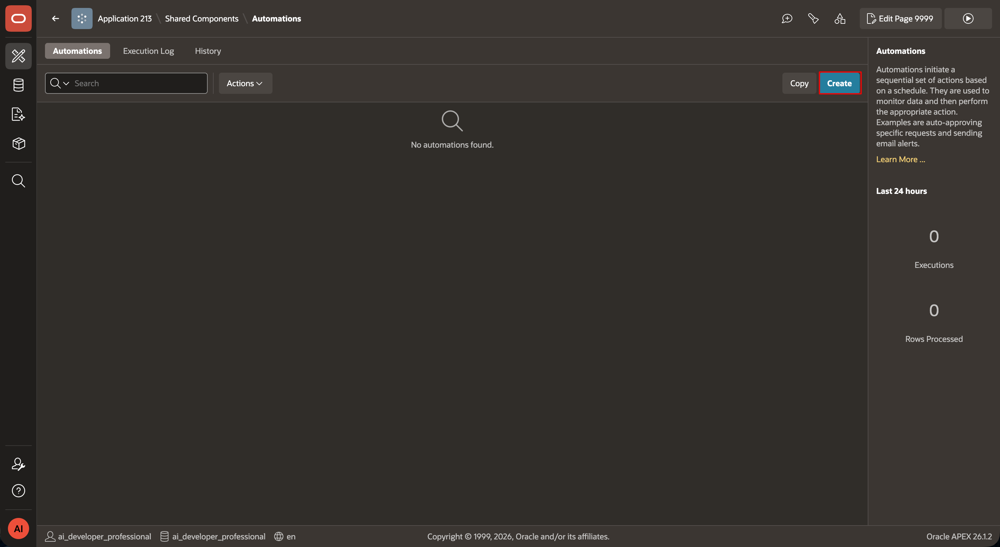


2. Set **Name** to **Task Overdue**. Select **Query** as the source type. Schedule it daily at `08:00 UTC`.
    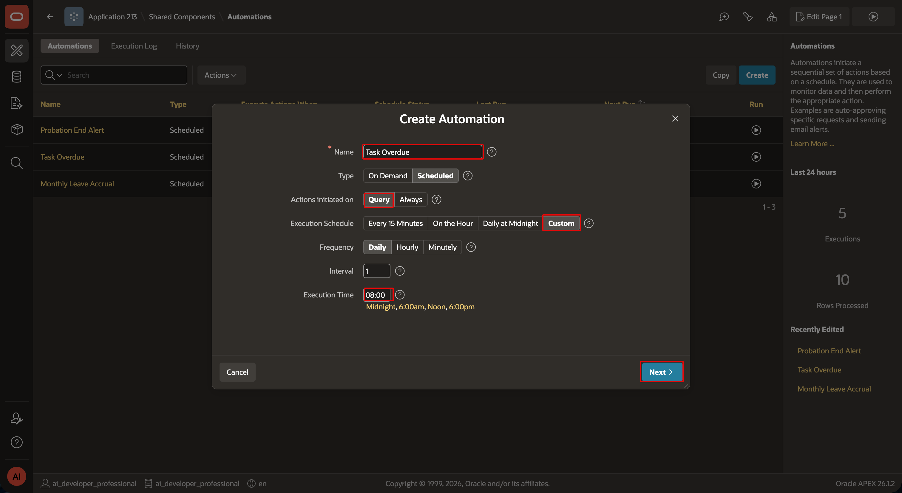


3. Enter the source query, then select **Create**.

    ```sql
    <copy>
        SELECT t.task_id,
           t.task_name,
           t.due_date,
           TO_CHAR(t.due_date, 'DD-Mon-YYYY') AS due_date_text,
           e.employee_id,
           e.email AS employee_email,
           e.first_name || ' ' || e.last_name AS employee_name
      FROM tms_onboarding_tasks t
      JOIN tms_employees e ON e.employee_id = t.employee_id
     WHERE t.due_date < TRUNC(SYSDATE)
       AND t.status NOT IN ('Completed', 'Cancelled', 'Overdue')
    </copy>
    ```
    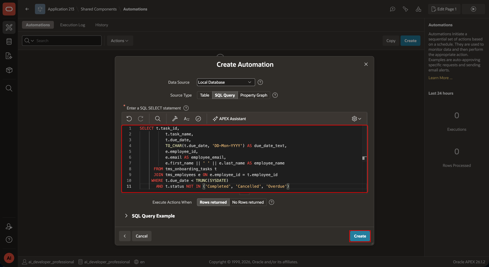

4. Add an **Execute Code** action to mark the current task as overdue:

    ```sql
    <copy>
        UPDATE tms_onboarding_tasks
            SET status = 'Overdue'
            WHERE task_id = :TASK_ID;
    </copy>
    ```
    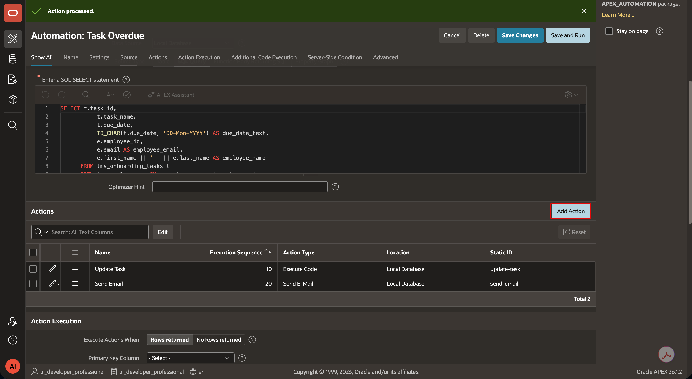
    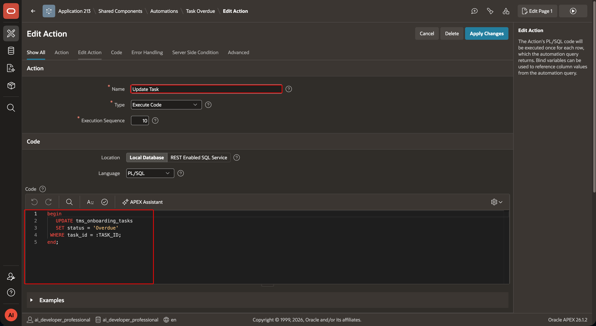

5. Add a **Send E-Mail** action. Set **To** to `&EMPLOYEE_EMAIL.`. Select `TASK_OVERDUE`. In the placeholder grid, set these values:

    | Placeholder | Value |
    | --- | --- |
    | `EMPLOYEE_NAME` | `&EMPLOYEE_NAME.` |
    | `TASK_NAME` | `&TASK_NAME.` |
    | `DUE_DATE` | `&DUE_DATE_TEXT.` |

    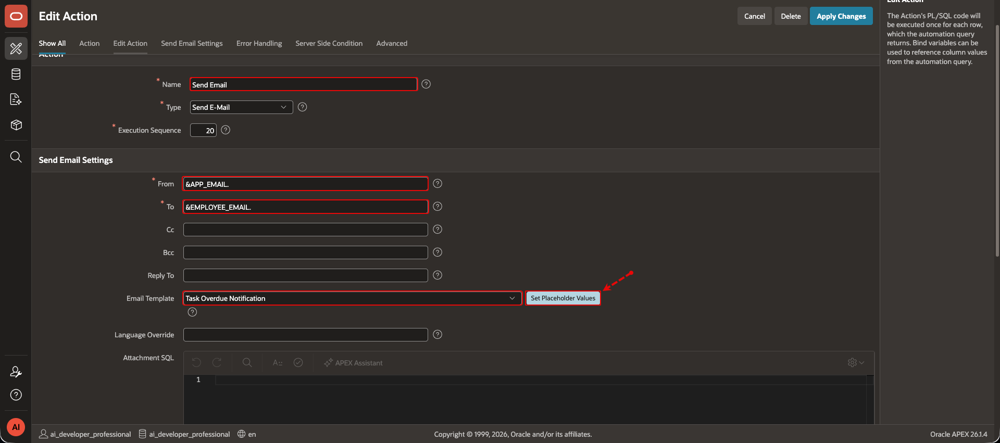
    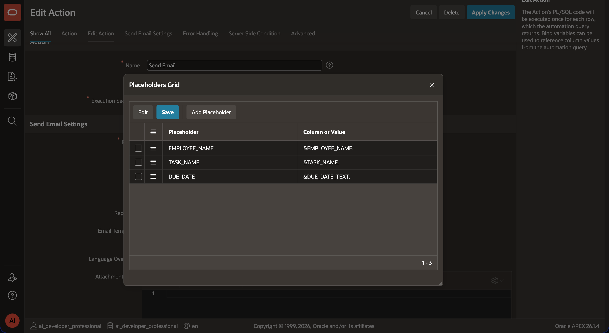

6. Set the schedule to **Active** and click **Save and Run**.

    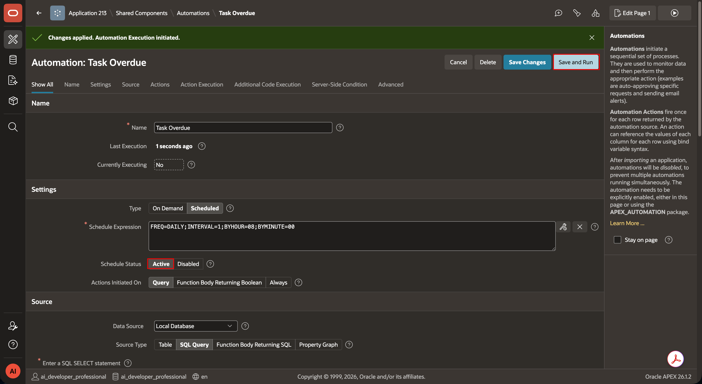

## Task 2: Create Monthly Leave Accrual

1. Create a second scheduled automation named **Monthly Leave Accrual**. Select **On Demand**. You change it to **Scheduled** in the next step.
    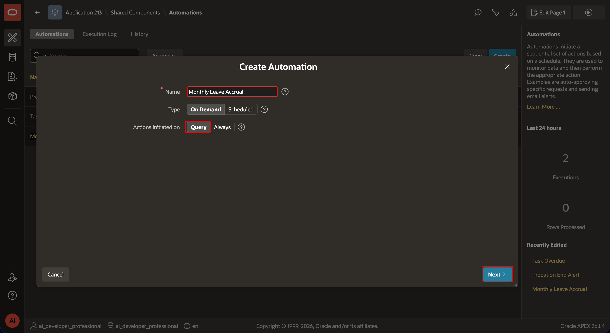

2. Set **Source Type** to **SQL Query**. Enter:

    ```sql
    <copy>
    SELECT employee_id
      FROM tms_employees
     WHERE status = 'Active'
     </copy>
    ```
    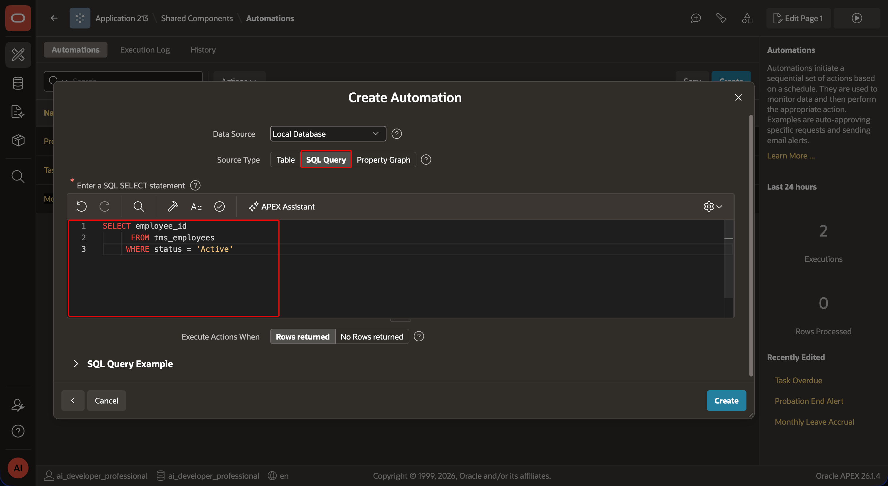
3. Change **Type** to **Scheduled**. Enter this **Schedule Expression**:

    ```text
    FREQ=MONTHLY;BYMONTHDAY=1;BYHOUR=0;BYMINUTE=0;BYSECOND=0
    ```
    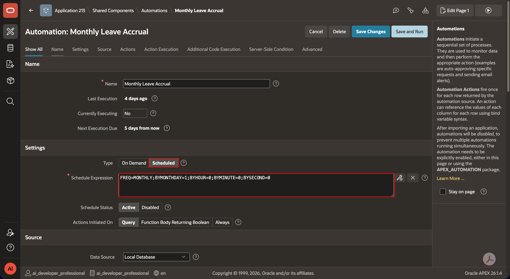

4. Add an **Execute Code** action. This example uses the `MAX_LEAVE_DAYS` application setting and leave type ID `1`. Create or adjust them to match your application.

    ```sql
    <copy>

    DECLARE
    l_accrual NUMBER := ROUND(apex_app_setting.get_value('MAX_LEAVE_DAYS') / 12, 1);
    BEGIN
        MERGE INTO tms_leave_balances b
        USING (
            SELECT :EMPLOYEE_ID AS employee_id,
                1 AS leave_type_id,
                EXTRACT(YEAR FROM SYSDATE) AS leave_year
            FROM dual
        ) s
        ON (b.employee_id = s.employee_id
        AND b.leave_type_id = s.leave_type_id
        AND b.year = s.leave_year)
        WHEN MATCHED THEN
            UPDATE SET accrued = NVL(b.accrued, 0) + l_accrual,
                    remaining = NVL(b.remaining, 0) + l_accrual
        WHEN NOT MATCHED THEN
            INSERT (employee_id, leave_type_id, year, accrued, remaining)
            VALUES (s.employee_id, s.leave_type_id, s.leave_year, l_accrual, l_accrual);
    END;

    </copy>
    ```
    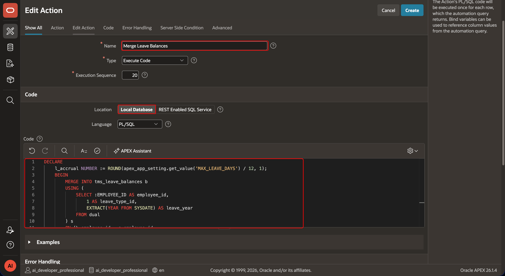


5. Set the schedule to **Active** and click **Save and Run**.
    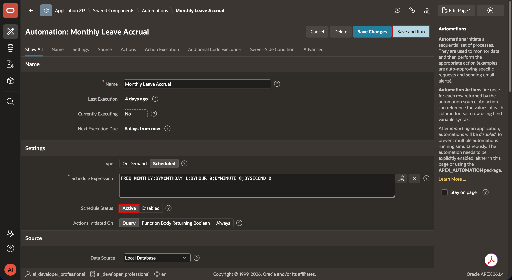

## Task 3: Create Probation End Alert

1. Create a scheduled automation named **Probation End Alert**. Schedule it daily at `07:00 UTC`.
    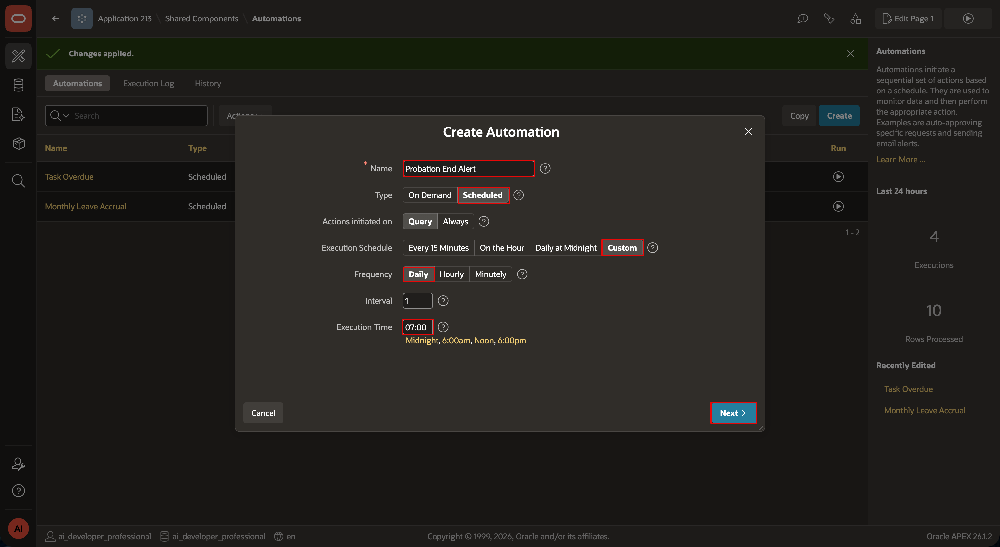

2. Set **Source Type** to **SQL Query**. Enter:

    ```sql
    <copy>SELECT e.employee_id,
           e.first_name || ' ' || e.last_name AS employee_name,
           e.hire_date,
           ADD_MONTHS(e.hire_date,
               apex_app_setting.get_value('PROBATION_MONTHS')) AS probation_end
      FROM tms_employees e
     WHERE e.status = 'Active'
       AND ADD_MONTHS(e.hire_date,
           apex_app_setting.get_value('PROBATION_MONTHS'))
           BETWEEN TRUNC(SYSDATE) AND TRUNC(SYSDATE) + 7</copy>
    ```
    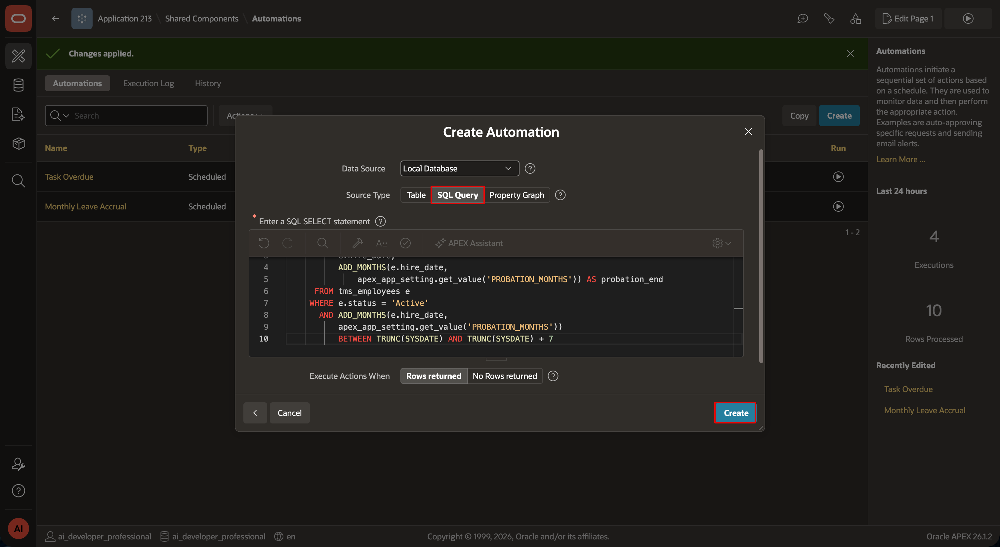

3. Add a **Send E-Mail** action. Set **To** to the value of the `SUPPORT_EMAIL` application setting. Select `PROBATION_ALERT`. Map `EMPLOYEE_NAME`, `HIRE_DATE`, and `PROBATION_END` in the placeholder grid.
    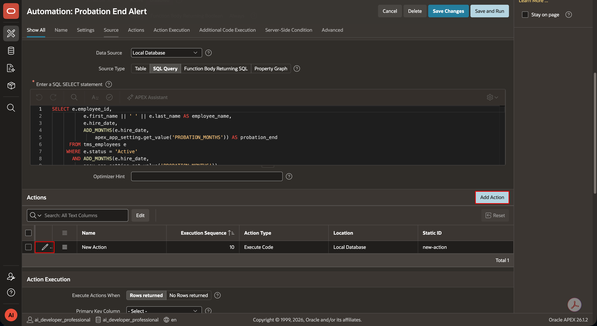
    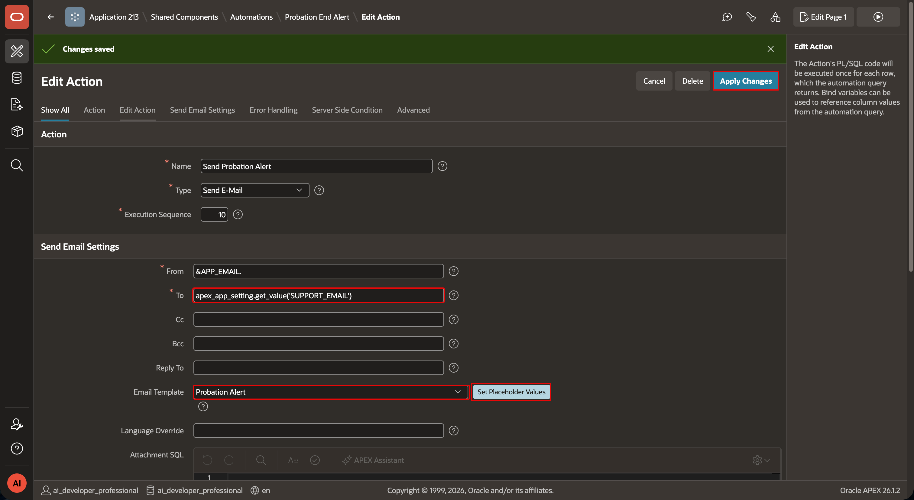
    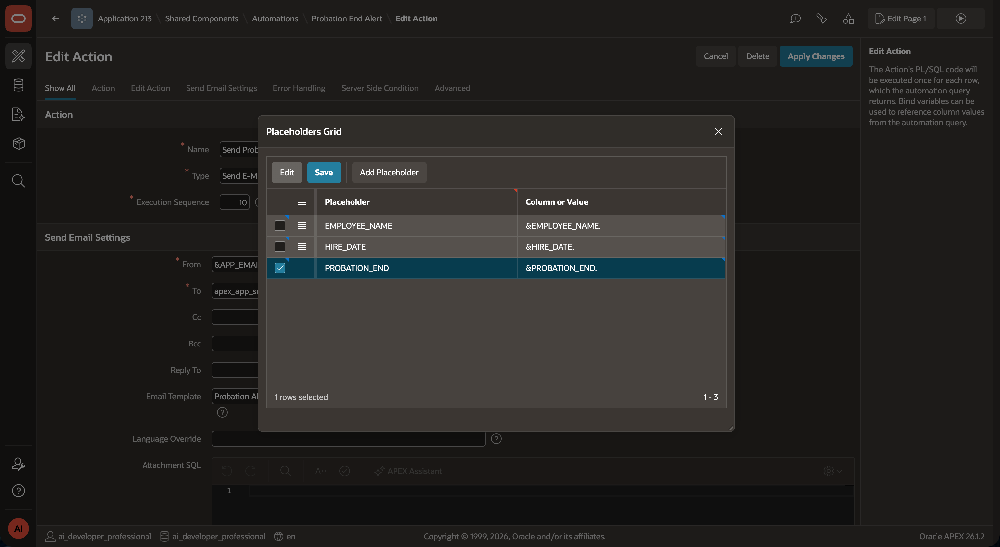

4. Set the schedule to **Active** and click **Save and Run**.
    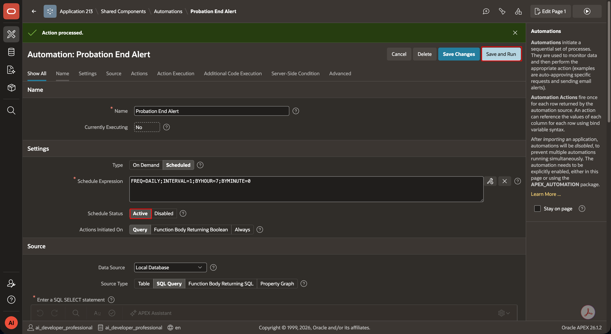


## Task 4: Monitor automation runs

1. Open **Shared Components**, select **Automations**, then select **Execution Log**. Review the run history and messages for each automation.
    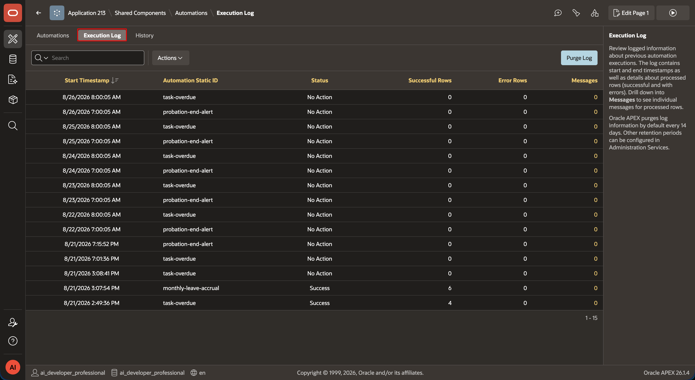

2. Open the **System Logs** page from next lab (Lab 5) for an HR administrator. Confirm that it displays the same automation-run data from `APEX_AUTOMATION_LOG`.

3. If an email does not arrive, check `APEX_MAIL_LOG` and the mail queue to identify the failure.

## Acknowledgements

- **Author -** Aravind Madhavan, Senior Product Manager.
- **Last Updated By/Date** - Aravind Madhavan, Senior Product Manager, July 2026
