# Lab 4: Create ESS Scheduled Automations

## Introduction

Create three scheduled automations in ESS. Automations run a sequential set of actions when query results identify data to process. The actions can use columns from the current query row.

Estimated Workshop Time: 10 minutes

### Objectives

In this lab, you will learn how to:

- Create the Task Overdue automation.
- Create the Monthly Leave Accrual automation.
- Create the Probation End Alert automation.

## Task 1: Create the Task Overdue automation

1. In ESS, navigate to **Shared Components**.

    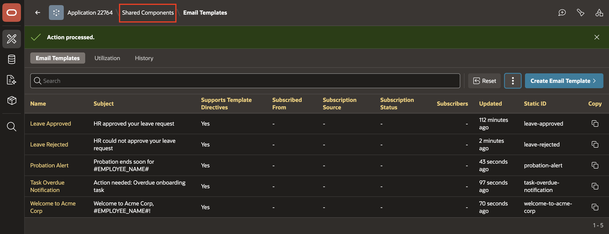

2. Under **Workflows and Automations**, select **Automations**.

    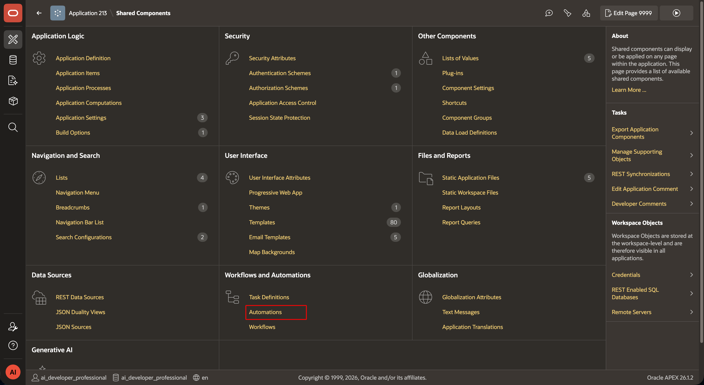

3. Click **Create**.

    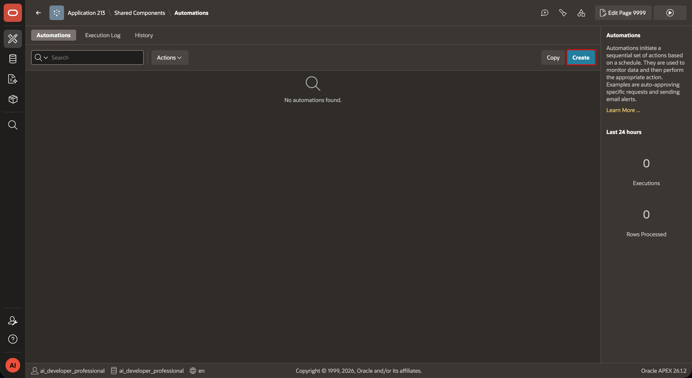

4. In the **Create Automation** wizard, enter or select:

    - **Name:** Task Overdue.
    - **Type:** Scheduled.
    - **Actions initiated on:** Query.
    - **Execution Schedule:** Custom.
    - **Frequency:** Daily.
    - **Interval:** `1`.
    - **Execution Time:** `08:00`.
    - Click **Next**.

    - The schedule runs in the database server time zone.

    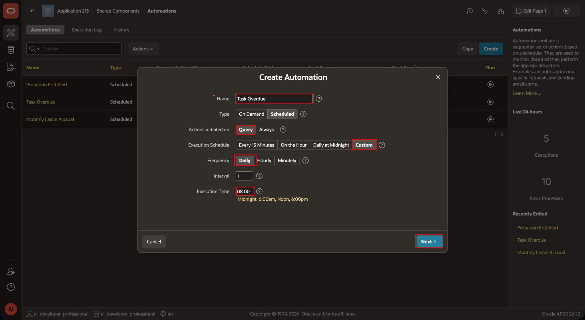

5. Set **Source Type** to **SQL Query**.

    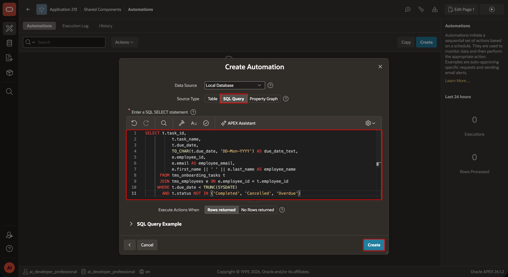

6. For **Enter a SQL SELECT Statement**, copy and paste the following SQL query:

    ```sql
    <copy>
        SELECT t.task_id,
           t.task_name,
           t.due_date,
           TO_CHAR(t.due_date, 'DD-Mon-YYYY') AS due_date_text,
           e.employee_id,
           e.email AS employee_email,
           e.first_name || ' ' || e.last_name AS employee_name
      FROM tms_onboarding_tasks t
      JOIN tms_employees e ON e.employee_id = t.employee_id
     WHERE t.due_date < TRUNC(SYSDATE)
       AND t.status NOT IN ('Completed', 'Cancelled', 'Overdue')
    </copy>
    ```

    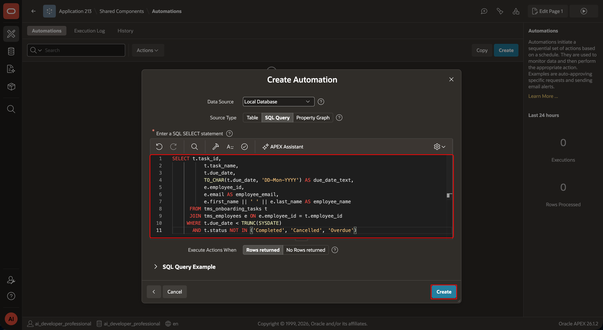

7. Click **Create** to create the automation.

8. Scroll down to **Actions** and click **Create Action**.

    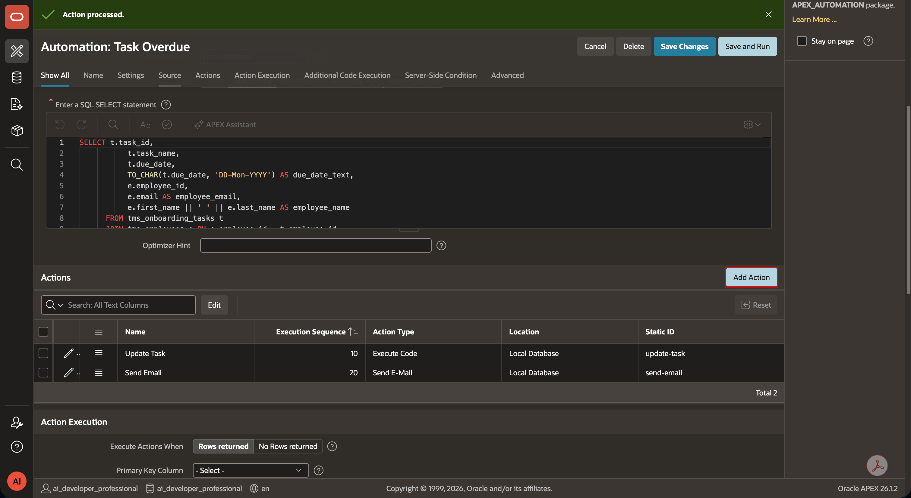

9. Enter or select the following attributes:

    - **Name:** Update Task.
    - **Type:** Execute Code.
    - **Code:** Copy and paste the following PL/SQL code:

        ```sql
        <copy>
            BEGIN
            UPDATE tms_onboarding_tasks
                SET status = 'Overdue'
                WHERE task_id = :TASK_ID;
            END;
        </copy>
        ```

    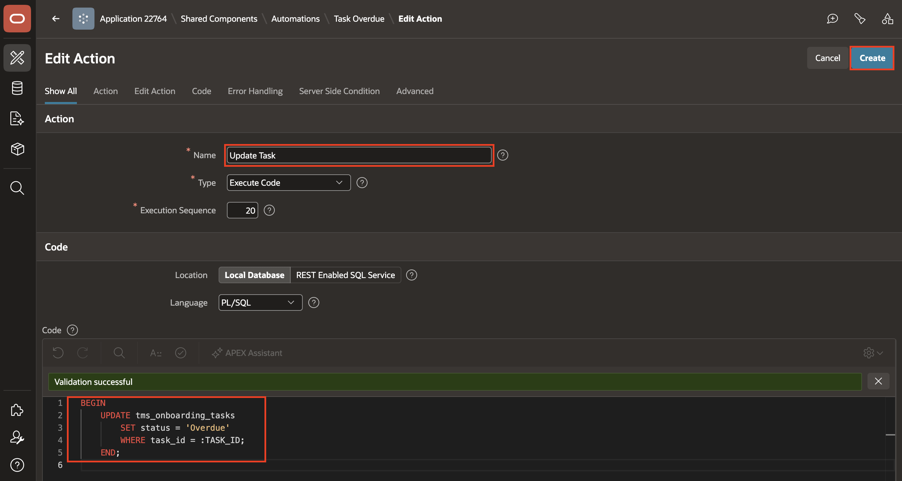

10. Click **Create** to save the **Update Task** action.

11. Under **Actions**, click **Create Action** and configure the following:

    - Under **Identification** (shown as **Action** in the screenshot):
        - **Name:** Send Email.
        - **Type:** Send E-Mail.
    - Under **Send Email Settings**:
        - **From:** `&APP_EMAIL.`.
        - **To:** `&EMPLOYEE_EMAIL.`.
        - **Email Template:** Task Overdue Notification.
    - Click **Set Placeholder Values**.

    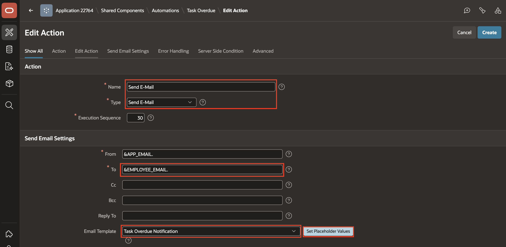

12. Enter the following values in the **Placeholder Grid**:

    | Placeholder | Value |
    | --- | --- |
    | `EMPLOYEE_NAME` | `&EMPLOYEE_NAME.` |
    | `TASK_NAME` | `&TASK_NAME.` |
    | `DUE_DATE` | `&DUE_DATE_TEXT.` |

    - Click **Save**, then close the placeholder dialog.

    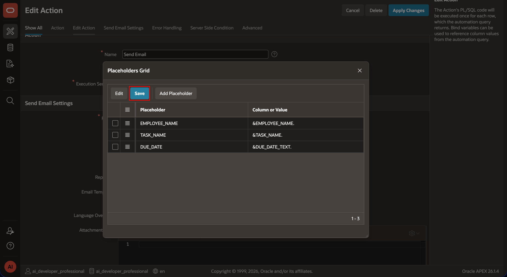

13. Click **Create** to save the email action.

    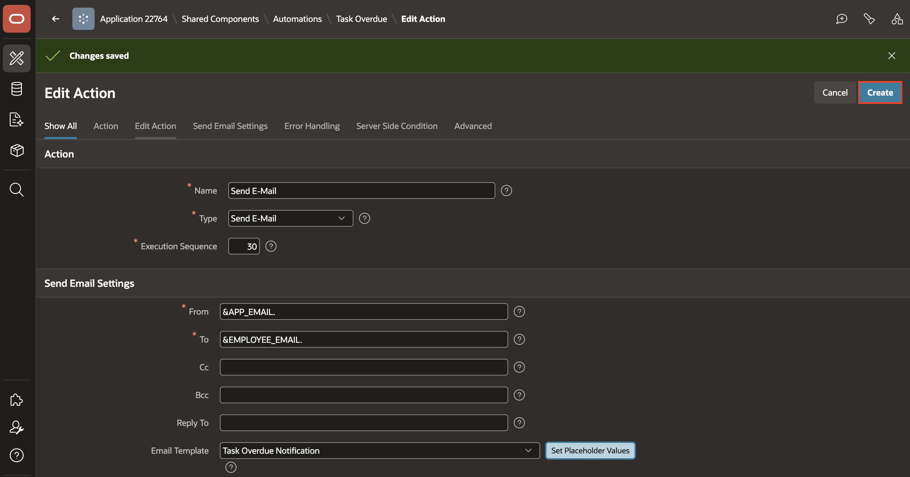

14. Set **Schedule Status** to **Active** and click **Save and Run**.

    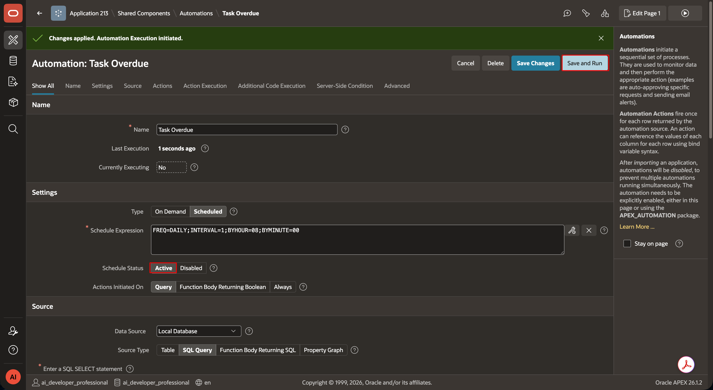

## Task 2: Create Monthly Leave Accrual

1. Create a second automation. Navigate to **Automations**.

    - Click **Create**.
    - In the **Create Automation** wizard, enter or select:
        - **Name:** Monthly Leave Accrual.
        - **Type:** On Demand.
        - **Actions initiated on:** Query.
    - Click **Next**.
    - After creating the automation, change its type to **Scheduled** as described below.

    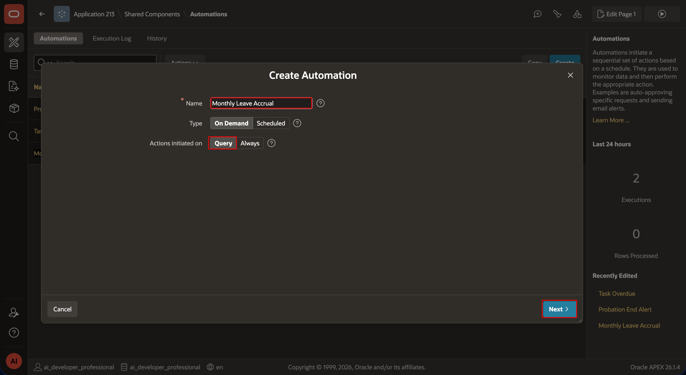

2. Set **Source Type** to **SQL Query**.

    - For **Enter a SQL SELECT Statement**, copy and paste the following SQL query:

        ```sql
        <copy>
        SELECT employee_id
          FROM tms_employees
         WHERE status = 'Active'
         </copy>
        ```
    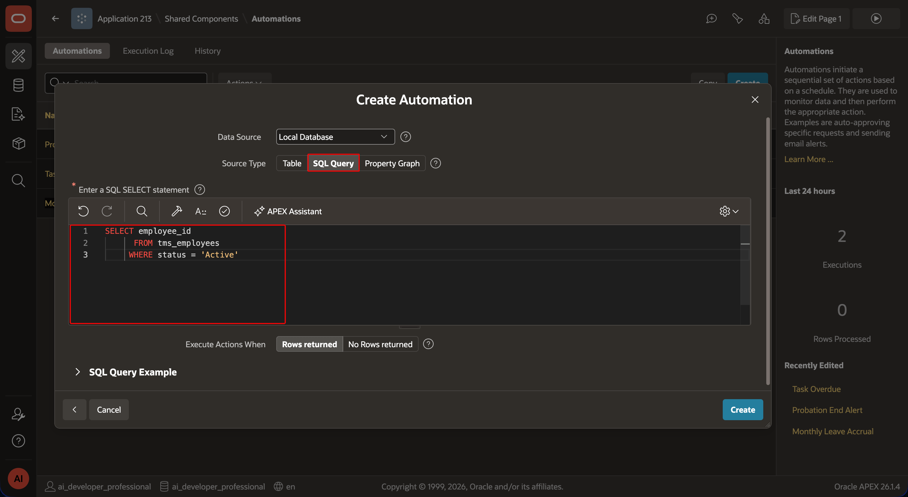

3. Click **Create**.

    

4. Change **Type** to **Scheduled**.

    - Enter this **Schedule Expression**:

        ```text
        FREQ=MONTHLY;BYMONTHDAY=1;BYHOUR=0;BYMINUTE=0;BYSECOND=0
        ```
    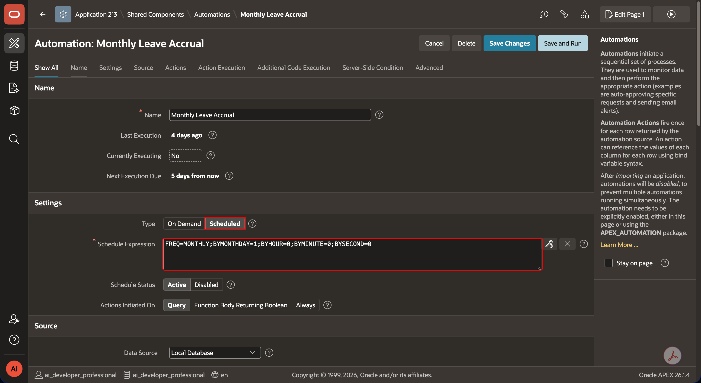

5. Add an **Execute Code** action named **Merge Leave Balances**.

    - This example uses the `MAX_LEAVE_DAYS` application setting and leave type ID `1`. Create or adjust them to match your application.

        ```sql
        <copy>

        DECLARE
        l_accrual NUMBER := ROUND(apex_app_setting.get_value('MAX_LEAVE_DAYS') / 12, 1);
        BEGIN
            MERGE INTO tms_leave_balances b
            USING (
                SELECT :EMPLOYEE_ID AS employee_id,
                    1 AS leave_type_id,
                    EXTRACT(YEAR FROM SYSDATE) AS leave_year
                FROM dual
            ) s
            ON (b.employee_id = s.employee_id
            AND b.leave_type_id = s.leave_type_id
            AND b.year = s.leave_year)
            WHEN MATCHED THEN
                UPDATE SET accrued = NVL(b.accrued, 0) + l_accrual,
                        remaining = NVL(b.remaining, 0) + l_accrual
            WHEN NOT MATCHED THEN
                INSERT (employee_id, leave_type_id, year, accrued, remaining)
                VALUES (s.employee_id, s.leave_type_id, s.leave_year, l_accrual, l_accrual);
        END;

        </copy>
        ```
    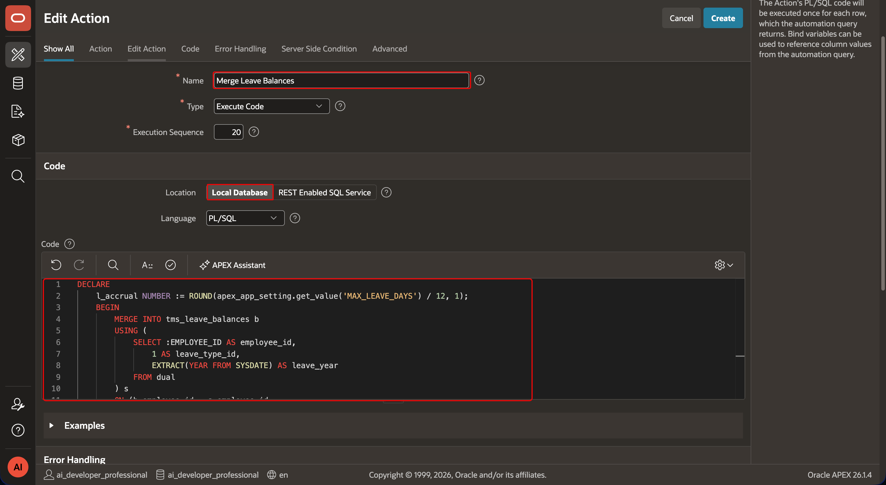

6. Set the schedule to **Active** and click **Save and Run**.
    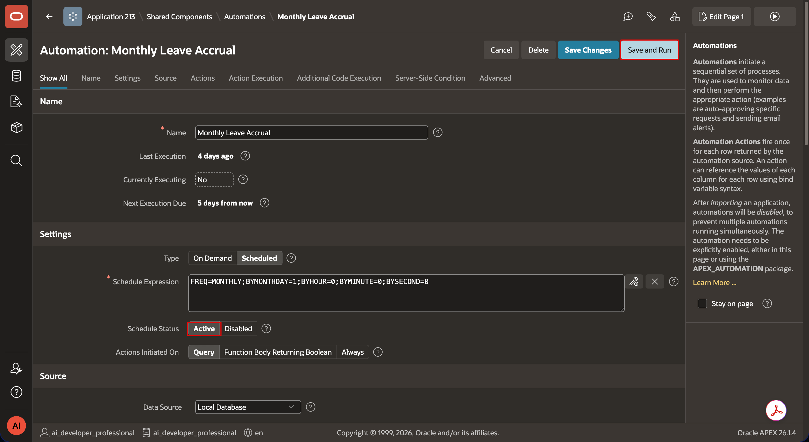

## Task 3: Create Probation End Alert

1. Create a scheduled automation named **Probation End Alert**.

    - Select **Query**, **Custom**, **Daily**, and an interval of `1`.

    - Set **Execution Time** to `07:00`. The resulting schedule expression is `FREQ=DAILY;INTERVAL=1;BYHOUR=7;BYMINUTE=0` in the database server time zone.
    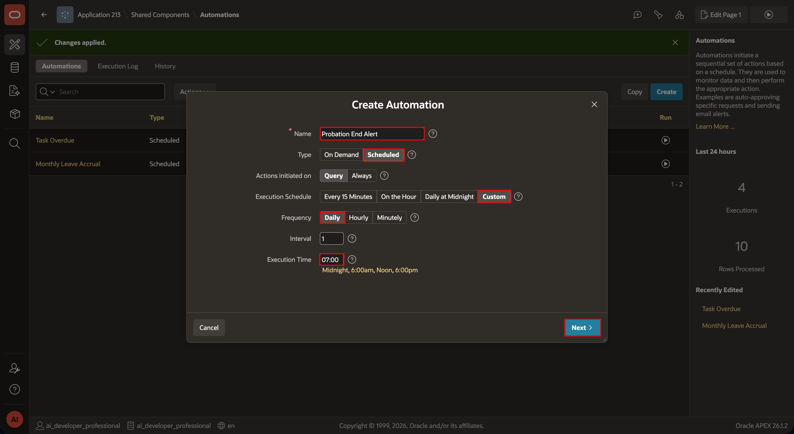

2. Set **Source Type** to **SQL Query**.

    - Enter:

        ```sql
        <copy>SELECT e.employee_id,
               e.first_name || ' ' || e.last_name AS employee_name,
               e.hire_date,
               ADD_MONTHS(e.hire_date,
                   apex_app_setting.get_value('PROBATION_MONTHS')) AS probation_end
          FROM tms_employees e
         WHERE e.status = 'Active'
           AND ADD_MONTHS(e.hire_date,
               apex_app_setting.get_value('PROBATION_MONTHS'))
               BETWEEN TRUNC(SYSDATE) AND TRUNC(SYSDATE) + 7</copy>
        ```
    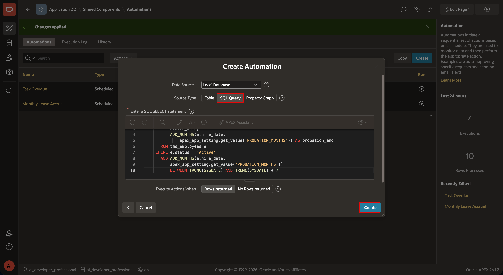

3. Add a **Send E-Mail** action named **Send Probation Alert**.

    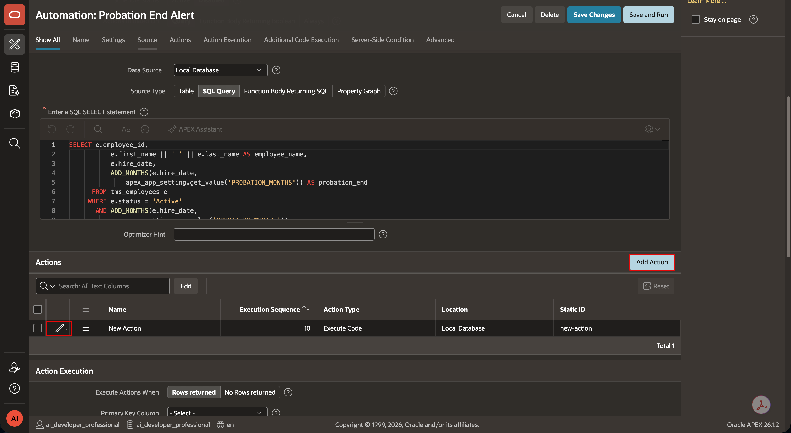

4. Set **From** to `&APP_EMAIL.` and **To** to `apex_app_setting.get_value('SUPPORT_EMAIL')`.

    - Select the **Probation Alert** email template.

    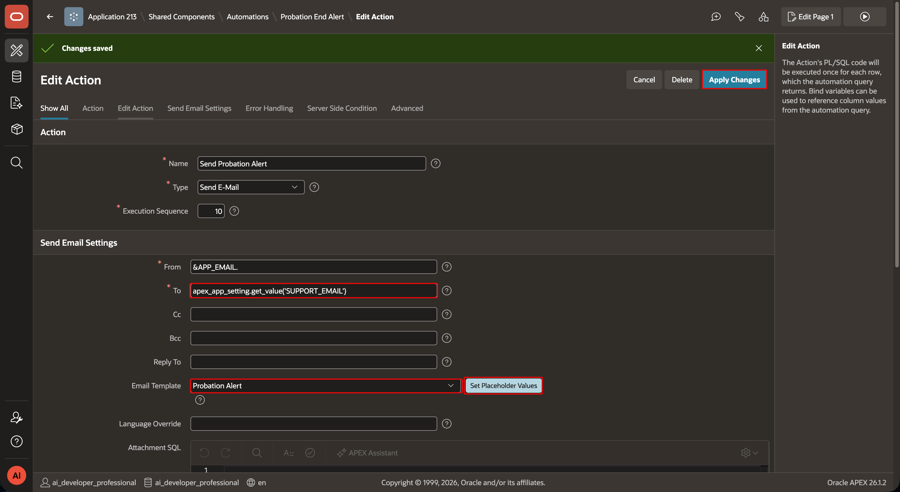

5. In the placeholder grid, map these values:

    | Placeholder | Column or Value |
    | --- | --- |
    | `EMPLOYEE_NAME` | `&EMPLOYEE_NAME.` |
    | `HIRE_DATE` | `&HIRE_DATE.` |
    | `PROBATION_END` | `&PROBATION_END.` |

    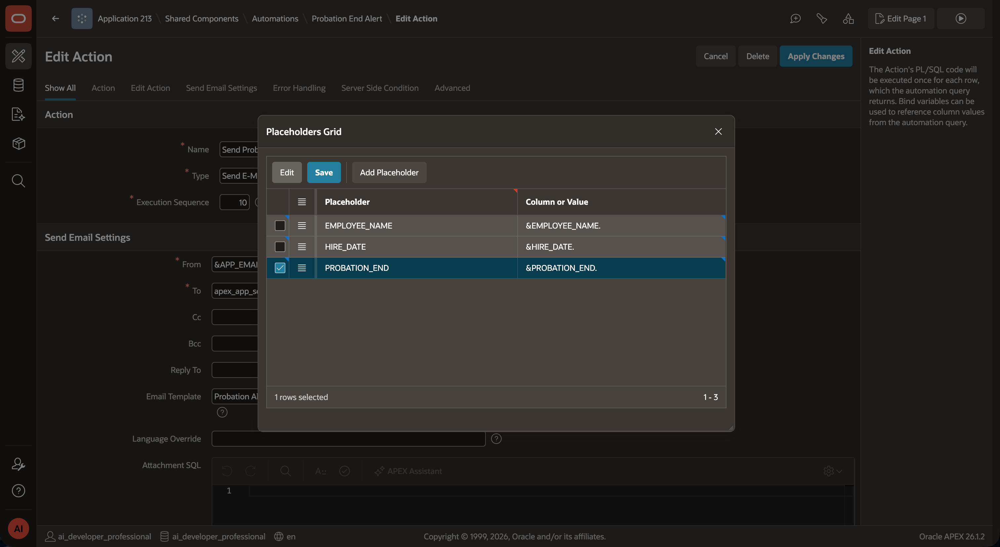

6. Set the schedule to **Active** and click **Save and Run**.
    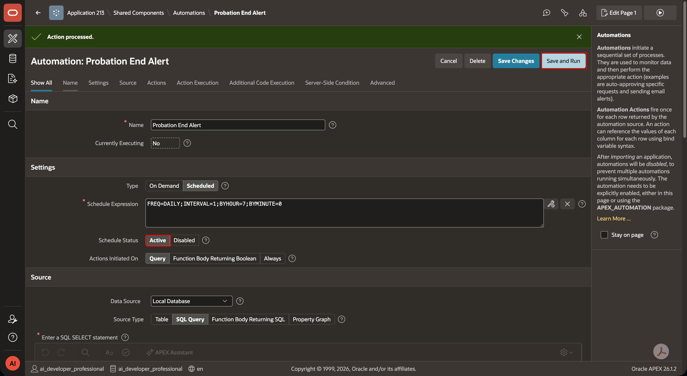

## Task 4: Monitor automation runs

1. Open **Shared Components**, select **Automations**, then select **Execution Log**.

    - Review the run history and messages for each automation.
    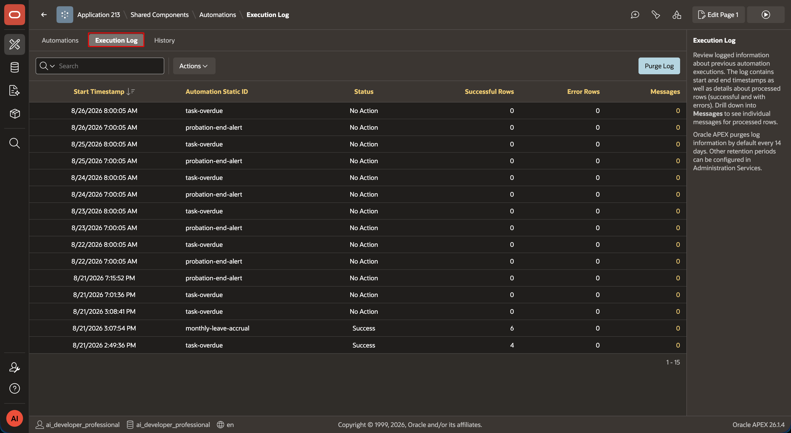

2. Open the **System Logs** page from next lab (Lab 5) for an HR administrator.

    - Confirm that it displays the same automation-run data from `APEX_AUTOMATION_LOG`.

3. If an email does not arrive, check `APEX_MAIL_LOG` and the mail queue to identify the failure.

## Acknowledgements

- **Author -** Aravind Madhavan, Senior Product Manager.
- **Last Updated By/Date** - Aravind Madhavan, Senior Product Manager, July 2026
