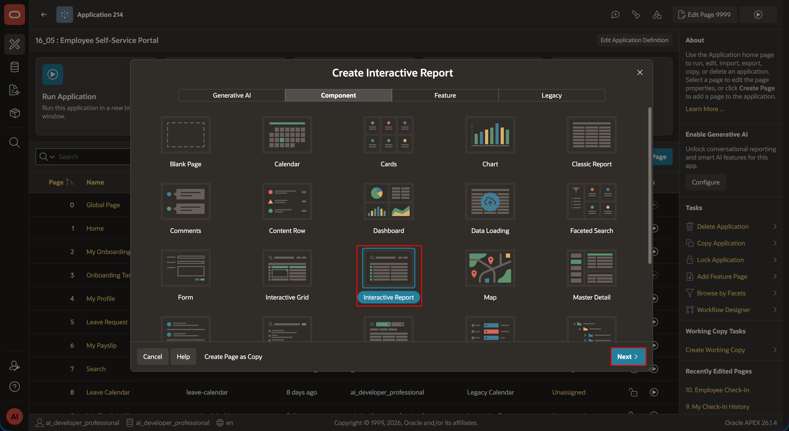
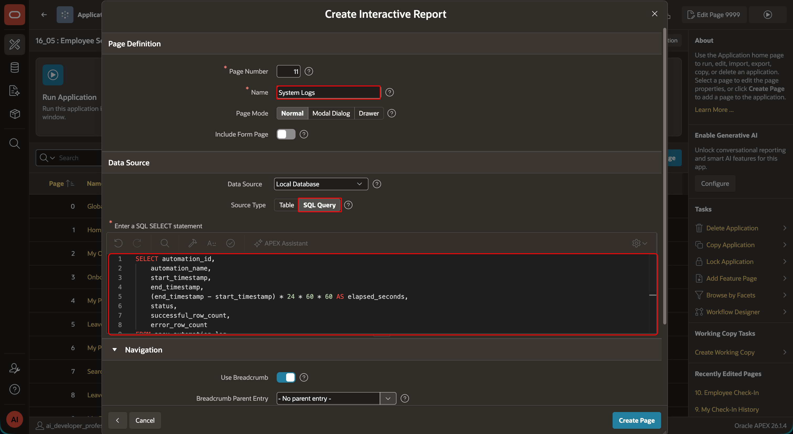
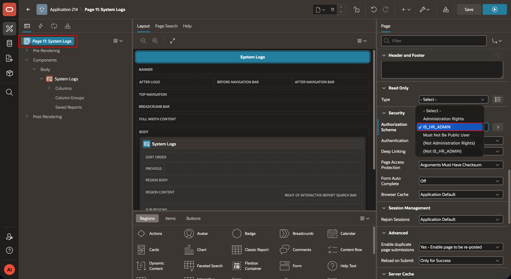
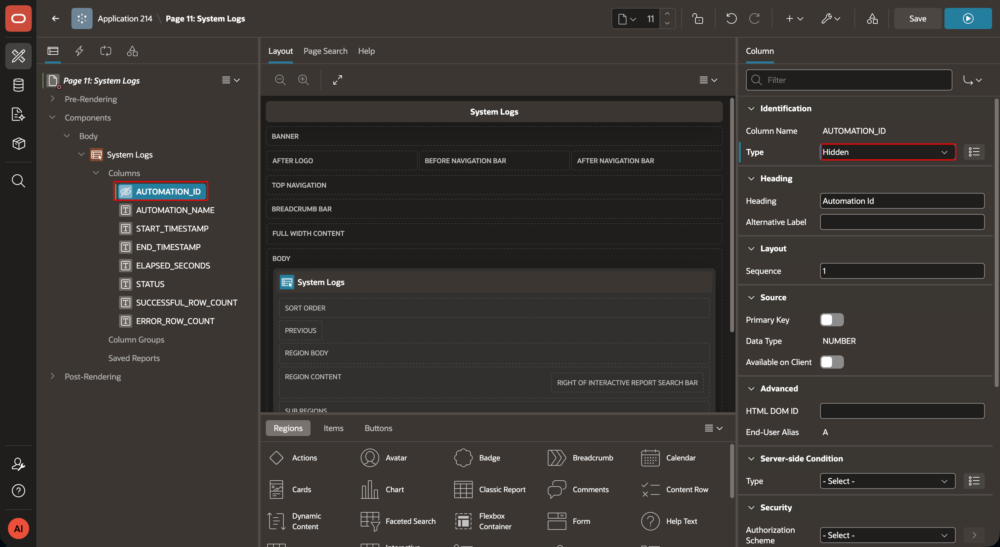
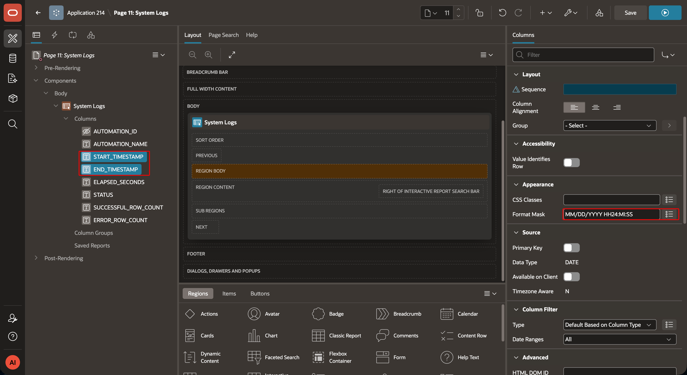
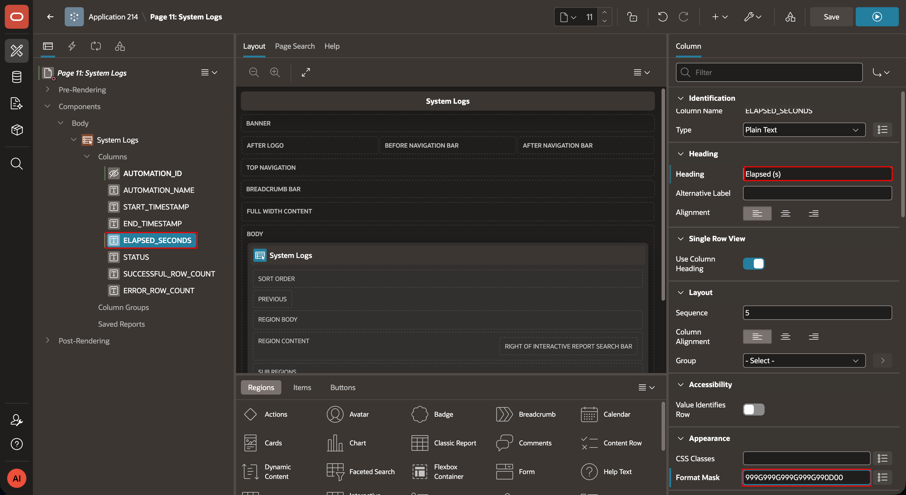
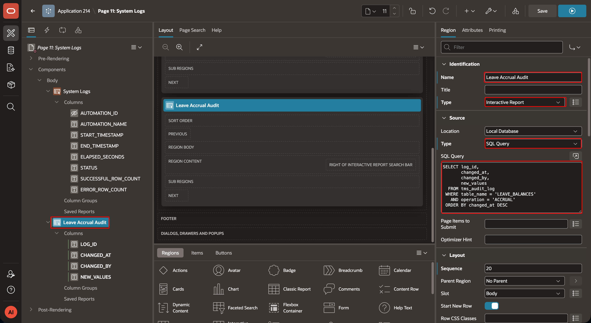
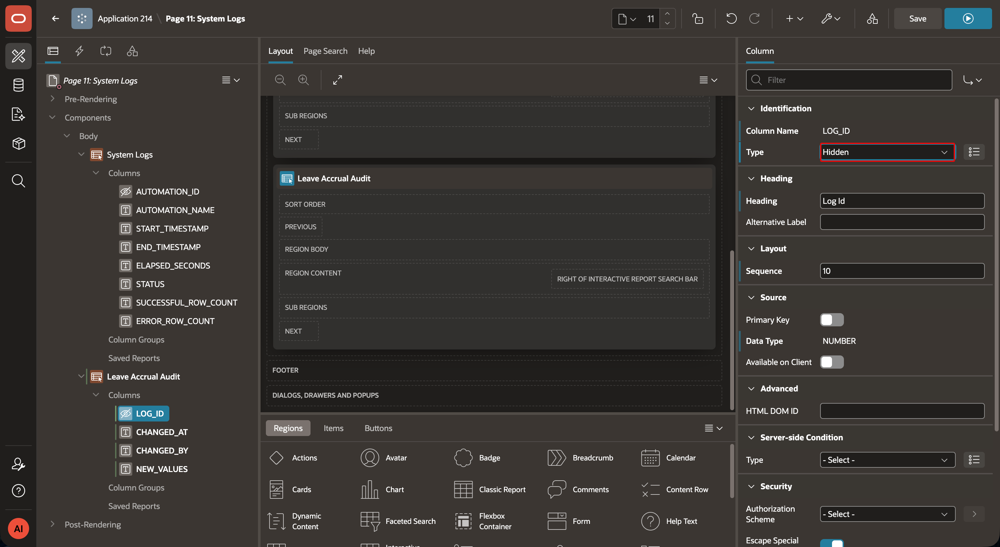
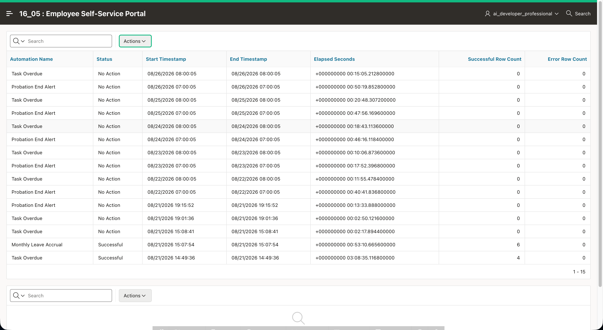

# Create the ESS System Logs Page

## Introduction

Create an administrator-only Interactive Report that reads the APEX automation log. The page gives HR administrators a concise view of recent automation runs.

### Objectives

- Create a System Logs Interactive Report.
- Display recent rows from `APEX_AUTOMATION_LOG`.
- Restrict access to HR administrators.

Estimated Time: 5 minutes

## Task 1: Create the System Logs report

1. In ESS App Builder, select **Create Page**, then select **Interactive Report** and **SQL Query**.



2. Name the page **System Logs**. Add it to the **Admin** navigation group. Create the group if it does not already exist.
    Enter the following query:

    ```sql
    <copy>SELECT automation_id,
        automation_name,
        start_timestamp,
        end_timestamp,
        (end_timestamp - start_timestamp) * 24 * 60 * 60 AS elapsed_seconds,
        status,
        successful_row_count,
        error_row_count
    FROM apex_automation_log
    ORDER BY start_timestamp DESC</copy>
    ```

3. In Page Designer, apply the `IS_HR_ADMIN` authorization scheme to the page.


4. Select the Interactive Report region and expand columns. Hide `AUTOMATION_ID`. Change the heading for `ELAPSED_SECONDS` to **Elapsed (s)** and apply the number format mask `999G990.0`.





## Task 2: Add an optional leave-accrual audit report

1. If the application already contains `TMS_AUDIT_LOG`, add a second Interactive Report region named **Leave Accrual Audit**. Use the below query.

    ```sql
    <copy>
    SELECT log_id,
           changed_at,
           changed_by,
           new_values
      FROM tms_audit_log
     WHERE table_name = 'LEAVE_BALANCES'
       AND operation = 'ACCRUAL'
     ORDER BY changed_at DESC
     </copy>
    ```
    

3. Hide `LOG_ID`. Truncate the displayed `NEW_VALUES` text to a suitable length.


4. Run the page. Confirm that the newest automation runs appear first and that **Elapsed (s)** shows the calculated duration.


## Acknowledgements

- **Author -** Aravind Madhavan, Senior Product Manager.
- **Last Updated By/Date** - Aravind Madhavan, Senior Product Manager, July 2026
