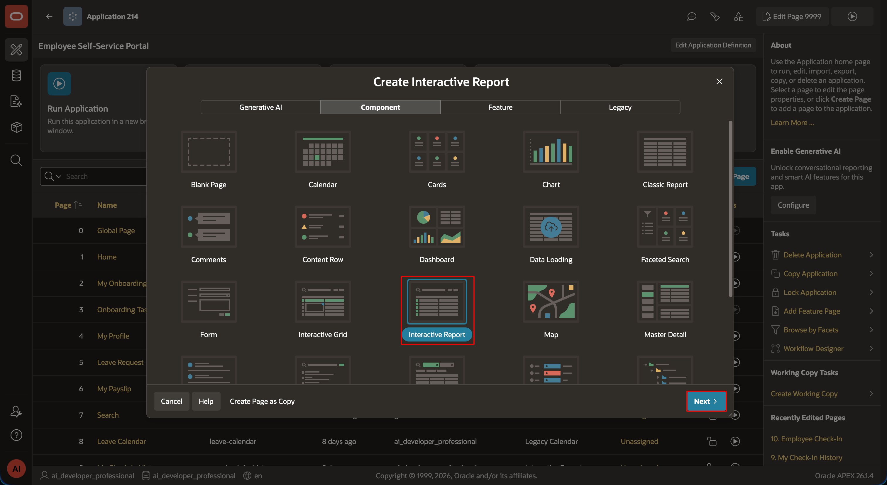
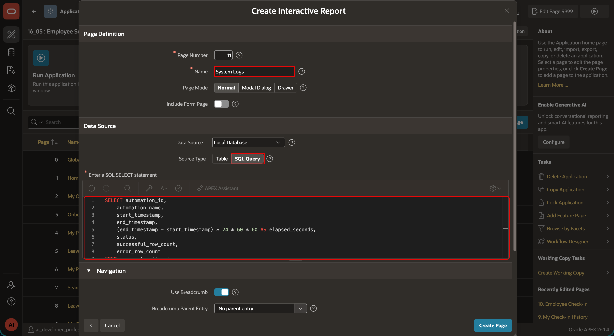
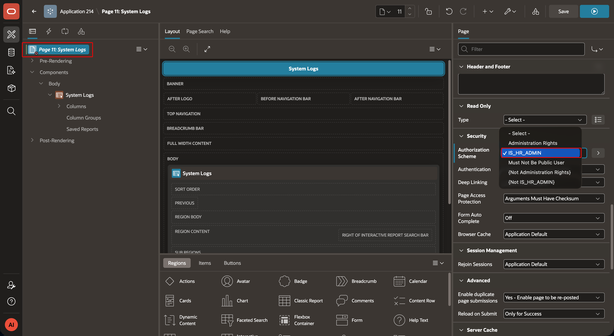
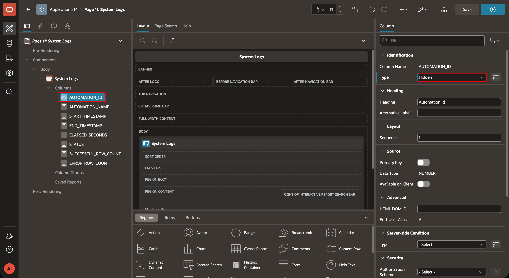
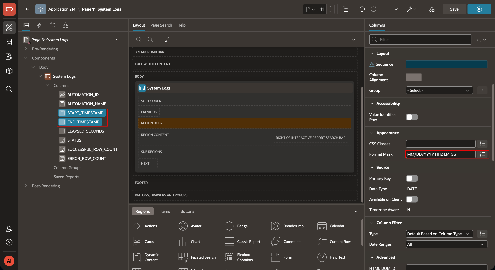
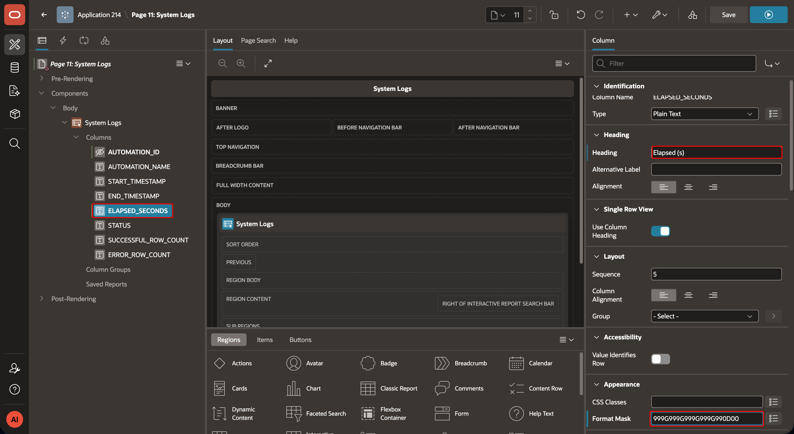
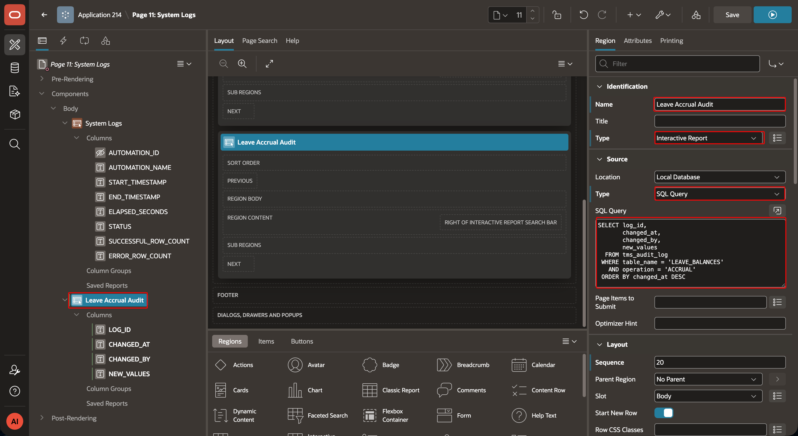
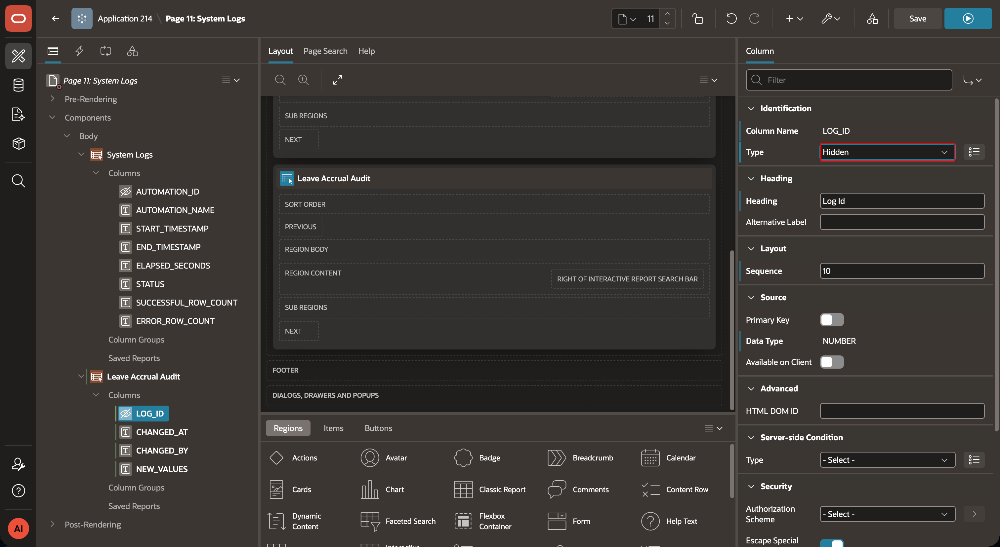
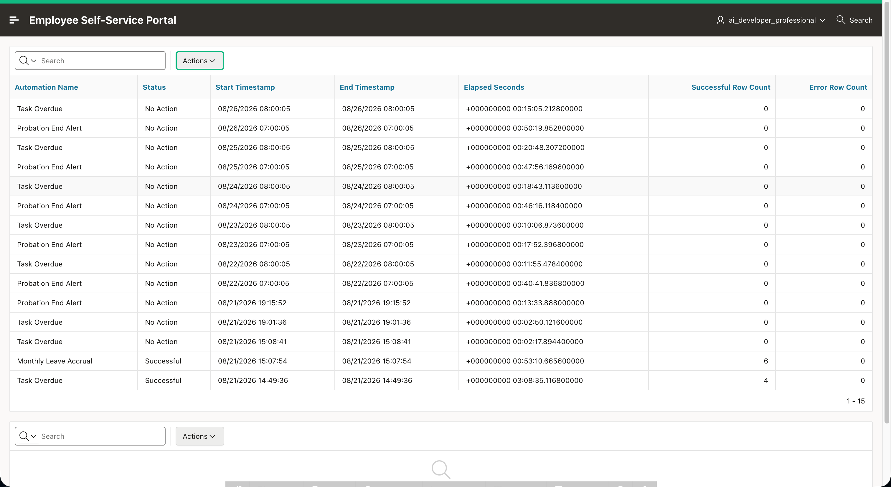

# Lab 5: Create the ESS System Logs Page

## Introduction

Create an administrator-only Interactive Report based on the APEX automation log. An Interactive Report is searchable and customizable. The page lets HR administrators review recent automation runs.

Estimated Workshop Time: 5 minutes

### Objectives

In this lab, you will learn how to:

- Create a System Logs Interactive Report.
- Display recent rows from `APEX_AUTOMATION_LOG`.
- Restrict access to HR administrators.

## Task 1: Create the System Logs report

1. In ESS **App Builder**, select **Create Page** and then **Interactive Report**.

    

2. Select **SQL Query** as the report source.

    

3. Name the page **System Logs**.

    - Add it to the **Admin** navigation group. Create the group if it does not already exist.
    Enter the following query:

        ```sql
        <copy>SELECT automation_id,
            automation_name,
            start_timestamp,
            end_timestamp,
            (end_timestamp - start_timestamp) * 24 * 60 * 60 AS elapsed_seconds,
            status,
            successful_row_count,
            error_row_count
        FROM apex_automation_log
        ORDER BY start_timestamp DESC</copy>
        ```

4. In **Page Designer**, apply the `IS_HR_ADMIN` authorization scheme to the page.
    

5. Select the **Interactive Report** region and expand **Columns**. Hide `AUTOMATION_ID`.

    

6. Select `START_TIMESTAMP` and `END_TIMESTAMP`.

    - Set **Format Mask** to `MM/DD/YYYY HH24:MI:SS`.

    

7. Change the heading for `ELAPSED_SECONDS` to **Elapsed (s)** and apply the number format mask `999G999G999G999G990D00`.

    

## Task 2: Add an optional leave-accrual audit report

1. If the application contains `TMS_AUDIT_LOG`, add a second **Interactive Report** region named **Leave Accrual Audit**.

    - Use this query.

        ```sql
        <copy>
        SELECT log_id,
               changed_at,
               changed_by,
               new_values
          FROM tms_audit_log
         WHERE table_name = 'LEAVE_BALANCES'
           AND operation = 'ACCRUAL'
         ORDER BY changed_at DESC
         </copy>
        ```
    

2. Hide `LOG_ID`. Truncate the displayed `NEW_VALUES` text to a suitable length.
    

3. Run the page.

    - Confirm that the newest automation runs appear first and that **Elapsed (s)** shows the calculated duration.
    

## Acknowledgements

- **Author -** Aravind Madhavan, Senior Product Manager.
- **Last Updated By/Date** - Aravind Madhavan, Senior Product Manager, July 2026
