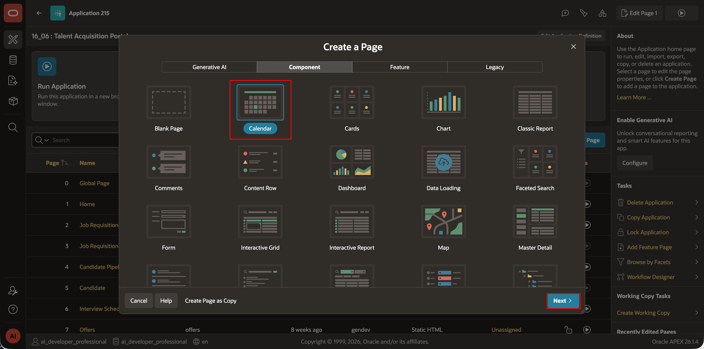
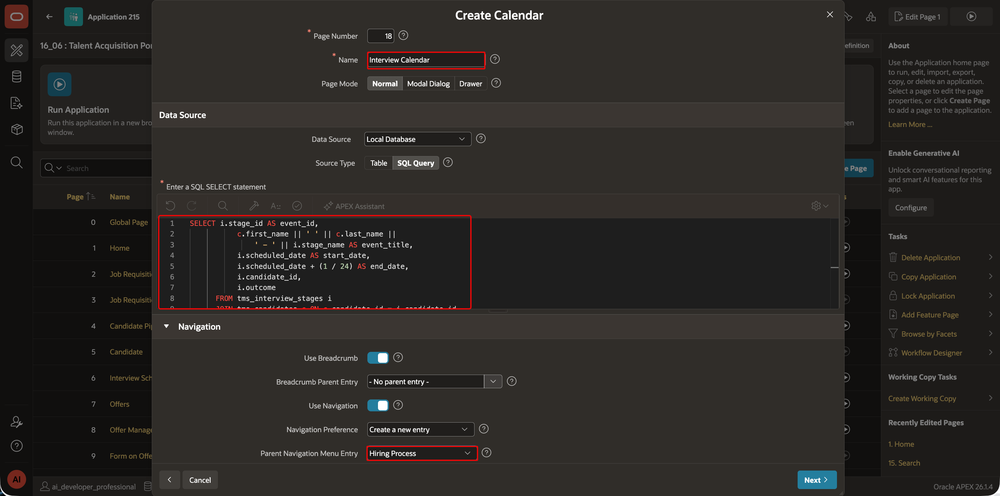
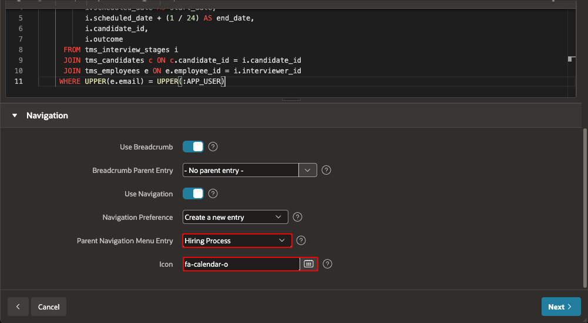
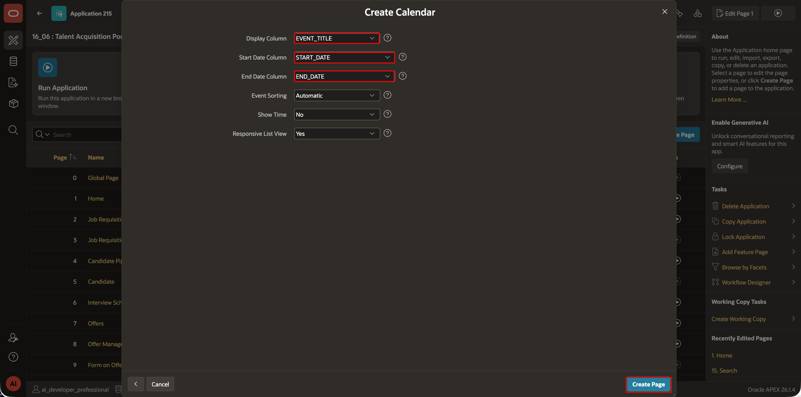
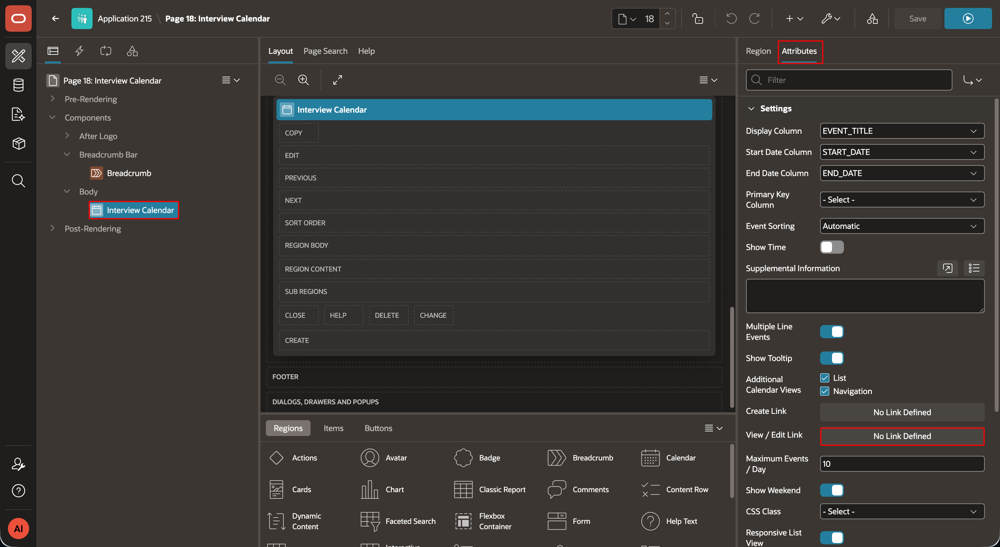
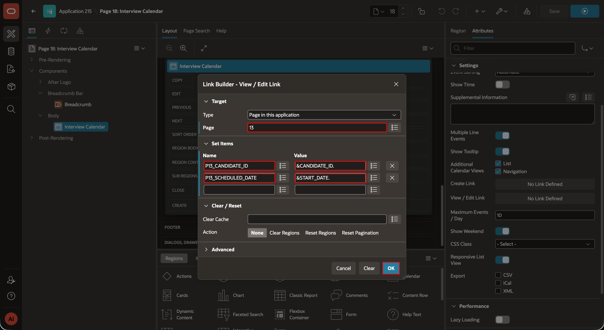
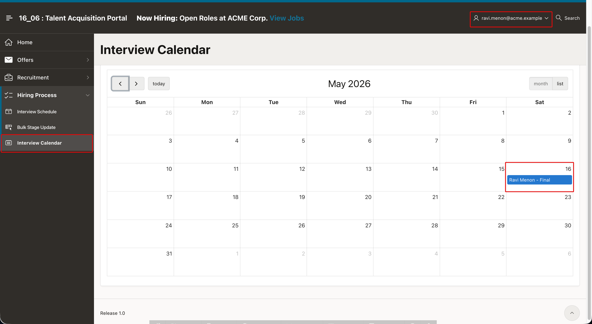

# Create the TAP Interview Calendar

## Introduction

Create a native Calendar page for interviewers. The calendar filters interviews by the signed-in interviewer and links events to the Interview Feedback page.

### Objectives

- Create the TAP Interview Calendar.
- Link calendar events to the Interview Feedback page.

Estimated Time: 5 minutes

## Task 1: Create the Interview Calendar

1. In TAP App Builder, select **Create Page**, then select **Calendar Component**.
    

2. Name the page **Interview Calendar** and select **Local Database** and **SQL Query**.  Enter:

    ```sql
    <copy>SELECT i.stage_id AS event_id,
           c.first_name || ' ' || c.last_name ||
               ' - ' || i.stage_name AS event_title,
           i.scheduled_date AS start_date,
           i.scheduled_date + (1 / 24) AS end_date,
           i.candidate_id,
           i.outcome
      FROM tms_interview_stages i
      JOIN tms_candidates c ON c.candidate_id = i.candidate_id
      JOIN tms_employees e ON e.employee_id = i.interviewer_id
     WHERE UPPER(e.email) = UPPER(:APP_USER)</copy>
    ```
    

3. Enable navigation. Set **Hiring Process** as the navigation parent and select the `fa-calendar` icon.
    

4. Map `EVENT_TITLE`, `START_DATE`, and `END_DATE` to the Calendar settings.
    

5. In the Calendar attributes, configure the **View / Edit Link** as the Event Click link to page `13`, **Interview Feedback**. Set `P13_CANDIDATE_ID` to `&CANDIDATE_ID.`. Set `P13_SCHEDULED_DATE` to `&START_DATE.`.
    
    

6. Save and run the page. Confirm that each interviewer sees only their assigned interviews.
    


## Acknowledgements

- **Author -** Aravind Madhavan, Senior Product Manager.
- **Last Updated By/Date** - Aravind Madhavan, Senior Product Manager, July 2026
