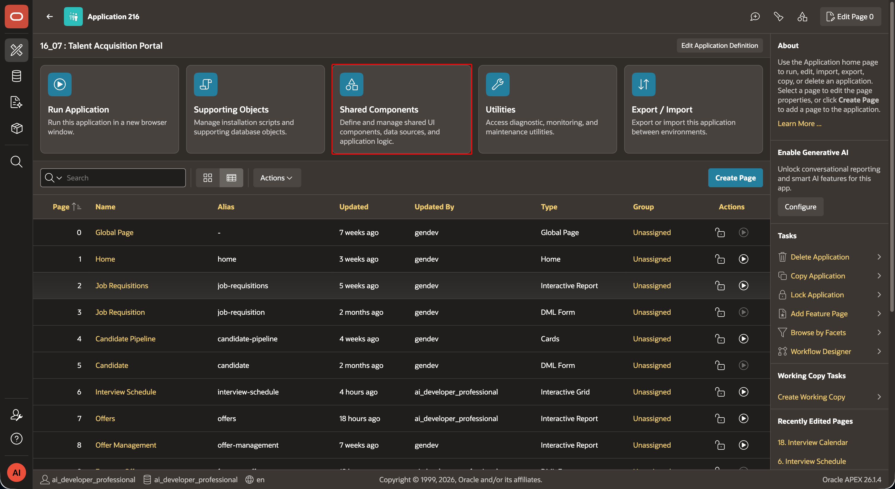
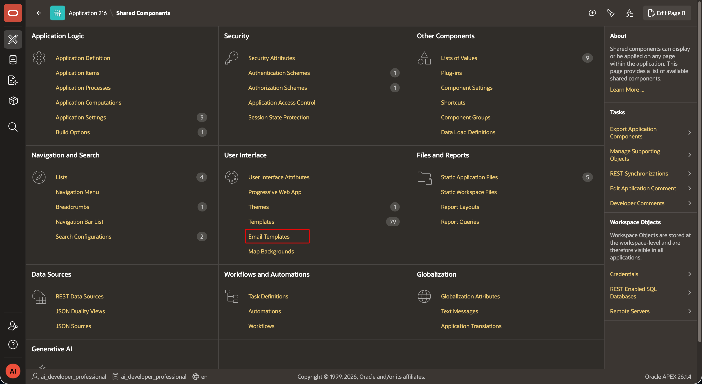
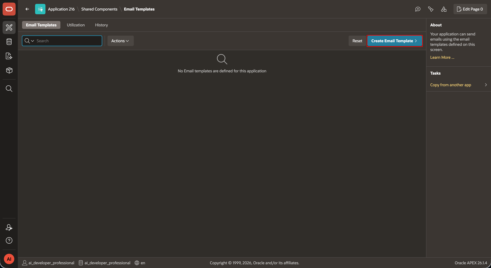
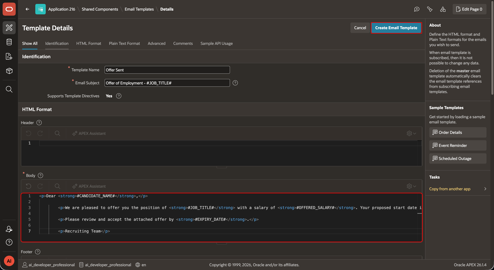
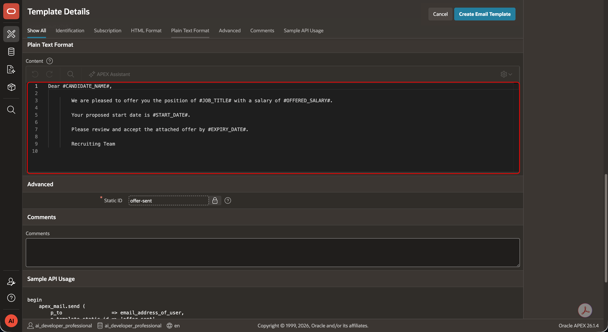
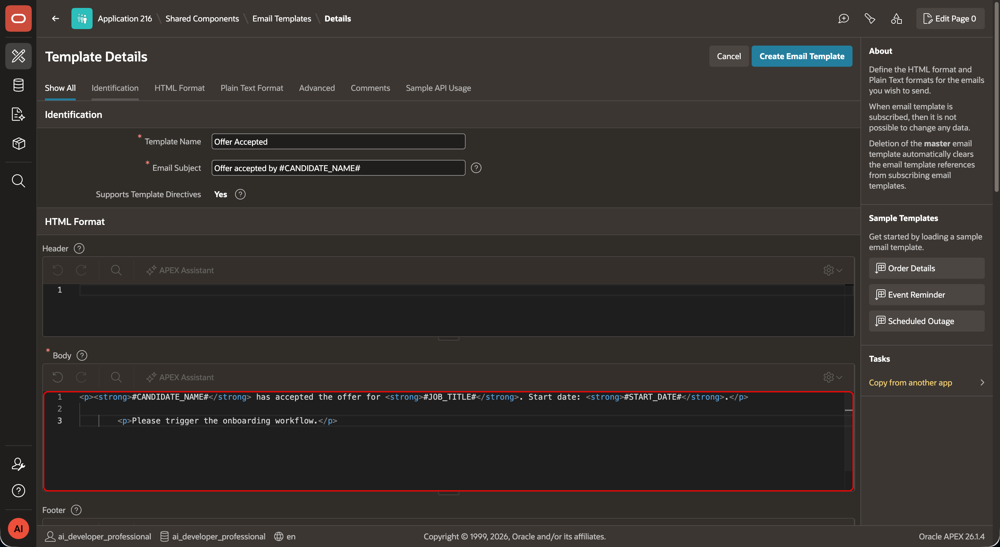
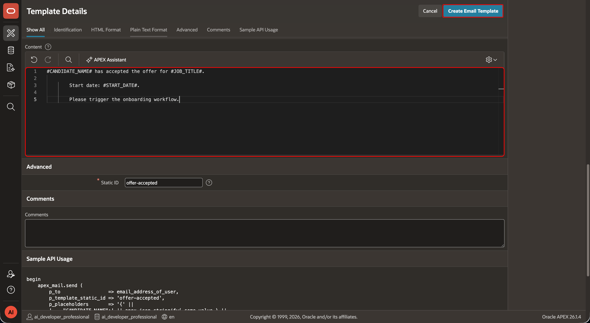
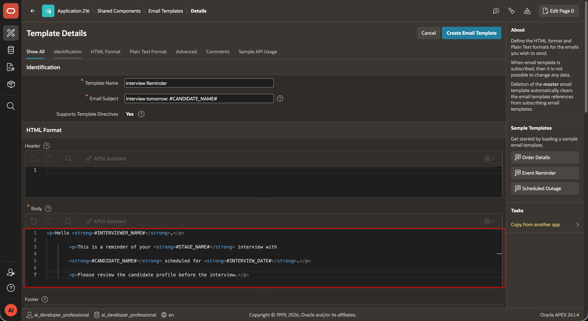
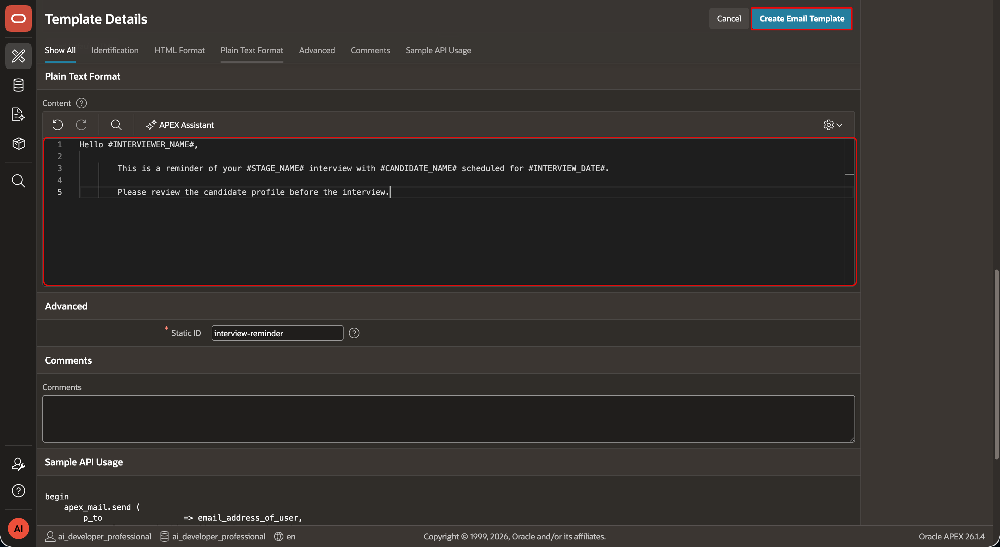
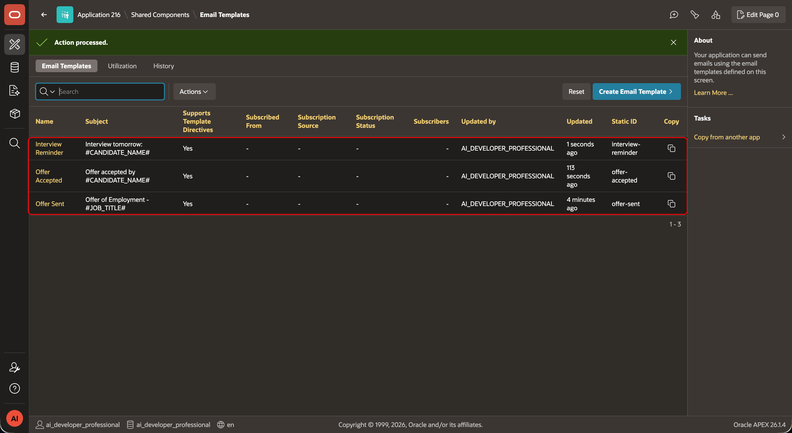

# Create TAP Email Templates

## Introduction

Create email templates for offer and interview events. Each template has a static identifier. TAP automations use the identifier and placeholders to send messages from each query row.

### Objectives

- Create three TAP email templates.
- Configure static identifiers and placeholders.
- Prepare templates for offer and interview notifications.

Estimated Time: 5 minutes

## Task 1: Open Email Templates

1. In TAP, select **Shared Components**, then select **Email Templates**.
    
    

2. Select **Create Email Template**.
    

## Task 2: Create the TAP templates

1. Create each template below. Enter the name, static identifier, and subject. Add the HTML and plain-text bodies, select **Create Template**, and repeat for the next template.

    1. **Offer Sent**

        - **Name:** Offer Sent
        - **Static Identifier:** `OFFER_SENT`
        - **Subject:** Offer of Employment - #JOB_TITLE#

        **HTML Format > Body**

        ```html
        <copy>

        <p>Dear <strong>#CANDIDATE_NAME#</strong>,</p>

        <p>We offer you the position of <strong>#JOB_TITLE#</strong> with a salary of <strong>#OFFERED_SALARY#</strong>. Your proposed start date is <strong>#START_DATE#</strong>.</p>

        <p>Please review and accept the attached offer by <strong>#EXPIRY_DATE#</strong>.</p>

        <p>Recruiting Team</p>

        </copy>
        ```

        **Plain-Text Format > Content**

        ```text
        <copy>

        Dear #CANDIDATE_NAME#,

        We offer you the position of #JOB_TITLE# with a salary of #OFFERED_SALARY#.

        Your proposed start date is #START_DATE#.

        Please review and accept the attached offer by #EXPIRY_DATE#.

        Recruiting Team

        </copy>
        ```
    
    

    2. **Offer Accepted**

        - **Name:** Offer Accepted
        - **Static Identifier:** `OFFER_ACCEPTED`
        - **Subject:** Offer accepted by #CANDIDATE_NAME#

        **HTML Format > Body**

        ```html
        <copy>

        <p><strong>#CANDIDATE_NAME#</strong> has accepted the offer for <strong>#JOB_TITLE#</strong>. Start date: <strong>#START_DATE#</strong>.</p>

        <p>Please trigger the onboarding workflow.</p></copy>
        ```

        **Plain-Text Format > Content**

        ```text
        <copy>

        #CANDIDATE_NAME# has accepted the offer for #JOB_TITLE#.

        Start date: #START_DATE#.

        Please trigger the onboarding workflow.

        </copy>
        ```
    
    

    3. **Interview Reminder**

        - **Name:** Interview Reminder
        - **Static Identifier:** `INTERVIEW_REMINDER`
        - **Subject:** Interview tomorrow: #CANDIDATE_NAME#

        **HTML Format > Body**

        ```html
        <copy>

        <p>Hello <strong>#INTERVIEWER_NAME#</strong>,</p>

        <p>This is a reminder of your <strong>#STAGE_NAME#</strong> interview with

        <strong>#CANDIDATE_NAME#</strong> scheduled for <strong>#INTERVIEW_DATE#</strong>.</p>

        <p>Please review the candidate profile before the interview.</p>

        </copy>
        ```

        **Plain-Text Format > Content**

        ```text
        <copy>

        Hello #INTERVIEWER_NAME#,

        This is a reminder of your #STAGE_NAME# interview with #CANDIDATE_NAME# scheduled for #INTERVIEW_DATE#.

        Please review the candidate profile before the interview.

        </copy>
        ```
    
    

2. Return to **Email Templates** and confirm that `OFFER_SENT`, `OFFER_ACCEPTED`, and `INTERVIEW_REMINDER` appear in the list.
    

3. Use `OFFER_SENT` after you generate an offer. Use `OFFER_ACCEPTED` when a candidate accepts an offer. Lab 8 uses `INTERVIEW_REMINDER`.

4. In PL/SQL business logic, reference a template by its static identifier, such as `p_template_static_id => 'OFFER_SENT'` in `APEX_MAIL.SEND`.

## Acknowledgements

- **Author -** Aravind Madhavan, Senior Product Manager.
- **Last Updated By/Date** - Aravind Madhavan, Senior Product Manager, July 2026
