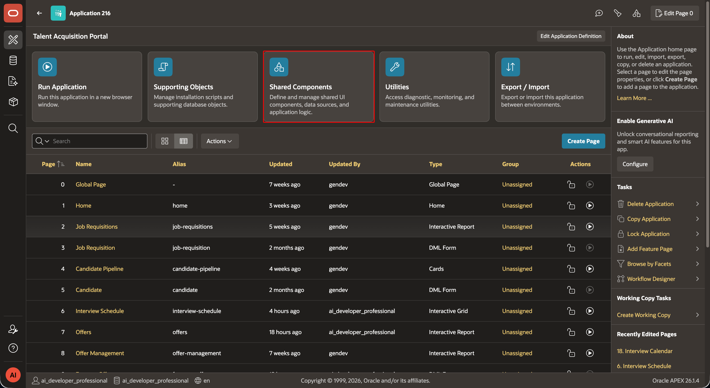
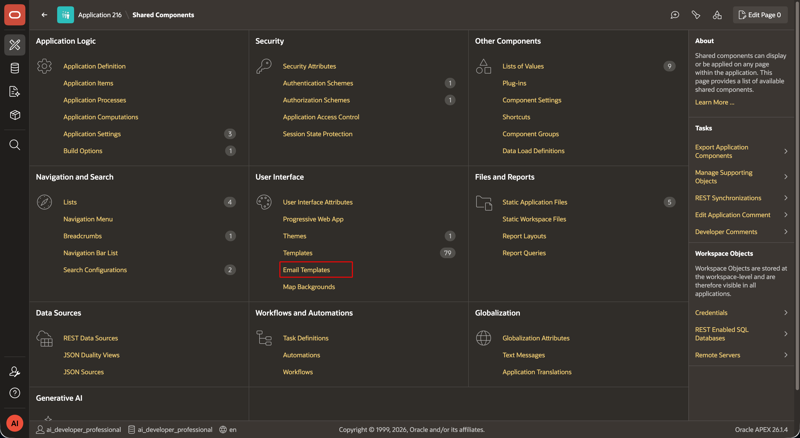
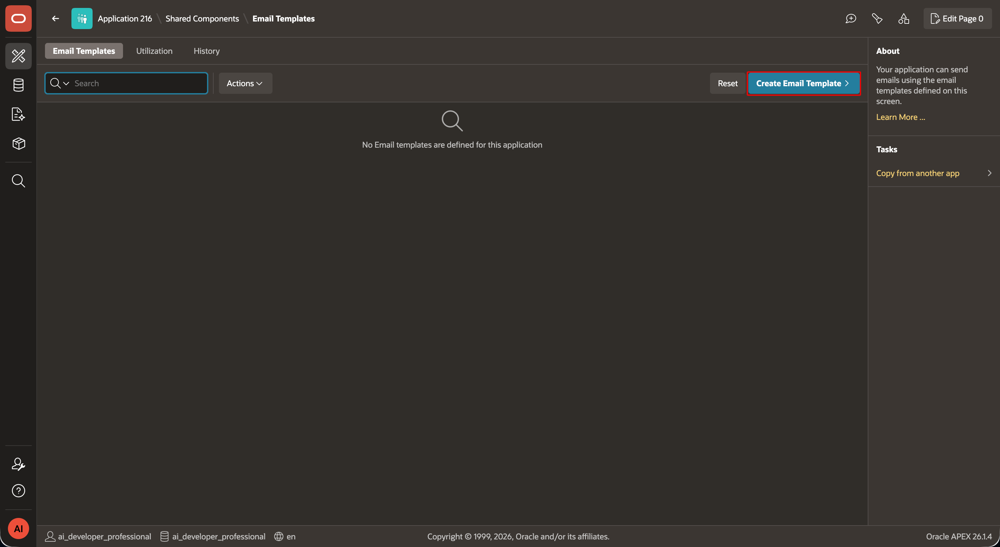
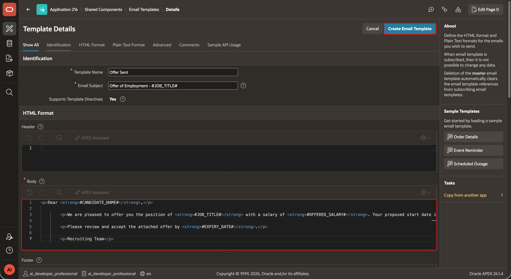
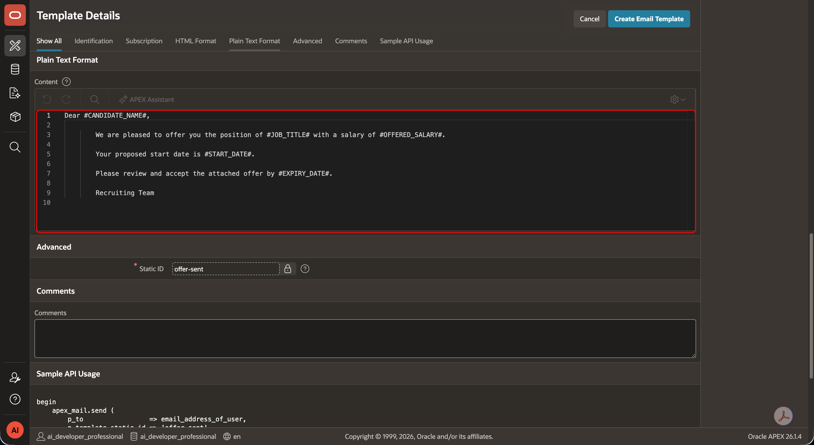
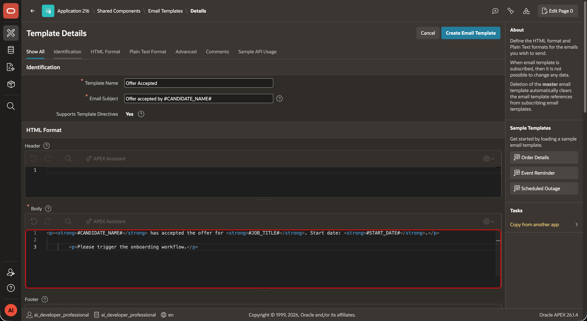
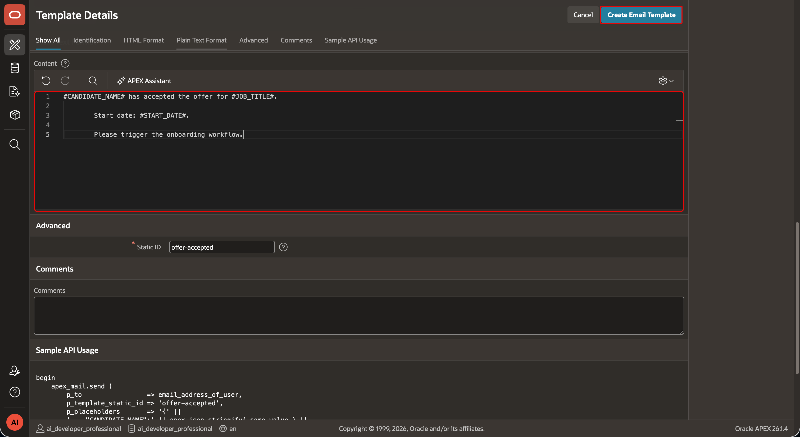
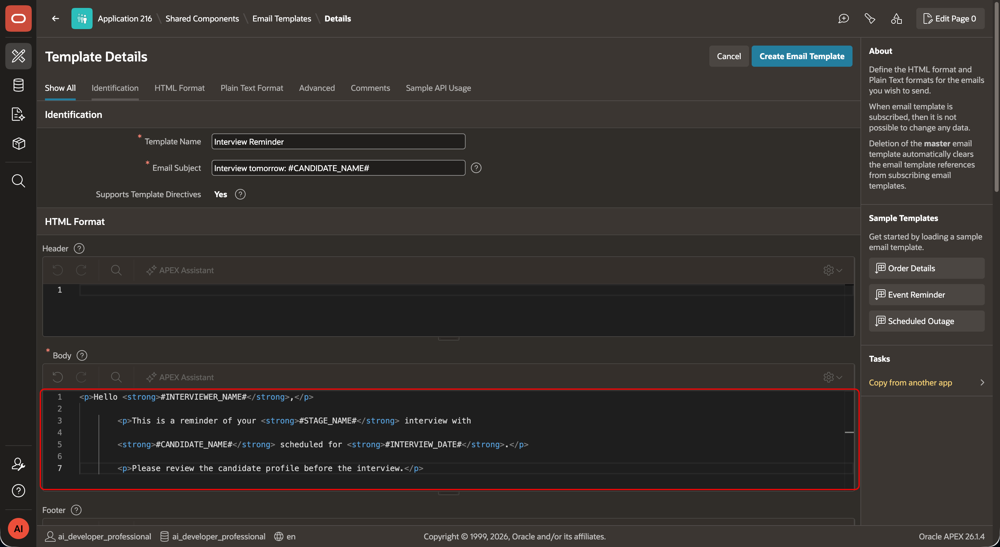
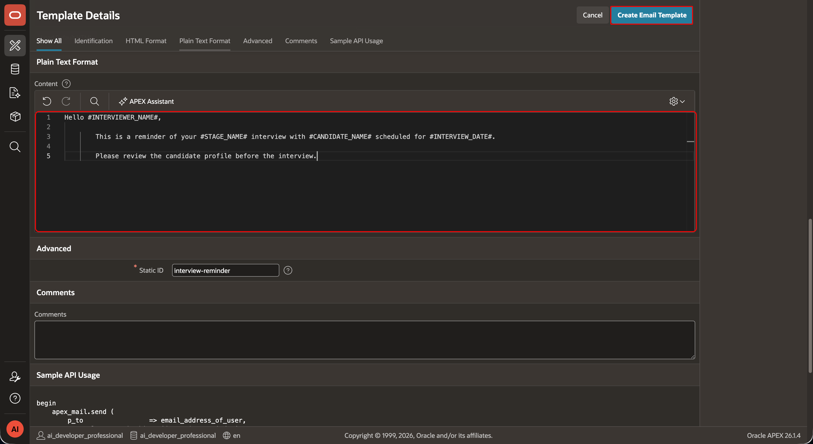
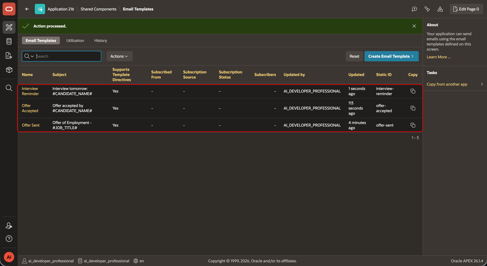

# Lab 7: Create TAP Email Templates

## Introduction

Create email templates for offer and interview events. Each template includes an HTML Format and a Plain Text Format. Its static identifier lets automations and `APEX_MAIL` refer to the template, while placeholders supply row-specific values.

Estimated Workshop Time: 5 minutes

### Objectives

In this lab, you will learn how to:

- Create three TAP email templates.
- Configure static identifiers and placeholders.
- Prepare templates for offer and interview notifications.

## Task 1: Open Email Templates

1. In TAP, open **Shared Components**.

    

2. Select **Email Templates**.

    

3. Select **Create Email Template**.
    

## Task 2: Create the TAP templates

1. Create the **Offer Sent** email template using these values:

    - **Name:** Offer Sent
    - **Static ID:** `offer-sent` (Auto-Generated)
    - **Subject:** Offer of Employment - #JOB_TITLE#

    

2. Enter the HTML and plain-text content for **Offer Sent**:

    - **HTML Format > Body:**

        ```html
        <copy>

        <p>Dear <strong>#CANDIDATE_NAME#</strong>,</p>

        <p>We are pleased to offer you the position of <strong>#JOB_TITLE#</strong> with a salary of <strong>#OFFERED_SALARY#</strong>. Your proposed start date is <strong>#START_DATE#</strong>.</p>

        <p>Please review and accept the attached offer by <strong>#EXPIRY_DATE#</strong>.</p>

        <p>Recruiting Team</p>

        </copy>
        ```

    - **Plain-Text Format > Content:**

        ```text
        <copy>

        Dear #CANDIDATE_NAME#,

        We are pleased to offer you the position of #JOB_TITLE# with a salary of #OFFERED_SALARY#.

        Your proposed start date is #START_DATE#.

        Please review and accept the attached offer by #EXPIRY_DATE#.

        Recruiting Team

        </copy>
        ```

    - Select **Create Email Template** to save this template before starting the next one.

    

3. Create the **Offer Accepted** email template using these values:

    - **Name:** Offer Accepted
    - **Static ID:** `offer-accepted` (Auto-Generated)
    - **Subject:** Offer accepted by #CANDIDATE_NAME#

    

4. Enter the HTML and plain-text content for **Offer Accepted**:

    - **HTML Format > Body:**

        ```html
        <copy>

        <p><strong>#CANDIDATE_NAME#</strong> has accepted the offer for <strong>#JOB_TITLE#</strong>. Start date: <strong>#START_DATE#</strong>.</p>

        <p>Please trigger the onboarding workflow.</p></copy>
        ```

    - **Plain-Text Format > Content:**

        ```text
        <copy>

        #CANDIDATE_NAME# has accepted the offer for #JOB_TITLE#.

        Start date: #START_DATE#.

        Please trigger the onboarding workflow.

        </copy>
        ```

    - Select **Create Email Template** to save this template before starting the next one.

    

5. Create the **Interview Reminder** email template using these values:

    - **Name:** Interview Reminder
    - **Static ID:** `interview-reminder` (Auto-Generated)
    - **Subject:** Interview tomorrow: #CANDIDATE_NAME#

    

6. Enter the HTML and plain-text content for **Interview Reminder**:

    - **HTML Format > Body:**

        ```html
        <copy>

        <p>Hello <strong>#INTERVIEWER_NAME#</strong>,</p>

        <p>This is a reminder of your <strong>#STAGE_NAME#</strong> interview with

        <strong>#CANDIDATE_NAME#</strong> scheduled for <strong>#INTERVIEW_DATE#</strong>.</p>

        <p>Please review the candidate profile before the interview.</p>

        </copy>
        ```

    - **Plain-Text Format > Content:**

        ```text
        <copy>

        Hello #INTERVIEWER_NAME#,

        This is a reminder of your #STAGE_NAME# interview with #CANDIDATE_NAME# scheduled for #INTERVIEW_DATE#.

        Please review the candidate profile before the interview.

        </copy>
        ```

    - Select **Create Email Template** to save this template before starting the next one.

    

7. Return to **Email Templates** and confirm that `offer-sent`, `offer-accepted`, and `interview-reminder` appear in the **Static ID** column.
    

8. Use `offer-sent` after you generate an offer.

    - Use `offer-accepted` when a candidate accepts an offer. Lab 8 uses the **Interview Reminder** email template.

9. In PL/SQL business logic, reference a template by its static ID, such as `p_template_static_id => 'offer-sent'` in `APEX_MAIL.SEND`.

## Acknowledgements

- **Author -** Aravind Madhavan, Senior Product Manager.
- **Last Updated By/Date** - Aravind Madhavan, Senior Product Manager, July 2026
