# Create TAP Scheduled Automations

## Introduction

Create TAP automations for interview reminders and expiring offers.

### Objectives

- Create the Interview Reminder automation.
- Create the Offer Expiry Alert automation.
- Review automation execution logs.

Estimated Time: 5 minutes

## Task 1: Create Interview Reminder

1. In TAP, select **Shared Components**, then select **Automations** and **Create**.
    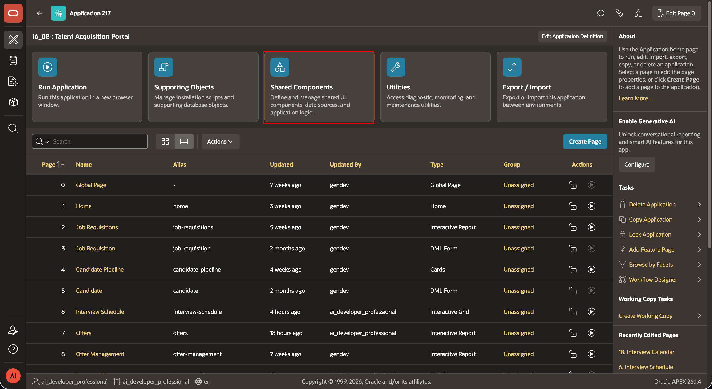
    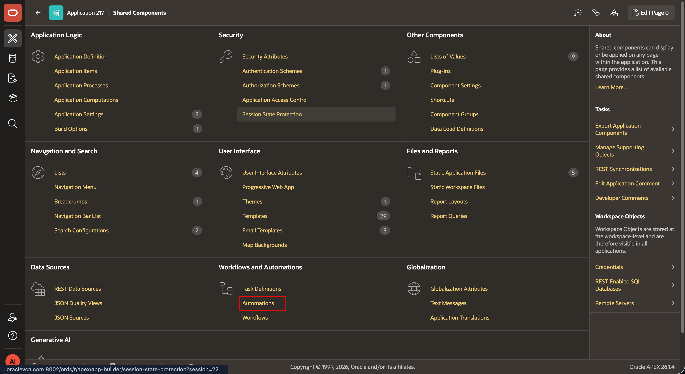
    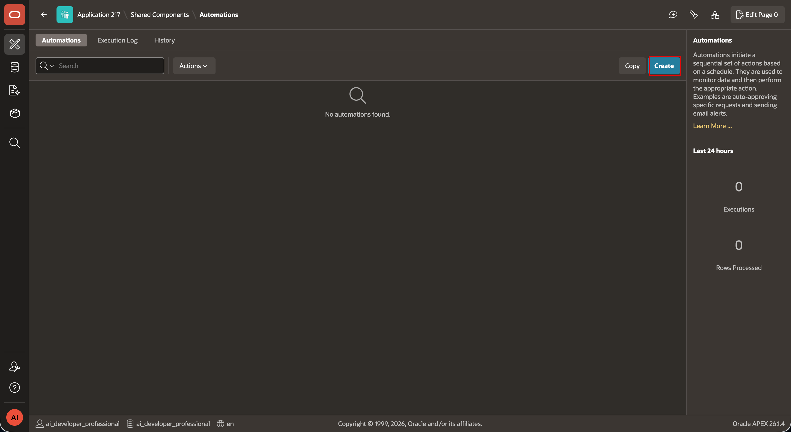

2. Name the automation **Interview Reminder**. Schedule it daily at `07:00 UTC`. Select a query source. Enable processing for each result row.
    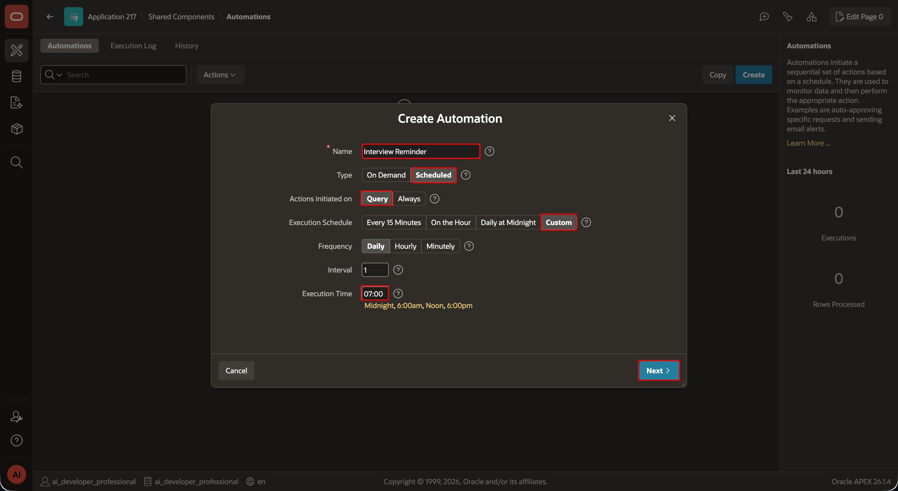

3. Enter this query:

    ```sql
    <copy>

    SELECT i.stage_id,
           i.stage_name,
           i.scheduled_date AS interview_date,
           TO_CHAR(i.scheduled_date, 'DD-Mon-YYYY HH24:MI') AS interview_date_text,
           c.first_name || ' ' || c.last_name AS candidate_name,
           e.email AS interviewer_email,
           e.first_name || ' ' || e.last_name AS interviewer_name
      FROM tms_interview_stages i
      JOIN tms_candidates c ON c.candidate_id = i.candidate_id
      JOIN tms_employees e ON e.employee_id = i.interviewer_id
     WHERE TRUNC(i.scheduled_date) = TRUNC(SYSDATE) + 1

     </copy>
    ```
    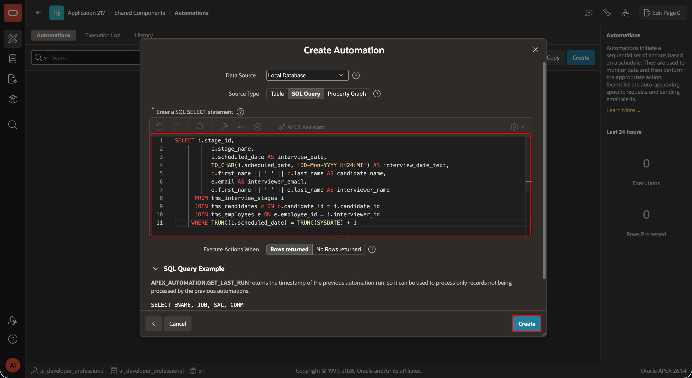

4. Add a **Send E-Mail** action. Set **To** to `&INTERVIEWER_EMAIL.`. Select `INTERVIEW_REMINDER`. In the placeholder grid, set these values:

    | Placeholder | Value |
    | --- | --- |
    | `CANDIDATE_NAME` | `&CANDIDATE_NAME.` |
    | `INTERVIEW_DATE` | `&INTERVIEW_DATE_TEXT.` |
    | `STAGE_NAME` | `&STAGE_NAME.` |
    | `INTERVIEWER_NAME` | `&INTERVIEWER_NAME.` |

    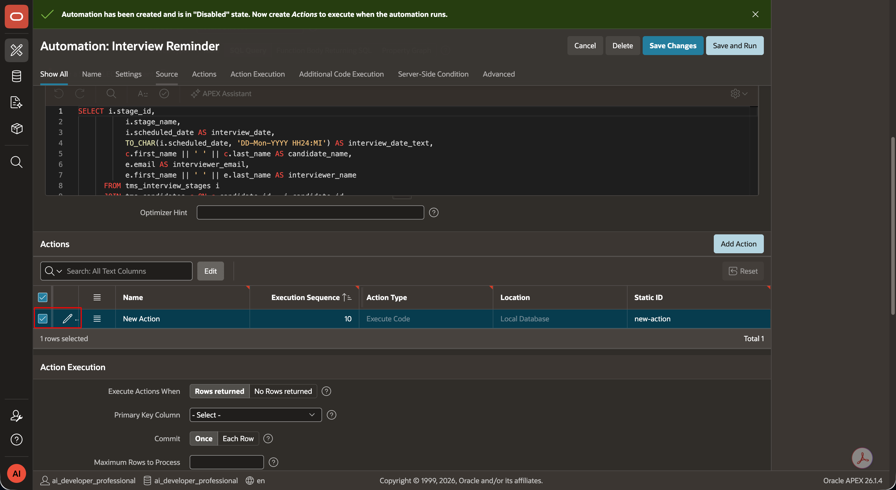
    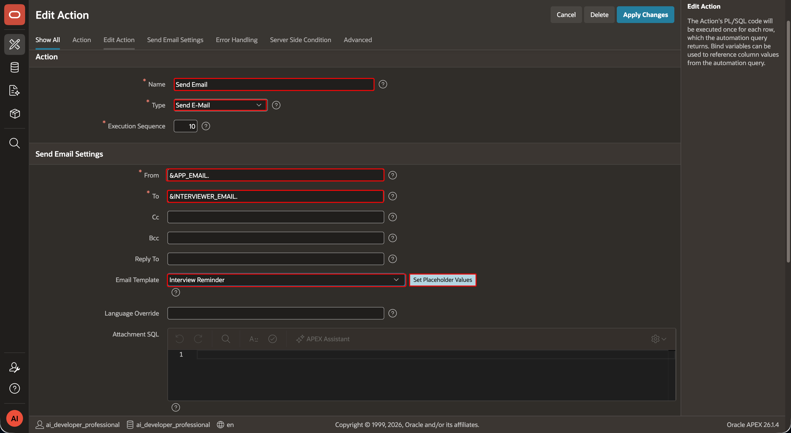
    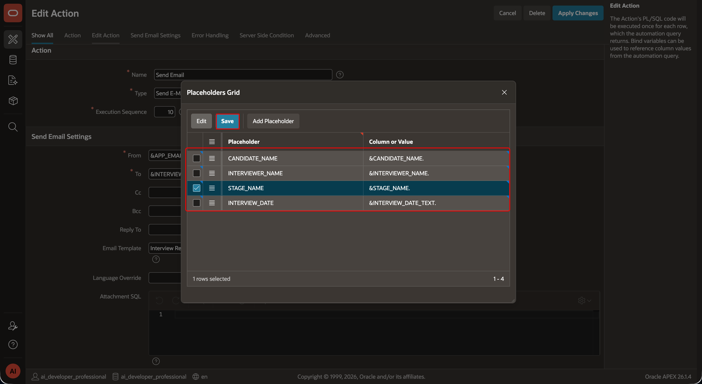

5. Save, select **Run Now**, and set the schedule to **Active**.
    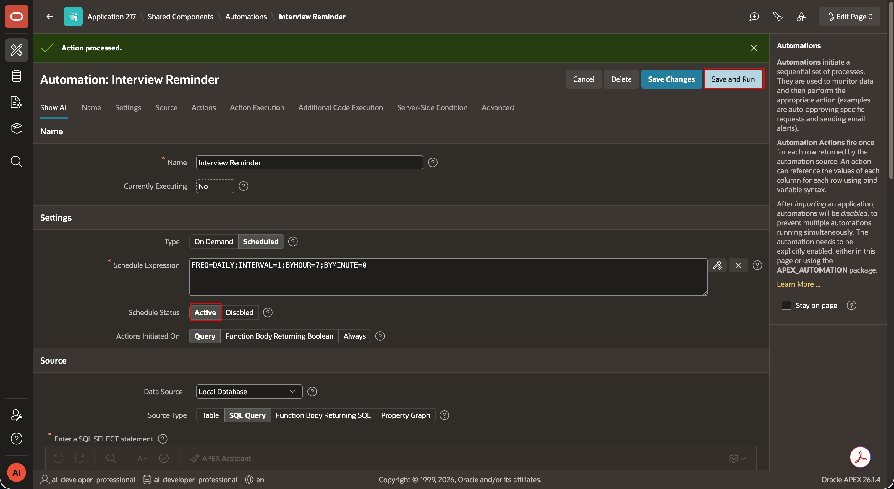

## Task 2: Create Offer Expiry Alert

1. Create a second scheduled automation named **Offer Expiry Alert**. Schedule it daily at `08:00 UTC`.
    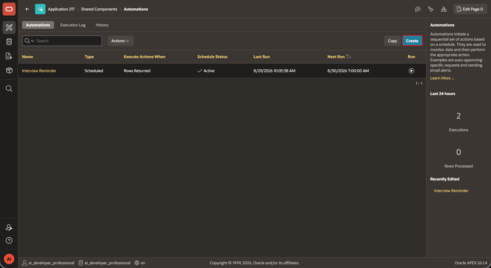
    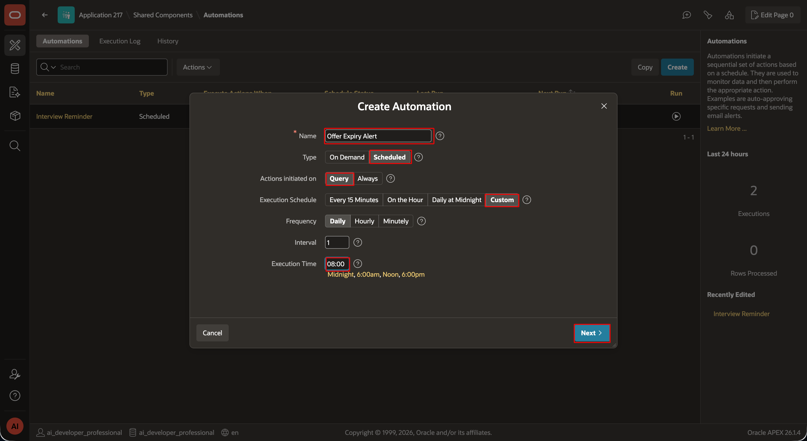

2. Use this query. It aliases `REQUESTED_BY` as `RECRUITER_EMAIL`. Store the recruiter email address in this column.

    ```sql
    <copy>SELECT o.offer_id,
           o.candidate_id,
           o.expiry_date,
           c.first_name || ' ' || c.last_name AS candidate_name,
           o.offered_salary,
           r.requested_by AS recruiter_email
      FROM tms_offers o
      JOIN tms_candidates c ON c.candidate_id = o.candidate_id
      JOIN tms_job_requisitions r ON r.req_id = o.req_id
     WHERE o.status = 'Sent'
       AND o.expiry_date = TRUNC(SYSDATE) + 3</copy>
    ```
    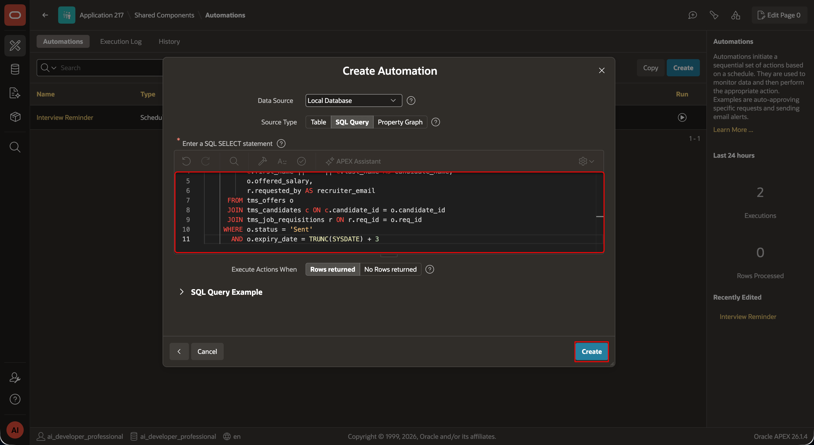

3. Add a **Send E-Mail** action without a template. Set **To** to `&RECRUITER_EMAIL.`. Use **Offer expiring soon: &CANDIDATE_NAME.** as the subject.
     Use this plain-text body:

    ```text
    <copy>The offer for &CANDIDATE_NAME. will expire on &EXPIRY_DATE. Please take action.</copy>
    ```

    Use this HTML body:

    ```html
    <copy><p>The offer for <strong>&CANDIDATE_NAME.</strong> will expire on <strong>&EXPIRY_DATE.</strong>. Please take action.</p></copy>
    ```
    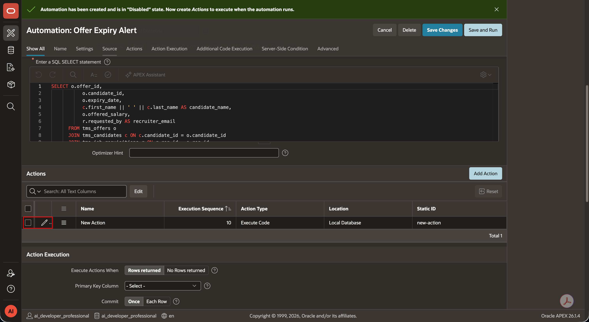
    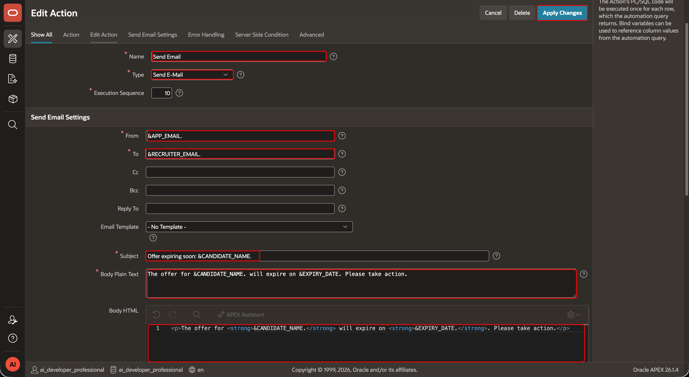

4. Save, run, and activate the automation.
    
    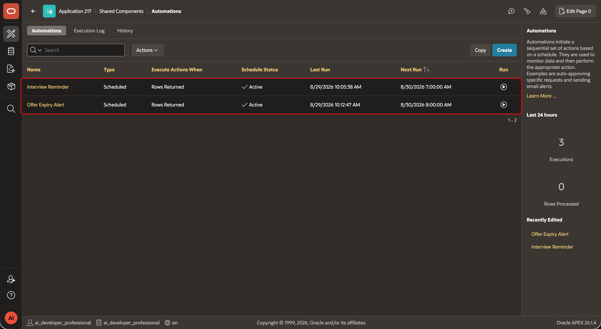


## Task 3: Review logs

1. Open **Shared Components**, select **Automations**, then select **Execution Log**. After each **Run Now**, confirm that the status is **Succeeded**. Review the timestamp, successful rows, error rows, and messages.
    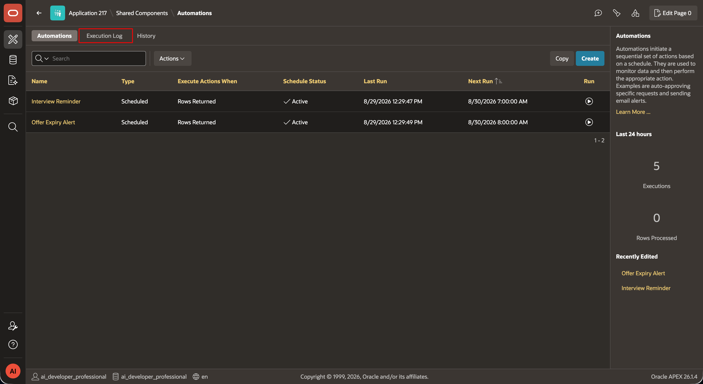


## Acknowledgements

- **Author -** Aravind Madhavan, Senior Product Manager.
- **Last Updated By/Date** - Aravind Madhavan, Senior Product Manager, July 2026
