# Lab 8: Create TAP Scheduled Automations

## Introduction

Create TAP automations for interview reminders and expiring offers.

Estimated Workshop Time: 5 minutes

### Objectives

In this lab, you will learn how to:

- Create the Interview Reminder automation.
- Create the Offer Expiry Alert automation.
- Review automation execution logs.

## Task 1: Create Interview Reminder

1. In TAP, open **Shared Components**.

    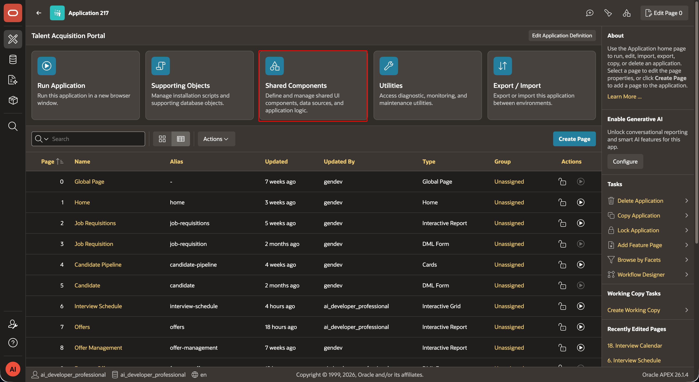

2. Select **Automations**.

    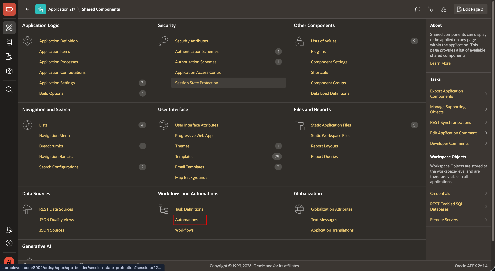

3. Click **Create**.

    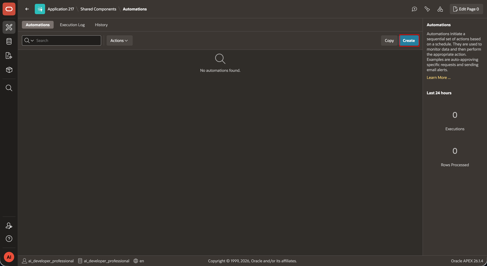

4. Name the automation **Interview Reminder**.

    - Select **Scheduled**, **Query**, **Custom**, **Daily**, and an interval of `1`.

    - Set **Execution Time** to `07:00`. The resulting schedule expression is `FREQ=DAILY;INTERVAL=1;BYHOUR=7;BYMINUTE=0` in the database server time zone.
    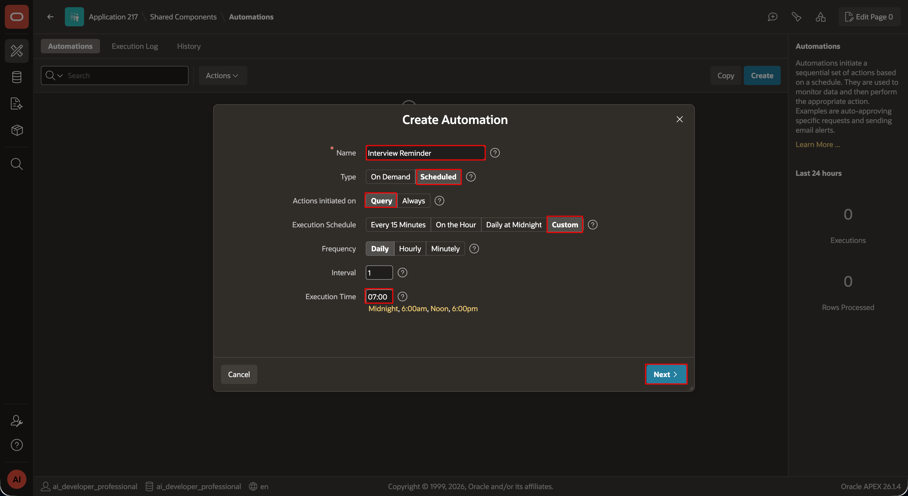

5. Enter this query:

    ```sql
    <copy>

    SELECT i.stage_id,
           i.stage_name,
           i.scheduled_date AS interview_date,
           TO_CHAR(i.scheduled_date, 'DD-Mon-YYYY HH24:MI') AS interview_date_text,
           c.first_name || ' ' || c.last_name AS candidate_name,
           e.email AS interviewer_email,
           e.first_name || ' ' || e.last_name AS interviewer_name
      FROM tms_interview_stages i
      JOIN tms_candidates c ON c.candidate_id = i.candidate_id
      JOIN tms_employees e ON e.employee_id = i.interviewer_id
     WHERE TRUNC(i.scheduled_date) = TRUNC(SYSDATE) + 1

     </copy>
    ```
    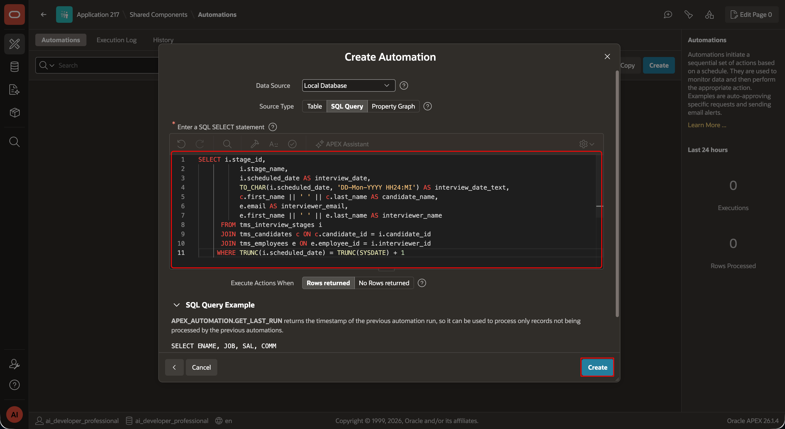

6. Add a **Send E-Mail** action.

    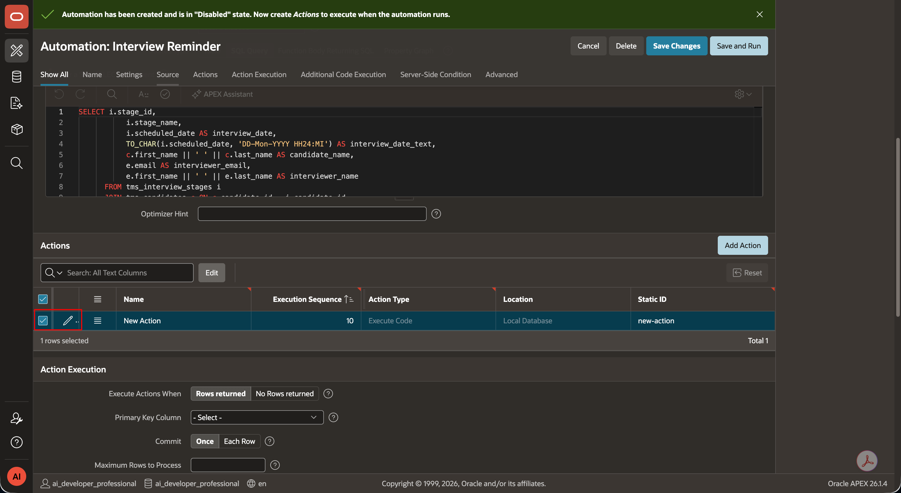

7. Set **From** to `&APP_EMAIL.` and **To** to `&INTERVIEWER_EMAIL.`.

    - Select the **Interview Reminder** email template.

    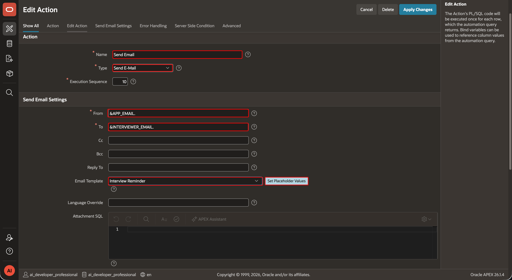

8. In the placeholder grid, set these values:

    | Placeholder | Value |
    | --- | --- |
    | `CANDIDATE_NAME` | `&CANDIDATE_NAME.` |
    | `INTERVIEW_DATE` | `&INTERVIEW_DATE_TEXT.` |
    | `STAGE_NAME` | `&STAGE_NAME.` |
    | `INTERVIEWER_NAME` | `&INTERVIEWER_NAME.` |

    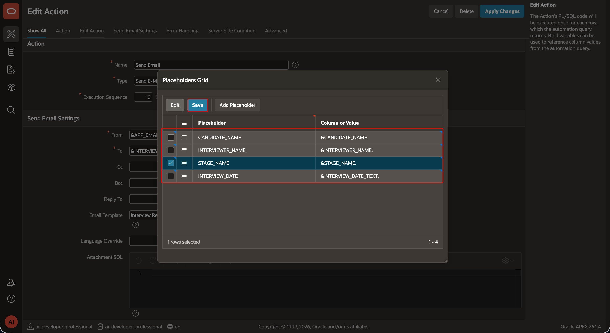

9. Set the schedule to **Active**, then select **Save and Run**.
    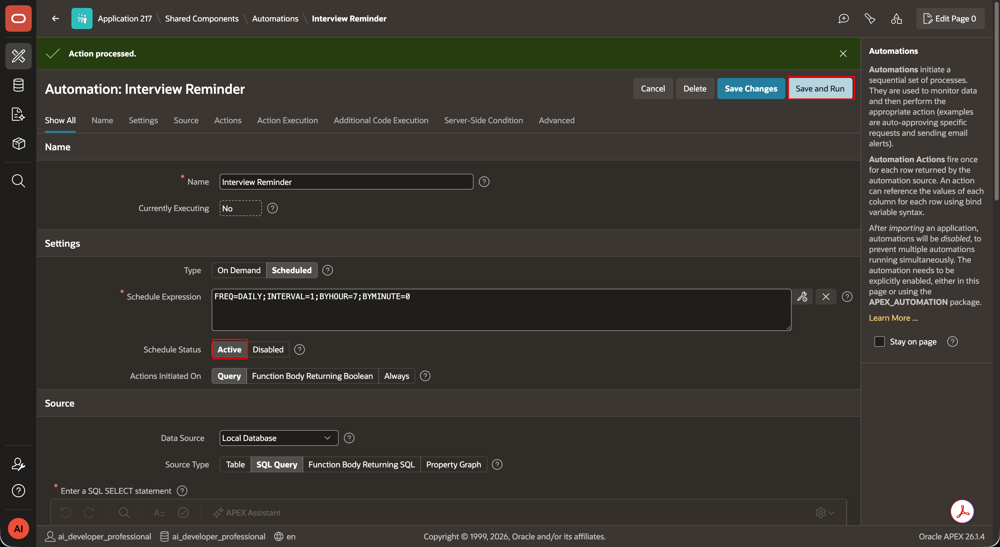

## Task 2: Create Offer Expiry Alert

1. Create a second automation named **Offer Expiry Alert** and select **Scheduled**.

    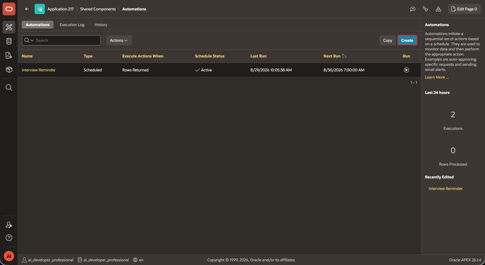

2. Select **Query**, **Custom**, **Daily**, and an interval of `1`.

    - Set **Execution Time** to `08:00`.

    - The resulting schedule expression is `FREQ=DAILY;INTERVAL=1;BYHOUR=8;BYMINUTE=0` in the database server time zone.

    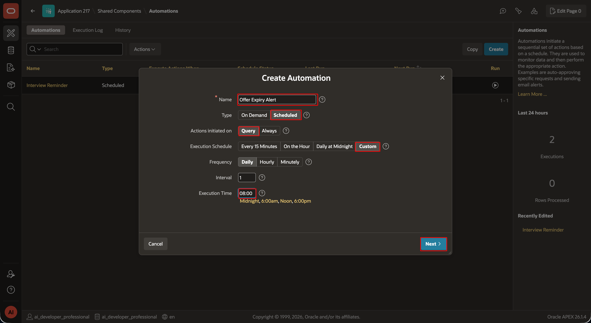

3. Use this query. It aliases `REQUESTED_BY` as `RECRUITER_EMAIL`. Store the recruiter email address in this column.

    ```sql
    <copy>SELECT o.offer_id,
           o.candidate_id,
           o.expiry_date,
           c.first_name || ' ' || c.last_name AS candidate_name,
           o.offered_salary,
           r.requested_by AS recruiter_email
      FROM tms_offers o
      JOIN tms_candidates c ON c.candidate_id = o.candidate_id
      JOIN tms_job_requisitions r ON r.req_id = o.req_id
     WHERE o.status = 'Sent'
       AND o.expiry_date = TRUNC(SYSDATE) + 3</copy>
    ```
    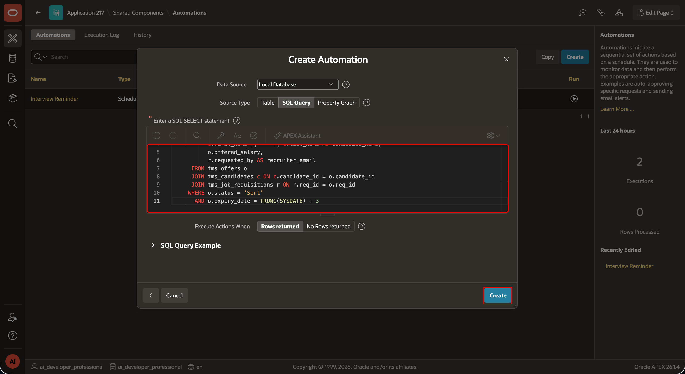

4. Add a **Send E-Mail** action without a template.

    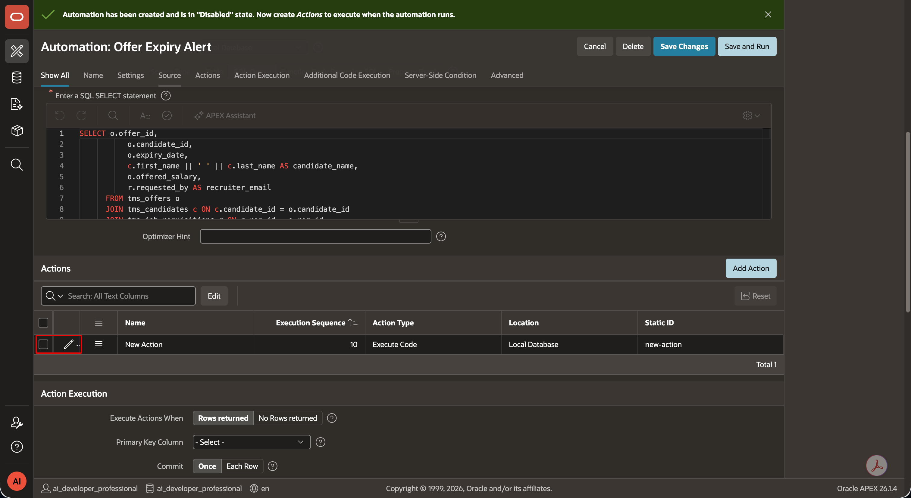

5. Set **From** to `&APP_EMAIL.` and **To** to `&RECRUITER_EMAIL.`.

    - Set **Subject** to **Offer expiring soon: &CANDIDATE_NAME.**.

    - Use this plain-text body:

        ```text
        <copy>The offer for &CANDIDATE_NAME. will expire on &EXPIRY_DATE. Please take action.</copy>
        ```

    - Use this HTML body:

        ```html
        <copy><p>The offer for <strong>&CANDIDATE_NAME.</strong> will expire on <strong>&EXPIRY_DATE.</strong>. Please take action.</p></copy>
        ```

    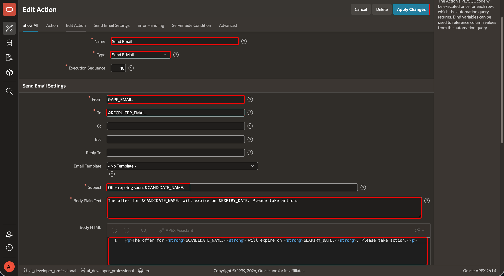

6. Set the schedule to **Active**, then select **Save and Run**.

    

7. Return to **Automations** and confirm that both TAP automations are listed.

    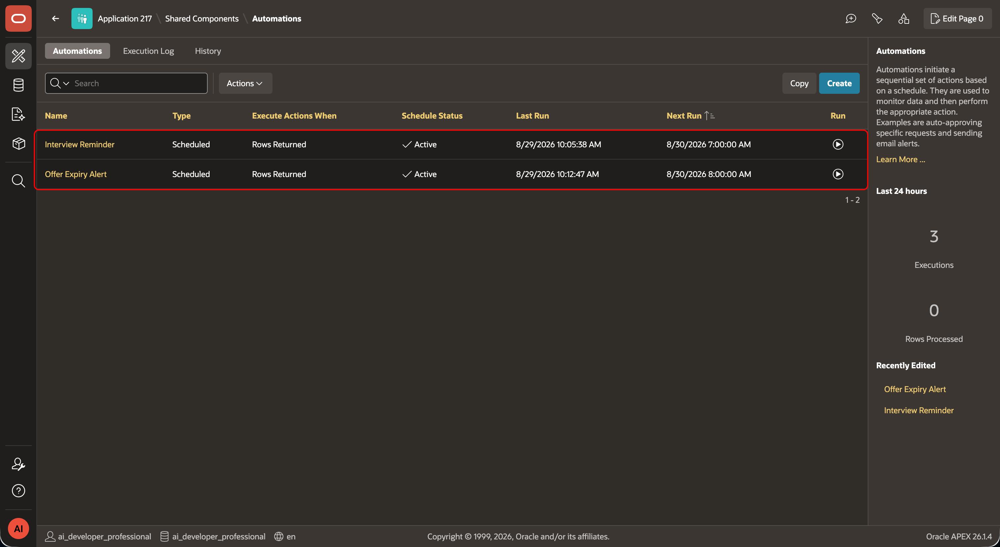

## Task 3: Review logs

1. Open **Shared Components**, select **Automations**, then select **Execution Log**. After each **Save and Run**, confirm that the status is **Succeeded**.

    - Review the timestamp, successful rows, error rows, and messages.
    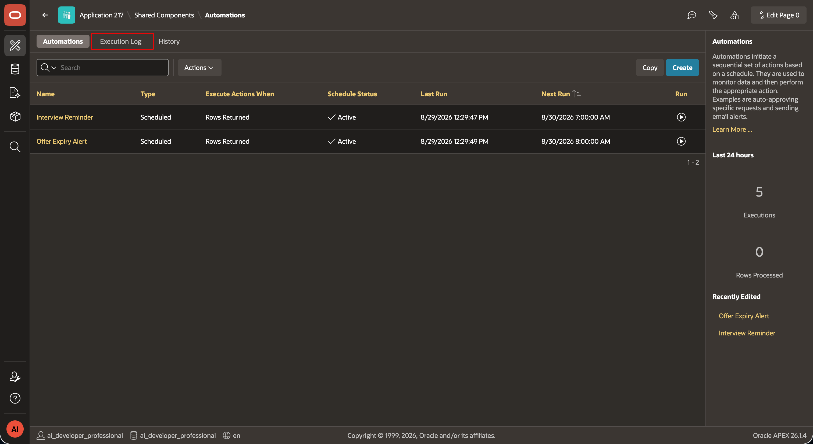

## Acknowledgements

- **Author -** Aravind Madhavan, Senior Product Manager.
- **Last Updated By/Date** - Aravind Madhavan, Senior Product Manager, July 2026
