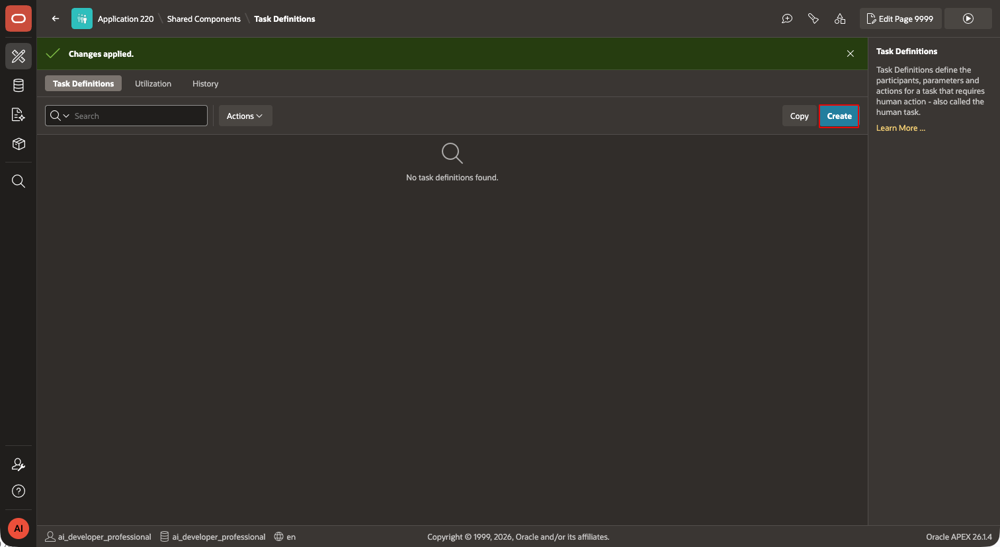
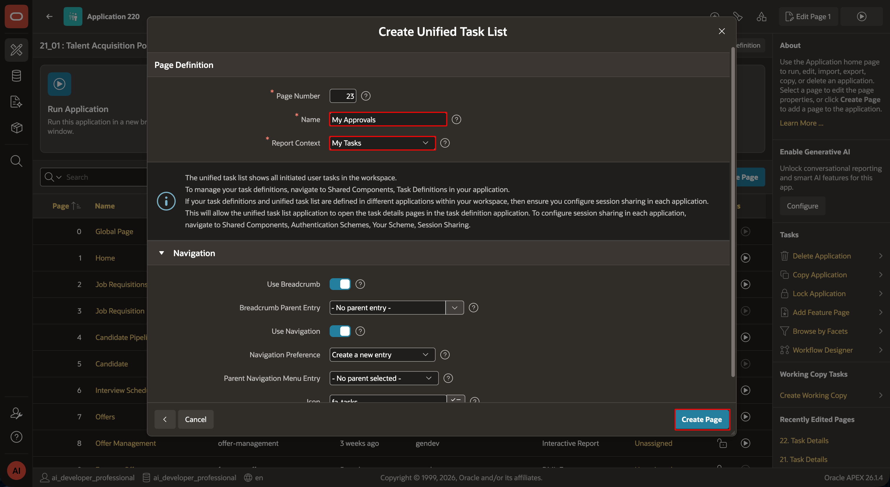
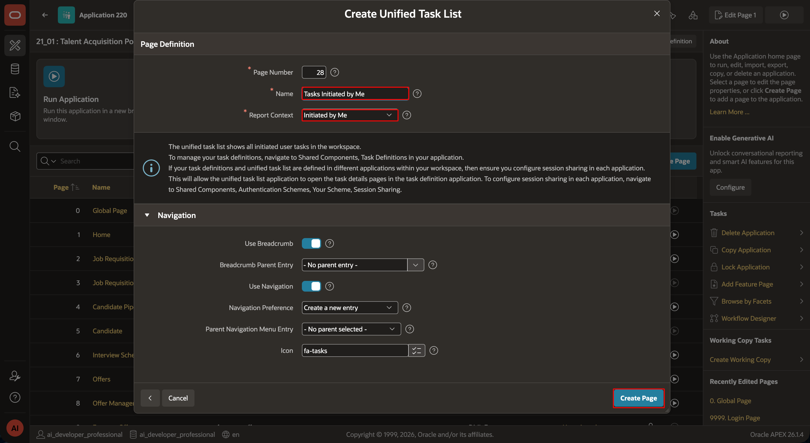
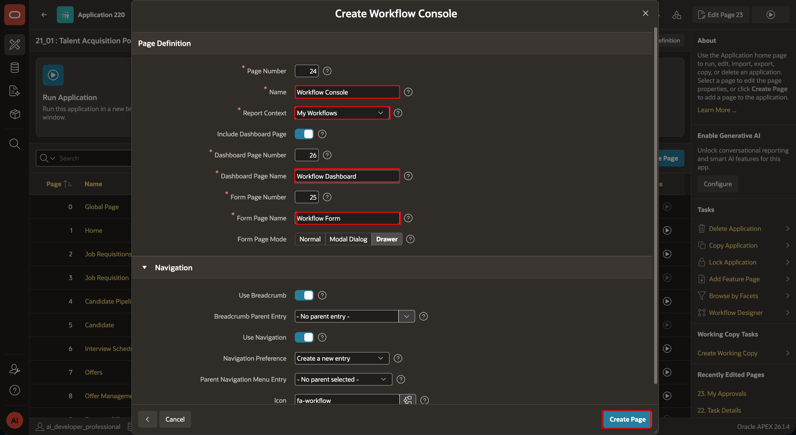
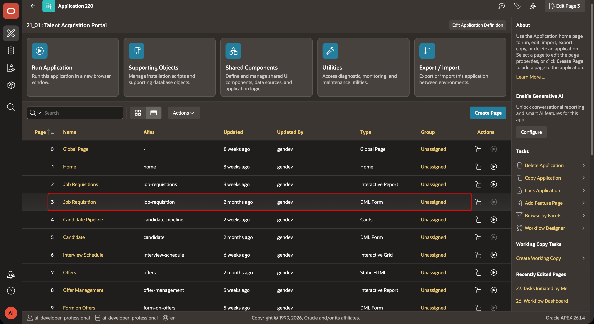
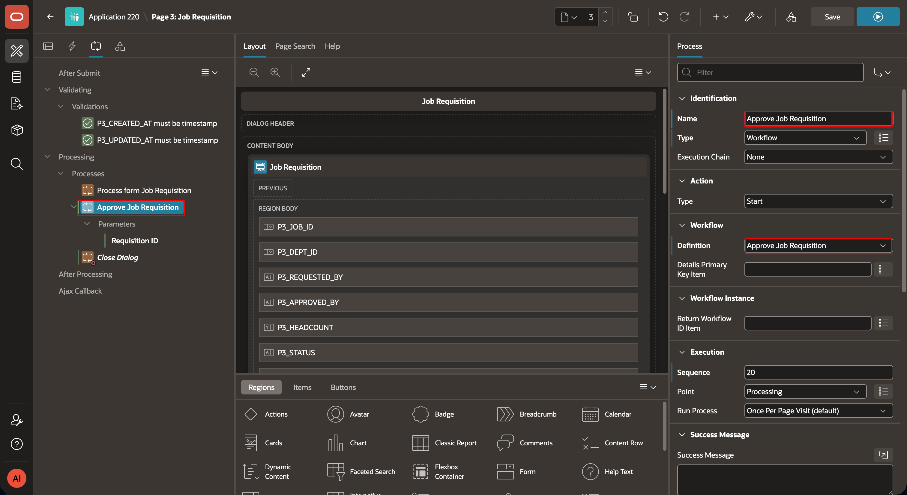
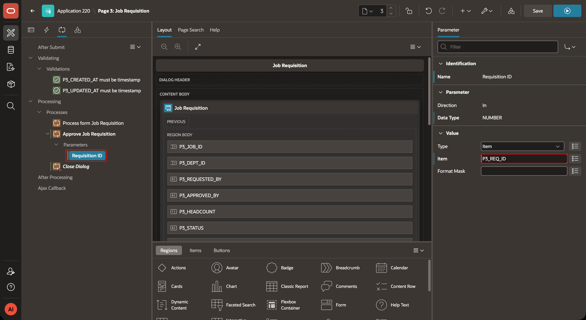
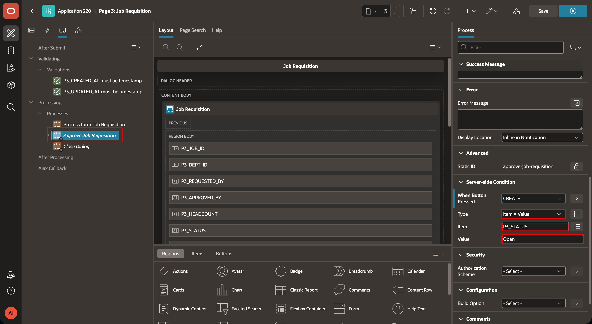

# TAP Requisition Approval Workflow

## Introduction

Create a TAP workflow that routes submitted requisitions by requested headcount. Requisitions for more than three people go to an HR administrator. All other requisitions go to the department head. The task outcome updates the requisition status.

Estimated Time: 45 minutes

### Objectives

- Create approval task definitions with task parameters and potential owners.
- Build a workflow that loads requisition details and routes by headcount.
- Start the workflow from the Job Requisition form and test both routes.

## Task 1: Create the Task definition

1. In TAP, open **Shared Components**, select **Task Definitions**, and click **Create**. Create the HR administration task definition. Use these values:
    

    **Requisition HR Admin Review**

    | Field | Value |
    | --- | --- |
    | Name | `Requisition HR Admin Review` |
    | Static ID | `approve_job_requisition_hr_administration` |
    | Type | Approval Task |
    | Priority | Medium |
    | Subject | `Approve Requisition &REQ_ID. for &HEADCOUNT. headcount` |
    
    
    - Set **Due On Type** to **Expression** and set **Due On** to `SYSDATE + 2`.
        
    - Click **Add Participant** and configure the participant as follows:
   | Participant Type | Identity Type | Value Type | SQL Query |
    | --- | --- | --- | --- |
    | Potential Owner | Authorization Scheme |  |  IS_TA_ADMIN |
    
        
    - Add the following task parameters. The static IDs support the subject substitutions. Set each parameter data type to **String** and provide a readable label.

    | Static ID | Label | Required | Visible |
    | --- | --- | --- | --- |
    | `P_REQUISITION_ID` | Requisition ID | Yes | Yes |
    | `P_HEADCOUNT` | Requested Headcount | Yes | Yes |
    | `P_JOB_TITLE` | Job Title | Yes | Yes |
    | `P_DEPARTMENT_NAME` | Department Name | Yes | Yes |
    
        

    - Keep **Initiator Can Complete** off. Click **Create Task Details Page**, then save the task definition.

     **Requisition Department Head Review**

    | Field | Value |
    | --- | --- |
    | Name | `Requisition Department Head Review` |
    | Static ID | `approve_job_requisition_department_head` |
    | Type | Approval Task |
    | Priority | Medium |
    | Subject | `Approve Requisition &REQ_ID. for &HEADCOUNT. headcount` |

    
    - Click **Create**. On the Task Definition page, click **Add Participant** and configure the Department Head Potential Owner as follows:

    | Participant Type | Identity Type | Value Type | SQL Query |
    | --- | --- | --- | --- |
    | Potential Owner | User | SQL Query | `SELECT e.email FROM tms_employees e JOIN tms_departments d ON d.manager_id = e.employee_id WHERE d.dept_id = (SELECT r.dept_id FROM tms_job_requisitions r WHERE r.req_id = :APEX$TASK_PK)` |

        
    - Add the same task parameters to this definition. The static IDs support the subject substitutions. Set each parameter data type to **String** and provide a readable label.

    | Static ID | Label | Required | Visible |
    | --- | --- | --- | --- |
    | `P_REQUISITION_ID` | Requisition ID | Yes | Yes |
    | `P_HEADCOUNT` | Requested Headcount | Yes | Yes |
    | `P_JOB_TITLE` | Job Title | Yes | Yes |
    | `P_DEPARTMENT_NAME` | Department Name | Yes | Yes |

        
    - Keep **Initiator Can Complete** off. Click **Create Task Details Page**, then save the task definition.
        
        

## Task 2: Create the requisition workflow

1. Open **Shared Components**, select **Workflows**, and click **Create**. Set the workflow name to `Approve Job Requisition`. Keep the version in **Development**.

2. Create the required workflow parameter:

    | Static ID | Label | Data Type | Direction | Required |
    | --- | --- | --- | --- | --- |
    | `P_REQUISITION_ID` | Requisition ID | NUMBER | In | Yes |

    
3. Create these workflow variables. Use the `V_` prefix for values that can change at runtime. Add the label shown for each variable.

    | Static ID | Label | Data Type |
    | --- | --- | --- |
    | `V_REQUESTED_HEADCOUNT` | Requested Headcount | NUMBER |
    | `V_DEPARTMENT_ID` | Department ID | NUMBER |
    | `V_REQUESTER_ID` | Requester ID | NUMBER |
    | `V_JOB_TITLE` | Job Title | VARCHAR2 |
    | `V_DEPARTMENT_NAME` | Department Name | VARCHAR2 |

    

4. In the Workflow Designer, add a **Workflow Start** activity named `Start`. Add an **Execute Code** activity named `Load Requisition Details`. Enter:

    ```sql
    <copy>
    BEGIN
        SELECT r.headcount,
               r.dept_id,
               r.requested_by,
               j.title,
               d.name
          INTO :V_REQUESTED_HEADCOUNT,
               :V_DEPARTMENT_ID,
               :V_REQUESTER_ID,
               :V_JOB_TITLE,
               :V_DEPARTMENT_NAME
          FROM tms_job_requisitions r
          JOIN tms_jobs j ON j.job_id = r.job_id
          JOIN tms_departments d ON d.dept_id = r.dept_id
         WHERE r.req_id = :P_REQUISITION_ID;
    END;
    </copy>
    ```
    

## Task 3: Route and complete the approval

1. Add a **Switch** activity named `Headcount Review Route` after **Load Requisition Details**. Set the switch type to **True False**. Use this SQL query for the condition:

    ```sql
    <copy>
    SELECT CASE
             WHEN headcount > 3 THEN 'TRUE'
             ELSE 'FALSE'
           END
      FROM tms_job_requisitions
     WHERE req_id = :P_REQUISITION_ID
    </copy>
    ```
    

2. On the first route, add a **Human Task - Create** activity named `HR Admin Review`. Select task definition `Requisition HR Admin Review`. Set **Details Primary Key Item** to `P_REQUISITION_ID`. Map the outcome to `TASK_OUTCOME`.

    |Parameters| Value Type | Variable |
    |----|----|----| 
    `Requestor ID` | Item | `V_REQUESTOR_ID`, 
    `Requested Headcount` | Item | `V_REQUESTED_HEADCOUNT`, 
    `Job Title` | Item | `V_JOB_TITLE`,
    `Department Name` | Item | `V_DEPARTMENT_NAME`. 

    

3. On the second route, add `Requisition Department Head Review`. Select task definition `Requisition Department Head Review`. Set **Details Primary Key Item** to `P_REQUISITION_ID`. Map the outcome to `TASK_OUTCOME`.

    Use the same parameter and result mappings.

    |Parameters| Value Type | Variable |
    |----|----|----| 
    `Requestor ID` | Item | `V_REQUESTOR_ID`, 
    `Requested Headcount` | Item | `V_REQUESTED_HEADCOUNT`, 
    `Job Title` | Item | `V_JOB_TITLE`,
    `Department Name` | Item | `V_DEPARTMENT_NAME`. 

    

4. Configure the connections from `Headcount Review Route`. Set the True connection to `HR Admin` and the False connection to `Department Head`.

    
    

5. Connect both Human Task activities to an **Execute Code** activity named `Update Requisition Status`. Enter this code:

    ```sql
    <copy>
    BEGIN
        UPDATE tms_job_requisitions
           SET status = CASE UPPER(:TASK_OUTCOME)
                            WHEN 'APPROVED' THEN 'Open'
                            WHEN 'REJECTED' THEN 'Rejected'
                            ELSE status
                        END
         WHERE req_id = :P_REQUISITION_ID;
    END;
    </copy>
    ```

    

6. Create a workflow participant and set the workflow owner to `sofia.garcia@acme.example`.
    

7. Add a **Workflow End** activity named `End`. Set its end state to **Completed**. Connect it after **Update Requisition Status**, then save and activate the workflow version.
    
    

## Task 4: Add task and monitoring pages

1. In App Builder, click **Create Page** and select **Unified Task List**. Set the page name to `My Approvals` and **Report Context** to **My Tasks**. Enable navigation, then create the page.

    

2. Create a second **Unified Task List** page. Set its name to `Tasks Initiated by Me` and **Report Context** to **Initiated by Me**. Enable navigation, then create the page.

    

3. Click **Create Page** and select **Workflow Console**. Name the page `Workflow Console` and choose the required **Report Context**. Enable navigation. After page creation, apply authorization scheme `IS_TA_ADMIN` in Page Designer.

    

4. Open the TAP Job Requisition Form in Page Designer and select **Processing**. Create a **Workflow** page process after the Form DML process. Set **Workflow** to `Approve Job Requisition` and **Operation** to **Start**. Map `P_REQUISITION_ID` to page item `PXX_REQ_ID`.

    
    
    

5. Add a server-side condition to the Workflow process. Run the process only when the Create button is pressed and `PXX_STATUS` equals `Open`.

    

## Task 5: Test both approval routes

1. Run TAP and submit a requisition with headcount `2`. Sign in as the department head for that department. Open **My Approvals**, then approve the `Requisition Department Head Review` task.

2. Return to the requisition and confirm status `Open`. Sign in as `sofia.garcia@acme.example`. Open **Workflow Console** and confirm that the instance completed.

3. Submit another requisition with headcount `5`. Sign in as a TA administrator who can own the task. Open **My Approvals** and claim `Requisition HR Admin Review` if required. Approve or reject the task.

4. Verify that approval sets `TMS_JOB_REQUISITIONS.STATUS` to `Open`. Verify that rejection sets it to `Rejected`. Confirm that the workflow instance completed in **Workflow Console**.

## Acknowledgements

- **Author -** Aravind Madhavan, Senior Product Manager.
- **Last Updated By/Date** - Aravind Madhavan, Senior Product Manager, August 2026
