# TAP Requisition Approval Workflow

## Introduction

Create a TAP workflow that routes submitted requisitions according to the requested headcount. Requisitions for more than three people go to an HR administrator; all others go to the department head. The approver's decision updates the requisition status.

Estimated Time: 45 minutes

### Objectives

- Create approval task definitions with task parameters and potential owners.
- Build a workflow that loads requisition details and routes by headcount.
- Start the workflow from the Job Requisition form and test both routes.

## Task 1: Create the Task definition

1. In TAP, open **Shared Components**, select **Task Definitions**, and click **Create**. Create the HR administration task definition with these values:
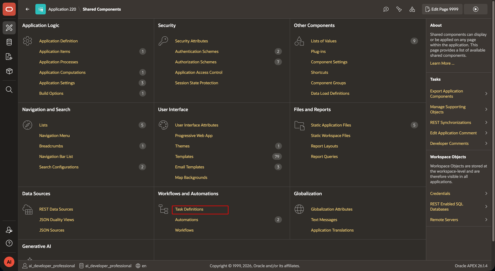

    **Requisition HR Admin Review**

    | Field | Value |
    | --- | --- |
    | Name | `Requisition HR Admin Review` |
    | Static ID | `approve_job_requisition_hr_administration` |
    | Type | Approval Task |
    | Priority | Medium |
    | Subject | `Approve Requisition &REQ_ID. for &HEADCOUNT. headcount` |
    
    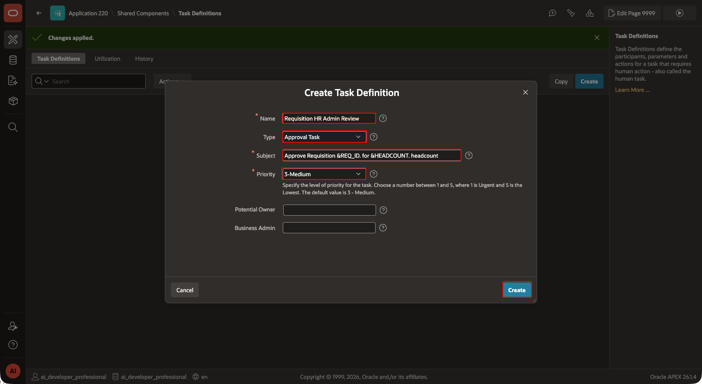
- Set `Deadline` as **Due on Type = Expression** and **Due On = SYSDATE + 2**
    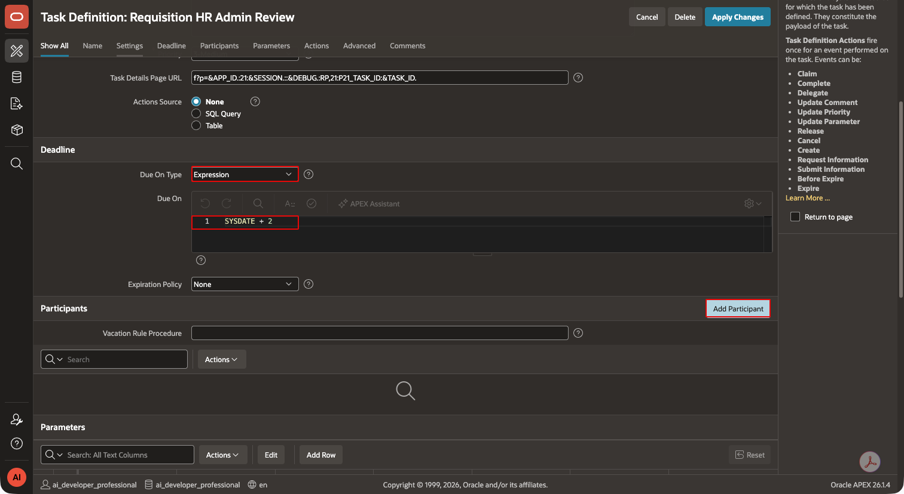
- click Add Participant and configure the below
   | Participant Type | Identity Type | Value Type | SQL Query |
    | --- | --- | --- | --- |
    | Potential Owner | Authorization Scheme |  |  IS_TA_ADMIN |
    
    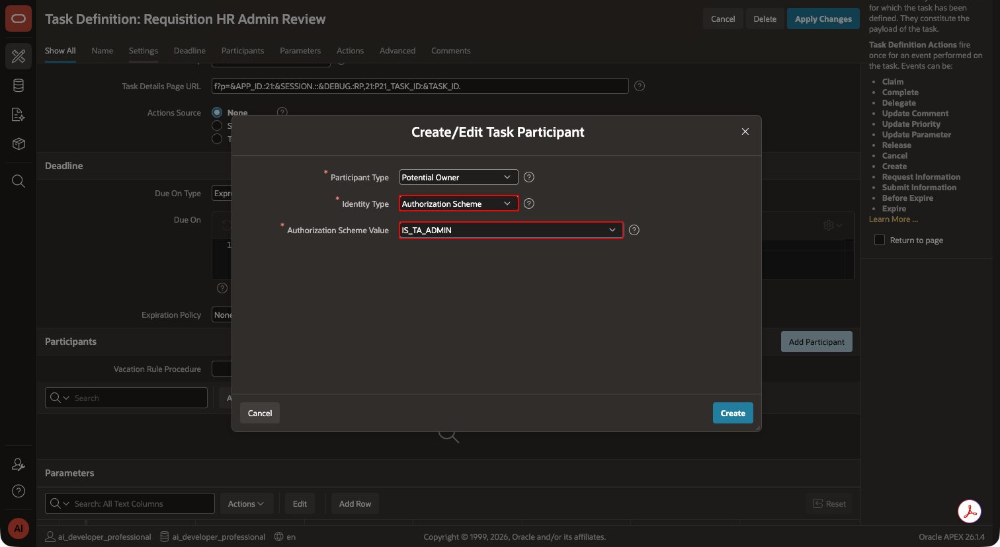
- Add the below task parameters. Use the static IDs shown so the subject substitutions resolve. Task parameters are String values and have readable labels.

    | Static ID | Label | Required | Visible |
    | --- | --- | --- | --- |
    | `P_REQUISITION_ID` | Requisition ID | Yes | Yes |
    | `P_HEADCOUNT` | Requested Headcount | Yes | Yes |
    | `P_JOB_TITLE` | Job Title | Yes | Yes |
    | `P_DEPARTMENT_NAME` | Department Name | Yes | Yes |
    
    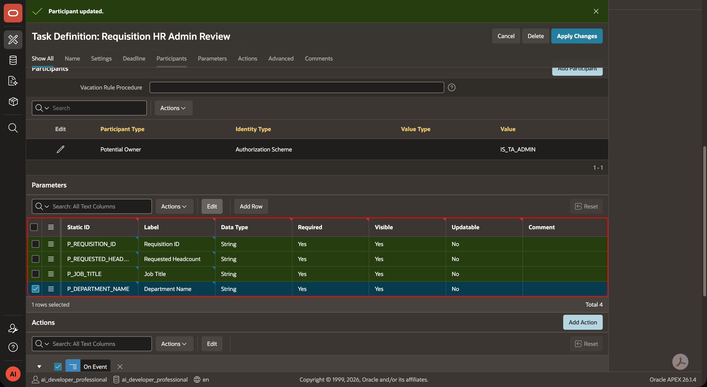

- Keep **Initiator Can Complete** off. Click on **Create Task Details Page** and then save the task definition.

     **Requisition Department Head Review**

    | Field | Value |
    | --- | --- |
    | Name | `Requisition Department Head Review` |
    | Static ID | `approve_job_requisition_department_head` |
    | Type | Approval Task |
    | Priority | Medium |
    | Subject | `Approve Requisition &REQ_ID. for &HEADCOUNT. headcount` |

    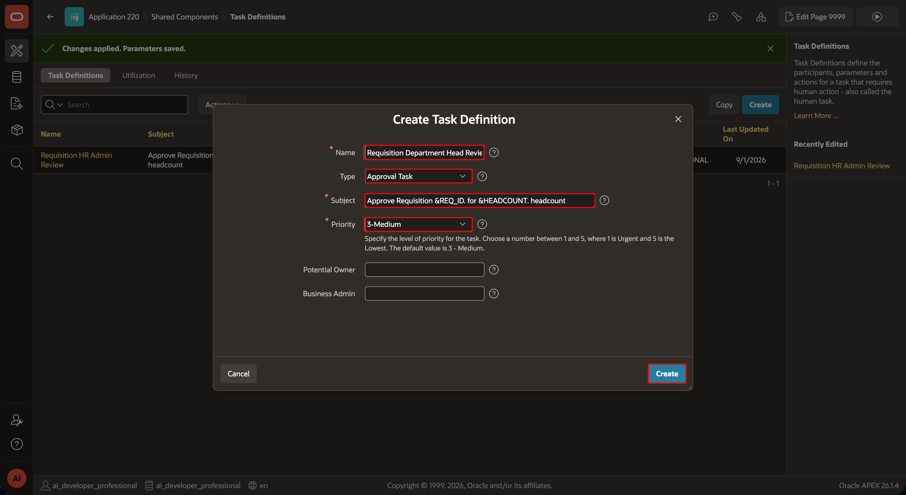
- Click **Create**. On the Task Definition page, click **Add Participant** and configure the Department Head Potential Owner as follows:

    | Participant Type | Identity Type | Value Type | SQL Query |
    | --- | --- | --- | --- |
    | Potential Owner | User | SQL Query | `SELECT e.email FROM tms_employees e JOIN tms_departments d ON d.manager_id = e.employee_id WHERE d.dept_id = (SELECT r.dept_id FROM tms_job_requisitions r WHERE r.req_id = :APEX$TASK_PK)` |

    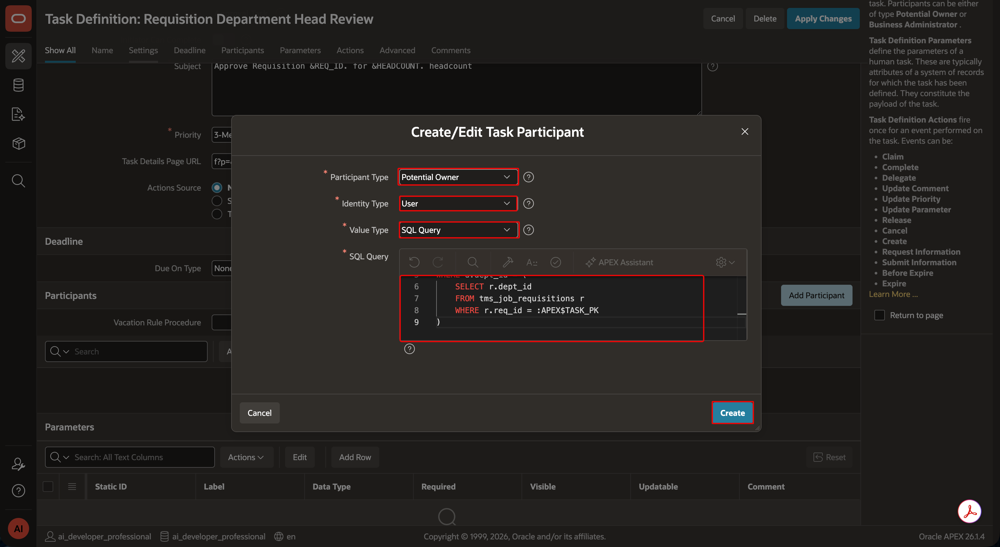
- Add the same task parameters to this definition. Use the static IDs shown so the subject substitutions resolve. Task parameters are String values and have readable labels.

    | Static ID | Label | Required | Visible |
    | --- | --- | --- | --- |
    | `P_REQUISITION_ID` | Requisition ID | Yes | Yes |
    | `P_HEADCOUNT` | Requested Headcount | Yes | Yes |
    | `P_JOB_TITLE` | Job Title | Yes | Yes |
    | `P_DEPARTMENT_NAME` | Department Name | Yes | Yes |

    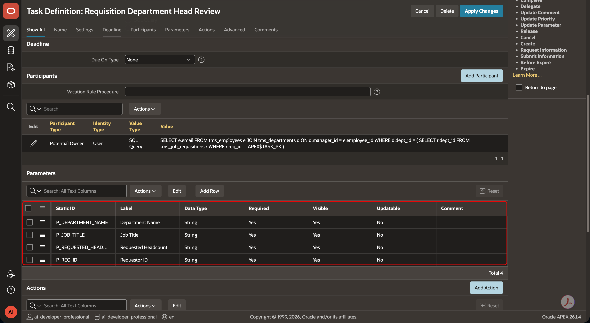
-  Keep **Initiator Can Complete** off. Click on **Create Task Details Page** and then save the task definition.
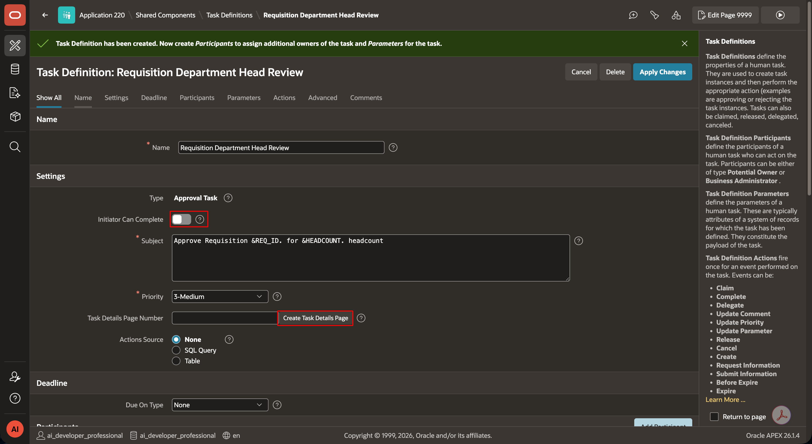
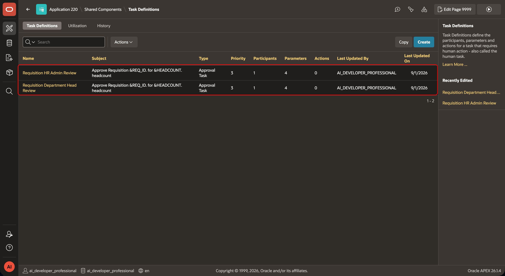

## Task 2: Create the requisition workflow

1. Open **Shared Components**, select **Workflows**, and click **Create**. Set the workflow name to `Approve Job Requisition`. Keep the version in **Development**.

2. Create the required workflow parameter:

    | Static ID | Label | Data Type | Direction | Required |
    | --- | --- | --- | --- | --- |
    | `P_REQUISITION_ID` | Requisition ID | NUMBER | In | Yes |

    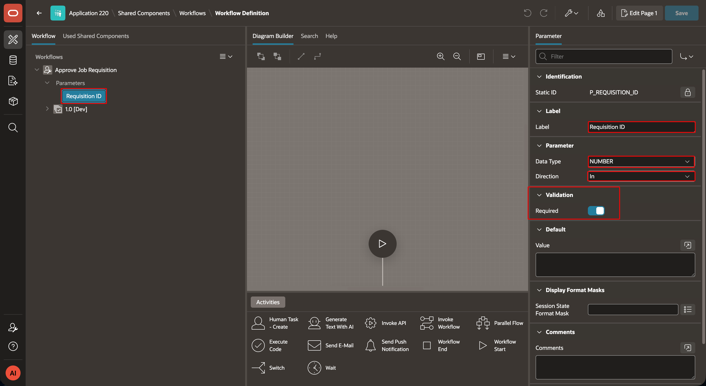
3. Create these workflow variables. Use the `V_` prefix only for version variables whose values can change during the workflow. Add the label shown for each variable.

    | Static ID | Label | Data Type |
    | --- | --- | --- |
    | `V_REQUESTED_HEADCOUNT` | Requested Headcount | NUMBER |
    | `V_DEPARTMENT_ID` | Department ID | NUMBER |
    | `V_REQUESTER_ID` | Requester ID | NUMBER |
    | `V_JOB_TITLE` | Job Title | VARCHAR2 |
    | `V_DEPARTMENT_NAME` | Department Name | VARCHAR2 |

    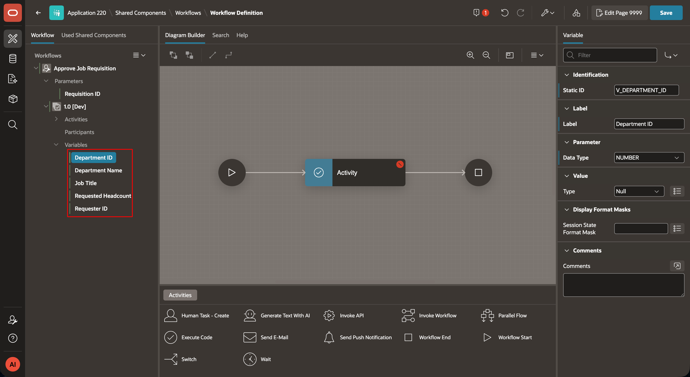

4. In the Workflow Designer, add a **Workflow Start** activity named `Start`. After it, add an **Execute Code** activity named `Load Requisition Details` and enter:

    ```sql
    <copy>
    BEGIN
        SELECT r.headcount,
               r.dept_id,
               r.requested_by,
               j.title,
               d.name
          INTO :V_REQUESTED_HEADCOUNT,
               :V_DEPARTMENT_ID,
               :V_REQUESTER_ID,
               :V_JOB_TITLE,
               :V_DEPARTMENT_NAME
          FROM tms_job_requisitions r
          JOIN tms_jobs j ON j.job_id = r.job_id
          JOIN tms_departments d ON d.dept_id = r.dept_id
         WHERE r.req_id = :P_REQUISITION_ID;
    END;
    </copy>
    ```
    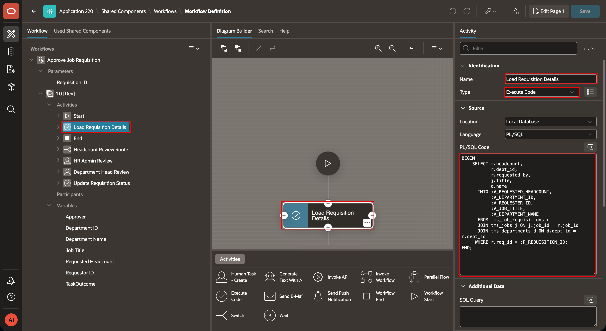

## Task 3: Route and complete the approval

1. Add a **Switch** activity named `Headcount Review Route` after **Load Requisition Details**. Use the below sql to create **True/False** path

   ``` sql
   <copy>
   SELECT CASE
         WHEN headcount > 3 THEN 'TRUE'
         ELSE 'FALSE'
       END
        FROM tms_job_requisitions
        WHERE req_id = :P_REQUISITION_ID
   </copy>
   ```
    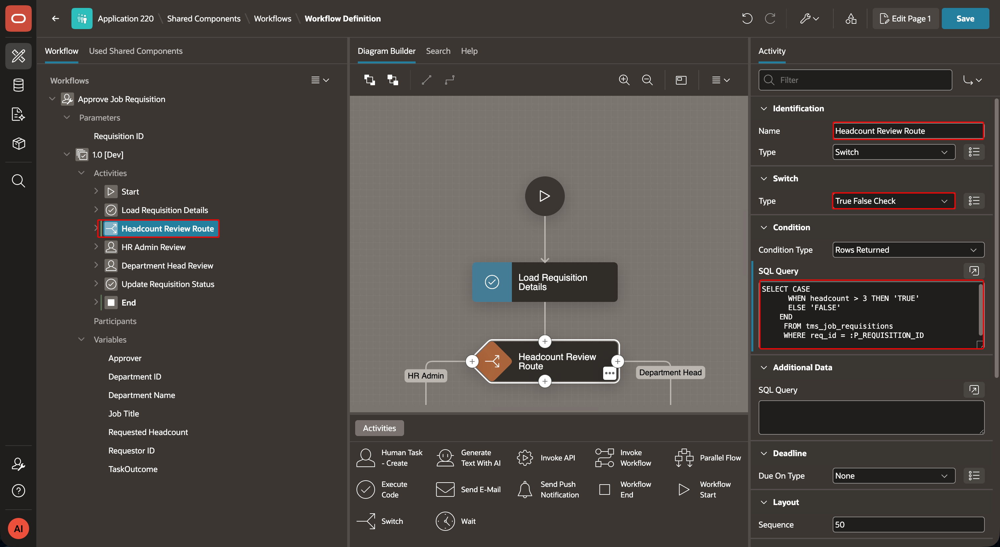

2. On the first route, add a **Human Task - Create** activity named `HR Admin Review`. Select task definition `Requisition HR Admin Review`. Set **Details Primary Key Item** to `P_REQUISITION_ID`. Map Outcome to `TASK_OUTCOME`.

    |Parameters| Value Type | Variable |
    |----|----|----| 
    `Requestor ID` | Item | `V_REQUESTOR_ID`, 
    `Requested Headcount` | Item | `V_REQUESTED_HEADCOUNT`, 
    `Job Title` | Item | `V_JOB_TITLE`,
    `Department Name` | Item | `V_DEPARTMENT_NAME`. 

    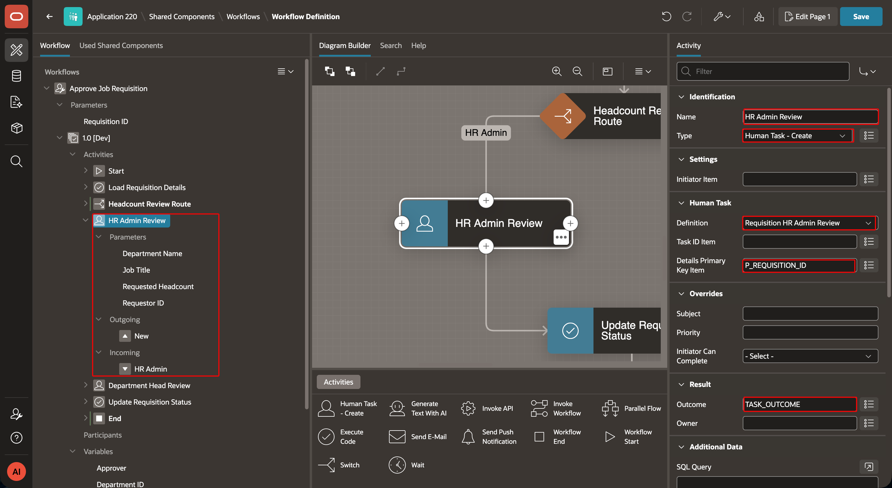

3. On the second route, add `Requisition Department Head Review` using task definition `Requisition Department Head Review`. Set **Details Primary Key Item** to `P_REQUISITION_ID` Map Outcome to `TASK_OUTCOME`. 

    Use the same parameter and result mappings.

    |Parameters| Value Type | Variable |
    |----|----|----| 
    `Requestor ID` | Item | `V_REQUESTOR_ID`, 
    `Requested Headcount` | Item | `V_REQUESTED_HEADCOUNT`, 
    `Job Title` | Item | `V_JOB_TITLE`,
    `Department Name` | Item | `V_DEPARTMENT_NAME`. 

    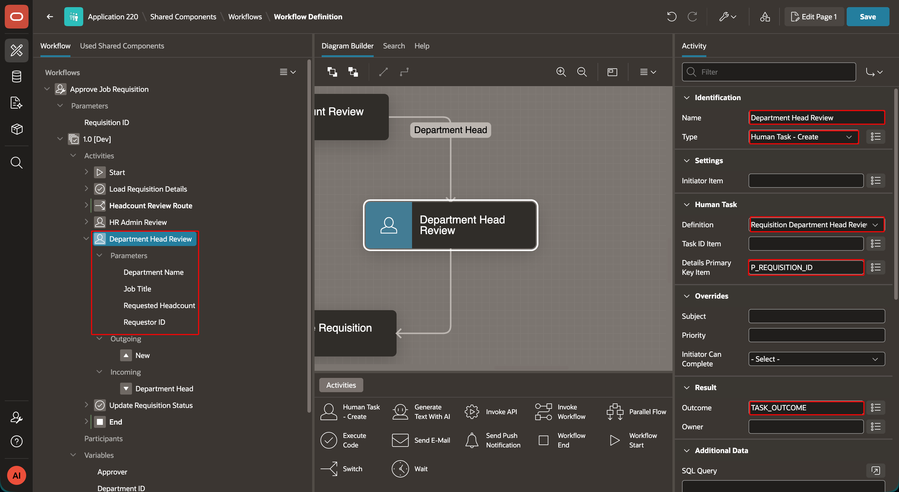

4. Name the connectors from the `Headcount Review Route` by clicking on the conector as `HR Admin` and condition true and clicking on the connector for false condtion and name it as `Department Head`.

    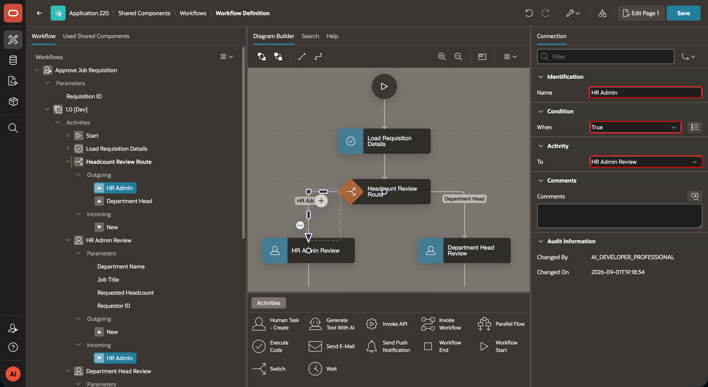
    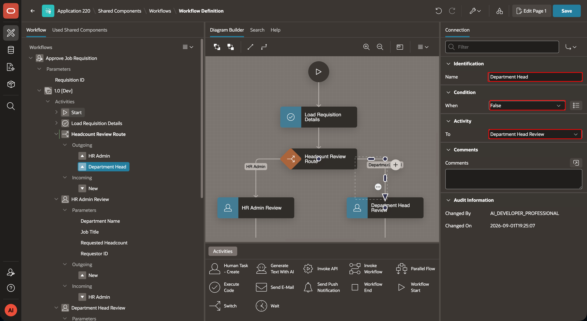

5. Connect both Human Task activities to an **Execute Code** activity named `Update Requisition Status`. Enter:

    ```sql
    <copy>
    BEGIN
        UPDATE tms_job_requisitions
           SET status = CASE UPPER(:TASK_OUTCOME)
                            WHEN 'APPROVED' THEN 'Open'
                            WHEN 'REJECTED' THEN 'Rejected'
                            ELSE status
                        END
         WHERE req_id = :P_REQUISITION_ID;
    END;
    </copy>
    ```

    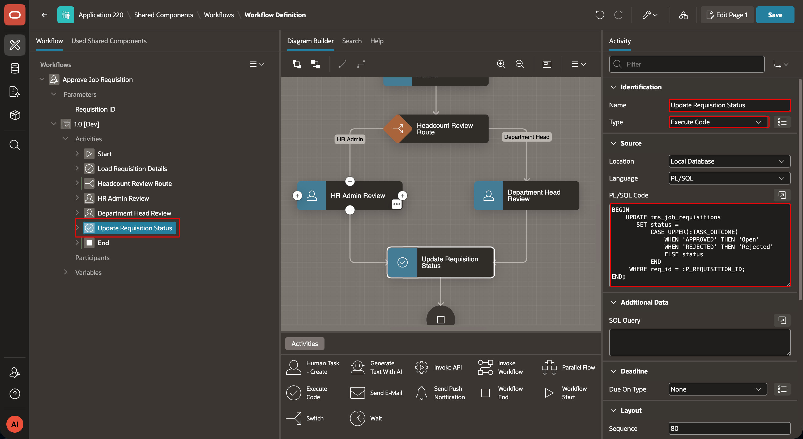

6. Create a Workflow Participant and add the workflow owner as `sofia.garcia@acme.example.`
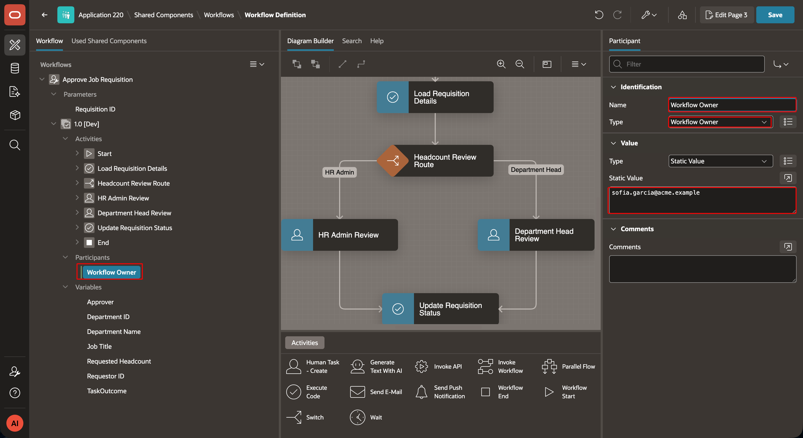

7. Add a **Workflow End** activity named `End`, set its end state to **Completed**, and connect it after **Update Requisition Status**. Save, validate, and activate the workflow version.
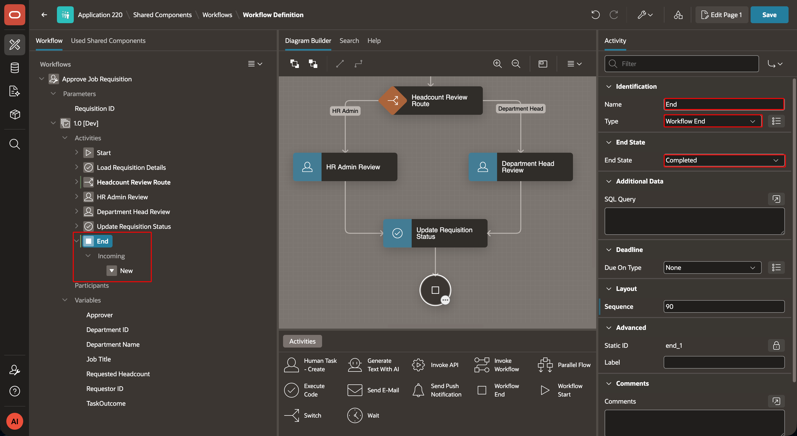
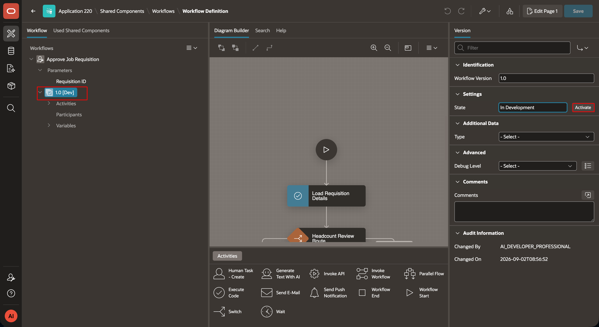

## Task 4: Add task and monitoring pages

1. Create a TAP **Unified Task List** page named `My Approvals`. Set **Task List Context** to **My Tasks** and add the page to the navigation menu.

2. Create a TAP **Unified Task List** page named `Tasks Initiated by Me`. Set **Task List Context** to **Initiated by Me** and add the page to the navigation menu.

2. Create a TAP **Workflow Console** page named `Workflow Console`. Add a navigation entry and protect it with authorization scheme `IS_TA_ADMIN`.

3. Open the existing TAP Job Requisition Form and select **Processing**. After the existing Form DML process, create a Workflow process with **Workflow** set to `Approve Job Requisition` and **Operation** set to **Start**. Map `P_REQUISITION_ID` to the existing `REQ_ID` page item.

4. Add a server-side condition so the process runs only when the requisition status is `Submitted`.

## Task 5: Test both approval routes

1. Run TAP and submit a requisition with headcount `2`. Sign in as that department's department head, open **My Approvals**, open the `Requisition Department Head Review` task, and click **Approve**.

2. Return to the requisition and confirm its status is `Open`. As `sofia.garcia@acme.example`, open **Workflow Console** and confirm the instance is completed.

3. Submit another requisition with headcount `5`. Sign in as a TA administrator who is a potential owner, open **My Approvals**, and claim `Requisition HR Admin Review` if required. Approve or reject it.

4. Verify an approval sets `TMS_JOB_REQUISITIONS.STATUS` to `Open` and a rejection sets it to `Rejected`. Confirm the workflow instance is completed in **Workflow Console**.

## Acknowledgements

- **Author -** Aravind Madhavan, Senior Product Manager.
- **Last Updated By/Date** - Aravind Madhavan, Senior Product Manager, August 2026
