# ESS Employee Onboarding Workflow

## Introduction

Create an ESS onboarding workflow with parallel HR document and department orientation tasks. APEX continues after both Human Task activities complete. It then sends the new employee a welcome email.

Estimated Time: 45 minutes

### Objectives

- Create action task definitions for HR and the department manager.
- Create a parallel APEX workflow that loads employee data and waits for both tasks.
- Start, complete, and monitor an onboarding instance.

## Task 1: Create the task definitions

1. In ESS, open **Shared Components**, select **Task Definitions**, and click **Create**. Create the HR documents task definition. Use these values:
     
     **New Employee HR Documents**
    | Field | Value |
    | --- | --- |
    | Name | `New Employee HR Documents` |
    | Type | Action Task |
    | Priority | Medium |
    | Subject | `Complete HR documents for &P_EMPLOYEE_NAME.` |
    
    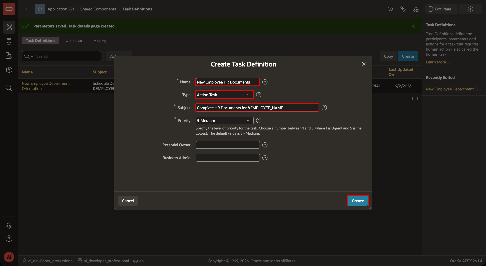

    - Click **Create**. On the Task Definition page, click **Add Participant**. Configure the HR Documents Potential Owner as follows:

    | Participant Type | Identity Type | Value Type | Authorization Scheme |
    | --- | --- | --- | --- |
    | Potential Owner | Authorization Scheme |  | `IS_HR_ADMIN` |

    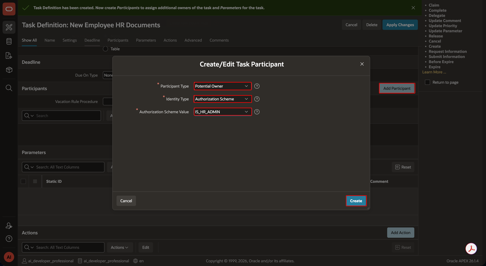

    - Add these task parameters. Set the data type to **String**. Set each parameter to **Required** and **Visible**.

    | Static ID | Label | Required | Visible |
    | --- | --- | --- | --- |
    | `EMPLOYEE_ID` | Employee ID | Yes | Yes |
    | `EMPLOYEE_NAME` | Employee Name | Yes | Yes |
    | `START_DATE` | Start Date | Yes | Yes |

    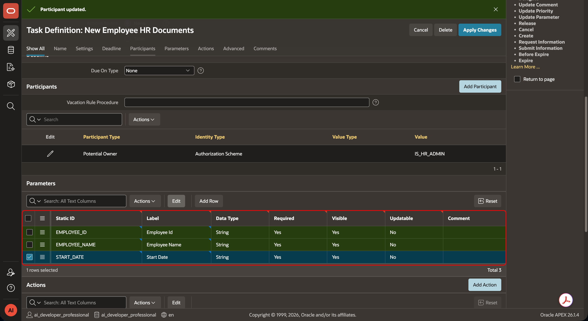

    - Click **Create Task Details Page**. Save the task definition.

    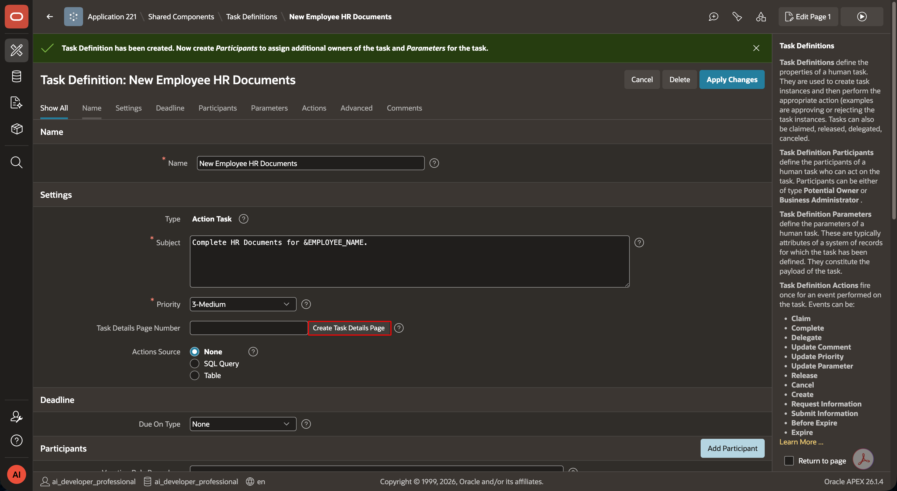

    **New Employee Department Orientation**

    | Field | Value |
    | --- | --- |
    | Name | `New Employee Department Orientation` |
    | Type | Action Task |
    | Priority | Medium |
    | Subject | `Schedule department orientation for &P_EMPLOYEE_NAME.` |

    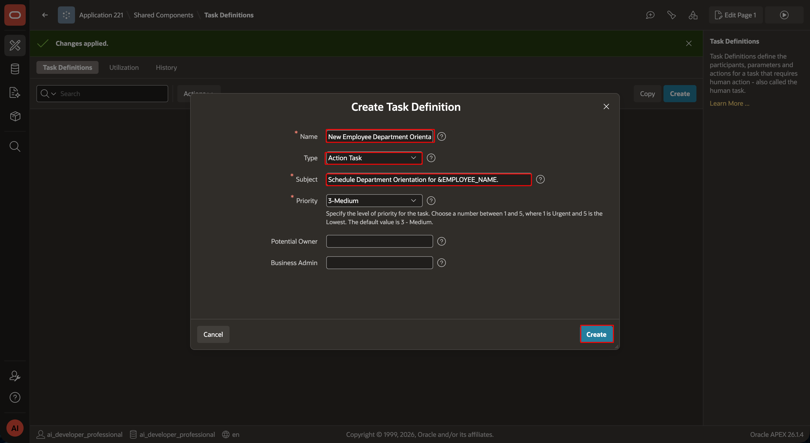

    - Click **Create**. On the Task Definition page, click **Add Participant**. Configure the Department Orientation Potential Owner as follows:

    | Participant Type | Identity Type | Value Type | Task Parameter |
    | --- | --- | --- | --- |
    | Potential Owner | User | Static | `&DEPARTMENT_MANAGER.` |

    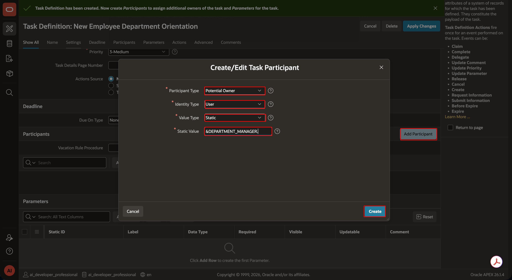

    - Add these task parameters. Set the data type to **String**. Set each parameter to **Required** and **Visible**.

    | Static ID | Label | Required | Visible |
    | --- | --- | --- | --- |
    | `EMPLOYEE_ID` | Employee ID | Yes | Yes |
    | `EMPLOYEE_NAME` | Employee Name | Yes | Yes |
    | `START_DATE` | Start Date | Yes | Yes |
    | `DEPARTMENT_MANAGER` | Department Manager | Yes | Yes |

    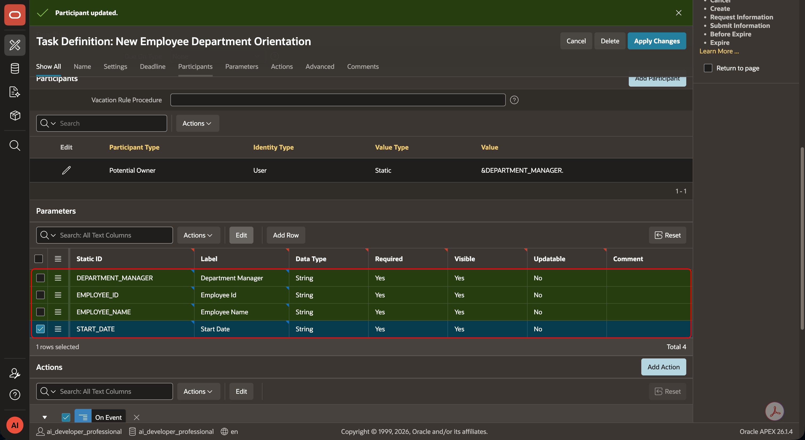

    - Click **Create Task Details Page**. Save the task definition.
    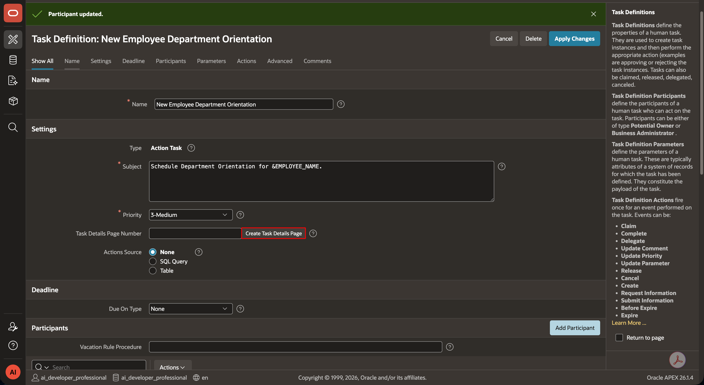


## Task 2: Create the Onboard New Employee workflow

1. In ESS Shared Components, create workflow `Onboard New Employee` with static ID `onboard_new_employee`. Keep the version in **Development**.
    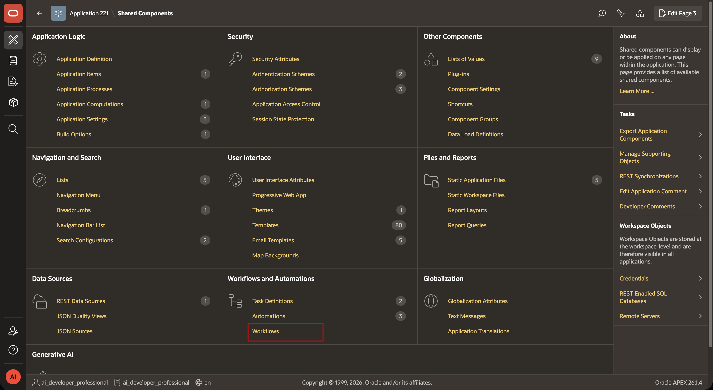

2. Create the required workflow parameter with **Direction** set to **In**.

    | Static ID | Label | Data Type | Required |
    | --- | --- | --- | --- |
    | `V_EMPLOYEE_ID` | Employee ID | NUMBER | Yes |

    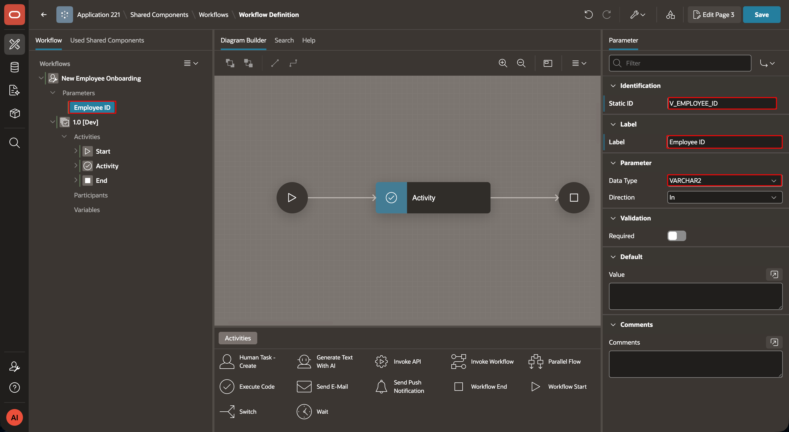

3. Create these version variables. The `V_` prefix identifies values that can change at runtime.

    | Static ID | Label | Data Type |
    | --- | --- | --- |
    | `V_EMPLOYEE_NAME` | Employee Name | VARCHAR2 |
    | `V_EMPLOYEE_EMAIL` | Employee Email | VARCHAR2 |
    | `V_START_DATE` | Start Date | TIMESTAMP |
    | `V_DEPARTMENT_NAME` | Department Name | VARCHAR2 |
    | `V_DEPARTMENT_MANAGER` | Department Manager | VARCHAR2 |

    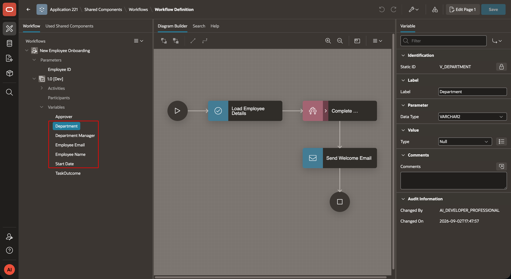

4. Add a **Workflow Start** activity named `Start`. Add an **Execute Code** activity named `Load Employee Details`. Enter this code:

    ```sql
    <copy>
    BEGIN
        SELECT e.first_name || ' ' || e.last_name,
               e.email,
               e.hire_date,
               d.name,
               mgr.email
          INTO :V_EMPLOYEE_NAME,
               :V_EMPLOYEE_EMAIL,
               :V_START_DATE,
               :V_DEPARTMENT_NAME,
               :V_DEPARTMENT_MANAGER
          FROM tms_employees e
          LEFT JOIN tms_departments d ON d.dept_id = e.dept_id
          LEFT JOIN tms_employees mgr ON mgr.employee_id = d.manager_id
         WHERE e.employee_id = :P_EMPLOYEE_ID;
    END;
    </copy>
    ```

    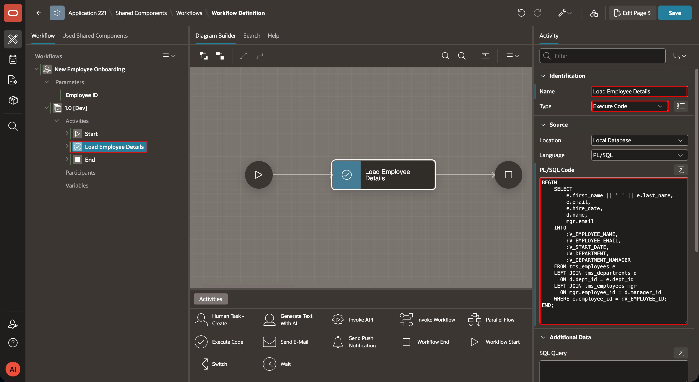

5. Add a **Parallel Flow** after the code activity. Name it `Complete Onboarding Setup`. Name its branches `HR Documents` and `Department Orientation`. APEX continues after both branches complete.

## Task 3: Configure the parallel activities and email

1. In the `Complete HR Documents` branch, add a **Human Task - Create** activity named `HR Documents`. Select the matching task definition. Configure the parameter mappings:

    | Parameter | Value Type | Variable |
    | --- | --- | --- |
    | `EMPLOYEE_ID` | Item | `V_EMPLOYEE_ID` |
    | `EMPLOYEE_NAME` | Item | `V_EMPLOYEE_NAME` |
    | `START_DATE` | Item | `V_START_DATE` |

    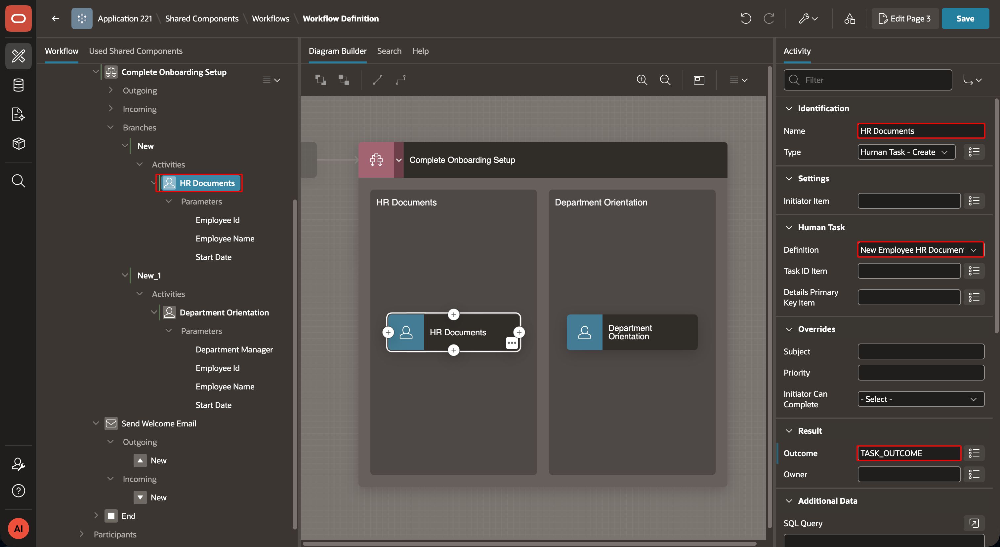

2. In the `Schedule Department Orientation` branch, add a **Human Task - Create** activity named `Schedule New Employee Department Orientation`. Select the matching task definition. Configure the parameter mappings:

    | Parameter | Value Type | Variable |
    | --- | --- | --- |
    | `EMPLOYEE_ID` | Item | `P_EMPLOYEE_ID` |
    | `EMPLOYEE_NAME` | Item | `V_EMPLOYEE_NAME` |
    | `START_DATE` | Item | `V_START_DATE` |
    | `DEPARTMENT_MANAGER` | Item | `V_DEPARTMENT_MANAGER` |

    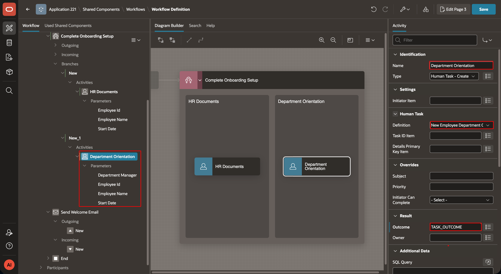

3. Collapse the Parallel Flow. Add a **Send Email** activity named `Send Welcome Email`. Select the existing welcome email template. Set recipient to `V_EMPLOYEE_EMAIL`, then map these placeholders:

    | Placeholder | Value |
    | --- | --- |
    | `EMPLOYEE_NAME` | `&V_EMPLOYEE_NAME.` |
    | `START_DATE` | `&V_START_DATE.` |
    | `DEPT_NAME` | `&V_DEPARTMENT.` |
    | `MANAGER_NAME`| `&V_DEPARTMENT_MANAGER.` |

    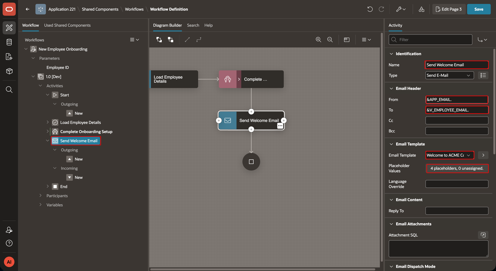

4. Create a workflow participant for the workflow owner.
    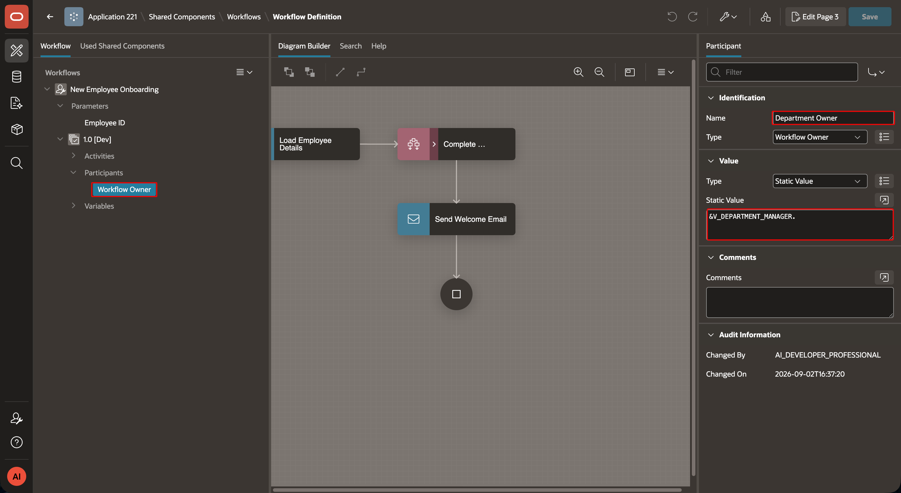

5. Add a **Workflow End** activity named `End` after the email. Set its end state to **Completed**. Save and activate the workflow.
    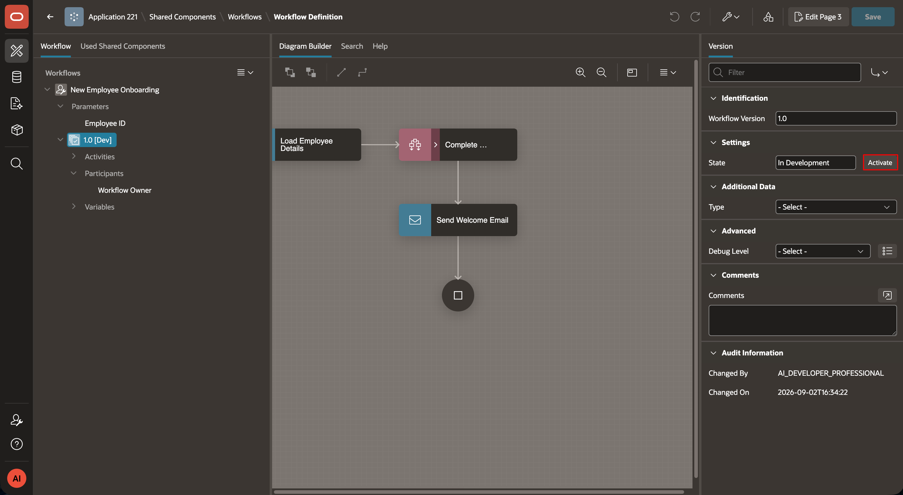

## Task 4: Add the inbox, console, and start page

1. Create an ESS **Unified Task List** page named `My Workflow Tasks`. Set **Report Context** to **My Tasks**. Add the page to ESS navigation.
    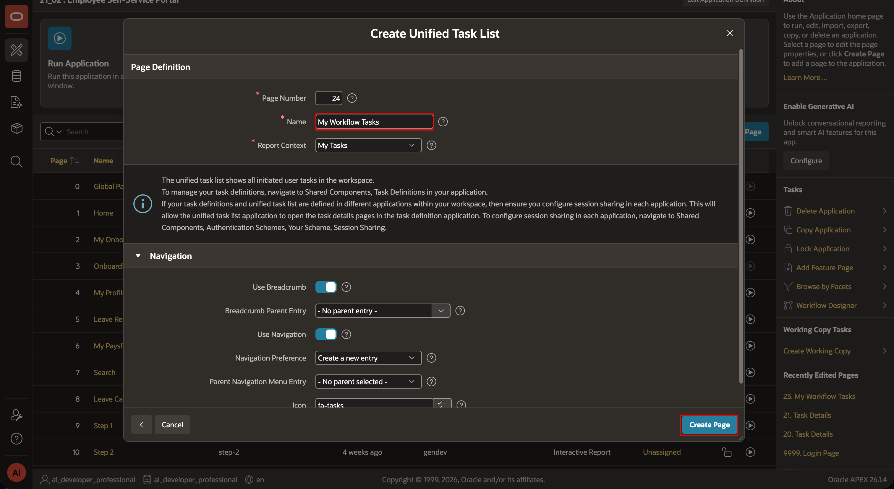

2. Create a **Workflow Console** page for instances that the signed-in user initiated.
    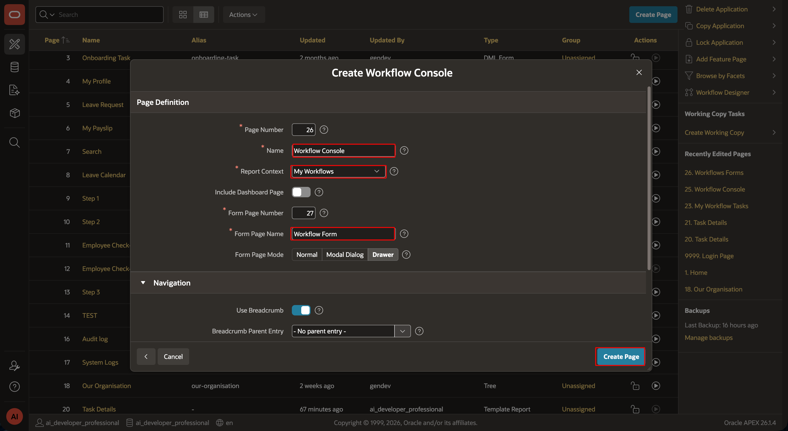

3. Create a blank ESS page named `Start Employee Onboarding`. Protect it with `IS_HR_ADMIN`. Add select-list item `PXX_EMPLOYEE_ID`, where `XX` is your page number. Use this LOV:

    ```sql
    <copy>
    SELECT first_name || ' ' || last_name AS display_value,
           employee_id AS return_value
      FROM tms_employees
     WHERE status = 'Active'
     ORDER BY first_name, last_name
    </copy>
    ```
    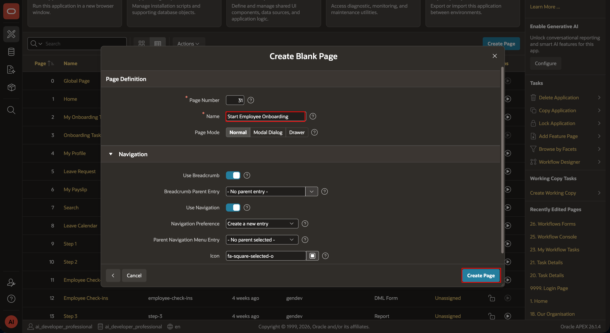
    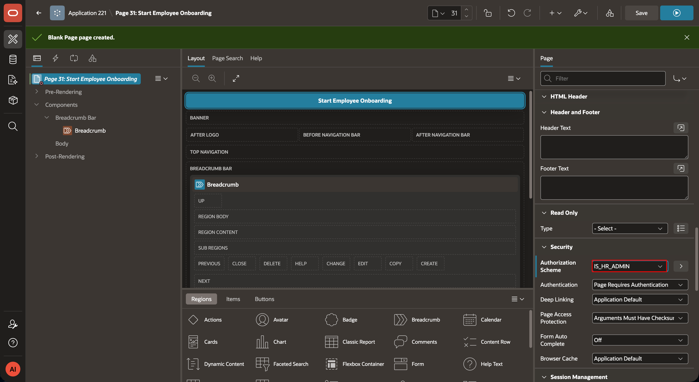
    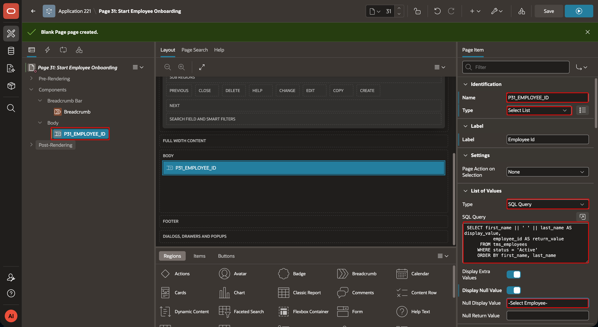


4. Add button `START_ONBOARDING` with label **Start Onboarding**. Add a process to start workflow `Onboard New Employee`. Map `P_EMPLOYEE_ID` to `PXX_EMPLOYEE_ID`.
    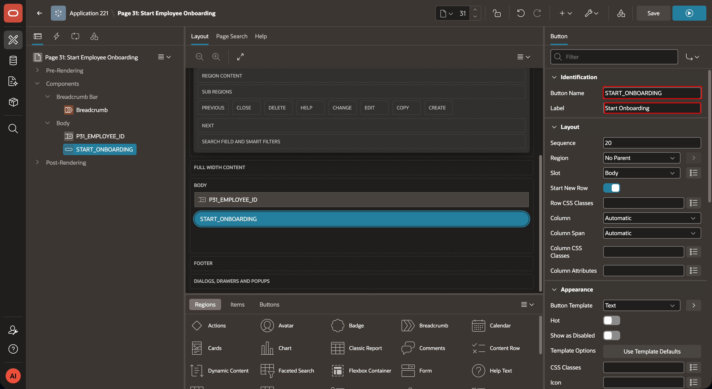
    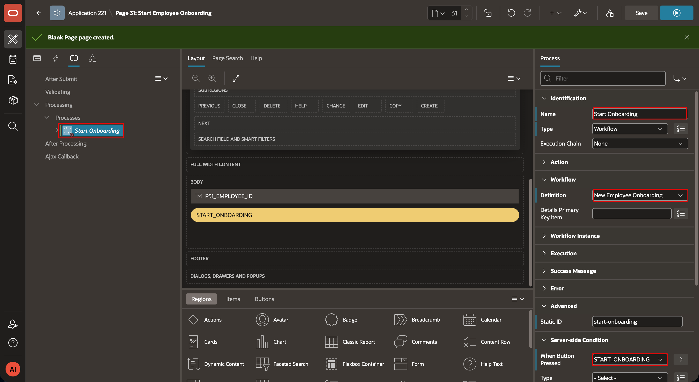
    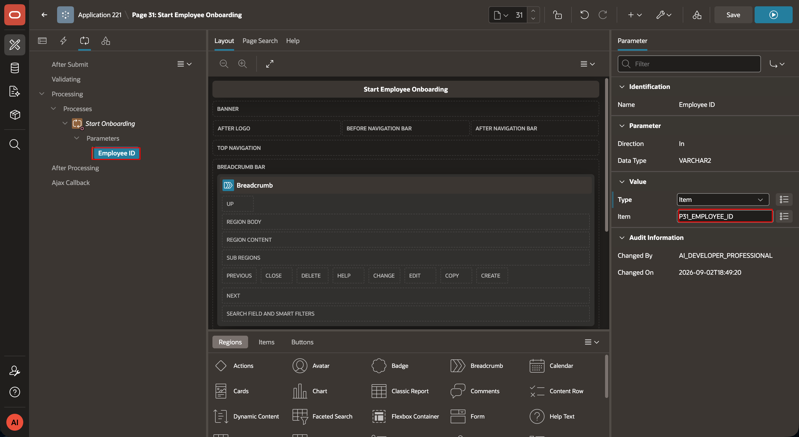


## Task 5: Test parallel completion

1. Run ESS as an HR administrator. Open **Start Employee Onboarding**, select an employee, and click **Start Onboarding**.

2. Open **My Workflow Tasks**. Confirm that both tasks exist. Complete only **Complete New Employee HR Documents**. Confirm that the workflow remains active and the welcome email was not sent.

3. Sign in as the department manager for the selected employee. Open **My Workflow Tasks**. Complete **Schedule New Employee Department Orientation**.

4. Confirm that the Parallel Flow completes. Confirm that **Send Welcome Email** runs. Verify **Completed** status in the Workflow Console.

## Acknowledgements

- **Author -** Aravind Madhavan, Senior Product Manager.
- **Last Updated By/Date** - Aravind Madhavan, Senior Product Manager, August 2026
