# Lab 2: ESS Employee Onboarding Workflow

## Introduction

Create an ESS onboarding workflow with parallel HR document and department orientation tasks. APEX continues after both **Human Task - Create** activities complete. It then sends the new employee a welcome email.

Estimated Workshop Time: 45 minutes

### Objectives

- Create action task definitions for HR and the department manager.
- Create a parallel APEX workflow that loads employee data and waits for both tasks.
- Start, complete, and monitor an onboarding instance.

## Task 1: Create the task definitions

1. In ESS, open **Shared Components**, select **Task Definitions**, and click **Create**. Set up the Department Orientation task definition with these values:

    | Field | Value |
    | --- | --- |
    | Name | `New Employee Department Orientation` |
    | Type | Action Task |
    | Priority | Medium |
    | Subject | `Schedule department orientation for &EMPLOYEE_NAME.` |

    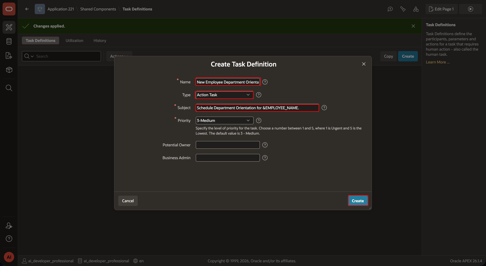

2. Click **Create** to save the definition. On the Task Definition page, click **Add Participant** and configure the Department Orientation Potential Owner:

    | Participant Type | Identity Type | Value Type | Task Parameter |
    | --- | --- | --- | --- |
    | Potential Owner | User | Static | `&DEPARTMENT_MANAGER.` |

    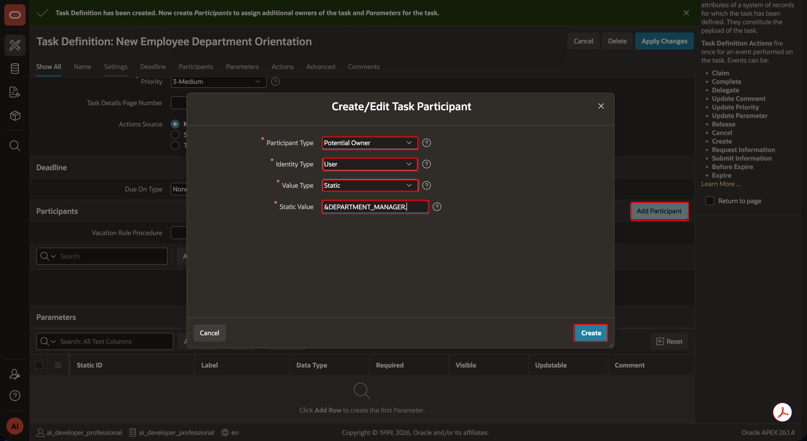

3. Add these task parameters. Set each data type to **String**, and set each parameter to **Required** and **Visible**.

    | Static ID | Label | Required | Visible |
    | --- | --- | --- | --- |
    | `EMPLOYEE_ID` | Employee ID | Yes | Yes |
    | `EMPLOYEE_NAME` | Employee Name | Yes | Yes |
    | `START_DATE` | Start Date | Yes | Yes |
    | `DEPARTMENT_MANAGER` | Department Manager | Yes | Yes |

    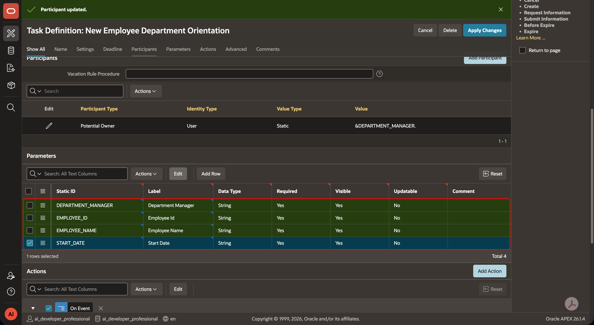

4. Click **Create Task Details Page**, then save the Department Orientation task definition.
    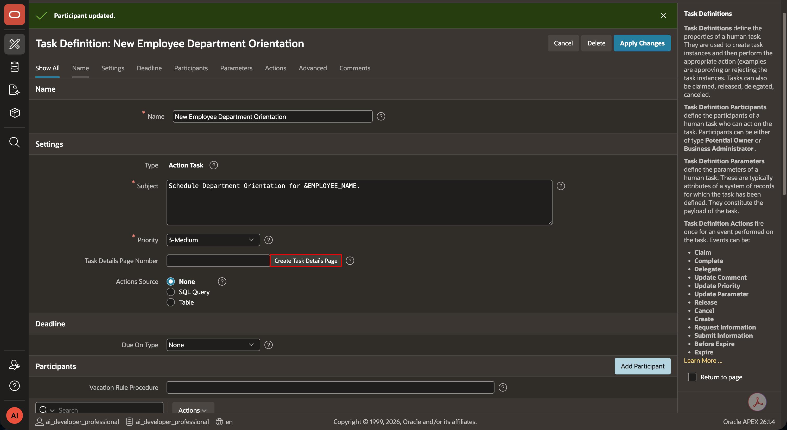

5. In **Task Definitions**, click **Create**. Set up the HR documents task definition with these values:

    | Field | Value |
    | --- | --- |
    | Name | `New Employee HR Documents` |
    | Type | Action Task |
    | Priority | Medium |
    | Subject | `Complete HR documents for &EMPLOYEE_NAME.` |

    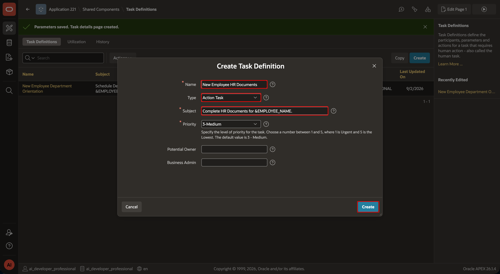

6. Click **Create** to save the definition. On the Task Definition page, click **Add Participant** and configure the HR Documents Potential Owner:

    | Participant Type | Identity Type | Authorization Scheme |
    | --- | --- | --- |
    | Potential Owner | Authorization Scheme | `IS_HR_ADMIN` |

    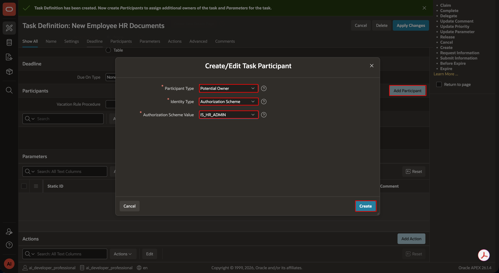

7. Add these task parameters. Set each data type to **String**, and set each parameter to **Required** and **Visible**.

    | Static ID | Label | Required | Visible |
    | --- | --- | --- | --- |
    | `EMPLOYEE_ID` | Employee ID | Yes | Yes |
    | `EMPLOYEE_NAME` | Employee Name | Yes | Yes |
    | `START_DATE` | Start Date | Yes | Yes |

    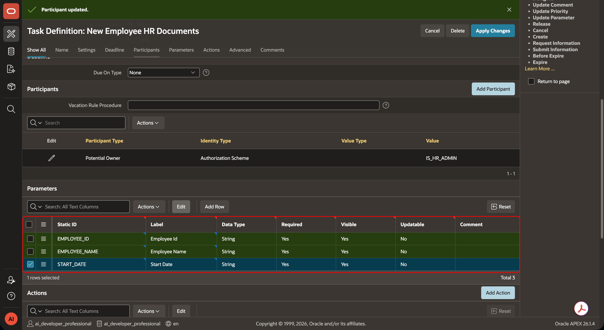

8. Click **Create Task Details Page**, then save the HR Documents task definition.
    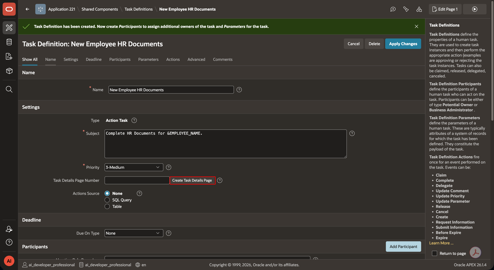


## Task 2: Create the Onboard New Employee workflow

1. In ESS, open **Shared Components** and select **Workflows**.
    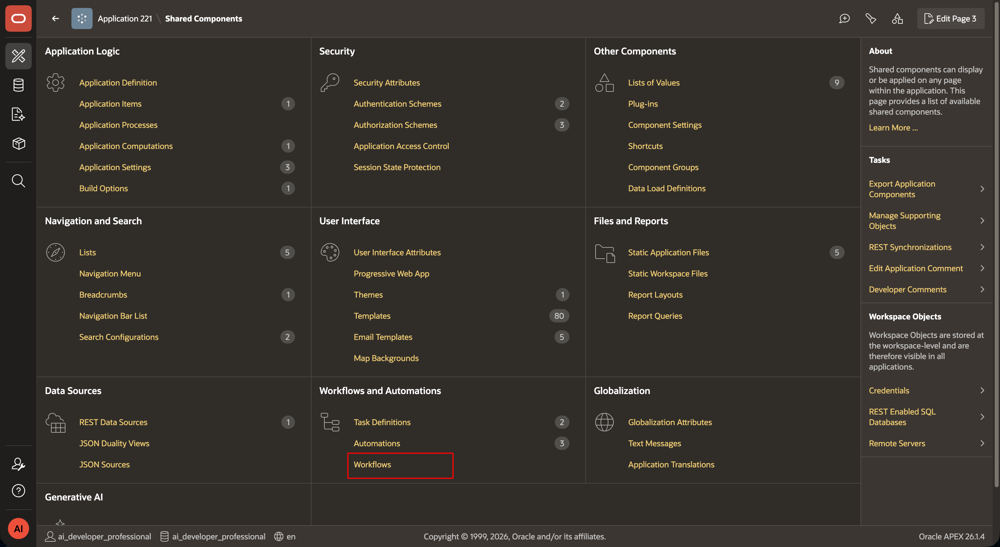

2. Click **Create**. Name the workflow `Onboard New Employee`, set its static ID to `onboard_new_employee`, and keep the version in **Development**.

3. Create the workflow parameter. Set **Direction** to **In** and leave **Required** off.

    | Static ID | Label | Data Type | Direction | Required |
    | --- | --- | --- | --- | --- |
    | `V_EMPLOYEE_ID` | Employee ID | VARCHAR2 | In | No |

    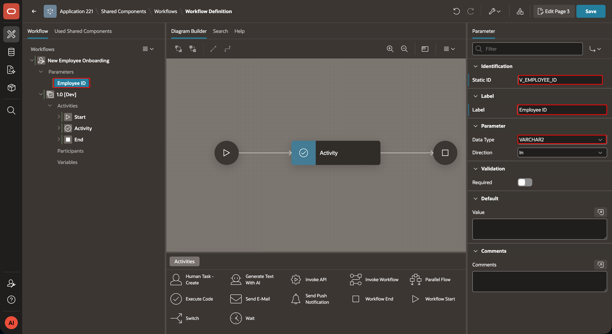

4. Create these version variables. The `V_` prefix identifies values that can change at runtime.

    | Static ID | Label | Data Type |
    | --- | --- | --- |
    | `V_EMPLOYEE_NAME` | Employee Name | VARCHAR2 |
    | `V_EMPLOYEE_EMAIL` | Employee Email | VARCHAR2 |
    | `V_START_DATE` | Start Date | TIMESTAMP |
    | `V_DEPARTMENT` | Department | VARCHAR2 |
    | `V_DEPARTMENT_MANAGER` | Department Manager | VARCHAR2 |

    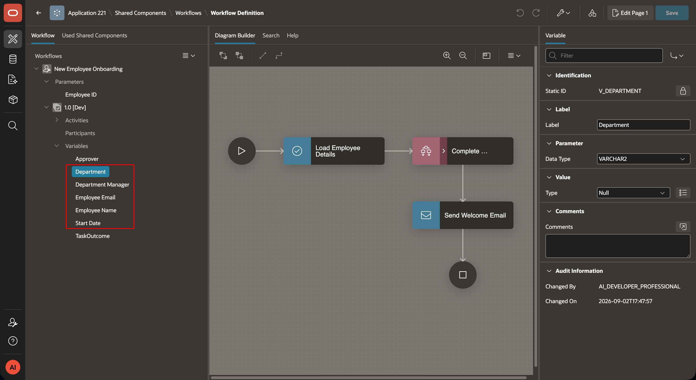

5. In Workflow Designer, add a **Workflow Start** activity named `Start`.

6. Add an **Execute Code** activity named `Load Employee Details`. Enter this code:

    ```sql
    <copy>
    BEGIN
        SELECT e.first_name || ' ' || e.last_name,
               e.email,
               e.hire_date,
               d.name,
               mgr.email
          INTO :V_EMPLOYEE_NAME,
               :V_EMPLOYEE_EMAIL,
               :V_START_DATE,
               :V_DEPARTMENT,
               :V_DEPARTMENT_MANAGER
          FROM tms_employees e
          LEFT JOIN tms_departments d ON d.dept_id = e.dept_id
          LEFT JOIN tms_employees mgr ON mgr.employee_id = d.manager_id
         WHERE e.employee_id = :V_EMPLOYEE_ID;
    END;
    </copy>
    ```

    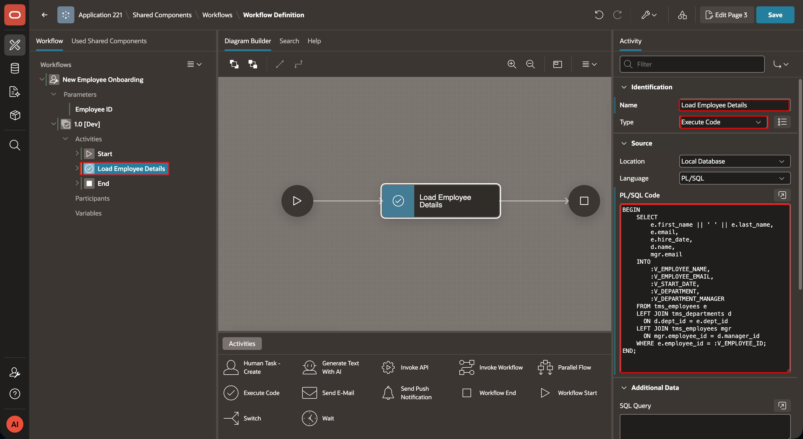

7. Add a **Parallel Flow** named `Complete Onboarding Setup` after the code activity. The flow creates two branches, and APEX continues after both branches complete.

## Task 3: Configure the parallel activities and email

1. In the first Parallel Flow branch, add a **Human Task - Create** activity named `HR Documents`. Select task definition `New Employee HR Documents`. Set **Outcome** to `TASK_OUTCOME` and configure the parameter mappings:

    | Parameter | Value Type | Variable |
    | --- | --- | --- |
    | `EMPLOYEE_ID` | Item | `V_EMPLOYEE_ID` |
    | `EMPLOYEE_NAME` | Item | `V_EMPLOYEE_NAME` |
    | `START_DATE` | Item | `V_START_DATE` |

    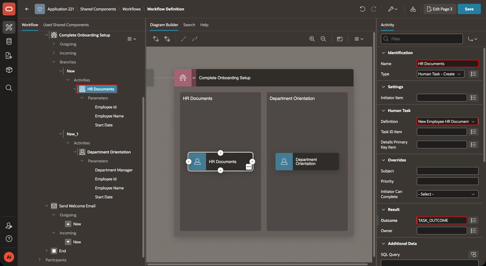

2. In the second Parallel Flow branch, add a **Human Task - Create** activity named `Department Orientation`. Select task definition `New Employee Department Orientation`. Set **Outcome** to `TASK_OUTCOME` and configure the parameter mappings:

    | Parameter | Value Type | Variable |
    | --- | --- | --- |
    | `EMPLOYEE_ID` | Item | `V_EMPLOYEE_ID` |
    | `EMPLOYEE_NAME` | Item | `V_EMPLOYEE_NAME` |
    | `START_DATE` | Item | `V_START_DATE` |
    | `DEPARTMENT_MANAGER` | Item | `V_DEPARTMENT_MANAGER` |

    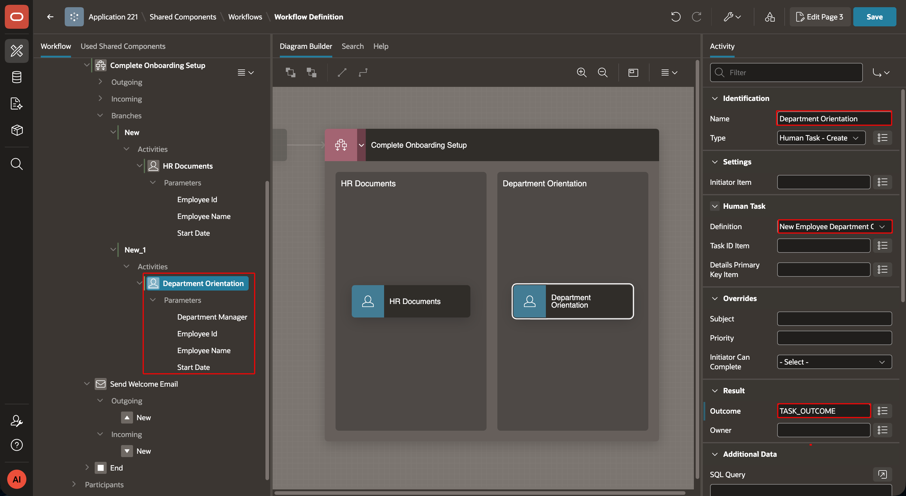

3. Collapse the Parallel Flow. Add a **Send E-Mail** activity named `Send Welcome Email`. Set **From** to `&APP_EMAIL.` and **To** to `&V_EMPLOYEE_EMAIL.`. Select the `Welcome to Acme Corp` email template, then map these placeholders:

    | Placeholder | Value |
    | --- | --- |
    | `EMPLOYEE_NAME` | `&V_EMPLOYEE_NAME.` |
    | `START_DATE` | `&V_START_DATE.` |
    | `DEPT_NAME` | `&V_DEPARTMENT.` |
    | `MANAGER_NAME`| `&V_DEPARTMENT_MANAGER.` |

    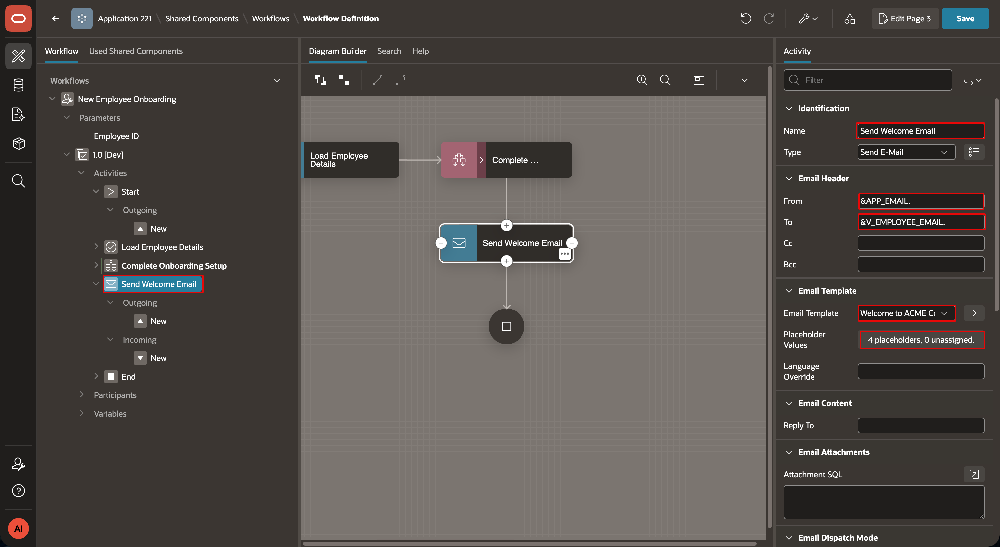

4. Create a workflow participant for the workflow owner.

    | Name | Value Type | Value |
    | --- | --- | --- |
    | Department Owner | Static Value | `&V_DEPARTMENT_MANAGER.` |

    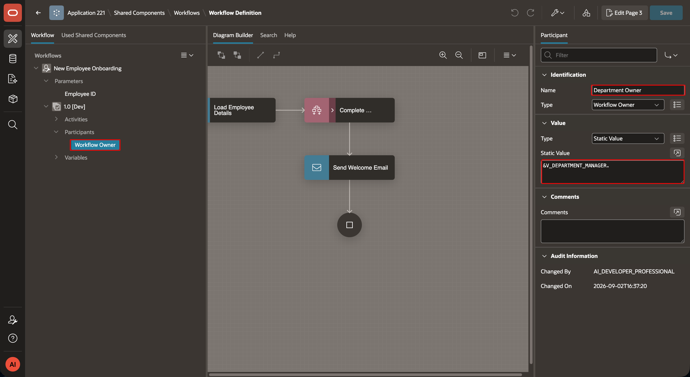

5. Add a **Workflow End** activity named `End` after the email and set its end state to **Completed**.

6. Save and activate the workflow.
    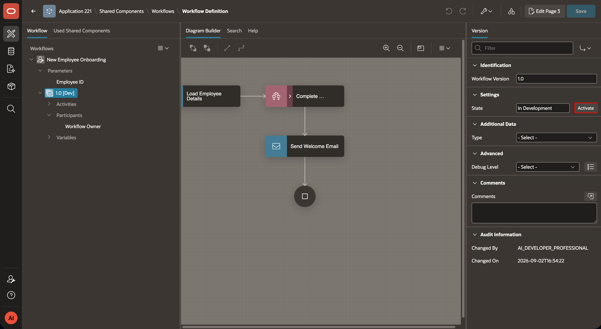

## Task 4: Add the inbox, console, and start page

1. Create an ESS **Unified Task List** page named `My Workflow Tasks`. Set **Report Context** to **My Tasks**. Add the page to ESS navigation.
    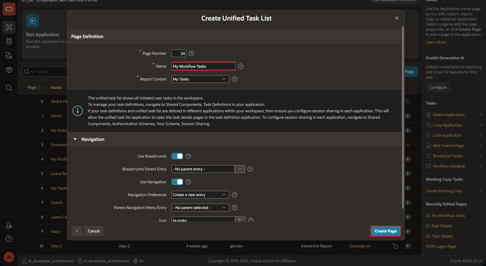

2. Create a **Workflow Console** page named `Workflow Console`. Set **Report Context** to **My Workflows**, leave **Include Dashboard Page** off, and enable navigation.
    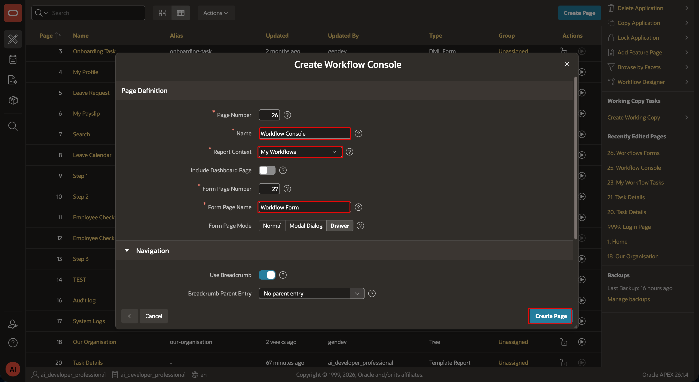

3. Create a blank ESS page named `Start Employee Onboarding`.
    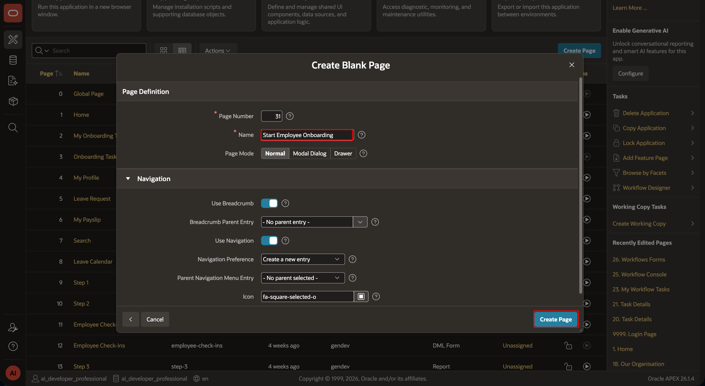

4. In Page Designer, protect the page with authorization scheme `IS_HR_ADMIN`.
    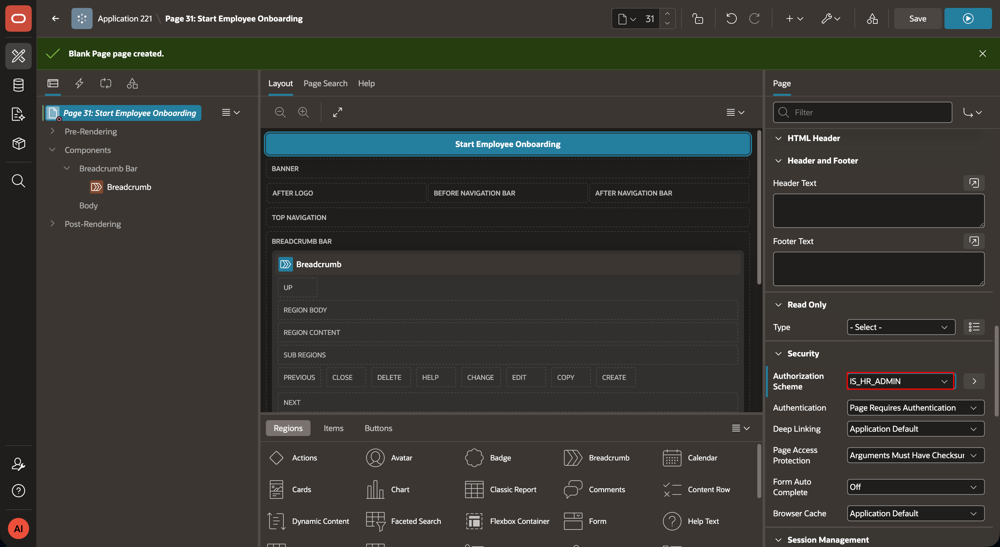

5. Add select-list item `PXX_EMPLOYEE_ID`, where `XX` is your page number. Use this LOV:

    ```sql
    <copy>
    SELECT first_name || ' ' || last_name AS display_value,
           employee_id AS return_value
      FROM tms_employees
     WHERE status = 'Active'
     ORDER BY first_name, last_name
    </copy>
    ```
    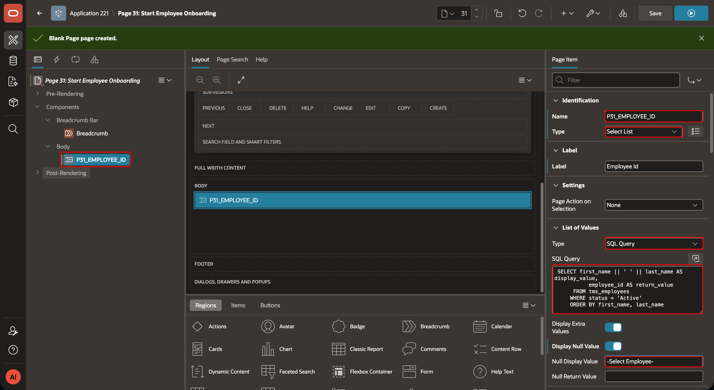


6. Add button `START_ONBOARDING` with label **Start Onboarding**.
    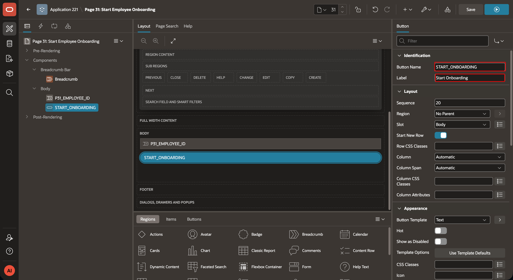

7. Add a **Workflow** process that starts `Onboard New Employee`.
    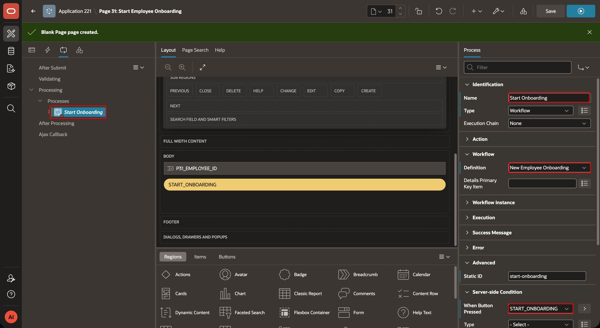

8. Under **Parameters**, select **Employee ID** and map `V_EMPLOYEE_ID` to `PXX_EMPLOYEE_ID`.
    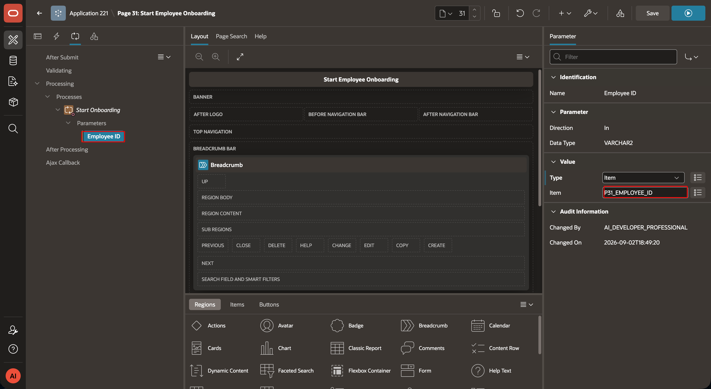


## Task 5: Test parallel completion

1. Run ESS as an HR administrator. Open **Start Employee Onboarding**, select an employee, and click **Start Onboarding**.

2. Open **My Workflow Tasks**. Confirm that both tasks exist. Complete only **HR Documents**. Confirm that the workflow remains active and the welcome email was not sent.

3. Sign in as the department manager for the selected employee. Open **My Workflow Tasks**. Complete **Department Orientation**.

4. Confirm that the Parallel Flow completes. Confirm that **Send Welcome Email** runs. Verify **Completed** status in the Workflow Console.

## Acknowledgements

- **Author -** Aravind Madhavan, Senior Product Manager.
- **Last Updated By/Date** - Aravind Madhavan, Senior Product Manager, August 2026
