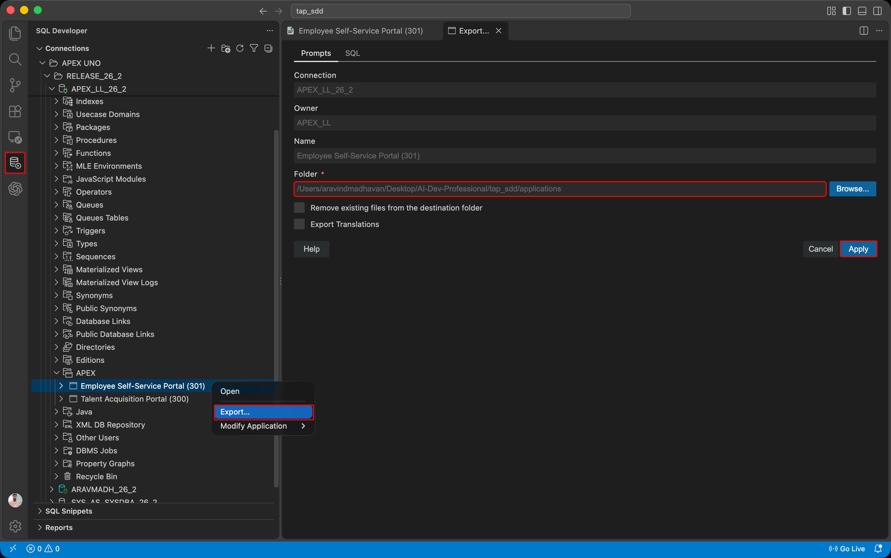
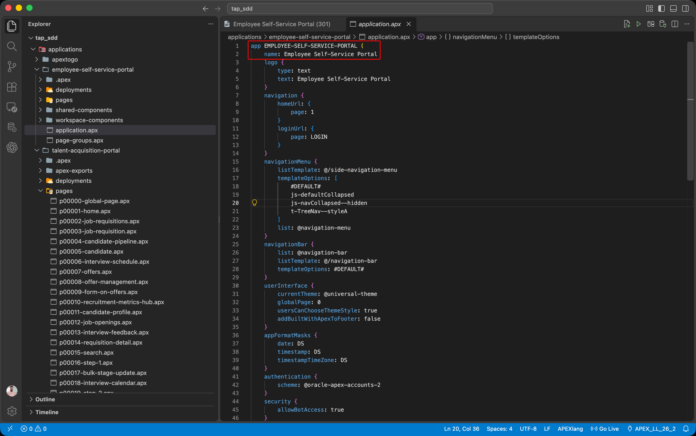

# Lab 2: Export ESS and Inspect Its Source

## Introduction

ESS already exists in the course workspace. Unlike TAP, it has not yet gone through the APEXlang export and import cycle from Module 23. Export its current definition so that Codex can update its pages in the next lab.

An existing application satisfies the selected file import prerequisite. You can apply page updates directly to the installed ESS application without importing the complete project first.

### Objectives

- Export the installed ESS application through SQL Developer for VS Code.
- Check the exported application name and project structure.
- Prepare the ESS project for Lab 3.

Estimated Time: 10 minutes

## Task 1: Export the Current ESS Application

1. In VS Code, open **Connections** and select the parsing-schema connection for your course workspace. Expand **APEX** and locate **Employee Self-Service Portal (ESS)**.

2. Record the ESS Application ID and workspace. Right-click ESS and choose **Export…**.

3. Choose the **applications** folder as the export destination, then click **Apply**. Wait for the export to finish.

    

4. In **Explorer**, open the exported **employee-self-service-portal** folder and select `application.apx`. Confirm the application name and locate the **pages** folder. Keep this project open for Lab 3.

    

## Acknowledgements

- **Author** - Aravind Madhavan, Senior Product Manager, Oracle
- **Last Updated By/Date** - Aravind Madhavan, October 2026
