# Lab 3: Add Bulk Validations and Make ESS Buttons More Prominent

## Introduction

Use the ESS export from Lab 2 to add bulk validations to employee forms. Then make buttons more prominent across the application. Review the changes and import a page through SQL Developer for VS Code. Then import the complete application to apply the remaining changes.

Estimated Workshop Time: 20 minutes

### Objectives

In this lab, you will learn how to:

- Add bulk validations to the existing ESS application.
- Edit buttons across the application.
- Import the pages that you updated.

### Prerequisites

The **single-file import** feature requires **Oracle APEX 26.2 or later** and an ESS project exported from APEX 26.2 or later.

On **APEX 26.1**, you can still follow the editing tasks. Skip the single-file import in Task 4 and use **Import Application** in Task 5, as learned in Module 23.

## Task 1: Check the ESS Project and Export Version

1. Open the ESS APEXlang project from Lab 2 in VS Code. In **Explorer**, locate the exported ESS application folder.

    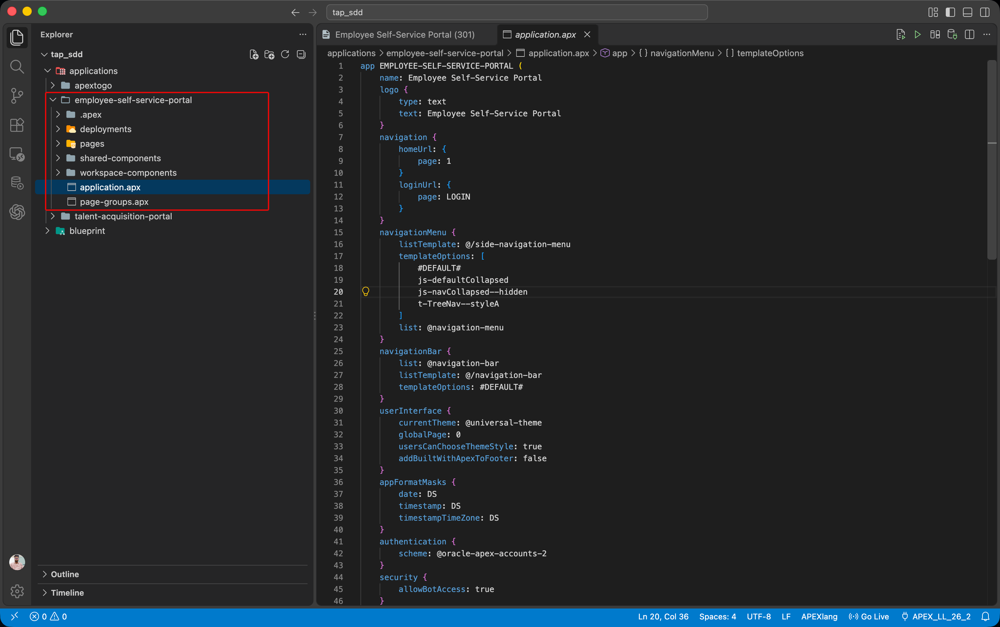

2. Open `.apex/apexlang.json` inside that folder and check the **mmdVersion** value. Single-file import requires a version of `26.2` or later. The build number after `+` may differ in your environment.

    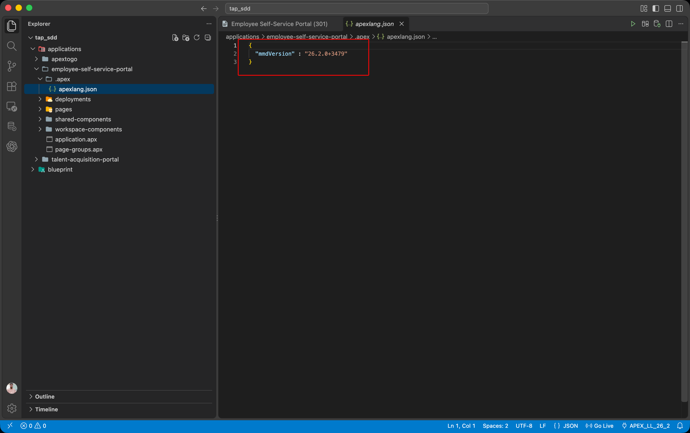

## Task 2: Add Bulk Validations

1. Click the **Codex** icon in the VS Code Activity Bar to open the chat.

    - Use the Oracle APEXlang skills configured in Module 23.

    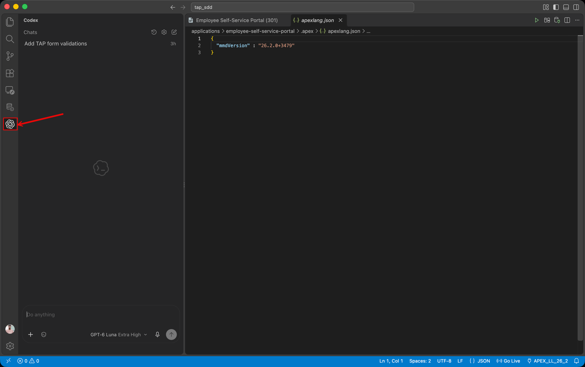

2. Add the exported ESS application folder to the chat context. Paste the following prompt and click **Send**:

    ```text
    <copy>
    Add validations to the My Profile, Leave Request, and Onboarding Task forms
    in ESS. Names and email must not be blank. Leave requests need a reason,
    and completed onboarding tasks need a completed date.
    </copy>
    ```

    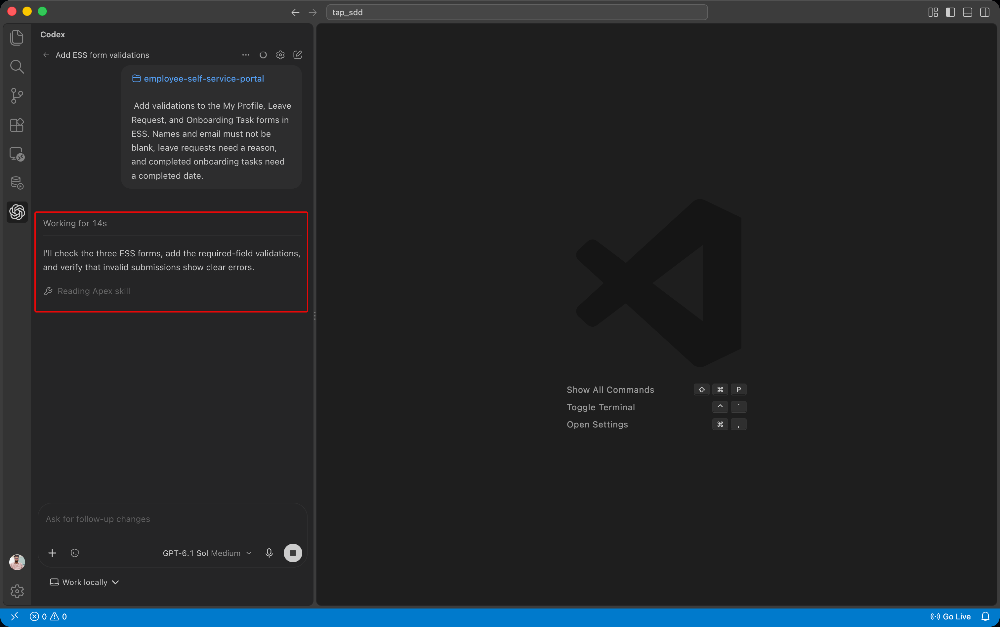

3. Review the response, then click **View changes** to inspect the edited page files.

    - Confirm that **Codex** found the existing forms and used the correct items. Reuse equivalent checks rather than adding duplicate validations.

    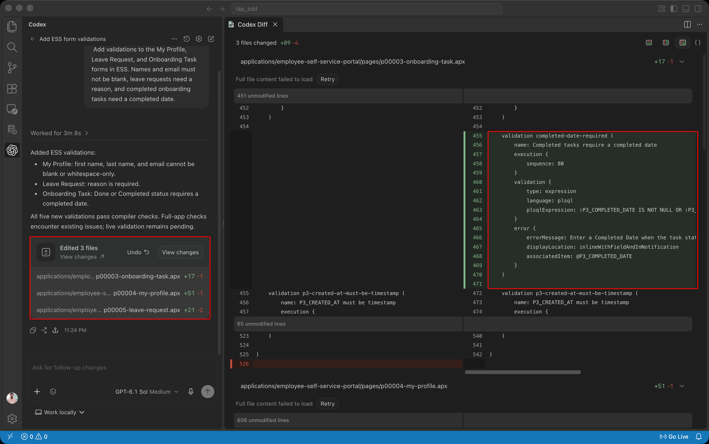

4. Open the edited form files and review the validation rules and error messages.

    - Keep the edits local for now. You will test the validations after import.

    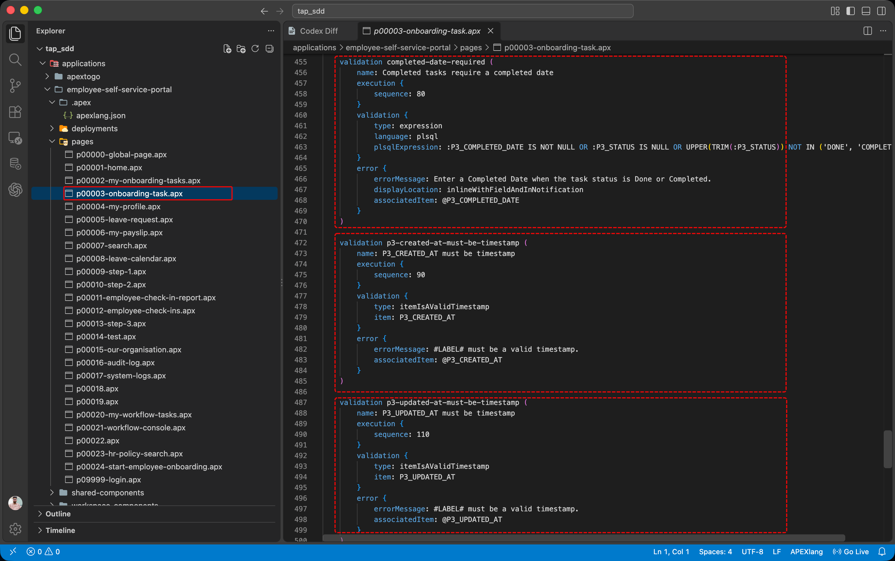

## Task 3: Make Buttons More Prominent Across ESS

1. In the same **Codex** chat, submit this prompt:
    ```text
    <copy>
    Identify all the buttons across all the pages and make them more prominent in line with the theme.
    </copy>
    ```

    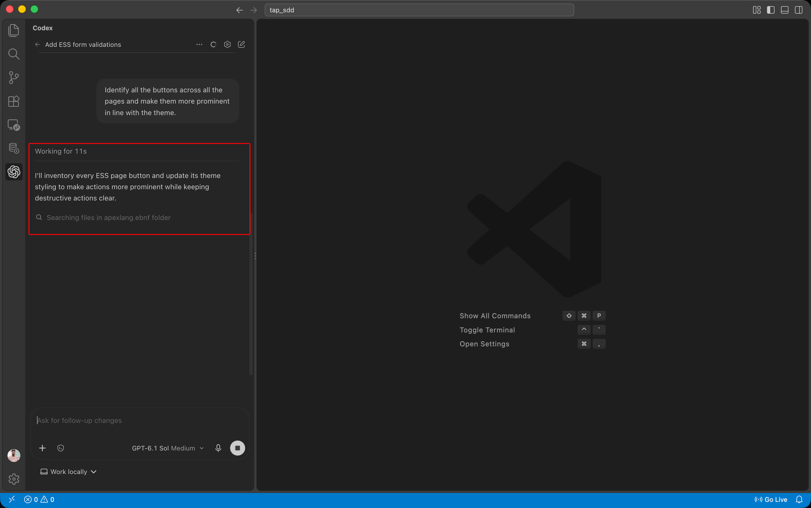

2. Review the response and wait for **Codex** to finish updating the buttons. Check which pages changed and how the proposed styles fit the existing theme.

    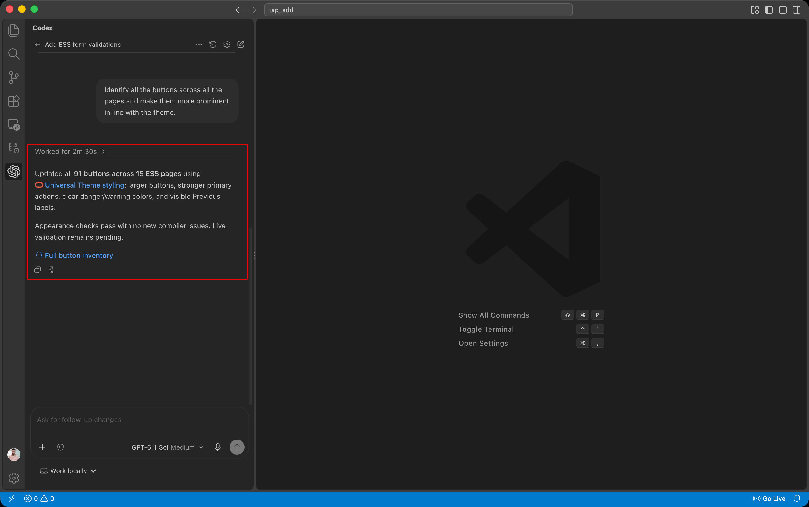

3. Open an edited page and review the button appearance settings.

    - Confirm that button actions and conditions remain intact. You will check the visual result after import.

    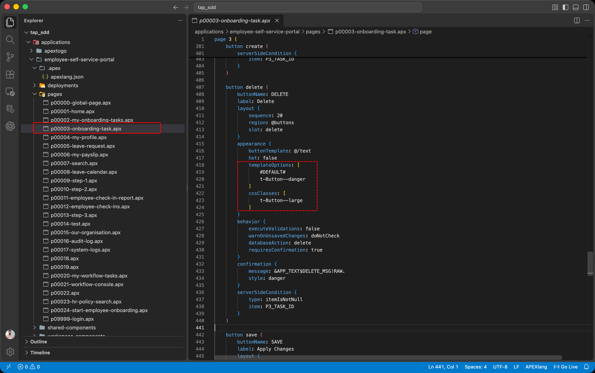

## Task 4: Compare the Changes and Import One Page

1. Open an edited `.apx` page file.

    - Click **Compare with APEX Application** in the editor toolbar.

    - Review the differences between your local project and ESS in the connected workspace.

    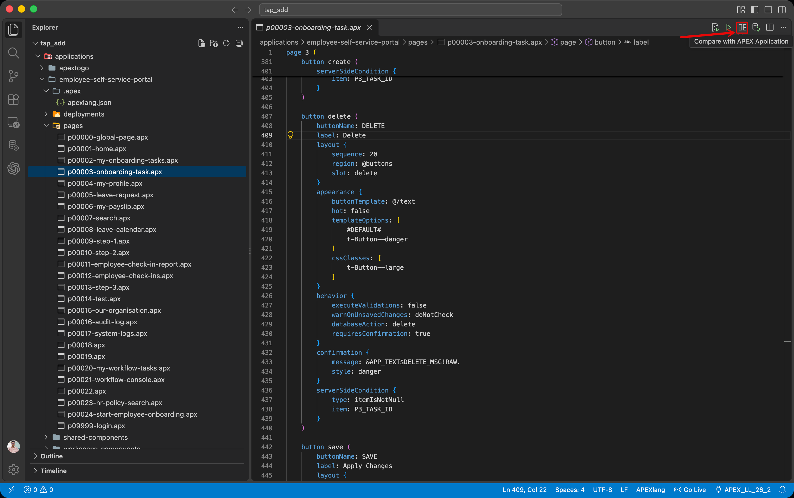

2. In **APEXlang Differences**, review the files marked **modified**.

    - Confirm that the connection and application shown at the top are your intended ESS targets. Reconcile any unexpected differences before import.

    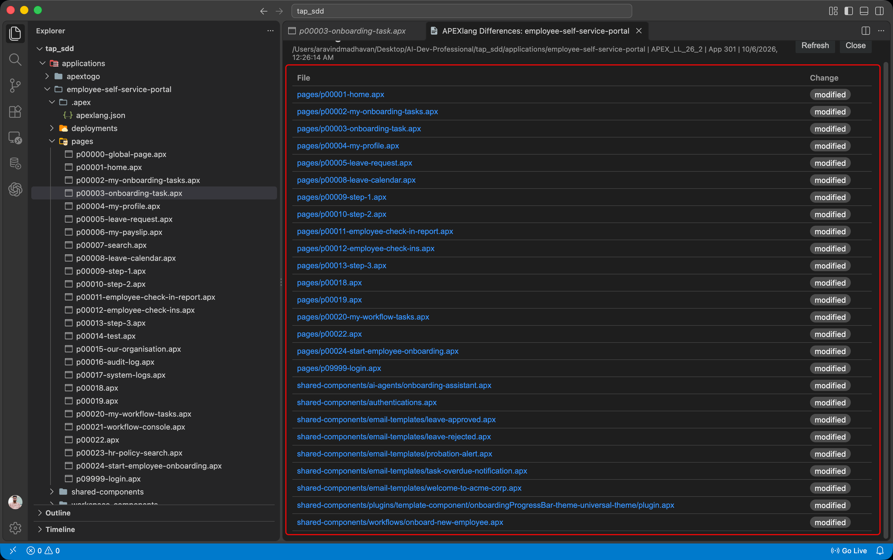

3. Click the **Leave Request** page file in the differences list to open the **Remote ↔ Local** comparison.

    - Review its added validation and button changes.

    - Keep existing leave rules, onboarding logic, and authorization checks intact.

    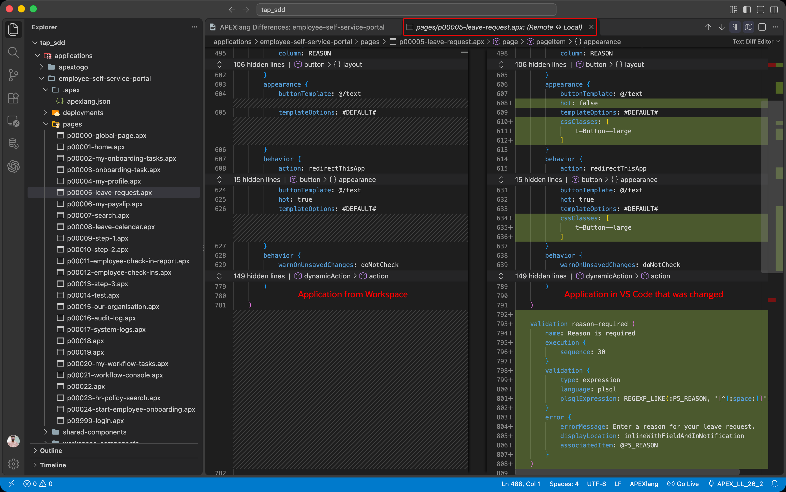

4. Open the edited **Leave Request** page file in the regular editor tab and save your edits.

    - Confirm the selected connection and target Application ID.

    - Click **Import File** in the editor toolbar.

    - Wait for the **File successfully imported** message.

    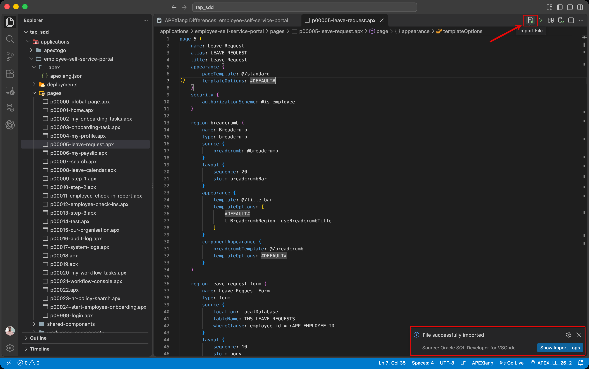

    > **Note:** **Import File** imports only the open file.

5. Run ESS and open **Leave Request**.

    - Enter valid dates, leave **Reason** blank, and click **Submit Leave**.

    - Confirm that the reason validation prevents submission.

    - Enter a reason and verify that valid data passes the check.

    Also check the existing date validation by entering an **End Date** earlier than **Start Date**. The screenshot below shows that date error, rather than the new reason error.

    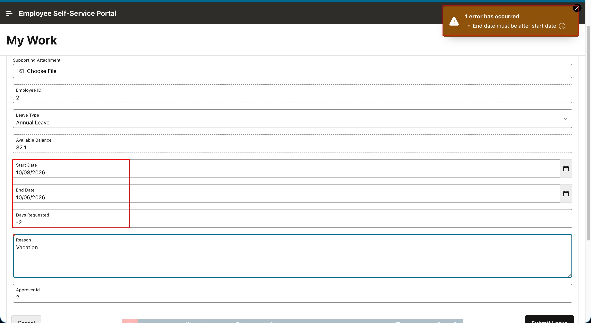

## Task 5: Import the Complete Application and Verify the Remaining Changes

1. The button updates may affect multiple ESS page files. Save your edits, then click **Import Application** in the editor toolbar to apply the remaining changes.

    - This imports the entire ESS application into the connected workspace.

2. Wait for the **Application successfully imported** message.

    - If the import reports an error, click **Show Import Logs**, correct the reported issue, and retry.

    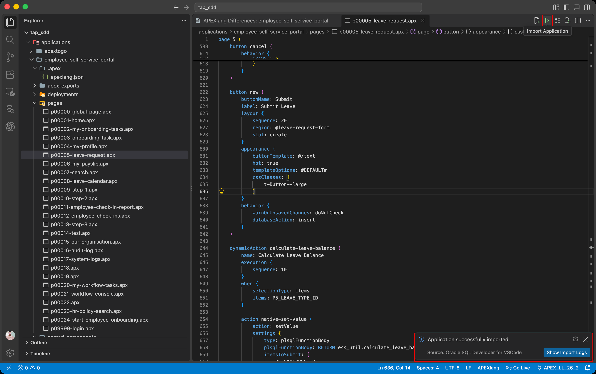

3. Run ESS and review the updated buttons across the affected pages. Check **Create**, **Cancel**, **Delete**, and the update buttons where available.

    - Confirm that their appearance fits the theme and that their actions still work.

    - Use a disposable record when testing **Delete**.

    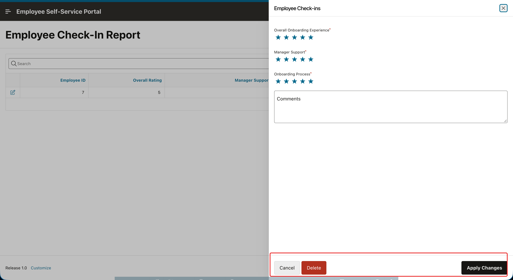

4. Test the validations on the other updated forms. Blank editable names or email addresses on **My Profile** should fail validation. On **Onboarding Task**, select a completed status without a **Completed Date** and try to save.

    - Confirm that the check prevents saving.

    - Use **Done** or **Completed**, as available in your application.

5. Correct the invalid values and confirm that valid submissions succeed.

    - **Try More Changes:**

    - Lab 4 provides optional prompts for TAP and ESS. Extend the same edit, review, import, and test workflow to other validations and page improvements.

## Acknowledgements

- **Author** - Aravind Madhavan, Senior Product Manager, Oracle
- **Last Updated By/Date** - Aravind Madhavan, October 2026
