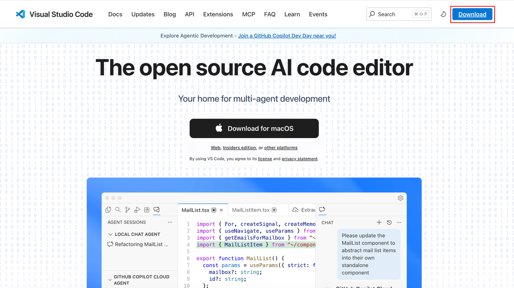
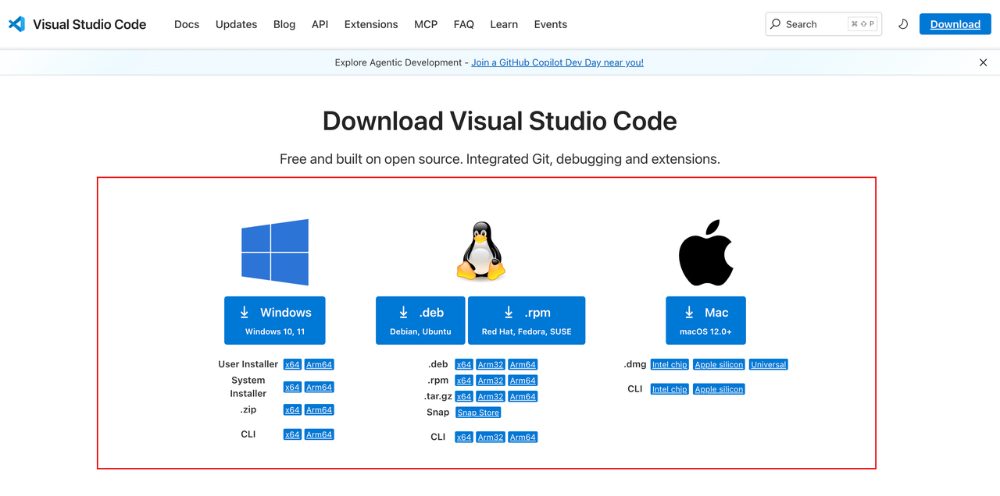
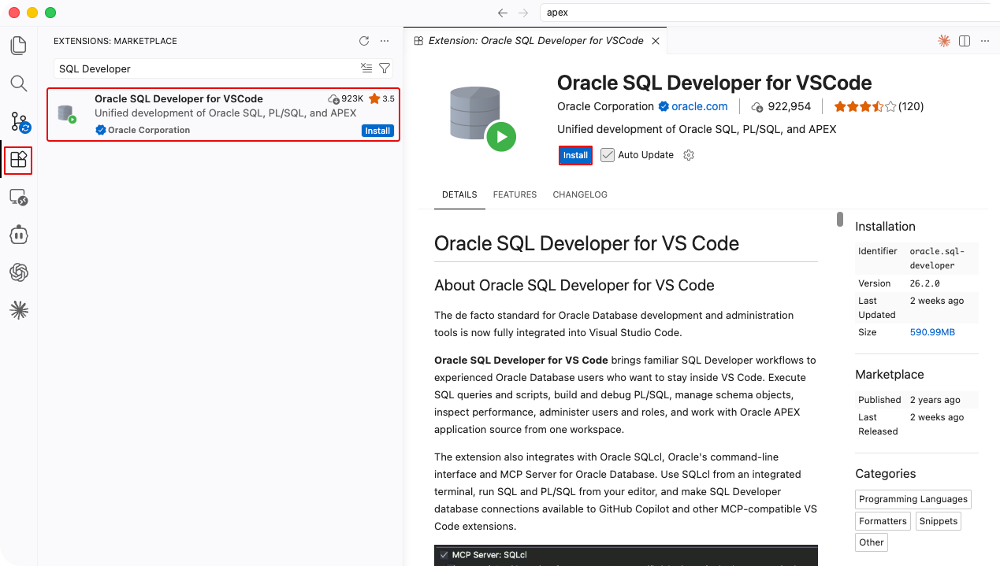
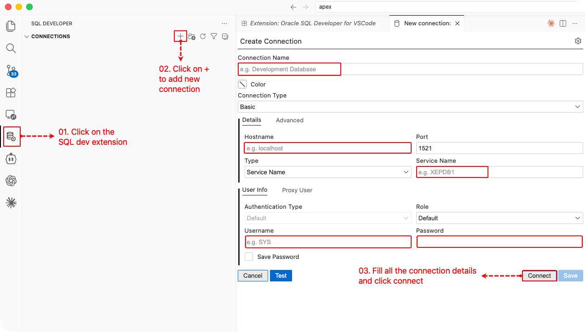
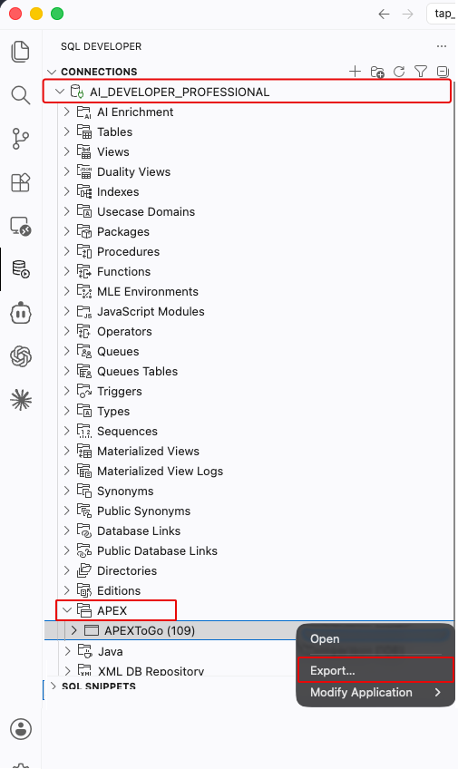
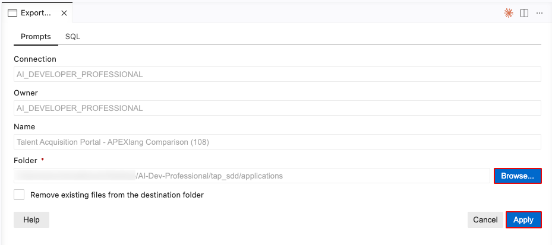
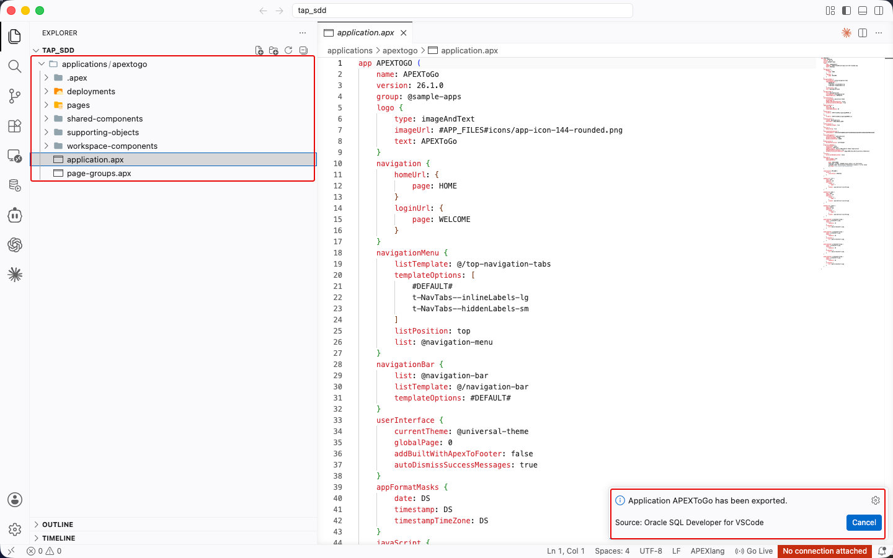
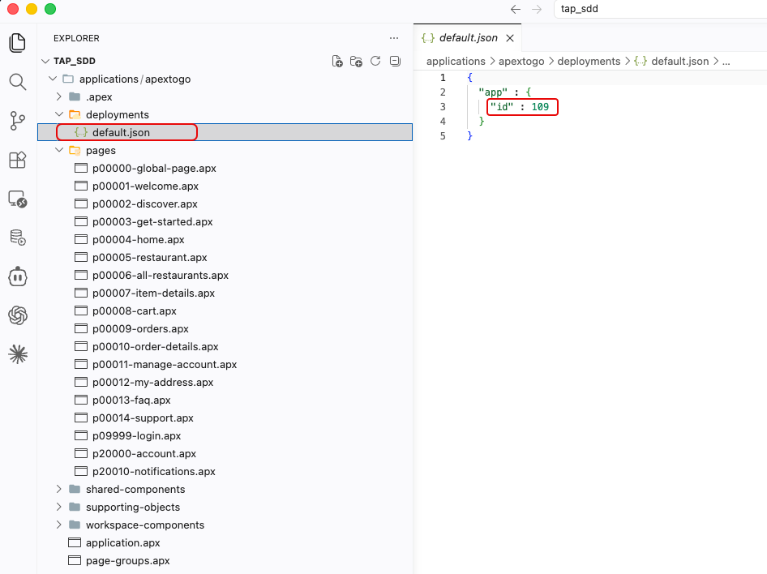
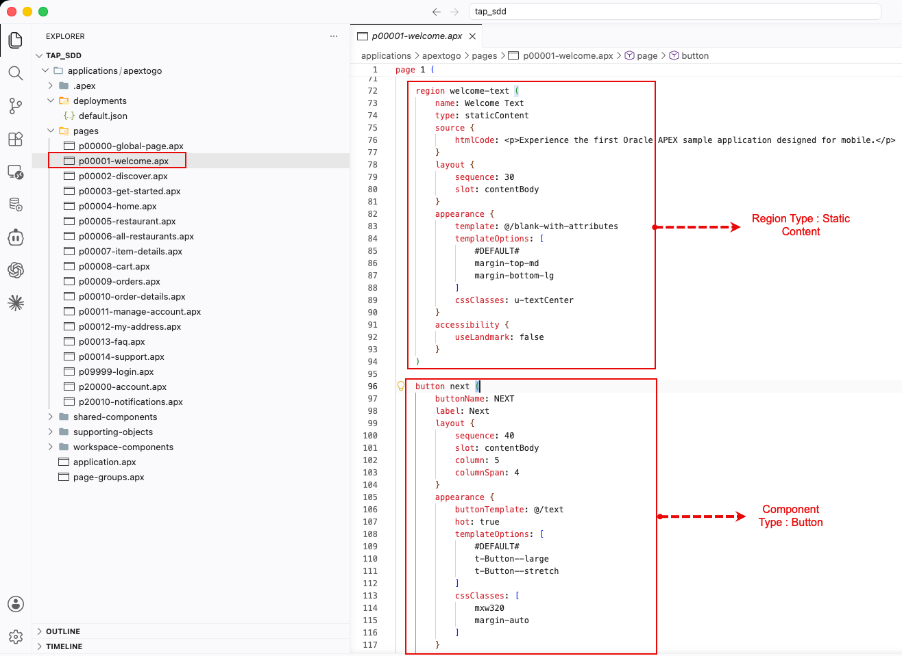

# Export and Inspect an Application with APEXlang

## Introduction

APEXlang stores an Oracle APEX app in readable `.apx` source files. Export the Module 3 sample app, then inspect its project files before you scaffold TAP.

### Objectives

- Export an existing APEX app in APEXlang format.
- Find the app, page, and shared-component source files.
- See how an APEXlang project supports code review in a coding workspace.

Estimated Time: 15 minutes

## Task 1: Prerequisites

### Install Visual Studio Code on Your Local Machine

1. Open a web browser and navigate to the Visual Studio Code download page: `https://code.visualstudio.com/Download`.
    

2. Download and install the version that matches your operating system (Windows, macOS, or Linux).
    

### Install the SQL Developer Extension

1. In the Visual Studio Code **Extensions** marketplace, search for **SQL Developer** and install the extension.
    

2. Open the **SQL Developer** extension from the VS Code sidebar. Create a database connection with your APEX Workspace schema credentials.
    

## Task 2: Export the application using SQL Developer Extension

1. In the SQL Developer extension, expand the database connection and then **APEX**. Right-click the **APEXToGo** app from Module 3 and select **Export**.
    

2. Select `applications` folder in your Module 4 workspace as the destination and click **Apply**
    

3. Wait for the export to complete and check if the application folder appears under `applications`.
    

## Task 3: Review the Exported Project

1. In Visual Studio Code, expand the exported application folder.

2. Expand the **Deployments** folder and open **default.json**.
   * This file stores the exported APEX app's **Application ID**.
   * To create a new app during import, enter a new **Application ID** and save the file.
   * If you keep the **Application ID**, import replaces the existing app in your workspace.
    
    
3. Expand the **pages** folder and open **p00001-welcome-page.apx**.

   * This file shows the page definition in a readable format.
   * Inspect **regions**, **buttons**, and other APEX components to see how the page works.
   * Explore the other folders and pages to see how the project works.
    

4. Keep this project open. In later modules, export the Wizard-built TAP to this format after you learn the core APEX components.

## Acknowledgements

- **Last Updated By/Date** - Course team, July 2026
