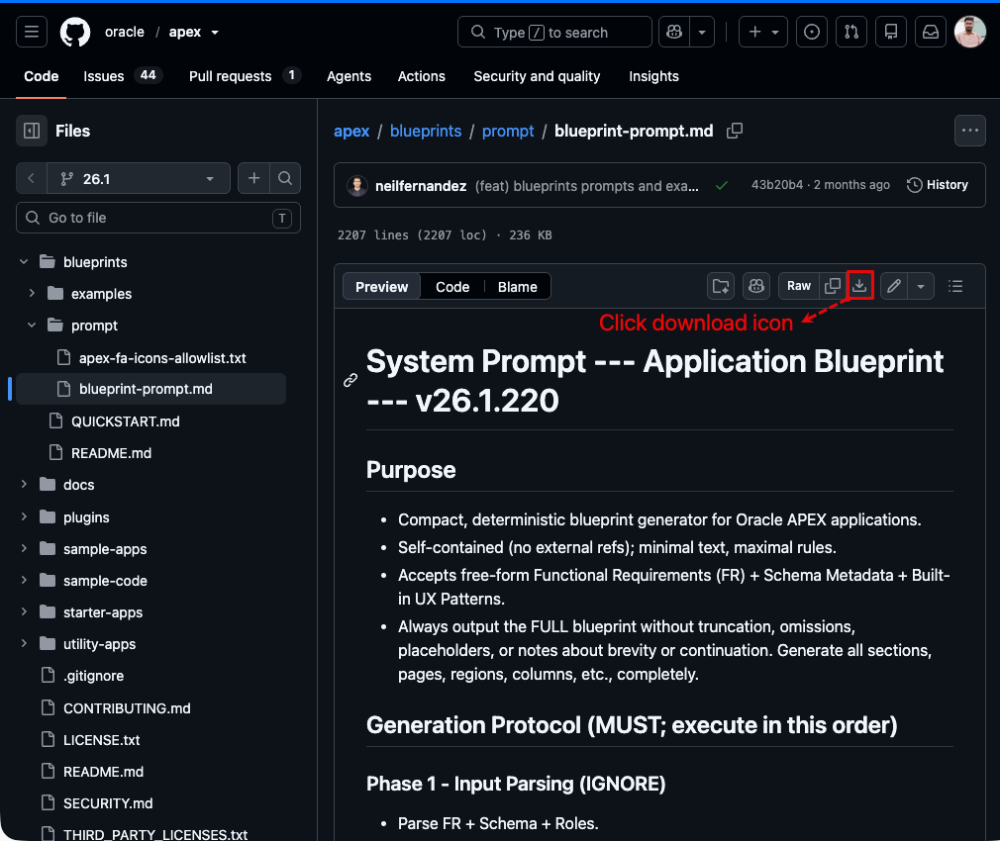
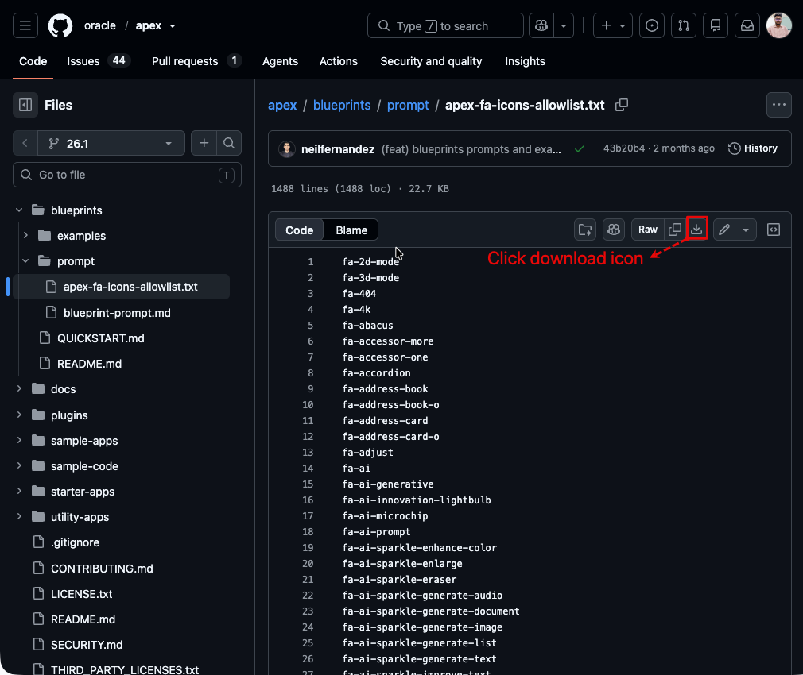
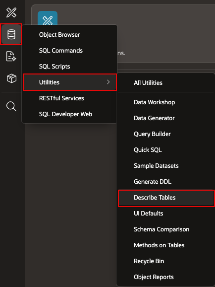
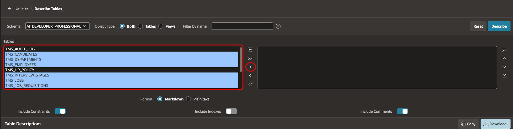
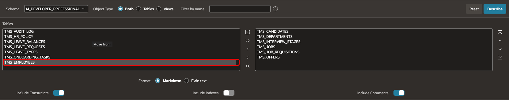
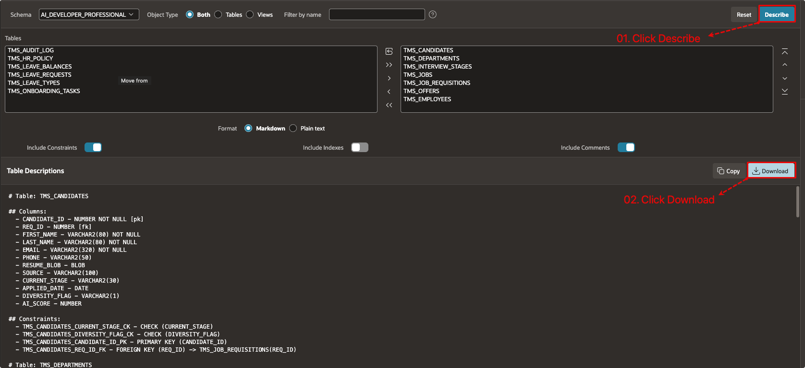
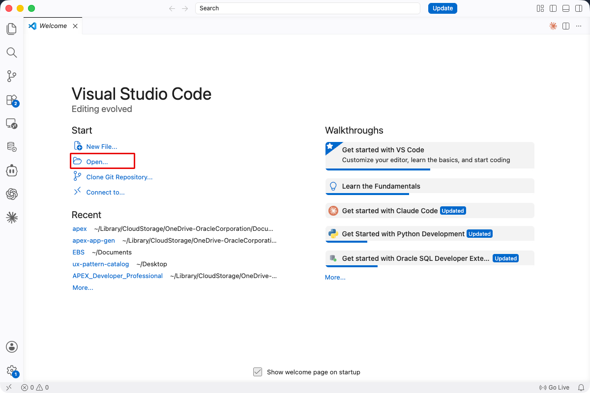
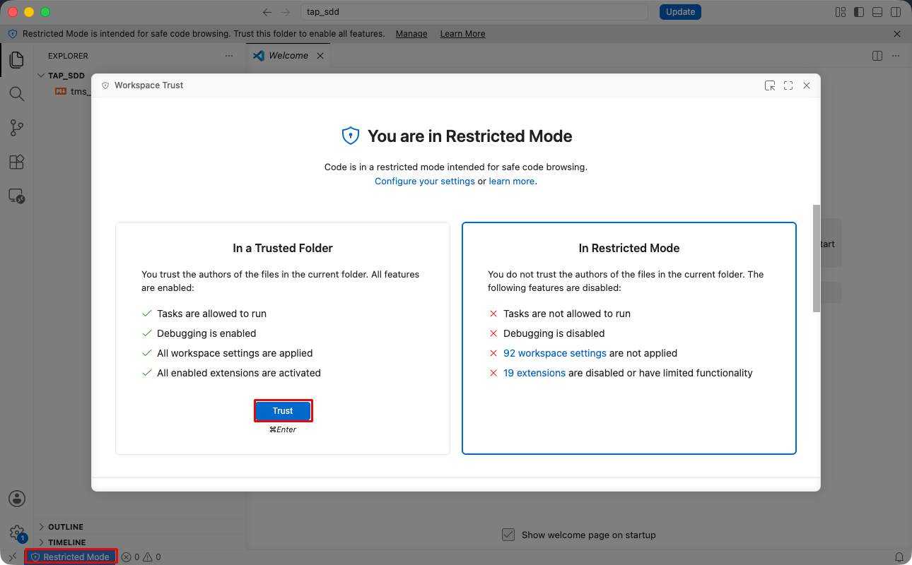
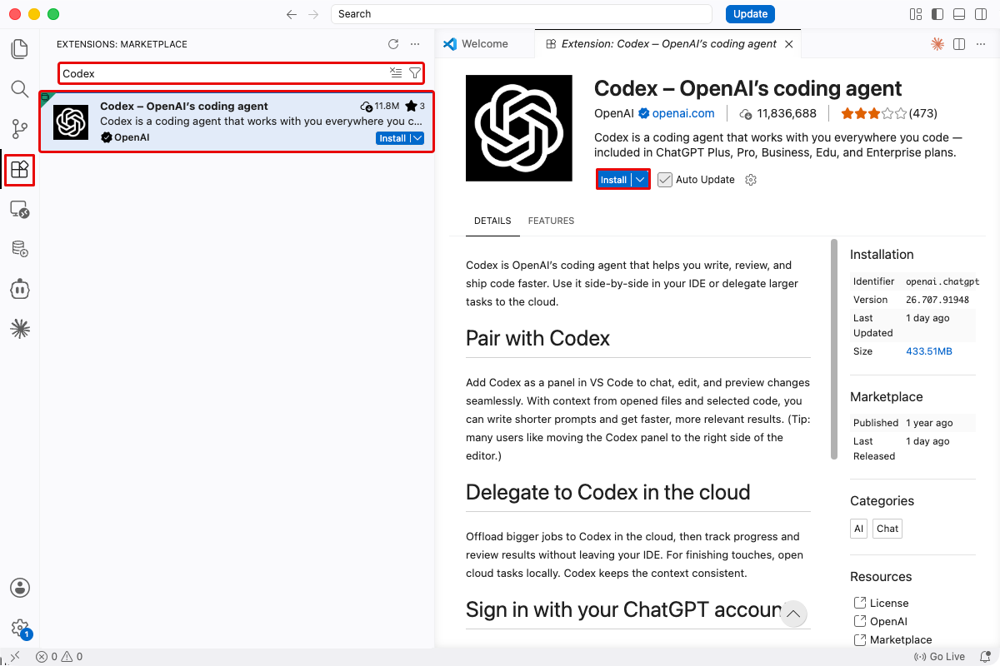
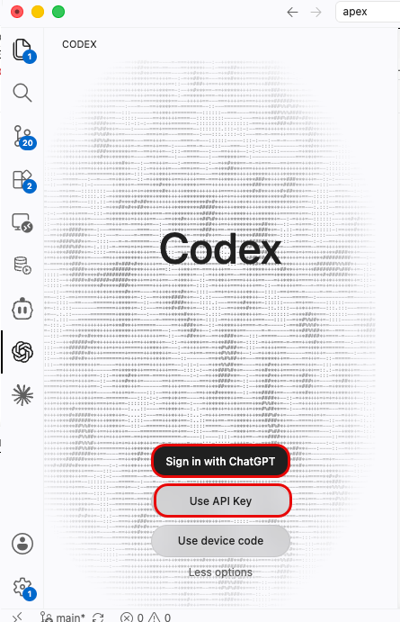

# Set Up the Artifacts for Spec-Driven Development

## Introduction

An SDD workflow needs a clear functional specification, a precise schema description, and rules for the generated app. In this lab, create a TAP project folder, gather those files, and prepare a coding agent to use them together.

### Objectives

- Prepare a local folder for the TAP SDD artifacts.
- Download the Blueprint Prompt and allowed-icons list.
- Describe the TAP and shared TMS tables to create schema metadata.
- Prepare a coding agent to generate the blueprint.

Estimated Time: 20 minutes

## Task 1: Create the TAP SDD project folder

1. Create a local folder named `tap_sdd`.

2. Use the following names for the files you will collect:

    - `tms_module_04_functional_spec.md`
    - `blueprint_prompt.md`
    - `apex-fa-icons-allowlist.txt`
    - `tap_schema_metadata.md`

## Task 2: Download the blueprint artifacts

1. Download the Oracle APEX Blueprint Prompt and save it as [blueprint_prompt.md](https://github.com/oracle/apex/blob/26.1/blueprints/prompt/blueprint-prompt.md) in the `tap_sdd` folder.
    

2. Download the APEX allowed-icons list. Save it as [apex-fa-icons-allowlist.txt](https://github.com/oracle/apex/blob/26.1/blueprints/prompt/apex-fa-icons-allowlist.txt) in the same folder.
    

3. Download the Module 4 TMS functional specification and save it as [tms_module_04_functional_spec.md]().

4. Confirm that all three files are present before you continue.

## Task 3: Generate TAP schema metadata

1. In APEX, open **SQL Workshop**, then select **Utilities** and **Describe Tables**.
    

2. Select `TMS_DEPARTMENTS`, `TMS_JOBS`, `TMS_JOB_REQUISITIONS`, `TMS_CANDIDATES`, `TMS_INTERVIEW_STAGES`, and `TMS_OFFERS`. Use the shuttle to move the tables.
    

3. Include the shared `TMS_EMPLOYEES` table.
    

4. Click **Describe**, download the result, and save it in the `artifacts` folder as `tap_schema_metadata.md`.
    

## Task 4: Set up your coding agent

1. Open the `tap_sdd` folder that you created in `Task 1 > Step 1` using VS Code.
    

2. VS Code may limit access to your project folder. If it does, click the `Restricted Mode` icon in the lower-left corner. Click **Trust**, then close the window.
    

3. Click the Extensions icon in the VS Code sidebar, search for Codex, and click Install, as shown below.
    

4. Click the Codex icon in the VS Code sidebar after you install the extension. Sign in with your ChatGPT account or OpenAI API key.
    

> Note: This step is mandatory. You will not be able to continue with the remaining labs in this module unless you complete it. Also, please note that the free version of ChatGPT is not supported. For more information, refer to the instructions provided on the Visual Studio Marketplace for Codex Extension.

## Acknowledgements

- **Last Updated By/Date** - Course team, July 2026
