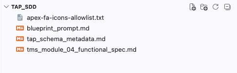
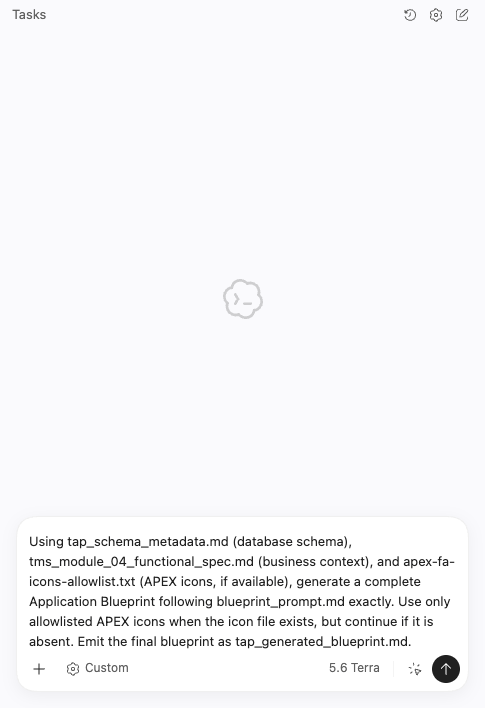
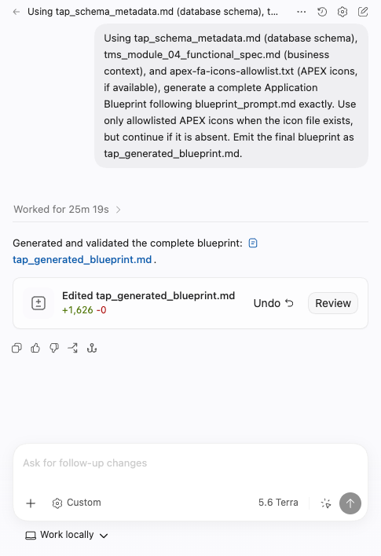
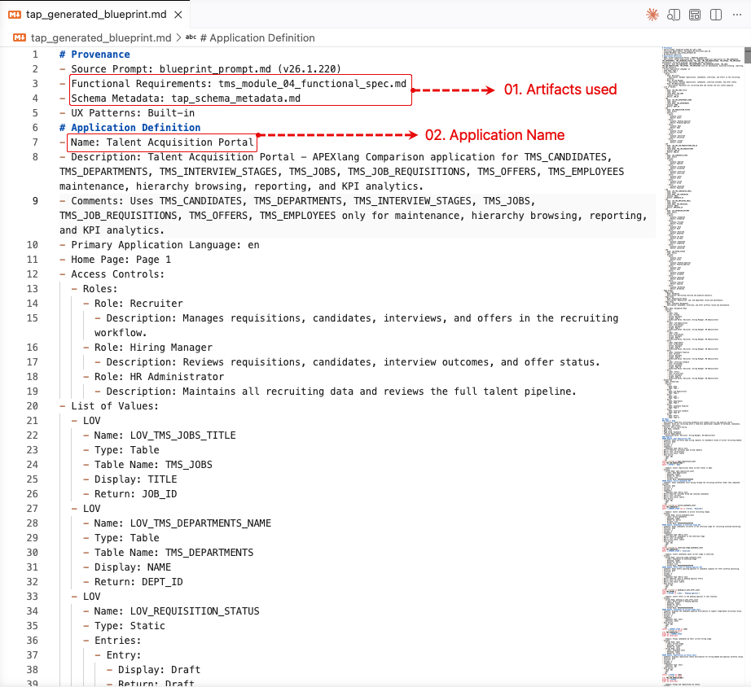
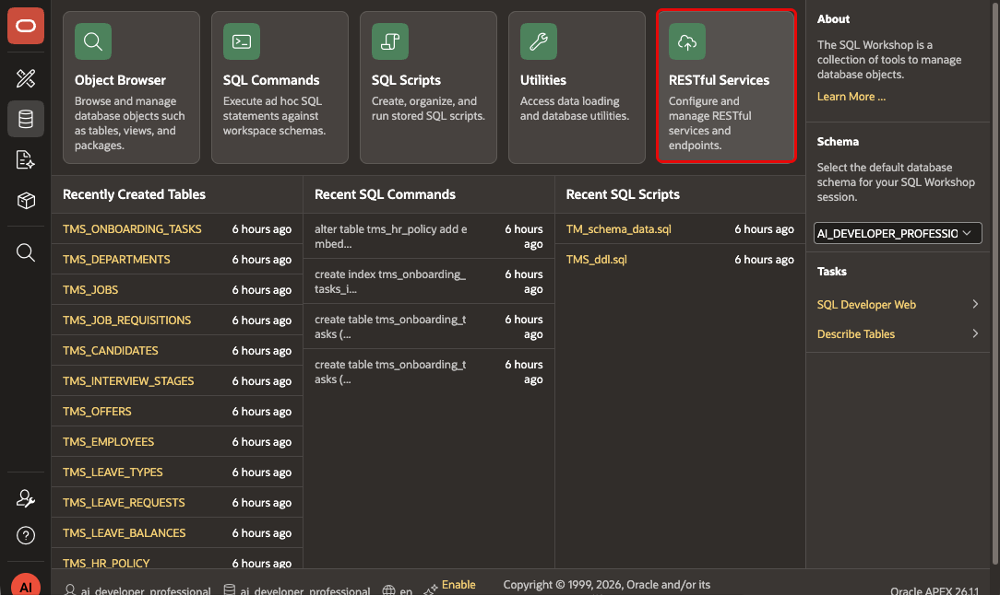
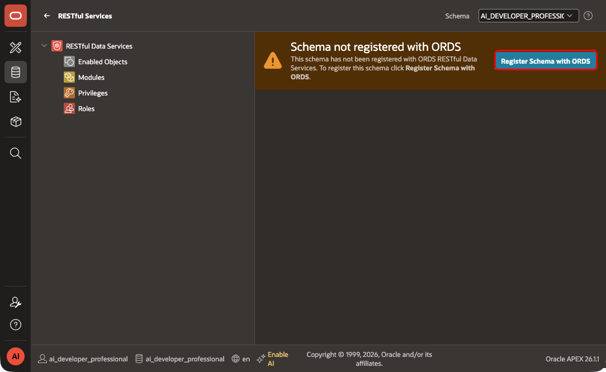
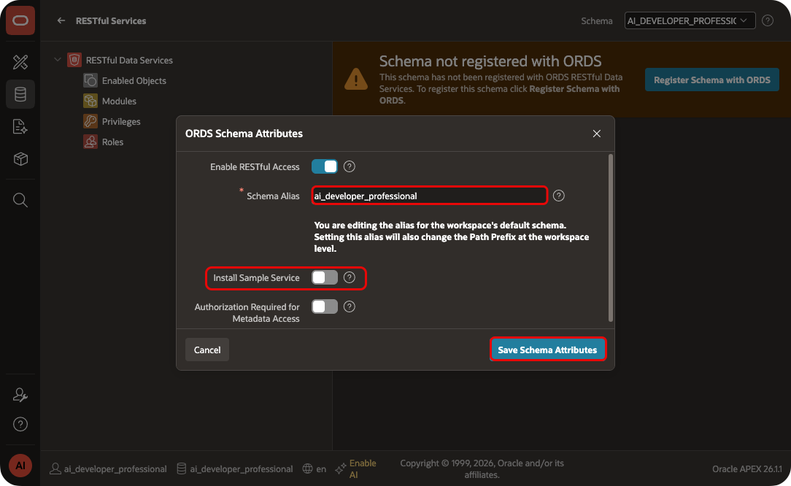

# Generate a TAP Application Blueprint with Scaffolding

## Introduction

You now have the business requirements, schema details, and generation rules in one folder. Use them to generate a blueprint for a TAP comparison app.

### Objectives

- Review the TAP source files before you generate the blueprint.
- Prompt a coding agent to create a constrained blueprint.
- Inspect the blueprint for a TAP-focused page layout.

Estimated Time: 25 minutes

## Task 1: Review the inputs before generation

1. In the `tap_sdd` folder, verify that these files are present:

    - `tms_module_04_functional_spec.md`
    - `tap_schema_metadata.md`
    - `blueprint_prompt.md`
    - `apex-fa-icons-allowlist.txt`
    
    
2. Read the functional specification and confirm that it describes the Talent Acquisition Portal, not the Employee Self-Service Portal or HR Analytics App.

3. Review the schema metadata and confirm that it includes every table and column used by the app.

## Task 2: Generate the Application Blueprint

1. Give all four source files to your coding agent.

2. Submit the following prompt:

    ```
    <copy>Use tap_schema_metadata.md for the database schema, tms_module_04_functional_spec.md for business context, and apex-fa-icons-allowlist.txt for icon choices. Generate a complete Application Blueprint that follows blueprint_prompt.md exactly. Use only allowlisted APEX icons. Save the final blueprint as tap_generated_blueprint.md.
    </copy>
    ```
    

3. Review each file-write request. Approve it only when the agent creates or updates `tap_application_blueprint.md` in `tap_sdd`.

4. Wait for the agent to finish writing the blueprint. 

    

## Task 3: Inspect the generated blueprint

1. Open `tap_application_blueprint.md`.

2. Confirm that the blueprint names the app `Talent Acquisition Portal` and includes only TAP pages and components.
    

## Task 4: Enable REST for Your Schema

**Prerequisite before moving to the next lab**

1. In APEX, open **SQL Workshop**, then select **RESTful Services**.
    
2. Click **Register Schema** with **ORDS (Oracle REST Data Services)**.
    

3. APEX fills in the **Schema Alias**. Change it only if needed. Turn off **Install Sample Service**, then click **Save Schema Attributes**.
    

> **Note:** Complete this step before you import the app from the blueprint.


## Acknowledgements

 - **Author -** Aravind Madhavan, Senior Product Manager.
 - **Last Updated By/Date** - Aravind Madhavan, Senior Product Manager, July 2026
