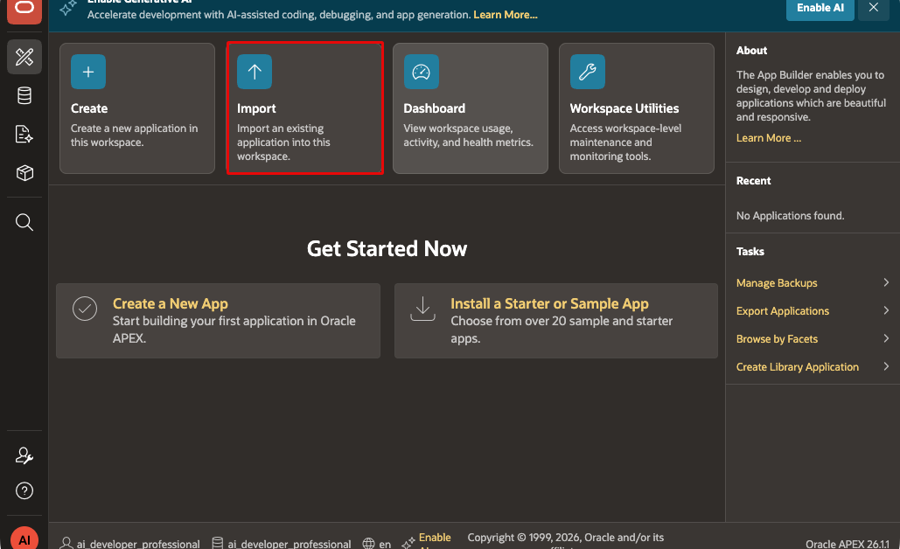
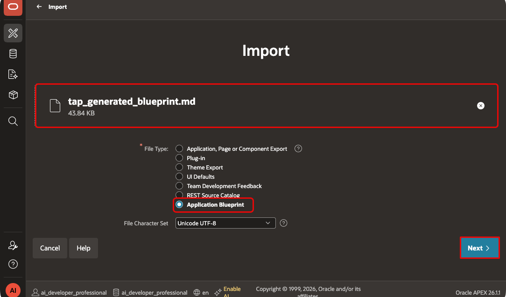
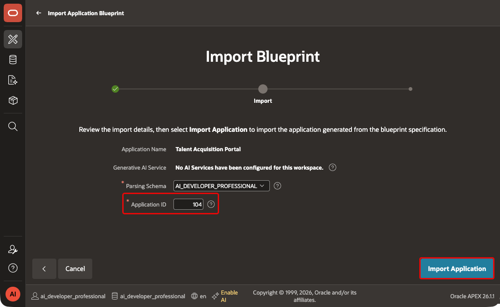
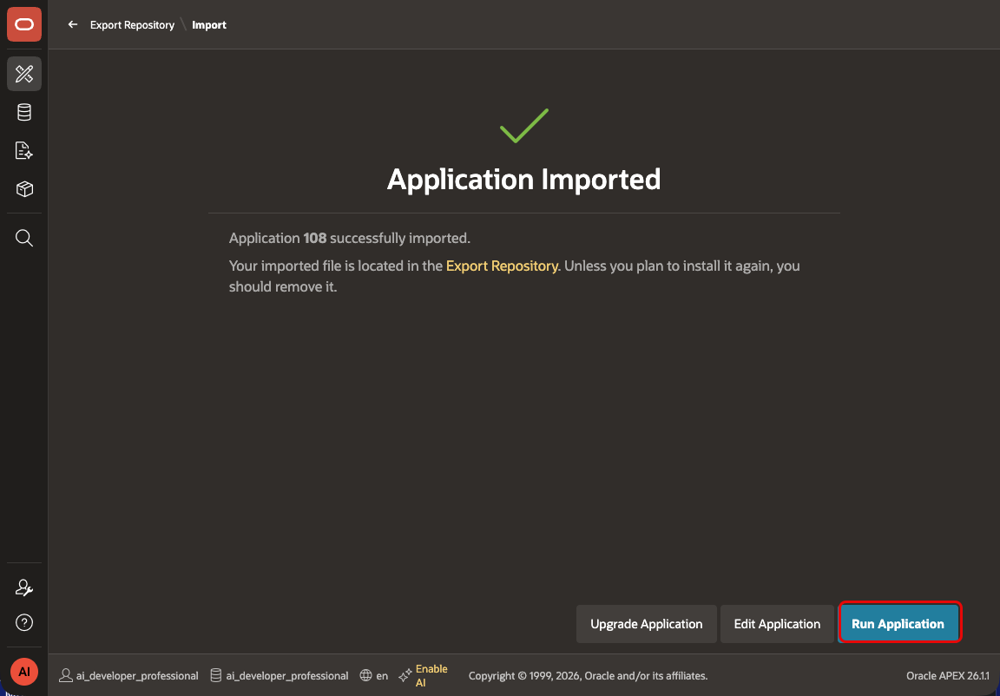
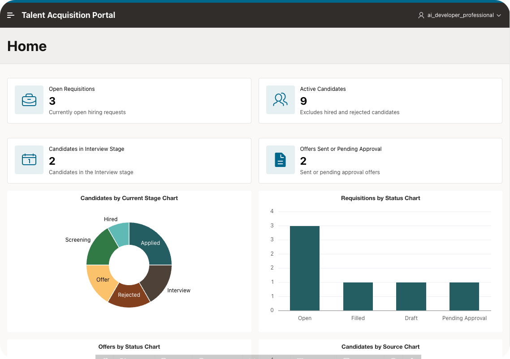

# Import and Compare the Generated TAP Blueprint

## Introduction

Import the generated blueprint into APEX and run the TAP comparison app. Then assess what the specification-first workflow produced. Module 5 creates the Wizard-built TAP that the course develops going forward.

### Objectives

- Import the generated TAP blueprint.
- Run the comparison app and inspect its pages.
- Decide to continue with the Wizard-built TAP in Module 5.

Estimated Time: 30 minutes

## Task 1: Import the Application Blueprint

1. In APEX, open **App Builder** and select **Import**.
    

2. Upload `tap_application_blueprint.md` from your `tap_sdd` project.
    

3. Select **Application Blueprint** as the file type, then select **Next**.

4. Review the import summary and select **Import Application**.
    

5. If APEX reports blueprint errors, copy the full error log. Give it to the coding agent with the generated blueprint and four source files. Correct the blueprint, then repeat this task.

## Task 2: Run the TAP Application

1. Open the imported application in App Builder and select **Run Application**.
    

2. Review the generated navigation, reports, forms, and page names.
    

3. Verify that the application is focused on recruitment work: jobs, requisitions, candidates, interviews, and offers.

## Task 3: Make the course decision

1. Keep the imported app only as a comparison reference. Do not use it as the starting point for later modules.

2. In Module 5, create TAP with the Create App Wizard. Develop that Wizard-built app through the rest of the course.

3. Keep the `tap_sdd` project folder. In Modules 23 and 24, export the Wizard-built TAP and manage it as source.

## Acknowledgements

- **Author** - Aravind Madhavan, Senior Product Manager